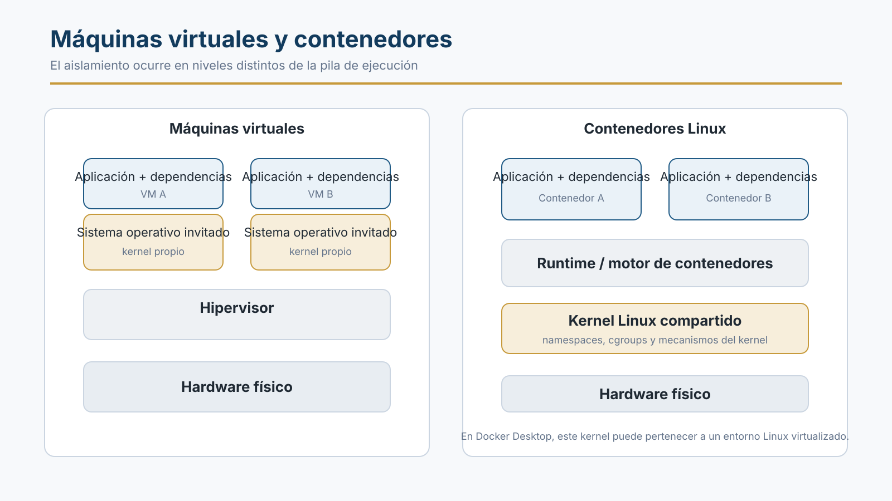
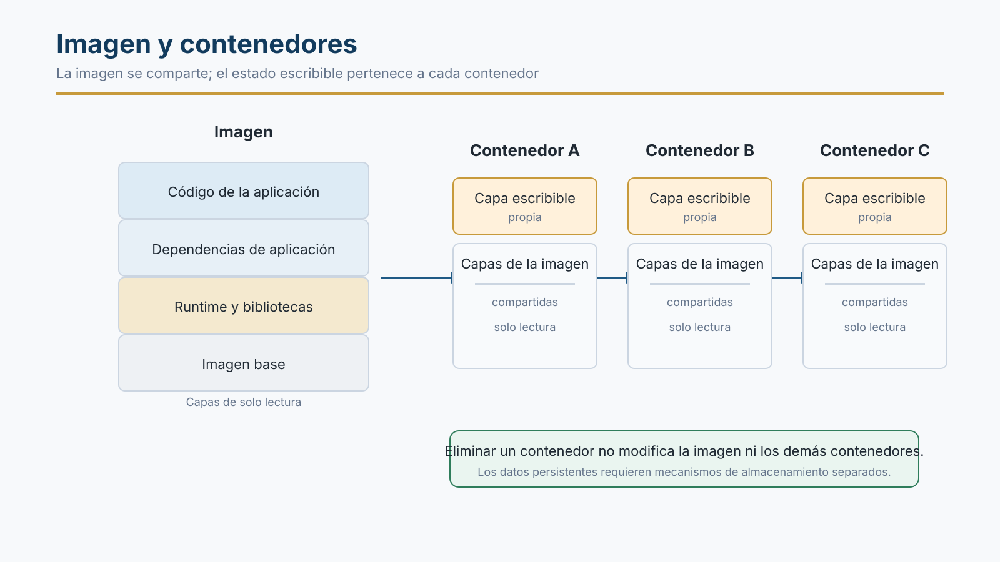
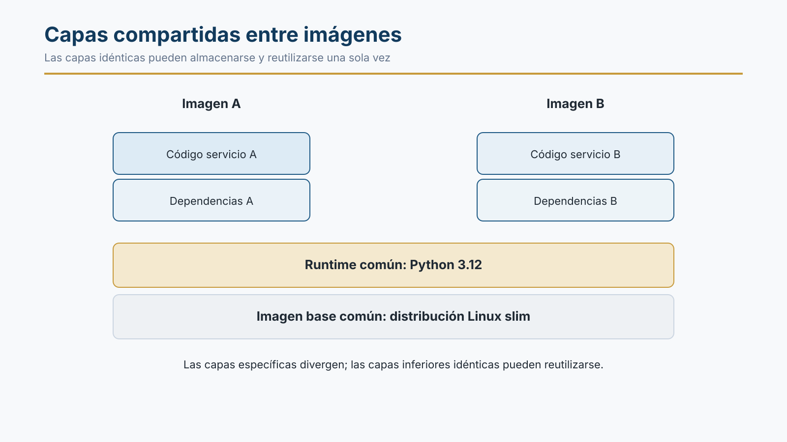
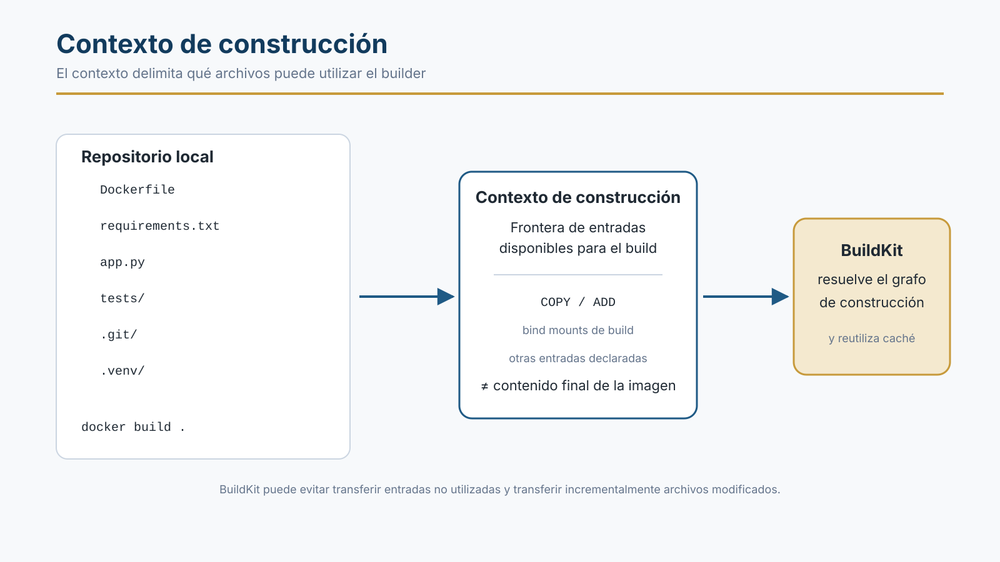
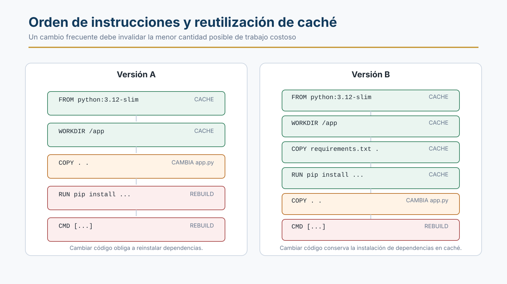

# Sesión 3. Contenedores I: fundamentos y construcción de imágenes

## Resultados de aprendizaje

Al finalizar esta sesión se espera que se pueda:

1. distinguir con precisión una imagen de un contenedor y explicar qué estado pertenece a cada uno;
2. explicar en qué se diferencia el aislamiento de procesos mediante contenedores de la virtualización mediante máquinas virtuales;
3. interpretar un Dockerfile sencillo e identificar las entradas que afectan su construcción;
4. predecir qué pasos de una construcción pueden reutilizarse desde caché ante distintos cambios y justificar el resultado.

## 1. Entorno de ejecución

El control de versiones permite identificar y compartir un estado concreto del código fuente, pero no determina por sí mismo el entorno en el que ese código se ejecutará. Dos integrantes de un equipo pueden trabajar sobre el mismo commit y obtener resultados diferentes si utilizan versiones distintas del runtime, bibliotecas del sistema, dependencias, variables de entorno u otras condiciones de ejecución.

La contenerización reduce esta fuente de variabilidad al empaquetar la aplicación junto con una parte importante de sus dependencias de espacio de usuario dentro de una imagen. Esa imagen puede distribuirse y ejecutarse sobre distintos hosts compatibles sin reconstruir manualmente el entorno en cada máquina.

La imagen no encapsula todo el sistema. El comportamiento de una carga de trabajo también puede depender del kernel disponible, la arquitectura de CPU, la configuración proporcionada al iniciar el contenedor, la red, el almacenamiento externo, los dispositivos y los recursos asignados. Por ello, los contenedores mejoran la portabilidad y la reproducibilidad del entorno de ejecución, pero no eliminan todas las diferencias posibles entre sistemas.

!!! note "Relación con la sesión anterior"
    Git permite que un equipo comparta y revise una versión concreta del código. Una imagen de contenedor permite distribuir, junto con ese código, muchas de las dependencias necesarias para ejecutarlo. Ambos mecanismos reducen fuentes distintas de variabilidad dentro del proceso de entrega.

## 2. Contenedores y máquinas virtuales

Las máquinas virtuales y los contenedores proporcionan aislamiento, pero lo hacen en niveles distintos.

Una máquina virtual se ejecuta sobre una capa de virtualización y dispone de un sistema operativo invitado con su propio kernel. Varias máquinas virtuales pueden coexistir sobre el mismo hardware físico sin compartir el kernel de sus sistemas operativos invitados.

Un contenedor, en cambio, ejecuta procesos aislados que comparten el kernel del entorno de sistema operativo donde funciona el runtime de contenedores. El aislamiento se apoya en mecanismos del kernel para separar procesos, recursos, sistemas de archivos y redes. Como no es necesario iniciar un sistema operativo invitado completo por cada instancia, los contenedores suelen requerir menos recursos adicionales y pueden inicializarse con menor sobrecarga que una máquina virtual equivalente.



*Figura 1. Las máquinas virtuales incorporan un kernel invitado por instancia; los contenedores Linux comparten el kernel del entorno Linux en el que se ejecuta el runtime.*

La diferencia tiene implicaciones de seguridad y compatibilidad. El aislamiento de una máquina virtual establece una frontera distinta a la de un contenedor, mientras que los contenedores dependen de las capacidades y de la seguridad del kernel compartido.

En un host Linux nativo, los contenedores Linux pueden compartir directamente el kernel del host. En Docker Desktop sobre Windows o macOS, los contenedores Linux se ejecutan dentro de un entorno Linux virtualizado. En Windows con el backend WSL 2, por ejemplo, Docker Desktop utiliza un kernel Linux proporcionado por WSL 2. En consecuencia, la afirmación "los contenedores comparten el kernel" sigue siendo válida, pero debe identificarse correctamente qué entorno proporciona ese kernel.

## 3. Imágenes y contenedores

Una **imagen** es un artefacto inmutable utilizado como base para crear contenedores. Incluye un sistema de archivos organizado en capas y una configuración asociada, como el comando por defecto, variables de entorno declaradas y otros metadatos necesarios para iniciar una carga de trabajo.

Un **contenedor** es una instancia creada a partir de una imagen, con configuración y estado propios. Puede encontrarse en distintos estados de su ciclo de vida, por ejemplo creado, en ejecución o detenido. El contenedor conserva una referencia a la imagen de la que proviene, pero no modifica sus capas de solo lectura.

A partir de una misma imagen pueden crearse múltiples contenedores. Cada uno obtiene su propio estado escribible y puede recibir configuración distinta en tiempo de ejecución.



*Figura 2. Una misma imagen puede originar varios contenedores. Las capas de la imagen se comparten y cada contenedor mantiene su propio estado escribible.*

Esta separación tiene una consecuencia importante: modificar archivos dentro de un contenedor no altera la imagen original. Si el contenedor se elimina, su capa escribible se elimina también, salvo que los datos se hayan almacenado mediante un mecanismo de persistencia externo a esa capa. Los volúmenes se estudiarán posteriormente cuando se trabaje con aplicaciones de varios servicios.

## 4. Capas de una imagen

Una imagen no se almacena necesariamente como una copia monolítica de todo su sistema de archivos. Está formada por capas inmutables que representan cambios acumulativos sobre capas anteriores. El runtime combina esas capas para presentar al contenedor una vista unificada del sistema de archivos.

Cuando se crea un contenedor, se añade una capa escribible asociada a esa instancia. Si un proceso modifica un archivo que pertenece a una capa inferior de solo lectura, el mecanismo de almacenamiento puede aplicar una estrategia de **copy-on-write**: se crea una copia escribible del archivo para el contenedor y la modificación se realiza sobre esa copia. Las capas originales permanecen sin cambios.

Este modelo permite reutilizar almacenamiento. Si dos imágenes comparten capas idénticas, esas capas pueden reutilizarse en lugar de almacenarse como copias independientes para cada imagen.



*Figura 3. Dos imágenes pueden compartir capas inferiores idénticas y diferir únicamente en las capas específicas de cada aplicación.*

Las capas y su reutilización son relevantes no solo para el almacenamiento. También forman parte del mecanismo de construcción y de caché: una construcción puede evitar repetir trabajo si las entradas necesarias para producir un resultado no han cambiado.

## 5. Dockerfile

Un **Dockerfile** es una especificación textual de construcción compuesta por instrucciones que el builder procesa en un orden definido para producir una imagen. El orden importa: una instrucción recibe como punto de partida el estado producido por las instrucciones anteriores y puede modificar el sistema de archivos o la configuración de la imagen.

Las instrucciones más frecuentes en esta etapa del curso son las siguientes:

| Instrucción | Propósito | Efecto principal |
|---|---|---|
| `FROM` | Define una imagen base e inicia un *build stage*. | Establece el estado inicial del stage. |
| `WORKDIR` | Define el directorio de trabajo para las instrucciones siguientes. | Configura el directorio activo y puede crearlo si no existe. |
| `COPY` | Copia archivos o directorios desde una fuente disponible para la construcción. | Modifica el sistema de archivos de la imagen. |
| `ADD` | Añade archivos o directorios y admite comportamientos adicionales, como fuentes remotas o extracción de archivos tar locales. | Modifica el sistema de archivos de la imagen. |
| `RUN` | Ejecuta comandos durante la construcción. | Puede modificar el sistema de archivos producido por el stage. |
| `ENV` | Define variables de entorno persistentes en la configuración de la imagen. | Modifica configuración de la imagen. |
| `ARG` | Define parámetros disponibles durante la construcción. | Parametriza el build y puede afectar la caché. |
| `EXPOSE` | Declara los puertos en los que se espera que escuche la aplicación. | Añade metadatos; no publica el puerto por sí mismo. |
| `CMD` | Define el comando o argumentos por defecto del contenedor. | Modifica configuración de la imagen. |
| `ENTRYPOINT` | Define el ejecutable principal del contenedor. | Modifica configuración de la imagen. |

`COPY` es la instrucción apropiada cuando únicamente se necesita copiar archivos o directorios. `ADD` debe utilizarse cuando se necesita alguno de sus comportamientos adicionales de forma deliberada, por ejemplo añadir una fuente remota o extraer un archivo tar local. La elección depende de la operación requerida, no de una preferencia general por una instrucción sobre la otra.

`ARG` merece una precisión adicional. Una variable declarada mediante `ARG` no se convierte automáticamente en una variable de entorno disponible para el contenedor en ejecución. Sin embargo, sus valores pueden quedar expuestos mediante historial o metadatos de construcción, por lo que no debe utilizarse para introducir secretos. La gestión segura de secretos se desarrollará en una sesión posterior.

El siguiente Dockerfile construye una imagen sencilla para una aplicación Python:

```dockerfile
FROM python:3.12-slim

WORKDIR /app

COPY requirements.txt .
RUN pip install --no-cache-dir -r requirements.txt

COPY . .

CMD ["python", "app.py"]
```

En este archivo aparecen dos tipos de entradas que cambian a ritmos diferentes: el archivo `requirements.txt`, que describe dependencias, y el resto del código de la aplicación. Separar esas entradas permite que el builder evalúe su caché con mayor granularidad.

## 6. Contexto de construcción

Una construcción necesita un conjunto de entradas. En un comando como:

```bash
$ docker build .
```

el punto final (`.`) identifica el **contexto de construcción**. Cuando se utiliza un directorio local como contexto, este establece la frontera desde la cual instrucciones como `COPY` y `ADD` pueden obtener archivos.



*Figura 4. El contexto de construcción delimita las entradas disponibles para el build. No debe confundirse con el contenido final de la imagen.*

El contexto no significa que todos sus archivos terminen dentro de la imagen. Solo se incorporan aquellos que las instrucciones de construcción utilizan explícitamente. Tampoco debe suponerse, con el builder actual, que todo el directorio se empaqueta necesariamente y se transfiere íntegramente antes de comenzar el build.

Docker utiliza actualmente **BuildKit** como backend de construcción. BuildKit representa la construcción como un grafo de dependencias y puede, entre otras optimizaciones, transferir incrementalmente archivos modificados, omitir archivos del contexto que el build no necesita, omitir stages no utilizados y ejecutar en paralelo partes independientes del grafo.

A pesar de estas optimizaciones, el contexto sigue siendo una decisión de diseño. Un contexto demasiado amplio aumenta la cantidad de entradas potenciales y facilita instrucciones poco selectivas como `COPY . .`, que pueden incorporar archivos irrelevantes a la imagen o hacer que cambios ajenos al código que realmente interesa afecten la caché. En la sesión siguiente se estudiará cómo excluir explícitamente archivos mediante `.dockerignore`.

## 7. Caché de construcción

La caché evita repetir trabajo cuyo resultado ya está disponible y cuyas entradas relevantes no han cambiado. Docker procesa las instrucciones del Dockerfile en orden y comprueba si puede reutilizar un resultado previo para cada una.

Las reglas exactas dependen de la instrucción. Para `COPY` y `ADD`, el builder calcula información de las fuentes involucradas y utiliza esa información para determinar si la entrada de caché sigue siendo válida. Si cambia un archivo relevante para la copia, la caché correspondiente deja de ser reutilizable.

Para una instrucción `RUN` convencional, la comprobación de caché no vuelve a consultar automáticamente el estado de las fuentes externas utilizadas por el comando. Considérese:

```dockerfile
RUN apt-get update && apt-get install -y curl
```

Si el comando y sus entradas previas siguen permitiendo un *cache hit*, el builder puede reutilizar el resultado producido anteriormente en lugar de volver a ejecutar el comando. Que el repositorio remoto disponga ahora de una versión más reciente de `curl` no invalida por sí solo esa entrada de caché.

Por tanto, un *cache hit* significa que se reutiliza un resultado anterior. **No significa que las fuentes externas consultadas originalmente sigan en el mismo estado ni que el resultado reutilizado contenga la versión más reciente disponible externamente.**

### Invalidación en cascada

En un Dockerfile lineal, cuando una instrucción deja de poder reutilizar la caché, las instrucciones posteriores deben evaluarse a partir del nuevo estado producido. Esto explica por qué el orden de las instrucciones afecta directamente al tiempo de construcción.

Considérense dos versiones funcionalmente equivalentes:

```dockerfile
# Versión A
FROM python:3.12-slim
WORKDIR /app
COPY . .
RUN pip install --no-cache-dir -r requirements.txt
CMD ["python", "app.py"]
```

```dockerfile
# Versión B
FROM python:3.12-slim
WORKDIR /app
COPY requirements.txt .
RUN pip install --no-cache-dir -r requirements.txt
COPY . .
CMD ["python", "app.py"]
```

Si se modifica únicamente `app.py`, la versión A invalida `COPY . .` antes de instalar las dependencias. La instalación debe ejecutarse de nuevo porque su estado padre cambió.

En la versión B, el archivo `requirements.txt` se incorpora antes que el código que cambia con mayor frecuencia. Mientras las dependencias no cambien, el builder puede reutilizar el resultado de su instalación y reconstruir únicamente desde la copia del código de aplicación.



*Figura 5. Separar entradas con distinta frecuencia de cambio permite conservar en caché pasos costosos que no necesitan repetirse.*

La regla práctica no consiste en memorizar una posición fija para cada instrucción, sino en identificar qué entradas cambian con mayor frecuencia y qué pasos son costosos. Cuando sea posible, los pasos dependientes de entradas más estables deben aparecer antes que aquellos afectados por cambios frecuentes.

!!! note "Límite del modelo"
    Esta sesión utiliza un Dockerfile lineal para explicar las reglas fundamentales de caché. BuildKit representa internamente la construcción como un grafo y dispone de mecanismos adicionales de reutilización, ejecución paralela y montaje de cachés. Esos mecanismos no son necesarios todavía para razonar sobre los ejemplos de esta sesión.

## 8. Caso de análisis

Un equipo mantiene un servicio Python cuyo repositorio tiene esta estructura aproximada:

```text
backend/
├── .git/
├── .venv/
├── coverage/
├── dist/
├── app/
│   └── ...
├── requirements.txt
└── Dockerfile
```

El tamaño local del proyecto es:

```text
backend/     684 MB
.venv/       531 MB
coverage/     83 MB
dist/         41 MB
```

El Dockerfile actual es:

```dockerfile
FROM python:3.12-slim
WORKDIR /app
COPY . .
RUN pip install --no-cache-dir -r requirements.txt
EXPOSE 8080
CMD ["gunicorn", "-b", "0.0.0.0:8080", "app:app"]
```

El archivo `requirements.txt` cambia aproximadamente una vez por semana. El código de `app/` cambia varias veces al día.

Además, algunas dependencias se declaran de esta forma:

```text
Flask>=3.0
gunicorn
requests
```

El equipo observa tres comportamientos:

1. cambios pequeños en `app/` provocan nuevamente la ejecución de `pip install`;
2. la imagen puede incorporar archivos locales que no son necesarios para ejecutar la aplicación;
3. una construcción realizada en un runner limpio puede resolver versiones de dependencias diferentes de las presentes en una capa de caché creada días antes.

### Análisis

El primer comportamiento se explica por el orden de las instrucciones. `COPY . .` depende del contenido copiado y aparece antes de `RUN pip install`. Un cambio en `app/` altera el resultado de la copia y obliga a ejecutar de nuevo los pasos posteriores, aunque `requirements.txt` no haya cambiado.

El segundo comportamiento está relacionado con el alcance del contexto y, sobre todo, con la instrucción `COPY . .`. Si directorios como `.venv`, `coverage` o `dist` forman parte del contexto y no se excluyen, una copia general puede incorporarlos a la imagen aunque no sean necesarios para ejecución. El mecanismo para excluirlos de forma explícita se estudiará en la sesión siguiente.

El tercer comportamiento no representa una anomalía de la caché. Una capa existente conserva exactamente el resultado producido cuando se construyó. Un runner limpio que no reutiliza esa capa ejecuta nuevamente `pip install`; si las versiones no están fijadas, el resolvedor puede obtener versiones distintas disponibles en ese momento. La diferencia proviene de entradas externas mutables y de una especificación de dependencias no completamente determinada.

!!! question "Pregunta de análisis"
    Si se modifica únicamente un archivo dentro de `app/`, ¿qué instrucciones del Dockerfile actual deben volver a ejecutarse? ¿Qué cambiaría si `requirements.txt` se copiara e instalara antes de `COPY . .`?

## 9. Actividades de análisis

### Actividad 1. Diagnóstico

Clasificar cada uno de los tres comportamientos del caso según su causa principal:

- selección y uso del contexto de construcción;
- orden de instrucciones e invalidación de caché;
- dependencias externas no fijadas.

Para cada comportamiento, indicar qué evidencia del caso permite sostener la clasificación.

### Actividad 2. Predicción de caché

Para la versión B del Dockerfile, determinar qué instrucciones pueden reutilizar caché y cuáles deben volver a ejecutarse en cada escenario:

1. cambia únicamente `app.py`;
2. cambia únicamente `requirements.txt`;
3. cambia la imagen base utilizada en `FROM`;
4. cambia el valor de un `ARG` utilizado posteriormente por una instrucción `RUN`.

La respuesta debe justificarse en función de las dependencias entre instrucciones, no únicamente indicar "cache hit" o "cache miss".

### Actividad 3. Interpretación de un build

A partir de una salida de construcción proporcionada por el docente, identificar:

- qué pasos fueron reutilizados desde caché;
- cuál fue el primer paso que perdió la caché;
- qué cambio en las entradas podría explicar esa invalidación;
- si la salida permite concluir que las dependencias externas utilizadas por un `RUN` están actualizadas.

## 10. Síntesis

Una imagen de contenedor empaqueta un sistema de archivos en capas junto con configuración necesaria para crear contenedores. Los contenedores comparten las capas inmutables de la imagen y mantienen estado escribible propio. Este modelo reduce la necesidad de reconstruir manualmente el entorno de ejecución en cada máquina y permite reutilizar almacenamiento y resultados de construcción.

El Dockerfile describe las operaciones que producen la imagen, mientras que el contexto de construcción delimita las entradas disponibles para esas operaciones. BuildKit utiliza esas entradas y el grafo de construcción para decidir qué trabajo puede reutilizarse. La caché mejora el rendimiento, pero su eficacia depende de cómo se organicen las instrucciones y no constituye un mecanismo de actualización automática de fuentes externas.

La sesión siguiente utilizará este modelo para estudiar `.dockerignore`, selección de imágenes base, construcciones multi-stage y otras decisiones que afectan tamaño, seguridad y eficiencia de las imágenes.

## Referencias

- Docker. *Dockerfile reference*. https://docs.docker.com/reference/dockerfile/
- Docker. *BuildKit*. https://docs.docker.com/build/buildkit/
- Docker. *Build context*. https://docs.docker.com/build/concepts/context/
- Docker. *Build cache invalidation*. https://docs.docker.com/build/cache/invalidation/
- Docker. *Storage drivers*. https://docs.docker.com/engine/storage/drivers/
- Docker. *Docker Desktop WSL 2 backend on Windows*. https://docs.docker.com/desktop/features/wsl/
- Humble, J. y Farley, D. (2010). *Continuous Delivery: Reliable Software Releases through Build, Test, and Deployment Automation*. Addison-Wesley.
- Kim, G., Humble, J., Debois, P., Willis, J. y Forsgren, N. (2021). *The DevOps Handbook* (2.ª ed.). IT Revolution.
