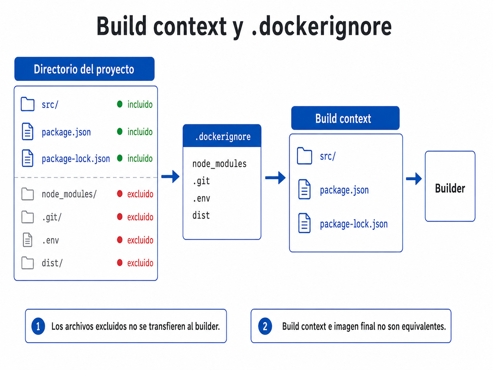
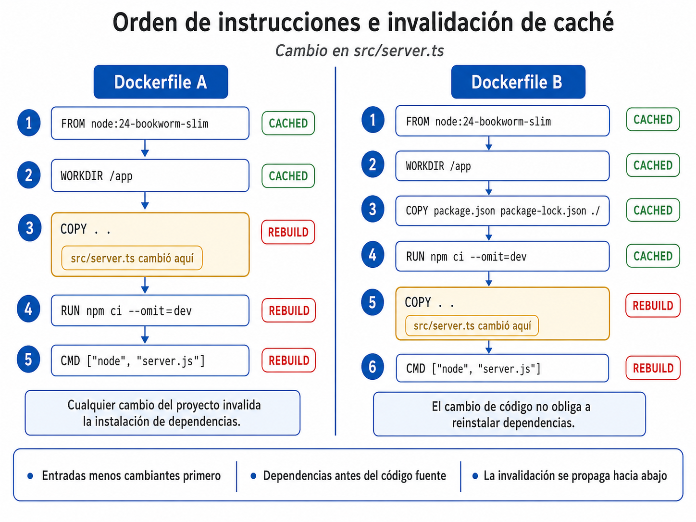
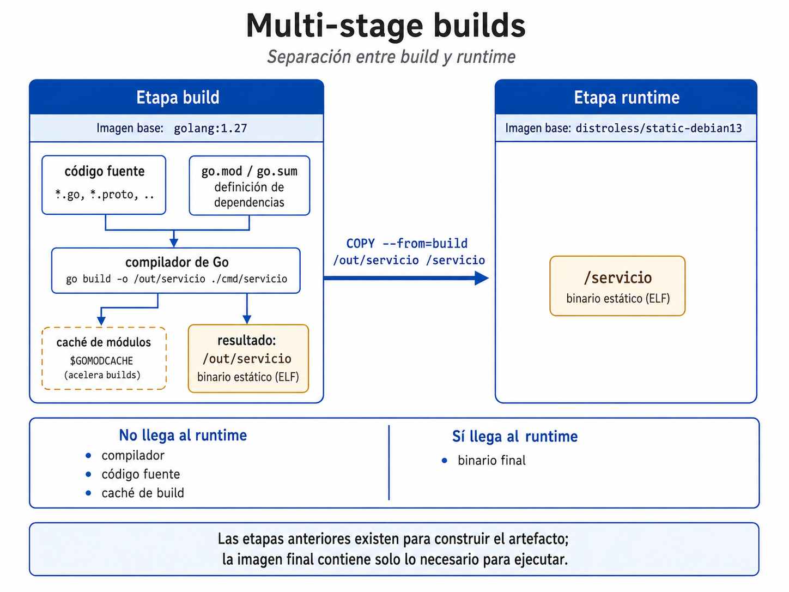
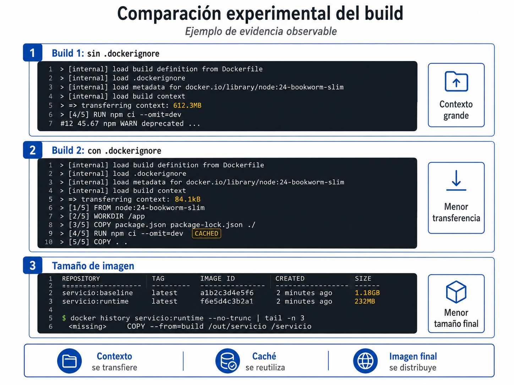

# Sesión 4. Construcción eficiente de imágenes

## Resultados de aprendizaje

La clase anterior introdujo el modelo de capas, el Dockerfile, el build context y las reglas básicas de reutilización e invalidación de caché. Esta sesión utiliza esos conceptos para optimizar cuatro aspectos del proceso de construcción:

1. Limitar los archivos que forman parte del **build context**;
2. Estructurar el Dockerfile para reutilizar el **build cache**;
3. Eeleccionar y versionar una **imagen base** compatible con el runtime;
4. Separar dependencias de construcción y ejecución mediante **multi-stage builds**.

Cada técnica modifica una dimensión diferente del build. `.dockerignore` actúa sobre el contexto transferido al builder; el orden de instrucciones y los cache mounts actúan sobre el trabajo reutilizable; la imagen base y la separación de etapas determinan buena parte del contenido disponible en runtime y del tamaño del artefacto final.


## 1. Costos del proceso de construcción

La ejecución correcta del contenedor solo verifica que la imagen permite iniciar la aplicación. La eficiencia del proceso de construcción requiere evaluar por separado el tamaño del contexto, la reutilización de caché, la selección de la imagen base y el contenido que llega al runtime.

La sesión utiliza cuatro problemas observables como referencia:

| Problema | Efecto principal | Mecanismo que lo controla |
|---|---|---|
| Contexto innecesariamente grande | Más datos enviados al builder | `.dockerignore` |
| Invalidaciones frecuentes de caché | Reejecución de pasos costosos | Orden de instrucciones y cache mounts |
| Imagen base sobredimensionada o incompatible | Mayor transferencia, más paquetes o fallas de runtime | Selección de `FROM` |
| Herramientas de build presentes en producción | Imagen final mayor y con contenido innecesario | Multi-stage builds |

En CI estos costos se acumulan: Una reinstalación de dependencias que tarda un minuto y ocurre en cada commit incrementa directamente el tiempo de retroalimentación. Una imagen innecesariamente grande consume tiempo y ancho de banda cada vez que se transfiere entre el runner, el registry y la plataforma de ejecución.

El diagnóstico comienza identificando qué magnitud domina el costo. Reglas generales como “usar menos capas” o “usar siempre la imagen más pequeña” no sustituyen esa medición.

## 2. Build context y `.dockerignore`

El **build context** es el conjunto de archivos al que el builder puede acceder durante una construcción. En un build local típico:

```bash
docker build -t servicio:dev .
```

el punto (`.`) indica que el directorio actual será el contexto.

Las instrucciones `COPY` y `ADD` solo pueden utilizar archivos disponibles dentro de ese contexto. Todo archivo que no haya sido excluido mediante .`dockerignore` forma parte del contexto disponible para el builder, aunque finalmente ninguna instrucción lo copie a la imagen.

### 2.1 Exclusión mediante `.dockerignore`

Un archivo `.dockerignore` ubicado en la raíz del contexto permite eliminar archivos y directorios antes de enviarlos al builder.

Para una aplicación Node.js podría utilizarse:

```text
# Dependencias instaladas localmente
node_modules/

# Control de versiones
.git/

# Configuración local
.env
.env.*
!.env.example

# Artefactos generados
coverage/
dist/

# Logs
npm-debug.log*
```

El orden de las reglas es relevante cuando se utiliza `!`: la última regla que coincide con una ruta determina si queda incluida o excluida.

<figure markdown="span">
  

  <figcaption>
    Figura 1. Filtrado del build context mediante <code>.dockerignore</code>. Los archivos excluidos no se transfieren al builder; el build context y la imagen final representan conjuntos distintos.
  </figcaption>
</figure>

### 2.2 Efectos del filtrado

`.dockerignore` tiene tres efectos técnicos relevantes.

**Menor transferencia al builder.** Un directorio `node_modules` o un historial `.git` grande deja de formar parte del contexto.

**Menor riesgo de copia accidental.** Un `COPY . .` no puede incorporar a la imagen un archivo que fue eliminado previamente del contexto. Esto reduce el riesgo de incluir archivos locales como `.env`. La gestión de secretos durante el build requiere mecanismos específicos adicionales.

**Menos invalidaciones provocadas por archivos irrelevantes.** Un archivo excluido no participa en el checksum utilizado para instrucciones que dependen del contexto, por lo que sus cambios no pueden invalidar esas instrucciones.

!!! warning "Contexto y tamaño de imagen"
    El tamaño del contexto y el tamaño de la imagen final son métricas distintas. El contexto puede contener archivos que nunca se copian a la imagen; el tamaño final depende del contenido incorporado por las instrucciones del Dockerfile y por las imágenes base.

### 2.3 Dockerfiles e ignore-files específicos

Docker admite archivos `.dockerignore` específicos para un Dockerfile. Por ejemplo:

```text
build.Dockerfile
build.Dockerfile.dockerignore
lint.Dockerfile
lint.Dockerfile.dockerignore
```

Cuando existe un ignore-file específico, este tiene precedencia sobre el `.dockerignore` de la raíz para ese Dockerfile. Esta posibilidad resulta útil cuando el mismo repositorio contiene builds con necesidades de contexto diferentes.

## 3. Orden de instrucciones e invalidación de caché

Docker evalúa las instrucciones del Dockerfile en orden. Cuando una instrucción deja de coincidir con una entrada válida del build cache, esa instrucción y las posteriores deben volver a ejecutarse.

Para `COPY` y `ADD`, el builder calcula un checksum de los archivos involucrados. Si una copia amplia aparece antes de una operación costosa, cualquier cambio dentro de ese conjunto puede invalidar la caché de las instrucciones posteriores.

### 3.1 Instalación de dependencias

Considérese este Dockerfile:

```dockerfile
# syntax=docker/dockerfile:1
FROM node:24-bookworm-slim
WORKDIR /app
COPY . .
RUN npm ci --omit=dev
CMD ["node", "server.js"]
```

Un cambio en cualquier archivo incluido por `COPY . .` invalida esa instrucción y también las posteriores. `RUN npm ci` vuelve a ejecutarse incluso cuando `package.json` y `package-lock.json` permanecen sin cambios.

Una estructura más eficiente es:

```dockerfile
# syntax=docker/dockerfile:1
FROM node:24-bookworm-slim
WORKDIR /app

COPY package.json package-lock.json ./
RUN npm ci --omit=dev

COPY . .
CMD ["node", "server.js"]
```

Ahora la instalación depende únicamente de los archivos que describen el conjunto de dependencias. Un cambio exclusivo en el código fuente puede reutilizar la capa producida por `npm ci`.

<figure markdown="span">
  

  <figcaption>
    Figura 2. Invalidación y reutilización del build cache según el orden de las instrucciones del Dockerfile.
  </figcaption>
</figure>

El mismo principio aparece en otros ecosistemas:

| Ecosistema | Archivos de dependencias que deben aislarse del código de aplicación |
|---|---|
| Python | `requirements.txt`, `pyproject.toml`, lockfile correspondiente |
| Java/Maven | `pom.xml` |
| Gradle | `build.gradle`, `settings.gradle`, lockfiles |
| Go | `go.mod`, `go.sum` |
| .NET | `.csproj`, `.sln`, archivos de paquetes |

El orden debe reflejar la frecuencia de cambio de las entradas: primero los archivos estables que controlan operaciones costosas y después el código que cambia con mayor frecuencia, siempre que la semántica del build lo permita.

### 3.2 Cache mounts de BuildKit

El build cache evita repetir una instrucción completa cuando sus entradas no cambiaron. Un **cache mount** resuelve otro problema: permite conservar datos reutilizables de una herramienta incluso cuando la instrucción debe ejecutarse nuevamente.

Por ejemplo:

```dockerfile
# syntax=docker/dockerfile:1
FROM node:24-bookworm-slim
WORKDIR /app

COPY package.json package-lock.json ./
RUN --mount=type=cache,target=/root/.npm \
    npm ci --omit=dev
```

Si el lockfile cambia y `npm ci` debe ejecutarse otra vez, el directorio de caché de npm puede reutilizar paquetes descargados previamente. Ese contenido se mantiene como caché del builder y no se incorpora a la capa final de la imagen.

Docker documenta mecanismos equivalentes para gestores como APT, pip, Go modules, Cargo y NuGet.

### 3.3 Agrupación de instrucciones `RUN`

El número de instrucciones `RUN` no constituye por sí mismo una métrica de calidad. La agrupación depende de la relación entre las operaciones y del comportamiento de la caché.

En imágenes basadas en Debian o Ubuntu, Docker recomienda ejecutar `apt-get update` e `apt-get install` en la misma instrucción:

```dockerfile
RUN apt-get update \
    && apt-get install -y --no-install-recommends curl \
    && rm -rf /var/lib/apt/lists/*
```

Separarlas puede provocar que `apt-get update` se reutilice desde caché mientras una instrucción posterior intenta instalar paquetes usando índices desactualizados.

Cuando se desea reutilizar los datos descargados por APT entre builds, BuildKit permite utilizar cache mounts:

```dockerfile
RUN --mount=type=cache,target=/var/cache/apt,sharing=locked \
    --mount=type=cache,target=/var/lib/apt,sharing=locked \
    apt-get update \
    && apt-get install -y --no-install-recommends gcc
```

El criterio técnico es identificar **qué entradas invalidan cada operación** y **qué datos pueden reutilizarse** entre ejecuciones.

## 4. Selección y versionado de imágenes base

La instrucción `FROM` determina el sistema de archivos y el runtime disponibles al inicio de una etapa. La selección debe considerar compatibilidad, mantenimiento, tamaño, bibliotecas disponibles y necesidades de operación.

Para Node.js 24 existen, entre otras, variantes oficiales basadas en Debian y Alpine. También existen imágenes distroless con Node.js 24.

| Tipo de base | Características principales | Uso típico |
|---|---|---|
| Imagen estándar de Node | Incluye Node.js y un conjunto más amplio de paquetes del sistema | Desarrollo o aplicaciones que necesitan herramientas adicionales |
| `node:24-bookworm-slim` | Debian con un conjunto reducido de paquetes, conserva shell y `apt` | Runtime general cuando se busca reducir tamaño sin abandonar glibc |
| `node:24-alpine` | Base Alpine, utiliza musl y `apk` | Aplicaciones verificadas como compatibles con musl |
| `gcr.io/distroless/nodejs24-debian13` | Runtime Node.js mínimo, sin shell ni gestor de paquetes en la variante normal | Producción cuando se conocen todas las dependencias de runtime |
| `scratch` | Base vacía, sin userland, shell, gestor de paquetes ni bibliotecas | Binarios estáticos autocontenidos; no es una base para una aplicación Node.js convencional |

### 4.1 Compatibilidad de bibliotecas nativas

Algunas dependencias no están formadas únicamente por código del lenguaje utilizado por la aplicación. También pueden incluir componentes compilados específicamente para determinado entorno del sistema operativo.

Cuando una imagen base utiliza un entorno diferente al esperado por esos componentes, la aplicación puede construirse correctamente y fallar al ejecutarse.

Por esta razón, la selección de la imagen base debe considerar no solo su tamaño, sino también la compatibilidad con las dependencias de la aplicación.

Por ejemplo, una dependencia con componentes nativos puede funcionar correctamente sobre una imagen basada en Debian y fallar al cambiar a Alpine Linux. Este tipo de incompatibilidad debe verificarse antes de sustituir una imagen base únicamente para reducir tamaño.

La selección de base debe responder a esta secuencia:

1. Identificar el runtime necesario;
2. Identificar bibliotecas dinámicas requeridas;
3. Verificar compatibilidad con la distribución y libc de la base;
4. Elegir la variante mínima que mantenga esos requisitos;
5. Verificar que la imagen provenga de una fuente mantenida y confiable.

### 4.2 Tags y digests

Utilizar una etiqueta versionada es preferible a depender de `latest`:

```dockerfile
FROM node:24-bookworm-slim
```

Los **tags son mutables**. El editor puede publicar una nueva imagen y hacer que el mismo tag apunte a contenido diferente.

Cuando se necesita identificar exactamente el contenido utilizado, puede fijarse el digest:

```dockerfile
FROM node:24-bookworm-slim@sha256:<digest>
```

El digest mejora reproducibilidad y trazabilidad al fijar contenido exacto. Esa referencia deja de recibir actualizaciones automáticamente, por lo que el pipeline debe actualizar el digest de forma deliberada y volver a validar la imagen. Tags y digests representan niveles distintos de control sobre la referencia utilizada por `FROM`.

### 4.3 Depuración en imágenes distroless

Las imágenes distroless eliminan herramientas que no son necesarias para ejecutar la aplicación. Entre esas herramientas se encuentra normalmente el **shell**, es decir, el intérprete de comandos que permite ejecutar instrucciones dentro del contenedor.

En una imagen convencional puede utilizarse, por ejemplo:

```bash
docker exec -it contenedor sh
```

Este comando intenta abrir una sesión interactiva dentro del contenedor utilizando el programa `sh`.

En una imagen distroless normal, `sh` no está disponible. Por esta razón, ese mecanismo de inspección interactiva no puede utilizarse.

Esta característica debe considerarse al seleccionar la imagen base. Una imagen distroless reduce el contenido del entorno de ejecución, pero también elimina herramientas que pueden resultar útiles durante el diagnóstico de problemas.

El proyecto Distroless proporciona variantes específicas para depuración que incorporan herramientas adicionales. Estas variantes pueden utilizarse temporalmente cuando se necesita inspeccionar el entorno del contenedor sin añadir esas herramientas a la imagen utilizada normalmente en producción.

!!! note "Implicación operativa"
    La ausencia de shell no impide que la aplicación se ejecute. La limitación afecta únicamente a la posibilidad de entrar al contenedor y ejecutar comandos interactivos durante una tarea de diagnóstico.

## 5. Multi-stage builds

Un Dockerfile puede contener varias instrucciones `FROM`. Cada `FROM` inicia una nueva etapa con su propio sistema de archivos. Los artefactos necesarios pueden transferirse entre etapas mediante `COPY --from`.

La separación de etapas permite mantener las herramientas de **build** fuera de la imagen utilizada en **runtime**.

### 5.1 Ejemplo con Go

```dockerfile
# syntax=docker/dockerfile:1
FROM golang:1.27 AS build
WORKDIR /src

COPY go.mod go.sum ./
RUN --mount=type=cache,target=/go/pkg/mod \
    go mod download

COPY . .
RUN --mount=type=cache,target=/root/.cache/go-build \
    CGO_ENABLED=0 GOOS=linux go build -o /out/servicio .

FROM gcr.io/distroless/static-debian13:nonroot AS runtime
COPY --from=build /out/servicio /servicio
ENTRYPOINT ["/servicio"]
```

La primera etapa contiene el compilador de Go, módulos y cachés de construcción. La imagen final recibe únicamente el binario generado.

`CGO_ENABLED=0` permite producir, para este ejemplo, un binario sin dependencia de una biblioteca C dinámica. Esto hace posible utilizar una base `static` muy pequeña. Si el programa utiliza CGO o requiere bibliotecas dinámicas, la etapa final debe proporcionar esas dependencias.


<figure markdown="span">
  

  <figcaption>
    Figura 3. Separación entre build y runtime mediante un multi-stage build. Solo los artefactos seleccionados se copian a la imagen final.
  </figcaption>
</figure>

### 5.2 Ejemplo con Node.js

En Node.js el resultado no suele ser un binario autocontenido. La etapa final continúa necesitando el runtime de Node y, en muchos proyectos, `node_modules`.

Considérese una aplicación TypeScript:

```dockerfile
# syntax=docker/dockerfile:1
FROM node:24-bookworm AS build
WORKDIR /app

COPY package.json package-lock.json ./
RUN --mount=type=cache,target=/root/.npm npm ci

COPY tsconfig.json ./
COPY src ./src
RUN npm run build
RUN npm prune --omit=dev

FROM node:24-bookworm-slim AS runtime
WORKDIR /app
ENV NODE_ENV=production

COPY --from=build /app/package.json ./
COPY --from=build /app/node_modules ./node_modules
COPY --from=build /app/dist ./dist

CMD ["node", "dist/server.js"]
```

La etapa `build` puede contener TypeScript, compiladores y dependencias de desarrollo. `npm prune --omit=dev` elimina dependencias no requeridas en producción antes de copiar `node_modules` a la etapa final.

Usar `node:24-bookworm` en build y `node:24-bookworm-slim` en runtime mantiene la misma familia de distribución y glibc. Los módulos nativos conservan así un entorno más cercano entre ambas etapas. La etapa final debe incluir además cualquier biblioteca dinámica del sistema requerida durante la ejecución.

!!! warning "Contenido transferido entre etapas"
    Multi-stage aísla los sistemas de archivos de cada etapa. El tamaño final depende de lo que se copie hacia runtime. Directorios innecesarios, dependencias de desarrollo o artefactos grandes conservan su costo si cruzan esa frontera mediante `COPY --from`.

## 6. Efectos de las técnicas de optimización

Cada técnica actúa sobre una propiedad distinta del proceso de construcción.

| Técnica | Reduce contexto | Mejora reutilización de caché | Reduce imagen final | Puede afectar compatibilidad |
|---|---:|---:|---:|---:|
| `.dockerignore` | Sí | Sí, indirectamente | Depende de lo que finalmente se copie | No |
| Orden de instrucciones | No | Sí | Generalmente no | No |
| Cache mounts | No | Sí | No | No |
| Imagen base más apropiada | No | Puede afectar | Sí, según variante | Sí |
| Multi-stage | No | Puede mejorar | Sí, si separa contenido de build | Sí, si cambia el entorno runtime |

Tiempo de build y tamaño de imagen deben medirse por separado. Una mejora en una de estas métricas no permite inferir la otra.

El diagnóstico puede apoyarse en tres observaciones separadas:

```bash
# Construcción detallada
docker build --progress=plain -t servicio:baseline .

# Tamaño de imágenes
docker image ls servicio

# Capas e instrucciones que aportan contenido
docker history servicio:baseline
```

## 7. Comparación experimental de builds

La demostración utiliza una aplicación Node.js preparada con:

- `node_modules` instalado localmente;
- un directorio `.git` con historial;
- un `.env` local;
- un archivo de lock;
- una fase de compilación, por ejemplo TypeScript;
- una dependencia nativa compatible con glibc.

### Variante A: build sin optimización

```dockerfile
FROM node:24-bookworm
WORKDIR /app
COPY . .
RUN npm ci
RUN npm run build
CMD ["node", "dist/server.js"]
```

Construir y registrar:

```bash
docker build --progress=plain -t servicio:a .
docker image ls servicio
docker history servicio:a
```

Observar especialmente la línea `transferring context`.

### Variante B: `.dockerignore` y caché

Agregar `.dockerignore` y reordenar el Dockerfile para copiar primero `package.json` y `package-lock.json`. Construir dos veces, modificando únicamente un archivo dentro de `src/` entre ambas ejecuciones.

Registrar:

- tamaño del contexto;
- pasos marcados como `CACHED`;
- tiempo relativo de la instalación de dependencias.

### Variante C: multi-stage

Separar la compilación de la etapa de ejecución y utilizar una variante `node:24-bookworm-slim` como runtime.

Comparar:

- tamaño del contexto de B y C;
- tamaño final de las imágenes A y C;
- contenido de `docker history`;
- pasos de build que permanecen reutilizables después de modificar código fuente.

<figure markdown="span">
  

  <figcaption>
    Figura 4. Evidencia observable durante la comparación de builds: tamaño del contexto transferido, reutilización de caché y tamaño de la imagen final. Los valores mostrados son ilustrativos.
  </figcaption>
</figure>

### Preguntas de análisis

1. ¿Qué relación existe entre el tamaño del contexto y el tamaño de la imagen final? Explique por qué pueden variar de forma independiente.
2. ¿Por qué un cambio en `src/` puede reutilizar la instalación de dependencias?
3. ¿Qué contenido desaparece de la imagen final al introducir multi-stage?
4. ¿Qué parte de la reducción de tamaño corresponde al cambio de base y cuál a la separación de etapas?

## 8. Caso: optimización de una imagen Node.js

Un equipo mantiene un servicio Node.js 24 con Express y TypeScript. El servicio procesa archivos mediante una dependencia que incluye un módulo nativo. El proveedor de esa dependencia distribuye binarios precompilados para Linux vinculados contra glibc.

El repositorio contiene:

```text
.git/
node_modules/
src/
dist/
.env
package.json
package-lock.json
tsconfig.json
Dockerfile
```

El Dockerfile actual es:

```dockerfile
FROM node:24-bookworm
WORKDIR /app
COPY . .
RUN npm ci
RUN npm run build
EXPOSE 3000
CMD ["node", "dist/server.js"]
```

El equipo reporta cuatro problemas.

### Problema A. Contexto de 650 MB

La salida del build muestra una transferencia inicial superior a 650 MB. `node_modules`, `.git`, `dist` y `.env` se encuentran dentro del contexto.

**Objetivo:** determinar qué rutas deben excluirse y justificar por qué.

### Problema B. Reinstalación de dependencias

Modificar una sola línea en `src/server.ts` provoca que `npm ci` vuelva a ejecutarse completamente.

**Objetivo:** identificar qué instrucción invalida el caché y reordenar el Dockerfile para aislar la instalación de dependencias.

### Problema C. Cambio a Alpine

Un integrante sustituye:

```dockerfile
FROM node:24-bookworm
```

por:

```dockerfile
FROM node:24-alpine
```

El build termina correctamente. Al iniciar el contenedor, el módulo nativo falla porque el binario disponible fue compilado para glibc.

**Objetivo:** explicar por qué una imagen base menor puede ser una elección incorrecta y seleccionar una base final compatible.

### Problema D. Imagen final con herramientas de build

La imagen contiene dependencias de desarrollo, TypeScript y otros componentes utilizados exclusivamente durante la compilación.

**Objetivo:** separar build y runtime mediante multi-stage y copiar a la etapa final únicamente:

- runtime de Node;
- dependencias de producción;
- código compilado;
- metadatos necesarios de la aplicación.

### Solución esperada: estructura general

Una solución razonable debería converger hacia una estructura similar a:

```dockerfile
# syntax=docker/dockerfile:1
FROM node:24-bookworm AS build
WORKDIR /app

COPY package.json package-lock.json ./
RUN --mount=type=cache,target=/root/.npm npm ci

COPY tsconfig.json ./
COPY src ./src
RUN npm run build
RUN npm prune --omit=dev

FROM node:24-bookworm-slim AS runtime
WORKDIR /app
ENV NODE_ENV=production

COPY --from=build /app/package.json ./
COPY --from=build /app/node_modules ./node_modules
COPY --from=build /app/dist ./dist

EXPOSE 3000
CMD ["node", "dist/server.js"]
```

La elección de `bookworm-slim` mantiene glibc y la misma familia de distribución que la etapa de build. Las bibliotecas adicionales requeridas por el módulo nativo deben instalarse también en la etapa runtime.

## 9. Antipatrones de construcción

### Copiar todo antes de instalar dependencias

```dockerfile
COPY . .
RUN npm ci
```

Hace que cualquier cambio dentro del conjunto copiado pueda invalidar una operación costosa que depende únicamente de los manifiestos de paquetes.

### Incluir dependencias locales en el contexto

Un `node_modules` generado en el host puede ser grande y contener binarios construidos para una plataforma distinta de la utilizada por la imagen.

### Usar `latest` como referencia de base

Reduce control sobre la versión utilizada. Una etiqueta versionada mejora la intención del Dockerfile y un digest permite fijar exactamente el contenido.

### Elegir Alpine únicamente por tamaño

La base debe ser compatible con las bibliotecas requeridas por la aplicación. El cambio glibc → musl puede afectar módulos nativos.

### Instalar toolchains en la imagen final

Compiladores, TypeScript, headers o herramientas usadas solo durante build deben mantenerse en una etapa separada cuando el runtime no los necesita.

### Separar `apt-get update` de `apt-get install`

Puede producir instalaciones basadas en índices reutilizados desde una capa de caché anterior. Ambas operaciones deben formar parte del mismo `RUN` cuando se utiliza APT.

### Confundir menos capas con mejor imagen

La cantidad de capas no es una métrica suficiente de calidad. La prioridad es controlar dependencias, caché, contenido de runtime y reproducibilidad.

## 10. Ejercicios de diagnóstico y optimización

1. **Build context.** Proponer un `.dockerignore` para el caso técnico y clasificar cada exclusión como rendimiento, reducción de riesgo de copia accidental o ambas.

2. **Cache invalidation.** Dado un Dockerfile con `COPY . .` antes de instalar dependencias, indicar exactamente qué instrucciones deben volver a ejecutarse después de modificar: a) `README.md`, b) `src/server.ts`, c) `package-lock.json`.

3. **Imagen base.** Comparar `node:24-bookworm`, `node:24-bookworm-slim`, `node:24-alpine` y `gcr.io/distroless/nodejs24-debian13` para una aplicación con una dependencia nativa. La respuesta debe considerar libc, bibliotecas dinámicas, herramientas de diagnóstico y mantenimiento de la imagen.

4. **Versionado.** Explicar la diferencia entre `node:24-bookworm-slim`, una etiqueta de patch específica y una referencia fijada por digest. Indicar qué propiedad de reproducibilidad aporta cada una.

5. **Multi-stage.** Diseñar el Dockerfile completo del caso técnico y justificar qué archivos o dependencias cruzan de la etapa de build a la etapa runtime.

6. **Evidencia.** A partir de una salida de `docker build --progress=plain`, `docker image ls` y `docker history`, identificar si el problema observado corresponde principalmente al contexto, al caché o al contenido de la imagen final.


## Referencias

- Docker Documentation. *Build context* y `.dockerignore`.
- Docker Documentation. *Optimize cache usage in builds* y *Build cache invalidation*.
- Docker Documentation. *Building best practices*.
- Docker Documentation. *Multi-stage builds*.
- Node.js. *Node.js Releases* y *End-of-Life releases*.

