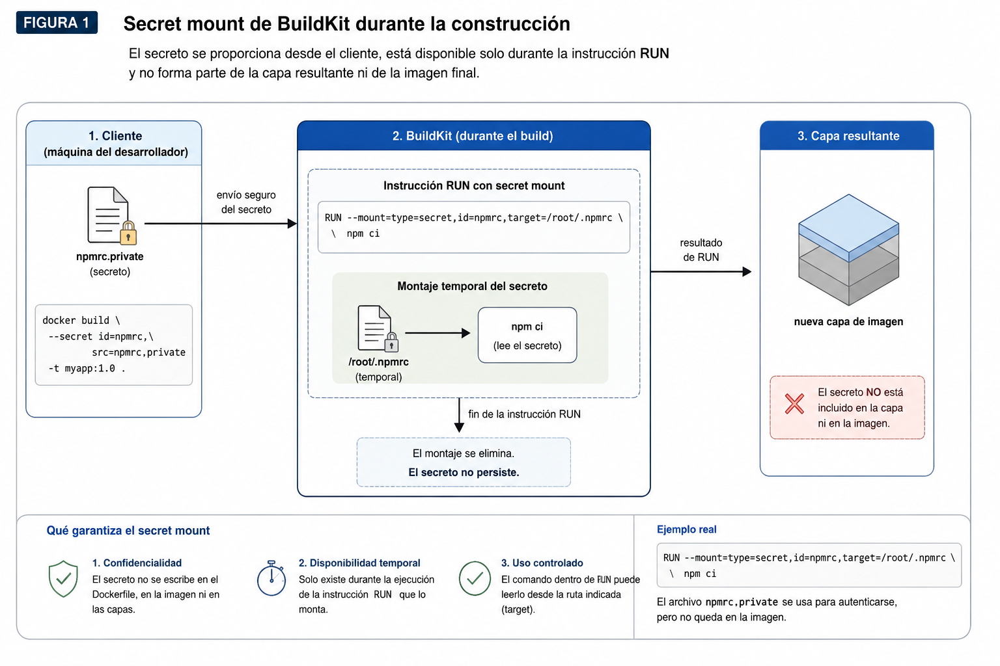
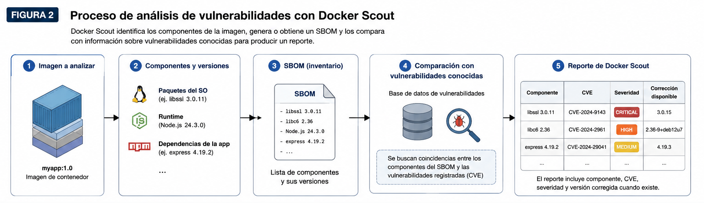
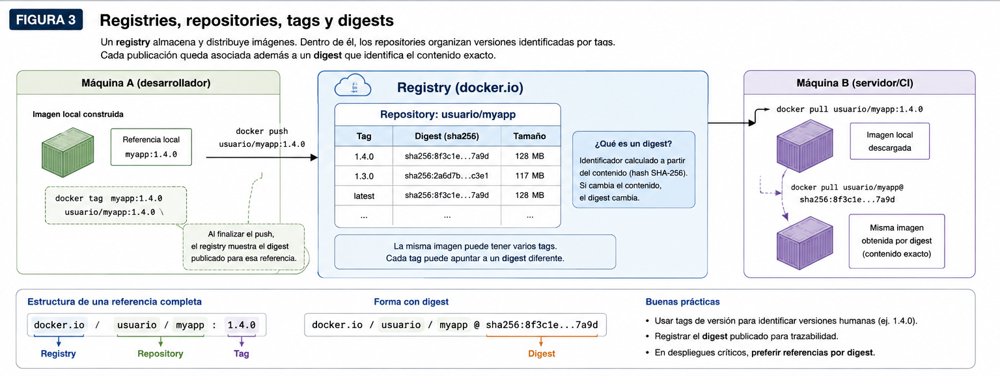

# Sesión 5. Seguridad y trazabilidad de imágenes de contenedor

## Introducción

Una imagen puede ejecutar correctamente una aplicación y, aun así, presentar problemas importantes de seguridad o trazabilidad. El funcionamiento correcto del contenedor no permite determinar por sí solo con qué privilegios se ejecuta el proceso, si existen credenciales incorporadas a la imagen, si alguno de sus componentes contiene vulnerabilidades conocidas o si puede identificarse posteriormente la versión exacta que fue distribuida.

En esta sesión se estudian cuatro aspectos de la construcción y distribución de imágenes:

- usuario y permisos;
- gestión de secretos;
- análisis de vulnerabilidades;
- versionado y distribución mediante registries.

Cada aspecto corresponde a un problema diferente y requiere mecanismos específicos.

---

## 1. Usuario y permisos

Los procesos que se ejecutan en Linux están asociados a un usuario y a uno o más grupos. El sistema utiliza identificadores numéricos para representarlos:

- **UID (User Identifier):** identifica al usuario;
- **GID (Group Identifier):** identifica al grupo.

El usuario con UID 0 se denomina `root`. Este usuario dispone de permisos mayores que un usuario ordinario y puede superar varias de las restricciones habituales de acceso a archivos y otros recursos.

Los contenedores mantienen este modelo de usuarios y permisos. El aislamiento proporcionado por Docker restringe el entorno disponible para el proceso, pero no elimina la diferencia entre ejecutar una aplicación como `root` y hacerlo con un usuario con menos privilegios.

Una aplicación que no necesita privilegios administrativos debería ejecutarse mediante un usuario no privilegiado. Esta decisión corresponde al **principio de mínimo privilegio**: un proceso debe disponer únicamente de los permisos necesarios para realizar su función.

### 1.1 La instrucción `USER`

El usuario predeterminado forma parte de la configuración de una imagen. Si la imagen base ya define uno, esa configuración se hereda mientras el Dockerfile no la modifique.

La instrucción utilizada para establecer el usuario es:

```dockerfile
USER usuario
```

También puede especificarse el grupo:

```dockerfile
USER usuario:grupo
```

o utilizar identificadores numéricos:

```dockerfile
USER 1000:1000
```

La instrucción `USER` determina el usuario utilizado por las instrucciones `RUN` posteriores dentro de esa etapa y establece además el usuario predeterminado para los procesos iniciados mediante `ENTRYPOINT` o `CMD`.

La imagen oficial de Node incluye un usuario denominado `node`, que puede utilizarse cuando la aplicación no necesita privilegios administrativos:

```dockerfile
FROM node:24-bookworm-slim

WORKDIR /app

COPY . .

USER node

CMD ["node", "server.js"]
```

El usuario configurado en una imagen puede inspeccionarse mediante:

```bash
docker image inspect \
  --format '{{.Config.User}}' \
  myapp:1.0
```

También puede verificarse la identidad efectiva del proceso mediante:

```bash
docker run --rm myapp:1.0 id
```

El comando `id` muestra el UID, GID y grupos del proceso. La opción `--rm` indica a Docker que elimine automáticamente el contenedor cuando termine.

Una salida posible es:

```text
uid=1000(node) gid=1000(node) groups=1000(node)
```

### 1.2 Propiedad de archivos

En Linux, cada archivo está asociado a un usuario propietario y a un grupo. Los permisos del archivo determinan qué operaciones pueden realizar su propietario, los miembros de su grupo y los demás usuarios.

Por esta razón, cambiar el usuario que ejecuta una aplicación puede modificar también qué archivos puede leer o escribir.

Considérese:

```dockerfile
FROM node:24-bookworm-slim

WORKDIR /app

COPY . .

USER node

CMD ["node", "server.js"]
```

Los archivos añadidos mediante `COPY` pertenecen normalmente a `root` si no se especifica otra propiedad.

Esto puede ser suficiente si la aplicación solo necesita leerlos. Si necesita modificar alguno de ellos, el usuario `node` podría no disponer de permisos adecuados.

La opción `--chown` permite establecer el propietario durante la copia:

```dockerfile
COPY --chown=node:node . .
```

También puede utilizarse al copiar archivos desde otra etapa:

```dockerfile
COPY --from=build \
  --chown=node:node \
  /app/dist \
  ./dist
```

Esto evita realizar posteriormente un cambio recursivo de propietario sobre los archivos copiados.

### 1.3 Ejemplo

El siguiente Dockerfile combina una construcción multi-stage con un usuario no privilegiado en la imagen final:

```dockerfile
# syntax=docker/dockerfile:1

FROM node:24-bookworm AS build

WORKDIR /app

COPY package*.json ./
RUN npm ci

COPY . .
RUN npm run build
RUN npm prune --omit=dev


FROM node:24-bookworm-slim AS runtime

WORKDIR /app

COPY --from=build \
  --chown=node:node \
  /app/dist \
  ./dist

COPY --from=build \
  --chown=node:node \
  /app/node_modules \
  ./node_modules

USER node

CMD ["node", "dist/server.js"]
```

La primera etapa contiene las herramientas necesarias para instalar dependencias y construir la aplicación. La etapa final recibe únicamente los archivos requeridos en ejecución y establece `node` como usuario predeterminado.

Si una operación posterior del Dockerfile requiere temporalmente privilegios de `root`, debe prestarse atención al usuario que queda configurado al final de la etapa:

```dockerfile
USER root

RUN ...

USER node

CMD ["node", "dist/server.js"]
```

Si se omite el segundo `USER`, la aplicación se ejecutará nuevamente como `root`.

El uso de un usuario no privilegiado reduce los permisos disponibles para el proceso, pero no corrige vulnerabilidades del código, no protege credenciales y no sustituye los demás controles de seguridad de la imagen.

---

## 2. Gestión de secretos

Una imagen no debería contener información cuya exposición permita acceder a recursos protegidos.

Entre los secretos habituales se encuentran:

- contraseñas;
- tokens de acceso;
- claves privadas;
- credenciales para repositorios privados;
- claves de servicios externos.

No toda configuración constituye un secreto. Valores como:

```text
APP_PORT=8080
LOG_LEVEL=info
```

normalmente no necesitan mantenerse confidenciales.

En cambio:

```text
DB_PASSWORD=...
API_TOKEN=...
```

sí requieren protección.

La forma de manejar un secreto depende del momento en que sea necesario.

| Tipo | Momento de uso | Ejemplo |
|---|---|---|
| Secreto de construcción | Durante `docker build` | Credencial para descargar una dependencia privada |
| Secreto de ejecución | Mientras la aplicación está funcionando | Contraseña de una base de datos |

En ambos casos, el valor sensible debe mantenerse fuera de la imagen resultante.

### 2.1 Secretos durante la construcción

Las instrucciones `ARG` y `ENV` tienen propósitos legítimos, pero no deben utilizarse como mecanismos para proteger secretos.

`ENV` incorpora una variable a la configuración de la imagen:

```dockerfile
ENV DB_PASSWORD=supersecreto
```

Ese valor permanecerá asociado a la imagen y estará disponible en los contenedores creados a partir de ella.

`ARG` tiene un alcance diferente:

```dockerfile
ARG NPM_TOKEN
```

El argumento está disponible durante la construcción y no se convierte automáticamente en una variable de entorno del contenedor final. Sin embargo, no proporciona confidencialidad y su valor puede quedar expuesto mediante información producida durante el build o por las instrucciones que lo utilizan.

Por ejemplo:

```dockerfile
ARG NPM_TOKEN

RUN npm config set \
  //registry.npmjs.org/:_authToken=$NPM_TOKEN \
  && npm ci
```

no debe considerarse una forma segura de suministrar el token.

BuildKit proporciona **secret mounts** para entregar temporalmente información sensible a una instrucción `RUN`.

Supóngase un archivo local:

```text
npmrc.private
```

que contiene la configuración necesaria para descargar paquetes privados.

El Dockerfile puede utilizar:

```dockerfile
# syntax=docker/dockerfile:1

FROM node:24-bookworm AS build

WORKDIR /app

COPY package*.json ./

RUN --mount=type=secret,id=npmrc,target=/root/.npmrc \
  npm ci

COPY . .
RUN npm run build
```

El archivo se suministra al ejecutar la construcción:

```bash
docker build \
  --secret id=npmrc,src=./npmrc.private \
  -t myapp:1.0 .
```

El archivo estará disponible temporalmente en:

```text
/root/.npmrc
```

durante esa instrucción `RUN`, pero el montaje no se incorpora a la capa resultante.



**Figura 1.** El secreto se proporciona al proceso de construcción y solo está disponible durante la instrucción `RUN` que declara el montaje. El montaje no forma parte de la capa resultante.

Si no se especifica un `target`, el secreto se monta de forma predeterminada bajo:

```text
/run/secrets/
```

Copiar un secreto y eliminarlo posteriormente no ofrece la misma protección:

```dockerfile
COPY npmrc.private /root/.npmrc
RUN npm ci
RUN rm /root/.npmrc
```

`COPY` incorpora el archivo a una capa. La eliminación posterior modifica el estado visible en una capa nueva, pero no elimina el contenido de la capa anterior.

El secret mount evita que BuildKit incorpore directamente el secreto mediante el montaje. Sin embargo, el programa ejecutado durante el `RUN` todavía podría copiarlo a otro archivo o escribirlo en su salida. La herramienta que consume el secreto también debe utilizarlo correctamente.

Los archivos sensibles tampoco deberían enviarse innecesariamente dentro del contexto de construcción. Por ejemplo:

```dockerignore
.env
*.pem
npmrc.private
```

`.dockerignore` reduce el riesgo de incluir accidentalmente estos archivos mediante un `COPY`, pero no sustituye el mecanismo utilizado para proporcionar secretos durante la construcción.

### 2.2 Secretos durante la ejecución

Una credencial que la aplicación necesita durante su ejecución tampoco debería quedar incorporada al Dockerfile:

```dockerfile
ENV DB_PASSWORD=contraseña-real
```

La imagen debe poder construirse y almacenarse independientemente del valor concreto de esa credencial.

Docker permite suministrar variables de entorno al iniciar el contenedor. Si la máquina desde la que se ejecuta Docker ya dispone de una variable denominada `DB_PASSWORD`, puede transferirse mediante:

```bash
docker run \
  --env DB_PASSWORD \
  myapp:1.0
```

La aplicación podrá consultar esa variable durante su ejecución sin que el valor haya formado parte de la imagen.

Esto mantiene separadas la imagen y la configuración sensible, pero una variable de entorno no constituye por sí misma un sistema completo de gestión de secretos. Un proceso o usuario con permisos suficientes para inspeccionar el contenedor podría obtener ese valor.

La propiedad que interesa en esta sesión es que el secreto no quede almacenado dentro del artefacto distribuible.

---

## 3. Análisis de vulnerabilidades

Una imagen contiene software procedente de diferentes fuentes. Además del código de la aplicación pueden existir paquetes del sistema operativo, un runtime y dependencias instaladas mediante gestores de paquetes.

Por ejemplo:

```text
node:24-bookworm-slim
├── paquetes del sistema operativo
├── Node.js
└── aplicación
    └── dependencias npm
```

Una vulnerabilidad puede encontrarse en cualquiera de esos componentes.

Para analizar una imagen es necesario conocer qué software contiene. Un **SBOM (Software Bill of Materials)** es un inventario de componentes de software y sus versiones asociado a un artefacto.

Un SBOM puede incluir, entre otros:

- paquetes del sistema operativo;
- runtimes;
- bibliotecas;
- dependencias de la aplicación.

La información disponible depende de los componentes y de la capacidad de la herramienta utilizada para identificarlos.

Las vulnerabilidades conocidas se identifican habitualmente mediante **CVE (Common Vulnerabilities and Exposures)**.

Un identificador como:

```text
CVE-2026-XXXXX
```

permite referirse de forma estándar a una vulnerabilidad determinada.

Los reportes también suelen asociar una **severidad** al hallazgo. Es frecuente encontrar categorías como:

- `critical`;
- `high`;
- `medium`;
- `low`.

La severidad ayuda a priorizar el análisis, pero no es la única información necesaria. También debe conocerse qué componente está afectado, qué versión contiene la imagen y si existe una versión corregida.



**Figura 2.** Docker Scout identifica componentes y versiones de la imagen, obtiene o genera un SBOM y utiliza esa información para localizar vulnerabilidades conocidas asociadas a los componentes detectados.

### 3.1 Docker Scout

Docker Scout permite analizar los componentes de una imagen y compararlos con información disponible sobre vulnerabilidades conocidas.

El análisis básico se ejecuta mediante:

```bash
docker scout cves myapp:1.0
```

El resultado permite observar información como:

- componente afectado;
- versión instalada;
- identificador CVE;
- severidad;
- versión corregida, cuando existe.

La disponibilidad de la herramienta puede comprobarse mediante:

```bash
docker scout version
```

Docker Desktop incluye Docker Scout. En instalaciones de Docker Engine donde el plugin no esté disponible, deberá instalarse antes de utilizar estos comandos.

Puede filtrarse el reporte por severidad:

```bash
docker scout cves \
  --only-severity critical,high \
  myapp:1.0
```

También puede analizarse específicamente lo heredado de la imagen base:

```bash
docker scout cves \
  --only-base \
  myapp:1.0
```

o excluir ese contenido para concentrarse en otros componentes:

```bash
docker scout cves \
  --ignore-base \
  myapp:1.0
```

Esta distinción ayuda a identificar la acción apropiada.

Una vulnerabilidad presente en un paquete heredado de la imagen base puede requerir:

- actualizar la imagen base;
- cambiar a una versión más reciente;
- seleccionar otra variante apropiada.

Una vulnerabilidad encontrada en una dependencia npm puede requerir:

- actualizar la dependencia;
- cambiar la versión requerida;
- revisar la compatibilidad de la aplicación con la versión corregida.

### 3.2 Interpretación de resultados

El número total de vulnerabilidades no es suficiente para decidir qué hacer con una imagen.

Para cada hallazgo interesa determinar:

1. qué componente está afectado;
2. qué versión está instalada;
3. qué severidad se reporta;
4. si existe una versión corregida;
5. si el componente procede de la base o fue añadido posteriormente.

El escáner permite identificar vulnerabilidades conocidas, pero no demuestra que una imagen sea segura.

No detecta necesariamente:

- errores lógicos de la aplicación;
- problemas de autorización;
- credenciales incorporadas accidentalmente al código;
- vulnerabilidades que todavía no han sido documentadas.

Una imagen puede además producir resultados diferentes en dos fechas aunque su contenido no haya cambiado. Esto puede ocurrir si posteriormente se publica información sobre una vulnerabilidad que ya estaba presente en alguno de sus componentes.

El tamaño de la imagen tampoco debe utilizarse como medida directa de seguridad. Reducir software innecesario disminuye la cantidad de componentes que deben mantenerse, pero una imagen pequeña puede contener componentes vulnerables y una imagen mayor puede no contenerlos.

---

## 4. Versionado y distribución de imágenes

Una imagen construida mediante:

```bash
docker build -t myapp:1.0 .
```

queda inicialmente almacenada en la máquina donde se ejecutó Docker.

Si otra máquina necesita ejecutar exactamente esa imagen, debe disponer de un mecanismo para obtenerla.

Los **registries** proporcionan ese mecanismo.

### 4.1 Registries y repositories

Un **registry** es un servicio utilizado para almacenar y distribuir imágenes de contenedor.

Algunos ejemplos son:

- Docker Hub;
- GitHub Container Registry;
- Google Artifact Registry;
- Amazon Elastic Container Registry;
- Azure Container Registry.

Dentro de un registry, las imágenes relacionadas se organizan en **repositories**.

Por ejemplo:

```text
docker.io/empresa/payments-api
```

puede separarse en:

```text
docker.io
```

como registry y:

```text
empresa/payments-api
```

como repository.

Un mismo repository puede contener varias versiones:

```text
empresa/payments-api:1.2.0
empresa/payments-api:1.3.0
empresa/payments-api:1.4.0
```

Un repository puede ser público o restringir el acceso mediante autenticación y autorización. Esta característica controla quién puede descargar o publicar imágenes, pero no modifica el contenido de las imágenes almacenadas.



**Figura 3.** Una imagen se publica en un repository dentro de un registry. Los tags ofrecen referencias legibles y el digest permite identificar el contenido exacto publicado.

### 4.2 Tags y digests

Un **tag** es un nombre asociado a una imagen dentro de un repository.

Por ejemplo:

```text
1.4.0
1.4.1
latest
```

Una referencia completa puede escribirse como:

```text
docker.io/empresa/payments-api:1.4.0
```

y contiene:

| Elemento | Valor |
|---|---|
| Registry | `docker.io` |
| Repository | `empresa/payments-api` |
| Tag | `1.4.0` |

Los tags son fáciles de leer y resultan útiles para representar versiones, pero pueden reasignarse.

Por tanto, una referencia como:

```text
payments-api:1.4.0
```

no garantiza por sí sola que siempre señale al mismo contenido.

`latest` tampoco significa automáticamente “versión más nueva”, “versión estable” o “versión aprobada”. Es simplemente un tag convencional.

Cuando no se especifica otro tag, Docker utiliza normalmente `latest`. Por ejemplo:

```bash
docker pull nginx
```

equivale a:

```bash
docker pull nginx:latest
```

Un **digest** identifica contenido mediante un hash criptográfico.

Una referencia por digest tiene una forma similar a:

```text
empresa/payments-api@sha256:...
```

La diferencia fundamental es que un tag puede asociarse posteriormente a otro contenido, mientras que un digest identifica un contenido específico.

Por esta razón suelen utilizarse para propósitos complementarios:

- el tag facilita el versionado y la comunicación;
- el digest permite identificar exactamente el artefacto publicado.

### 4.3 Publicación de imágenes

Supóngase una imagen local:

```text
myapp:1.0
```

y un repository de Docker Hub denominado:

```text
usuario/myapp
```

La imagen puede recibir una nueva referencia mediante:

```bash
docker tag \
  myapp:1.0 \
  usuario/myapp:1.0
```

`docker tag` no transfiere la imagen. Únicamente crea una referencia adicional hacia la misma imagen local.

Para realizar operaciones que requieren autorización contra Docker Hub puede utilizarse:

```bash
docker login
```

Una vez autenticado el cliente, la imagen puede publicarse mediante:

```bash
docker push usuario/myapp:1.0
```

Durante el `push`, Docker transfiere las partes de la imagen que el registry todavía no posee. Al finalizar, la salida incluye el digest asociado al contenido publicado.

Una salida simplificada puede mostrar:

```text
1.0: digest: sha256:... size: ...
```

Otra máquina puede obtener posteriormente la imagen mediante:

```bash
docker pull usuario/myapp:1.0
```

Si se desea solicitar exactamente el contenido identificado por un digest:

```bash
docker pull usuario/myapp@sha256:...
```

El flujo básico de publicación es:

```bash
docker build -t myapp:1.0 .

docker tag \
  myapp:1.0 \
  usuario/myapp:1.0

docker login

docker push usuario/myapp:1.0
```

y su recuperación puede realizarse mediante:

```bash
docker pull usuario/myapp:1.0
```

---

## 5. Caso de estudio

Un equipo mantiene el backend de una aplicación de pagos mediante el siguiente Dockerfile:

```dockerfile
FROM node:18

WORKDIR /app

COPY package*.json ./
RUN npm install

COPY . .

ENV DB_PASSWORD=produccion123

CMD ["node", "server.js"]
```

La imagen se publica siempre como:

```text
empresa/payments-api:latest
```

en un repository público.

Un análisis con Docker Scout reporta varias vulnerabilidades de severidad alta y crítica correspondientes a paquetes presentes en la imagen base. El equipo tampoco registra el digest de las imágenes desplegadas.

El escenario contiene varios problemas independientes.

| Aspecto | Problema | Corrección |
|---|---|---|
| Usuario | No se establece un usuario no privilegiado | Verificar el usuario de la imagen y configurar uno apropiado mediante `USER` |
| Credencial | La contraseña está incorporada mediante `ENV` | Eliminarla de la imagen y suministrarla durante la ejecución |
| Exposición previa | Versiones anteriores pudieron ser descargadas con la contraseña | Revocar o rotar la credencial |
| Runtime | Node.js 18 está fuera de soporte | Migrar a una línea soportada |
| Vulnerabilidades | Existen componentes vulnerables en la base | Identificar los paquetes afectados y reconstruir sobre una base corregida |
| Versionado | Solo se utiliza `latest` | Utilizar tags de versión explícitos |
| Trazabilidad | No se conserva la identidad exacta del artefacto | Registrar el digest de la imagen publicada |

La exposición de la contraseña requiere una consideración adicional. Publicar una nueva imagen sin:

```dockerfile
ENV DB_PASSWORD=...
```

evita que las nuevas versiones contengan el valor, pero no modifica las copias ya existentes.

Si una imagen que contenía una credencial válida estuvo disponible públicamente, no puede garantizarse que ningún tercero la haya descargado. La credencial debe considerarse comprometida y debe revocarse o rotarse.

Si el repository hubiera sido privado, sería necesario analizar quién tenía acceso y qué sistemas pudieron descargar la imagen. La restricción de acceso reduce el número potencial de lectores, pero no elimina el hecho de que cualquier usuario autorizado para obtener la imagen también puede analizar su contenido.

El uso de `node:18` plantea además un problema distinto de las vulnerabilidades concretas reportadas por Scout. Una línea de runtime fuera de soporte deja de recibir las actualizaciones normales del proyecto. Por tanto, debe utilizarse una versión todavía mantenida y, posteriormente, volver a analizar la imagen reconstruida.

---

## 6. Ejercicios

### Ejercicio 1. Usuario de ejecución

Considérese:

```dockerfile
FROM node:24-bookworm-slim

WORKDIR /app

COPY package*.json ./
RUN npm ci --omit=dev

COPY . .

CMD ["node", "server.js"]
```

Responder:

1. ¿Qué usuario queda configurado para ejecutar el proceso?
2. ¿Cómo puede comprobarse mediante `docker image inspect`?
3. ¿Qué modificación permitiría ejecutar la aplicación como `node`?
4. ¿Qué problema podría aparecer con la propiedad de los archivos?
5. ¿Cómo puede utilizarse `COPY --chown` para evitarlo?

Comprobar el resultado mediante:

```bash
docker image inspect \
  --format '{{.Config.User}}' \
  <imagen>
```

y:

```bash
docker run --rm <imagen> id
```

### Ejercicio 2. Secreto durante la construcción

Analizar:

```dockerfile
FROM node:24-bookworm

ARG PRIVATE_TOKEN

WORKDIR /app

COPY package*.json ./

RUN npm config set \
  //registry.example.com/:_authToken=$PRIVATE_TOKEN \
  && npm ci

COPY . .

CMD ["node", "server.js"]
```

Determinar:

1. por qué `PRIVATE_TOKEN` constituye un secreto de construcción;
2. por qué `ARG` no debe utilizarse para protegerlo;
3. cómo podría sustituirse por un secret mount de BuildKit;
4. qué archivo debería suministrarse mediante `--secret`;
5. qué archivos relacionados deberían excluirse del contexto mediante `.dockerignore`.

### Ejercicio 3. Vulnerabilidades

A partir de la salida de:

```bash
docker scout cves <imagen>
```

seleccionar varios hallazgos y completar:

| CVE | Componente | Versión instalada | Severidad | Corrección disponible | Origen |
|---|---|---|---|---|---|

Utilizar cuando resulte necesario:

```bash
docker scout cves --only-base <imagen>
```

y:

```bash
docker scout cves --ignore-base <imagen>
```

Para cada hallazgo debe indicarse qué acción se propone y por qué corresponde al componente afectado.

### Ejercicio 4. Publicación y trazabilidad

Un equipo publica:

```text
payments-api:1.4.0
```

Posteriormente modifica el código, reconstruye la aplicación y vuelve a publicar otra imagen utilizando exactamente el mismo tag:

```text
payments-api:1.4.0
```

Responder:

1. ¿permite el tag demostrar que ambas publicaciones contienen los mismos bytes?
2. ¿qué identificador permitiría distinguir inequívocamente los dos artefactos?
3. ¿qué utilidad conserva el tag?
4. ¿qué inconveniente produce reutilizarlo para contenido diferente?
5. ¿qué información debería conservarse después de cada `docker push`?

---

## Referencias

- Docker Documentation. *Dockerfile reference*.
- Docker Documentation. *Build secrets*.
- Docker Documentation. *Build variables*.
- Docker Documentation. *Docker Scout*.
- Docker Documentation. *Docker Scout CLI: cves*.
- Docker Documentation. *What is a registry?*
- Docker Documentation. *docker login*.
- Docker Documentation. *docker image push*.
- Docker Documentation. *docker image pull*.
- Node.js Project. *Node.js release schedule and End-of-Life information*.
