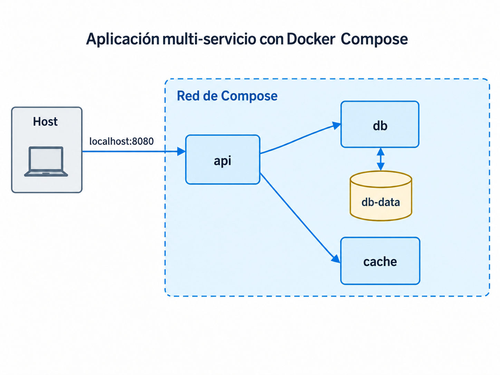
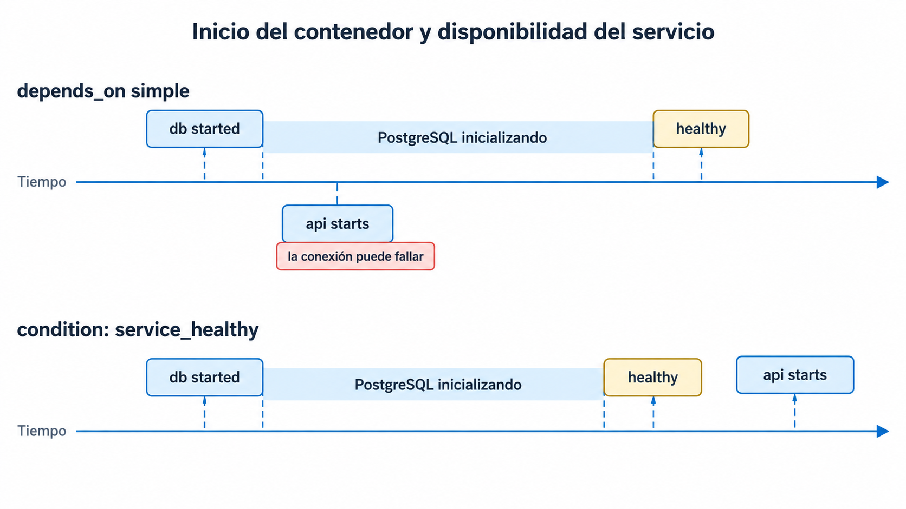
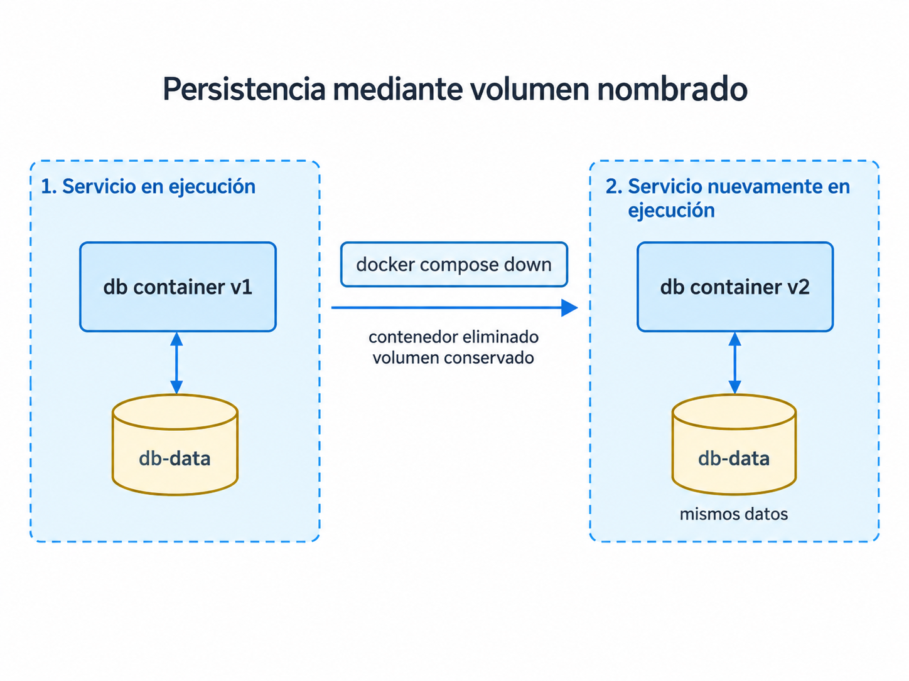

# Sesión 6. Docker Compose y aplicaciones multi-servicio

## Alcance de la sesión

Las sesiones anteriores desarrollaron el ciclo de construcción de una imagen de contenedor: definición mediante Dockerfile, control del contexto de construcción, uso de caché, construcciones multi-stage, selección de imágenes base, ejecución con un usuario no privilegiado, tratamiento de secretos y publicación en registries. Ese trabajo permite empaquetar un componente de software de forma reproducible, pero todavía deja pendiente un problema distinto: una aplicación real suele depender de otros servicios.

Un backend puede requerir una base de datos, una caché, un broker de mensajes u otros componentes. Cada uno puede ejecutarse en su propio contenedor, pero el sistema solo funciona si todos reciben una configuración coherente, pueden comunicarse entre sí y conservan el estado que corresponda.

En esta sesión introducimos **Docker Compose** como mecanismo para definir y ejecutar una aplicación formada por varios contenedores en un mismo host. El objetivo no consiste en memorizar propiedades YAML, sino en comprender cuatro problemas de ingeniería:

- cómo describir varios servicios como una sola aplicación;
- cómo se comunican los contenedores sin depender de direcciones IP fijas;
- qué datos deben sobrevivir a la recreación de un contenedor;
- cómo controlar configuración, secretos y dependencias durante el arranque.

Al finalizar, debe ser posible construir, levantar, inspeccionar, diagnosticar, detener y reconstruir una aplicación multi-servicio a partir de los archivos versionables del proyecto y de los valores de configuración que deliberadamente se mantienen fuera del repositorio.

---

## 1. El problema de una aplicación multi-servicio

Considérese un servicio de pedidos que necesita PostgreSQL. Con los comandos estudiados hasta este punto sería posible ejecutar ambos componentes manualmente. Una forma razonable de hacerlo sería crear primero una red definida por el usuario y conectar ambos contenedores a ella:

```bash
docker network create orders-net

docker run -d \
  --name orders-db \
  --network orders-net \
  -e POSTGRES_USER=app \
  -e POSTGRES_PASSWORD='contraseña-local' \
  -e POSTGRES_DB=orders \
  postgres:18

docker run -d \
  --name orders-api \
  --network orders-net \
  -p 8080:8080 \
  -e DB_HOST=orders-db \
  -e DB_USER=app \
  -e DB_PASSWORD='contraseña-local' \
  -e DB_NAME=orders \
  orders-api:1.0
```

Los dos contenedores podrían comunicarse utilizando nombres estables dentro de esa red. Una red bridge definida por el usuario incorpora resolución DNS entre sus contenedores; esto evita tener que conocer las direcciones IP que Docker asigne en cada ejecución.

El problema aparece al considerar el sistema completo. Al procedimiento anterior todavía habría que añadir la construcción de la imagen propia, persistencia de PostgreSQL, espera hasta que la base de datos esté lista, limpieza de recursos, tratamiento apropiado de credenciales y cualquier servicio adicional. Si cada integrante del equipo conserva esa secuencia en su memoria, en un documento informal o en su historial de terminal, la ejecución del sistema deja de ser reproducible.

### 1.1 ¿Por qué separar los servicios?

Una alternativa técnicamente posible sería instalar la API, PostgreSQL y Redis dentro de una misma imagen y ejecutar los tres procesos en un solo contenedor. Docker no impide hacerlo y tampoco exige que exista exactamente un proceso por contenedor.

Sin embargo, esa decisión acopla componentes que tienen responsabilidades y ciclos de vida diferentes. Si se desea actualizar Redis, sería necesario reconstruir y reemplazar un contenedor que también incluye la API y la base de datos. Si PostgreSQL falla mientras el proceso principal del contenedor continúa en ejecución, el estado del contenedor por sí solo no expresa con claridad cuál de los servicios internos dejó de funcionar. También se dificulta escalar cada componente de forma independiente: crear tres copias del contenedor para aumentar la capacidad de la API produciría, al mismo tiempo, tres instancias de PostgreSQL y tres de Redis.

Por esta razón, en una aplicación compuesta por servicios independientes suele resultar más apropiado ejecutar cada responsabilidad con su propio ciclo de vida en un contenedor separado:

```text
Aplicación TiendaNova
├── api
├── db
└── cache
```

La separación no significa que cada contenedor deba contener literalmente un único proceso. Un proceso principal puede crear procesos hijos o utilizar otros procesos auxiliares cuando forman parte de la misma responsabilidad. La decisión de diseño relevante es evitar agrupar en un mismo contenedor servicios independientes que necesiten actualizarse, escalarse, diagnosticarse o administrarse de forma separada.

Separar los servicios resuelve ese problema de acoplamiento, pero introduce otro: ahora es necesario describir cómo deben iniciarse, conectarse, configurarse y detenerse como una sola aplicación. **Docker Compose aborda precisamente ese problema.**

Docker Compose permite trasladar esa configuración a un archivo declarativo que puede revisarse y versionarse junto con el código.

!!! note "Alcance de Compose"
    En este curso Compose se utilizará para reproducir aplicaciones multi-servicio en un solo host. Docker también documenta su uso en servidores individuales y otros entornos, pero Compose no constituye por sí mismo un scheduler distribuido capaz de colocar cargas en múltiples nodos, tolerar la pérdida de un host o realizar autoscaling basado en carga. Esos problemas corresponden a plataformas de orquestación con otro modelo operativo.

---

## 2. Docker Compose y la Compose Specification

### 2.1 Verificación de la instalación

Compose forma parte actualmente de la experiencia de la CLI de Docker. Antes de comenzar, verificar Docker Engine y Compose:

```bash
docker version
docker compose version
```

La sintaxis utilizada durante la sesión es:

```text
docker compose ...
```

No se utilizará el comando heredado `docker-compose` con guion.

### 2.2 El archivo `compose.yaml`

Por convención, la definición de la aplicación se guarda en:

```text
compose.yaml
```

Compose también reconoce nombres heredados como `docker-compose.yaml` y `docker-compose.yml`, pero `compose.yaml` es el nombre preferido para proyectos nuevos.

Los archivos actuales siguen la **Compose Specification**. No es necesario añadir una propiedad superior `version:`. Esa propiedad se conserva únicamente por compatibilidad y las versiones actuales de Compose la consideran obsoleta.

Un archivo mínimo puede contener:

```yaml
services:
  api:
    build: .
    ports:
      - "8080:8080"

  db:
    image: postgres:18
```

La propiedad superior `services` contiene las definiciones de los servicios de la aplicación.

### 2.3 Servicio y proyecto

Un **servicio** describe cómo deben crearse uno o más contenedores equivalentes: imagen, variables, puertos, volúmenes, redes, dependencias y otras propiedades de ejecución. En desarrollo local, cada servicio suele tener una sola instancia.

Un **proyecto de Compose** agrupa los servicios, redes y volúmenes administrados como una unidad. Por defecto, Compose deriva el nombre del proyecto a partir del directorio, aunque puede establecerse explícitamente mediante `name:` o mediante la opción `-p`.

Ejemplo:

```yaml
name: tiendanova-orders

services:
  api:
    image: example/api:1.0
```

El nombre del proyecto ayuda a diferenciar recursos pertenecientes a aplicaciones distintas que se ejecutan en la misma máquina.

### 2.4 Compose aplica cambios cuando se ejecuta

`docker compose up` interpreta el modelo de la aplicación y crea, inicia o recrea los recursos necesarios. Si cambia la configuración de un servicio, una ejecución posterior de `docker compose up` puede recrear su contenedor manteniendo los volúmenes montados.

Esto no debe confundirse con un ciclo permanente de reconciliación. Compose no permanece comparando continuamente el archivo con el estado real después de terminar el comando. La convergencia ocurre cuando se invocan operaciones de Compose.

---

## 3. Proyecto de estudio: TiendaNova Orders

Durante el resto de la sesión se construirá un entorno local para el servicio de pedidos de TiendaNova. La versión final tendrá tres servicios:



*Figura 1. Aplicación multi-servicio utilizada durante la sesión. Compose coordina los servicios `api`, `db` y `cache`; el volumen `db-data` mantiene el estado de PostgreSQL fuera del ciclo de vida del contenedor.*

La aplicación es deliberadamente pequeña. Su función es hacer visibles los efectos de red, persistencia, caché, configuración y orden de arranque; no pretende enseñar desarrollo de APIs.

### 3.1 Crear el directorio de trabajo

En una terminal Bash:

```bash
mkdir -p tiendanova-compose/config
cd tiendanova-compose
```

La estructura final será:

```text
tiendanova-compose/
├── app.py
├── requirements.txt
├── Dockerfile
├── compose.yaml
├── .dockerignore
├── .gitignore
├── .env.example
├── .env
└── config/
    └── api.env
```

### 3.2 Dependencias de Python

Crear `requirements.txt`:

```text
Flask==3.1.3
psycopg[binary]==3.3.5
redis==8.1.0
```

Las versiones se fijan para que el ejemplo no cambie silenciosamente por una actualización de dependencias durante la sesión.

### 3.3 Código de la API

Crear `app.py`:

```python
import json
import os

import psycopg
from flask import Flask, jsonify, request
from psycopg.rows import dict_row
from redis import Redis

app = Flask(__name__)


def read_secret_or_env(file_var: str, env_var: str) -> str:
    secret_path = os.getenv(file_var)
    if secret_path:
        with open(secret_path, "r", encoding="utf-8") as secret_file:
            return secret_file.read().strip()

    value = os.getenv(env_var)
    if value:
        return value

    raise RuntimeError(f"No se definió {file_var} ni {env_var}")


def db_connection():
    return psycopg.connect(
        host=os.getenv("DB_HOST", "db"),
        port=int(os.getenv("DB_PORT", "5432")),
        dbname=os.getenv("DB_NAME", "orders"),
        user=os.getenv("DB_USER", "app"),
        password=read_secret_or_env("DB_PASSWORD_FILE", "DB_PASSWORD"),
    )


def redis_client():
    host = os.getenv("REDIS_HOST")
    if not host:
        return None

    return Redis(
        host=host,
        port=int(os.getenv("REDIS_PORT", "6379")),
        decode_responses=True,
    )


def initialize_database():
    with db_connection() as conn:
        with conn.cursor() as cur:
            cur.execute(
                """
                CREATE TABLE IF NOT EXISTS orders (
                    id SERIAL PRIMARY KEY,
                    product TEXT NOT NULL,
                    quantity INTEGER NOT NULL CHECK (quantity > 0)
                )
                """
            )


@app.get("/health")
def health():
    result = {"api": "ok", "database": "unknown", "cache": "not-configured"}

    try:
        with db_connection() as conn:
            with conn.cursor() as cur:
                cur.execute("SELECT 1")
        result["database"] = "ok"
    except Exception:
        result["database"] = "error"

    cache = redis_client()
    if cache is not None:
        try:
            cache.ping()
            result["cache"] = "ok"
        except Exception:
            result["cache"] = "error"

    status = 200 if result["database"] == "ok" else 503
    return jsonify(result), status


@app.get("/config")
def config():
    return jsonify(
        {
            "app_mode": os.getenv("APP_MODE", "not-defined"),
            "db_host": os.getenv("DB_HOST", "db"),
            "db_port": os.getenv("DB_PORT", "5432"),
            "redis_host": os.getenv("REDIS_HOST", "not-configured"),
        }
    )


@app.post("/orders")
def create_order():
    payload = request.get_json(silent=True) or {}
    product = payload.get("product")
    quantity = payload.get("quantity")

    if not isinstance(product, str) or not product.strip():
        return jsonify({"error": "product es obligatorio"}), 400

    if not isinstance(quantity, int) or quantity <= 0:
        return jsonify({"error": "quantity debe ser un entero positivo"}), 400

    with db_connection() as conn:
        with conn.cursor(row_factory=dict_row) as cur:
            cur.execute(
                """
                INSERT INTO orders (product, quantity)
                VALUES (%s, %s)
                RETURNING id, product, quantity
                """,
                (product.strip(), quantity),
            )
            order = cur.fetchone()

    cache = redis_client()
    if cache is not None:
        cache.delete("orders:all")

    return jsonify(order), 201


@app.get("/orders")
def list_orders():
    cache = redis_client()

    if cache is not None:
        cached = cache.get("orders:all")
        if cached:
            return jsonify({"source": "cache", "orders": json.loads(cached)})

    with db_connection() as conn:
        with conn.cursor(row_factory=dict_row) as cur:
            cur.execute("SELECT id, product, quantity FROM orders ORDER BY id")
            orders = cur.fetchall()

    if cache is not None:
        cache.setex("orders:all", 30, json.dumps(orders))

    return jsonify({"source": "database", "orders": orders})


if __name__ == "__main__":
    initialize_database()
    app.run(host="0.0.0.0", port=8080)
```

La API admite dos formas de recibir la contraseña de PostgreSQL. Al inicio se usará `DB_PASSWORD` como variable de entorno para observar sus limitaciones. La configuración final utilizará `DB_PASSWORD_FILE`, cuyo valor apunta a un secreto montado como archivo.

### 3.4 Dockerfile

Crear `Dockerfile`:

```dockerfile
FROM python:3.13-slim

ENV PYTHONDONTWRITEBYTECODE=1 \
    PYTHONUNBUFFERED=1

WORKDIR /app

COPY requirements.txt ./
RUN pip install --no-cache-dir -r requirements.txt

RUN addgroup --system --gid 10001 app \
    && adduser --system --uid 10001 --ingroup app app

COPY --chown=app:app app.py ./

USER app

EXPOSE 8080

CMD ["python", "app.py"]
```

Este Dockerfile conserva prácticas de sesiones anteriores: instalación de dependencias antes de copiar el código para aprovechar la caché y ejecución con un usuario no privilegiado.

### 3.5 Contexto de construcción y control de versiones

Crear `.dockerignore`:

```text
.git
.gitignore
.env
__pycache__/
*.pyc
```

Crear `.gitignore`:

```text
.env
__pycache__/
*.pyc
```

Crear `.env.example`:

```text
APP_PORT=8080
```

Crear la copia local que Compose utilizará para interpolación:

```bash
cp .env.example .env
```

Crear `config/api.env`:

```text
APP_MODE=development
```

`config/api.env` contiene únicamente configuración no sensible y se utilizará para demostrar `env_file`.

---

## 4. Primera definición de Compose

Crear inicialmente `compose.yaml` con dos servicios:

```yaml
name: tiendanova-orders

services:
  api:
    build:
      context: .
    ports:
      - "${APP_PORT:-8080}:8080"
    env_file:
      - ./config/api.env
    environment:
      DB_HOST: db
      DB_PORT: "5432"
      DB_NAME: orders
      DB_USER: app
      DB_PASSWORD: ${DB_PASSWORD:?Debe definir DB_PASSWORD en el entorno}
    depends_on:
      - db

  db:
    image: postgres:18
    environment:
      POSTGRES_USER: app
      POSTGRES_DB: orders
      POSTGRES_PASSWORD: ${DB_PASSWORD:?Debe definir DB_PASSWORD en el entorno}
```

### 4.1 Definir temporalmente la contraseña

No escribir la contraseña en el comando con `export DB_PASSWORD=valor`, porque el valor puede quedar almacenado en el historial del shell. En Bash puede solicitarse de forma interactiva:

```bash
read -s -p "Contraseña local de PostgreSQL: " DB_PASSWORD
export DB_PASSWORD
echo
```

El valor queda en el entorno de esta terminal. Si se abre una terminal nueva habrá que volver a definirlo.

### 4.2 Validar el modelo

Antes de crear contenedores:

```bash
docker compose config -q
```

Si el comando termina sin salida y con código `0`, la definición puede analizarse correctamente.

Para observar el modelo resuelto puede ejecutarse:

```bash
docker compose config
```

!!! warning "Una primera evidencia sobre secretos"
    En esta versión, `DB_PASSWORD` se interpola y termina como variable de entorno del contenedor. `docker compose config` puede mostrar el valor resuelto. No se debe copiar ni publicar esa salida cuando contiene datos sensibles. Más adelante se eliminará este mecanismo para la contraseña.

Para consultar únicamente las variables disponibles para interpolación:

```bash
docker compose config --environment
```

Este comando también debe tratarse con precaución cuando el entorno del shell contiene secretos.

### 4.3 Construir y levantar

Construir la imagen propia:

```bash
docker compose build api
```

Descargar la imagen de PostgreSQL explícitamente es opcional porque `up` puede descargarla si no existe localmente, pero puede hacerse antes de la ejecución:

```bash
docker compose pull db
```

Levantar la aplicación mostrando los logs en la terminal:

```bash
docker compose up
```

Para detenerla desde este modo puede utilizarse `Ctrl+C`.

Levantarla en segundo plano:

```bash
docker compose up -d
```

Cuando también se desea reconstruir cualquier servicio definido con `build`:

```bash
docker compose up -d --build
```

### 4.4 Inspeccionar el estado

```bash
docker compose ps
```

Para incluir contenedores que ya terminaron:

```bash
docker compose ps -a
```

Logs de todo el proyecto:

```bash
docker compose logs
```

Logs únicamente de la API:

```bash
docker compose logs api
```

Seguimiento continuo:

```bash
docker compose logs -f api
```

### 4.5 Probar el servicio

Desde el host:

```bash
curl http://localhost:8080/health
```

Si la API está disponible, una respuesta esperada en esta etapa es equivalente a:

```json
{
  "api": "ok",
  "cache": "not-configured",
  "database": "ok"
}
```

Consultar configuración no sensible:

```bash
curl http://localhost:8080/config
```

Aquí puede observarse que `APP_MODE` proviene de `config/api.env`, mientras que `DB_HOST`, `DB_PORT`, `DB_NAME` y `DB_USER` provienen de `environment`.

---

## 5. Ciclo de vida de los servicios

Compose administra el proyecto como una unidad, pero también permite operar sobre servicios concretos.

### 5.1 Detener sin eliminar

```bash
docker compose stop
```

Los contenedores siguen existiendo. Comprobarlo:

```bash
docker compose ps -a
```

Volver a iniciarlos:

```bash
docker compose start
```

### 5.2 Reiniciar

```bash
docker compose restart api
```

`restart` detiene y vuelve a iniciar el contenedor existente. **No aplica cambios nuevos realizados en `compose.yaml`.**

Por ejemplo, si se modifica `APP_MODE`, este comando no recreará el contenedor con la nueva configuración:

```bash
docker compose restart api
```

Para aplicar cambios del modelo debe ejecutarse nuevamente:

```bash
docker compose up -d
```

Si Compose detecta que la configuración del servicio cambió, recreará el contenedor correspondiente.

### 5.3 Ejecutar comandos dentro de un servicio

Abrir un shell dentro de la API:

```bash
docker compose exec api sh
```

Salir con:

```bash
exit
```

Ejecutar directamente una consulta en PostgreSQL:

```bash
docker compose exec db \
  psql -U app -d orders -c "SELECT current_database(), current_user;"
```

`docker compose exec` actúa sobre un contenedor que ya está en ejecución. Para tareas puntuales que deben ejecutarse en un contenedor nuevo existe también `docker compose run`, pero no es necesario para el flujo principal de esta sesión.

### 5.4 Eliminar los recursos de ejecución

```bash
docker compose down
```

Por defecto, `down` elimina los contenedores del proyecto y las redes administradas por Compose. Los volúmenes nombrados no se eliminan salvo que se solicite explícitamente.

---

## 6. Redes y resolución de nombres

### 6.1 Red predeterminada

En la primera definición no se declaró ninguna red. Compose crea automáticamente una red predeterminada para el proyecto y conecta a ella `api` y `db`.

Comprobar las redes disponibles:

```bash
docker network ls
```

Con el proyecto levantado aparecerá una red asociada a `tiendanova-orders`.

Los servicios de una misma red pueden resolverse mediante su nombre de servicio. Desde `api`:

```bash
docker compose exec api \
  python -c "import socket; print(socket.gethostbyname('db'))"
```

El resultado será una dirección IP interna asignada por Docker. Esa dirección puede cambiar cuando el contenedor se recrea; el nombre `db` es la referencia estable que la aplicación debe utilizar.


*Figura 2. El significado de `localhost` depende del contexto desde el que se realiza la conexión. Entre servicios de una misma red de Compose se utiliza el nombre del servicio como nombre de host.*

### 6.2 Por qué `localhost` no identifica otro contenedor

Dentro del contenedor `api`, `localhost` representa al propio contenedor `api`, no al host y tampoco al contenedor `db`.

La siguiente conexión debería fallar porque PostgreSQL no se ejecuta dentro de `api`:

```bash
docker compose exec api python -c \
  "import socket; socket.create_connection(('localhost', 5432), 2)"
```

La conexión correcta utiliza el nombre del servicio:

```bash
docker compose exec api python -c \
  "import socket; s=socket.create_connection(('db', 5432), 2); print('conectado'); s.close()"
```

Esto explica por qué la configuración utiliza:

```text
DB_HOST=db
```

y no:

```text
DB_HOST=localhost
```

### 6.3 Puerto del contenedor y puerto publicado

En la API aparece:

```yaml
ports:
  - "${APP_PORT:-8080}:8080"
```

La forma general es:

```text
PUERTO_HOST:PUERTO_CONTENEDOR
```

Si `.env` contiene:

```text
APP_PORT=8080
```

el host puede acceder mediante:

```text
http://localhost:8080
```

PostgreSQL no tiene `ports`, por lo que no se publica intencionalmente en el host. `api` puede conectarse a `db:5432` porque ambos servicios comparten una red; publicar `5432` en el host no es requisito para la comunicación entre contenedores.

!!! note "`EXPOSE` no publica un puerto"
    Una instrucción `EXPOSE 8080` en el Dockerfile documenta el puerto utilizado por la aplicación, pero no crea por sí misma un mapeo hacia el host. La publicación ocurre mediante `ports` en Compose o `-p` con `docker run`.

---

## 7. Orden de arranque y disponibilidad

### 7.1 El problema de `depends_on` simple

La primera definición contiene:

```yaml
depends_on:
  - db
```

Esto establece una dependencia de arranque, pero no significa que PostgreSQL ya esté preparado para aceptar consultas cuando se inicia `api`.

Existe una diferencia entre:

1. **contenedor en ejecución**: el proceso principal ha comenzado;
2. **servicio preparado**: el proceso ya puede atender correctamente la operación esperada.

En una máquina donde PostgreSQL tarde más en inicializarse, `api` puede intentar abrir la conexión demasiado pronto. Como `initialize_database()` necesita conectarse durante el inicio, el proceso de la API puede terminar con un error.

Diagnóstico:

```bash
docker compose ps -a
docker compose logs api
docker compose logs db
```

Si `api` terminó pero PostgreSQL ya está preparado, iniciar nuevamente únicamente la API puede hacer que funcione:

```bash
docker compose start api
```

Esto no corrige la causa. Solo demuestra que el problema dependía del momento de inicialización.



*Figura 3. Un contenedor puede estar iniciado antes de que el servicio que ejecuta esté preparado para atender solicitudes. `service_healthy` permite expresar esta diferencia cuando existe un `healthcheck` adecuado.*

### 7.2 Healthcheck de PostgreSQL

Modificar la definición de `db`:

```yaml
  db:
    image: postgres:18
    environment:
      POSTGRES_USER: app
      POSTGRES_DB: orders
      POSTGRES_PASSWORD: ${DB_PASSWORD:?Debe definir DB_PASSWORD en el entorno}
    healthcheck:
      test: ["CMD-SHELL", "pg_isready -U app -d orders"]
      interval: 5s
      timeout: 5s
      retries: 5
      start_period: 10s
```

`pg_isready` comprueba si PostgreSQL está aceptando conexiones. Los campos controlan la frecuencia, el límite de tiempo y el tratamiento de fallos durante el periodo inicial.

### 7.3 Esperar `service_healthy`

Cambiar `depends_on` en `api`:

```yaml
    depends_on:
      db:
        condition: service_healthy
```

Validar y recrear:

```bash
docker compose config -q
docker compose up -d
```

Comprobar estado:

```bash
docker compose ps
```

El servicio `db` debe terminar en estado `healthy` antes de que Compose inicie el servicio dependiente bajo esta condición.

Las condiciones relevantes son:

- `service_started`: se satisface cuando el servicio dependiente ha iniciado;
- `service_healthy`: requiere un `healthcheck` exitoso;
- `service_completed_successfully`: requiere que un servicio de ejecución finita termine con éxito.

`service_completed_successfully` no es apropiado para PostgreSQL, porque una base de datos es un servicio de larga duración. Puede ser útil para una tarea finita, por ejemplo una migración de esquema que debe terminar antes de arrancar la aplicación.

### 7.4 Esperar el proyecto desde la CLI

Con healthchecks definidos, puede utilizarse:

```bash
docker compose up --wait
```

`--wait` implica modo desacoplado y espera a que los servicios estén en ejecución o saludables, según corresponda.

Puede establecerse un tiempo máximo:

```bash
docker compose up --wait --wait-timeout 60
```

---

## 8. Persistencia y volúmenes

### 8.1 Sistema de archivos del contenedor

Los cambios realizados en la capa escribible de un contenedor pertenecen a ese contenedor. Si el contenedor se elimina y se crea otro, no debe suponerse que su sistema de archivos anterior reaparecerá.

Para una API sin estado, recrear el contenedor suele ser correcto. Para una base de datos, perder los datos al recrearla normalmente no lo es.



*Figura 4. El ciclo de vida del volumen puede ser independiente del ciclo de vida del contenedor. Al recrear `db`, el nuevo contenedor vuelve a utilizar los datos almacenados en `db-data`.*

### 8.2 Comprobar el problema

Con `api` y `db` funcionando, crear un pedido:

```bash
curl -X POST http://localhost:8080/orders \
  -H 'Content-Type: application/json' \
  -d '{"product":"teclado","quantity":2}'
```

Listar los pedidos:

```bash
curl http://localhost:8080/orders
```

Eliminar los contenedores:

```bash
docker compose down
```

Volver a levantarlos:

```bash
docker compose up --wait
```

Consultar nuevamente:

```bash
curl http://localhost:8080/orders
```

Sin un volumen nombrado declarado por el proyecto no existe una asociación estable de los datos de PostgreSQL con las siguientes recreaciones del servicio. En el caso de la imagen oficial de PostgreSQL, la propia imagen declara un `VOLUME`, por lo que Docker puede crear volúmenes anónimos; estos no proporcionan un nombre estable para que una ejecución posterior de Compose los reutilice intencionalmente.

### 8.3 Volumen nombrado

Añadir al servicio `db`:

```yaml
    volumes:
      - db-data:/var/lib/postgresql
```

Y añadir al final del archivo:

```yaml
volumes:
  db-data:
```

En PostgreSQL 18 y posteriores, la imagen oficial utiliza `/var/lib/postgresql` como punto de volumen y `PGDATA` queda en un subdirectorio versionado. Los ejemplos para PostgreSQL 17 y anteriores suelen utilizar `/var/lib/postgresql/data`; no deben copiarse sin comprobar la versión de la imagen.

Aplicar el cambio:

```bash
docker compose up -d
```

Listar volúmenes:

```bash
docker volume ls
```

Inspeccionar el volumen identificado para el proyecto:

```bash
docker volume inspect NOMBRE_DEL_VOLUMEN
```

### 8.4 Verificar persistencia

Crear un pedido nuevo:

```bash
curl -X POST http://localhost:8080/orders \
  -H 'Content-Type: application/json' \
  -d '{"product":"monitor","quantity":1}'
```

Eliminar los contenedores y la red:

```bash
docker compose down
```

Comprobar que el volumen continúa existiendo:

```bash
docker volume ls
```

Levantar nuevamente:

```bash
docker compose up --wait
```

Consultar:

```bash
curl http://localhost:8080/orders
```

El pedido debe permanecer porque el nuevo contenedor de PostgreSQL vuelve a montar el volumen nombrado.

### 8.5 Eliminación intencional del estado

Para eliminar también los volúmenes nombrados del proyecto:

```bash
docker compose down -v
```

!!! danger "Operación destructiva"
    `docker compose down -v` elimina los volúmenes nombrados declarados por el proyecto y los volúmenes anónimos asociados. Los datos almacenados en ellos se pierden. No debe utilizarse como comando de limpieza mecánica cuando el estado debe conservarse.

### 8.6 Volumen nombrado, bind mount y volumen anónimo

| Mecanismo | Ubicación administrada por | Referencia estable | Uso típico |
|---|---|---:|---|
| Volumen nombrado | Docker | Sí | Datos persistentes de bases de datos y servicios con estado |
| Bind mount | Sistema de archivos del host | Sí, mediante una ruta | Código o archivos que deben editarse directamente desde el host |
| Volumen anónimo | Docker | No desde la definición de la aplicación | Datos temporales o efectos de una imagen que declara `VOLUME`, pero no como mecanismo principal de persistencia intencional |

Un bind mount para una base de datos puede introducir diferencias de permisos, rendimiento y semántica del sistema de archivos entre Linux, Windows y macOS. Para este entorno local, un volumen nombrado expresa mejor que el dato pertenece al servicio y debe persistir sin requerir edición directa desde el host.

### 8.7 Usuarios y permisos

Un volumen no adquiere mágicamente la identidad del usuario configurado en el Dockerfile. Los archivos que un proceso crea se escriben con los UID/GID efectivos de ese proceso, pero el volumen puede contener archivos previos o recibir contenido inicial procedente del directorio sobre el que se monta. Por esa razón, problemas de UID, GID y permisos pueden aparecer al compartir datos entre procesos con identidades distintas.

La práctica de utilizar un usuario no privilegiado sigue siendo válida, pero no sustituye el análisis de permisos del almacenamiento montado.

---

## 9. Configuración: `.env`, `env_file` y `environment`

Compose utiliza mecanismos que parecen similares pero resuelven problemas distintos.

### 9.1 Interpolación del archivo Compose

`.env` se utiliza en este proyecto para sustituir valores dentro de `compose.yaml`:

```text
APP_PORT=8080
```

El archivo contiene:

```yaml
ports:
  - "${APP_PORT:-8080}:8080"
```

Compose resuelve el valor antes de aplicar el modelo.

Para interpolación, las fuentes principales siguen esta precedencia, de mayor a menor:

1. variables del entorno del shell;
2. archivos indicados mediante `--env-file`;
3. `.env` cargado por defecto desde el directorio del proyecto cuando no se especifica `--env-file`.

Ejemplo con un archivo alternativo:

```bash
docker compose --env-file ./config/.env.dev config
```

### 9.2 `env_file`

En el servicio `api`:

```yaml
env_file:
  - ./config/api.env
```

El contenido de `config/api.env` se introduce como variables de entorno **del contenedor**:

```text
APP_MODE=development
```

Comprobarlo:

```bash
docker compose exec api printenv APP_MODE
```

### 9.3 `environment`

`environment` también define variables dentro del contenedor:

```yaml
environment:
  DB_HOST: db
  DB_PORT: "5432"
```

Cuando la misma variable se define tanto mediante `env_file` como mediante `environment`, el valor de `environment` tiene precedencia.

### 9.4 Dos precedencias distintas

No deben mezclarse dos preguntas:

**¿Qué valor utiliza Compose al sustituir `${VARIABLE}` en `compose.yaml`?**

Eso corresponde a la precedencia de **interpolación**.

**¿Qué valor termina finalmente dentro del entorno del contenedor?**

Eso corresponde a la precedencia de las fuentes de **environment**. Entre las fuentes relevantes se encuentran valores pasados con `docker compose run -e`, `environment`, `env_file` y valores `ENV` de la imagen.

Un `.env` situado junto a `compose.yaml` no introduce automáticamente todas sus variables en el contenedor. Para que una de ellas llegue al contenedor debe ser utilizada por la definición, por ejemplo:

```yaml
environment:
  SOME_VALUE: ${SOME_VALUE}
```

---

## 10. Secretos durante la ejecución

### 10.1 Limitación de la primera versión

En la configuración inicial se utilizó:

```yaml
environment:
  DB_PASSWORD: ${DB_PASSWORD}
```

Esto evita escribir el valor literal dentro del repositorio, pero la contraseña termina como variable de entorno del contenedor. Una persona con permisos suficientes sobre Docker puede inspeccionar la configuración del contenedor, y la aplicación o sus herramientas de diagnóstico podrían exponer accidentalmente variables en logs.

Por tanto, separar el valor del repositorio es necesario, pero no convierte automáticamente una variable de entorno en un mecanismo de gestión de secretos.

### 10.2 Secretos de Compose

Compose permite declarar un secreto y concederlo únicamente a los servicios que lo necesitan. En contenedores Linux se presenta normalmente como un archivo de solo lectura bajo:

```text
/run/secrets/<nombre>
```

La fuente puede ser un archivo o, en Docker Compose actual, una variable de entorno del host.

En este proyecto se utilizará una variable del host para evitar guardar el valor en un archivo del repositorio:

```yaml
secrets:
  db_password:
    environment: DB_PASSWORD
```

El hecho de declarar el secreto no concede acceso a ningún servicio. Cada servicio debe solicitarlo explícitamente.

### 10.3 Modificación de la API

Sustituir:

```yaml
DB_PASSWORD: ${DB_PASSWORD:?Debe definir DB_PASSWORD en el entorno}
```

por:

```yaml
DB_PASSWORD_FILE: /run/secrets/db_password
```

Conceder el secreto a `api`:

```yaml
secrets:
  - source: db_password
    target: db_password
    uid: "10001"
    gid: "10001"
    mode: 0400
```

El UID y GID coinciden con el usuario no privilegiado definido en el Dockerfile. En Docker Compose, estos atributos son aplicables cuando la fuente del secreto es `environment`.

### 10.4 Modificación de PostgreSQL

La imagen oficial de PostgreSQL admite la convención `POSTGRES_PASSWORD_FILE`. Sustituir:

```yaml
POSTGRES_PASSWORD: ${DB_PASSWORD:?Debe definir DB_PASSWORD en el entorno}
```

por:

```yaml
POSTGRES_PASSWORD_FILE: /run/secrets/db_password
```

Conceder el secreto:

```yaml
secrets:
  - db_password
```

El sufijo `_FILE` no es una característica universal que Compose añada a cualquier aplicación. Es una convención implementada por determinadas imágenes, entre ellas la imagen oficial de PostgreSQL. En una aplicación propia, el código debe implementar explícitamente la lectura del archivo, como se hizo en `app.py`.

### 10.5 Verificación

Aplicar la nueva definición:

```bash
docker compose up -d
```

Comprobar que la API ya no recibe `DB_PASSWORD` como variable:

```bash
docker compose exec api python -c \
  "import os; print('DB_PASSWORD' in os.environ)"
```

Resultado esperado:

```text
False
```

Comprobar la existencia del secreto sin imprimirlo:

```bash
docker compose exec api sh -c \
  'ls -l /run/secrets && wc -c /run/secrets/db_password'
```

!!! warning "Qué protege y qué no protege este mecanismo"
    Los secretos de Compose reducen la exposición accidental respecto de variables de entorno y permiten conceder acceso por servicio. No constituyen un gestor centralizado con cifrado, rotación automática, auditoría y políticas externas de acceso. Además, una persona con control suficiente sobre el daemon de Docker o sobre el contenedor que puede leer el secreto continúa teniendo capacidad para acceder al valor. El mecanismo debe interpretarse según su modelo de amenazas, no como protección absoluta.

---

## 11. Incorporación de Redis

La última dependencia será una caché Redis. La API utiliza Redis únicamente si `REDIS_HOST` está configurado.

Añadir el servicio:

```yaml
  cache:
    image: redis:8.2
    healthcheck:
      test: ["CMD", "redis-cli", "ping"]
      interval: 5s
      timeout: 3s
      retries: 5
      start_period: 5s
```

Añadir a `api`:

```yaml
environment:
  REDIS_HOST: cache
  REDIS_PORT: "6379"
```

Y ampliar `depends_on`:

```yaml
depends_on:
  db:
    condition: service_healthy
  cache:
    condition: service_healthy
```

Descargar la nueva imagen y aplicar cambios:

```bash
docker compose pull cache
docker compose up --wait
```

Probar:

```bash
curl http://localhost:8080/health
```

Después consultar pedidos dos veces:

```bash
curl http://localhost:8080/orders
curl http://localhost:8080/orders
```

La primera respuesta debe indicar normalmente:

```json
"source": "database"
```

La segunda, mientras la entrada siga vigente en Redis:

```json
"source": "cache"
```

Crear un nuevo pedido invalida la caché para que la consulta siguiente vuelva a PostgreSQL.

Redis se utiliza aquí como caché y no se le asigna persistencia. Esa es una decisión deliberada: si el contenedor de caché se recrea, la aplicación puede reconstruir su contenido consultando el sistema de registro, PostgreSQL. No todo contenedor necesita un volumen.

---

## 12. Redes personalizadas

La red predeterminada es suficiente para aplicaciones pequeñas. Las redes personalizadas se justifican cuando se desea expresar qué componentes deben poder comunicarse.

La arquitectura final separará dos redes:

- `frontend`: conectada únicamente a `api`;
- `backend`: conecta `api`, `db` y `cache`.

`backend` se marcará como `internal: true`. Esto evita conectividad externa directa desde esa red. `api` pertenece también a `frontend`, por lo que mantiene una ruta separada para su comunicación externa y su puerto publicado.

Definición:

```yaml
networks:
  frontend:
  backend:
    internal: true
```

Asignación:

```yaml
services:
  api:
    networks:
      - frontend
      - backend

  db:
    networks:
      - backend

  cache:
    networks:
      - backend
```

El nombre `frontend` no publica automáticamente ningún servicio. El acceso desde el host continúa dependiendo de:

```yaml
ports:
  - "${APP_PORT:-8080}:8080"
```

Esta distinción evita confundir dos mecanismos:

- **red**: determina conectividad entre contenedores;
- **publicación de puerto**: crea acceso desde el host hacia un puerto del contenedor.

Aplicar:

```bash
docker compose up -d
```

Listar redes:

```bash
docker network ls
```

Inspeccionar las redes del proyecto identificadas en la salida:

```bash
docker network inspect NOMBRE_DE_LA_RED
```

---

## 13. Definición final integrada

Después de aplicar las mejoras anteriores, `compose.yaml` debe quedar así:

```yaml
name: tiendanova-orders

services:
  api:
    build:
      context: .
    ports:
      - "${APP_PORT:-8080}:8080"
    env_file:
      - ./config/api.env
    environment:
      DB_HOST: db
      DB_PORT: "5432"
      DB_NAME: orders
      DB_USER: app
      DB_PASSWORD_FILE: /run/secrets/db_password
      REDIS_HOST: cache
      REDIS_PORT: "6379"
    secrets:
      - source: db_password
        target: db_password
        uid: "10001"
        gid: "10001"
        mode: 0400
    depends_on:
      db:
        condition: service_healthy
      cache:
        condition: service_healthy
    networks:
      - frontend
      - backend

  db:
    image: postgres:18
    environment:
      POSTGRES_USER: app
      POSTGRES_DB: orders
      POSTGRES_PASSWORD_FILE: /run/secrets/db_password
    secrets:
      - db_password
    volumes:
      - db-data:/var/lib/postgresql
    healthcheck:
      test: ["CMD-SHELL", "pg_isready -U app -d orders"]
      interval: 5s
      timeout: 5s
      retries: 5
      start_period: 10s
    networks:
      - backend

  cache:
    image: redis:8.2
    healthcheck:
      test: ["CMD", "redis-cli", "ping"]
      interval: 5s
      timeout: 3s
      retries: 5
      start_period: 5s
    networks:
      - backend

volumes:
  db-data:

networks:
  frontend:
  backend:
    internal: true

secrets:
  db_password:
    environment: DB_PASSWORD
```

Validar sin imprimir el modelo completo:

```bash
docker compose config -q
```

Construir y levantar:

```bash
docker compose up --build --wait
```

Comprobar:

```bash
docker compose ps
curl http://localhost:8080/health
curl http://localhost:8080/config
```

Crear datos:

```bash
curl -X POST http://localhost:8080/orders \
  -H 'Content-Type: application/json' \
  -d '{"product":"mouse","quantity":3}'
```

Consultar dos veces para observar la caché:

```bash
curl http://localhost:8080/orders
curl http://localhost:8080/orders
```

Verificar PostgreSQL directamente:

```bash
docker compose exec db \
  psql -U app -d orders -c "SELECT * FROM orders ORDER BY id;"
```

Verificar Redis:

```bash
docker compose exec cache redis-cli GET orders:all
```

Detener y eliminar contenedores conservando PostgreSQL:

```bash
docker compose down
```

Reconstruir el proyecto:

```bash
docker compose up --build --wait
```

Confirmar que PostgreSQL conserva los pedidos:

```bash
curl http://localhost:8080/orders
```

Al finalizar la práctica, si se desea eliminar también el estado local:

```bash
docker compose down -v
```

---

## 14. Diagnóstico sistemático

Compose reduce la cantidad de comandos manuales, pero no elimina los fallos. La ventaja es que ofrece un modelo y un conjunto estable de operaciones para obtener evidencia.

### 14.1 Secuencia mínima de diagnóstico

Ante un proyecto que no funciona como se espera:

```bash
docker compose config -q
docker compose ps -a
docker compose logs
```

Luego reducir el problema al servicio relevante:

```bash
docker compose logs api
docker compose logs db
docker compose logs cache
```

Si el servicio está en ejecución, inspeccionar desde dentro:

```bash
docker compose exec api sh
```

Verificar resolución DNS:

```bash
docker compose exec api \
  python -c "import socket; print(socket.gethostbyname('db')); print(socket.gethostbyname('cache'))"
```

### 14.2 Puerto ocupado en el host

Síntoma típico:

```text
Bind for 0.0.0.0:8080 failed: port is already allocated
```

La causa está en el lado izquierdo de:

```yaml
ports:
  - "8080:8080"
```

Comprobar qué contenedores publican puertos:

```bash
docker ps
```

Una solución local es cambiar `.env`:

```text
APP_PORT=8081
```

Aplicar con:

```bash
docker compose up -d
```

No utilizar `docker compose restart`, porque no aplicaría el nuevo mapeo.

### 14.3 La API no puede resolver `db`

Comprobar:

```bash
docker compose exec api \
  python -c "import socket; print(socket.gethostbyname('db'))"
```

Si la resolución falla, revisar que `api` y `db` compartan al menos una red en `compose.yaml`.

### 14.4 La API usa `localhost` para PostgreSQL

Síntoma: conexión rechazada a `127.0.0.1:5432` desde el contenedor de API.

Causa: `localhost` identifica al propio contenedor. La configuración correcta dentro de la red de Compose es:

```text
DB_HOST=db
```

### 14.5 PostgreSQL está `running`, pero no `healthy`

```bash
docker compose ps
docker compose logs db
```

Ejecutar manualmente la misma comprobación:

```bash
docker compose exec db pg_isready -U app -d orders
```

Un healthcheck no sustituye el análisis de los logs. Solo convierte una condición comprobable en estado de salud del contenedor.

### 14.6 Los datos desaparecen al recrear `db`

Comprobar la declaración:

```yaml
volumes:
  - db-data:/var/lib/postgresql
```

Listar:

```bash
docker volume ls
```

Revisar también si se ejecutó accidentalmente:

```bash
docker compose down -v
```

### 14.7 Un cambio de configuración no aparece

Si se ejecutó:

```bash
docker compose restart api
```

el contenedor se reinició con la misma configuración con la que había sido creado.

Aplicar el modelo actualizado con:

```bash
docker compose up -d
```

### 14.8 La variable requerida no existe

Si una definición contiene:

```yaml
${DB_PASSWORD:?Debe definir DB_PASSWORD en el entorno}
```

y la variable no existe, Compose debe rechazar la configuración antes de iniciar el proyecto.

En la versión final, el secreto se toma mediante:

```yaml
secrets:
  db_password:
    environment: DB_PASSWORD
```

En cada nueva terminal Bash puede definirse sin escribir el valor en el historial:

```bash
read -s -p "Contraseña local de PostgreSQL: " DB_PASSWORD
export DB_PASSWORD
echo
```

---

## 15. Comandos de referencia para esta sesión

| Objetivo | Comando |
|---|---|
| Ver versión | `docker compose version` |
| Validar el modelo | `docker compose config -q` |
| Renderizar el modelo | `docker compose config` |
| Ver entorno de interpolación | `docker compose config --environment` |
| Construir servicios propios | `docker compose build` |
| Descargar imágenes | `docker compose pull` |
| Crear e iniciar | `docker compose up` |
| Crear e iniciar en segundo plano | `docker compose up -d` |
| Construir antes de iniciar | `docker compose up --build` |
| Esperar servicios running/healthy | `docker compose up --wait` |
| Ver servicios activos | `docker compose ps` |
| Incluir servicios terminados | `docker compose ps -a` |
| Ver logs | `docker compose logs` |
| Seguir logs | `docker compose logs -f api` |
| Ejecutar comando en un servicio activo | `docker compose exec api sh` |
| Detener sin eliminar | `docker compose stop` |
| Iniciar contenedores existentes | `docker compose start` |
| Reiniciar contenedores existentes | `docker compose restart` |
| Eliminar contenedores y redes | `docker compose down` |
| Eliminar también volúmenes | `docker compose down -v` |
| Listar redes Docker | `docker network ls` |
| Inspeccionar una red | `docker network inspect <red>` |
| Listar volúmenes Docker | `docker volume ls` |
| Inspeccionar un volumen | `docker volume inspect <volumen>` |

!!! note "No todos los comandos son equivalentes"
    `start`, `restart` y `up` no son sinónimos. `start` inicia contenedores existentes; `restart` reinicia contenedores existentes; `up` evalúa la definición de Compose y puede crear o recrear recursos cuando el modelo cambió.

---

## 16. Límites de Docker Compose

Compose resuelve de forma eficaz la definición y ejecución de aplicaciones multi-servicio sobre un mismo Docker Engine. Sus conceptos permiten describir servicios, redes, almacenamiento, configuración, secretos y dependencias de arranque sin mantener una secuencia manual de `docker run`.

Su ámbito no debe confundirse con el de una plataforma de orquestación distribuida. Compose no proporciona por sí mismo mecanismos equivalentes a:

- scheduling de workloads entre múltiples nodos;
- recuperación frente a la pérdida completa de un host mediante reubicación en otro nodo;
- autoscaling basado en métricas de carga;
- controladores que mantengan continuamente un estado deseado distribuido;
- abstracciones de plataforma para actualizaciones, políticas y operación de grandes conjuntos de workloads.

Esto no significa que Compose sea técnicamente incapaz de ejecutarse en producción. Docker documenta escenarios de producción sobre un único servidor. La decisión depende de los requisitos de disponibilidad, operación, escalamiento y tolerancia a fallos del sistema.

En el contexto del curso, Compose se utiliza porque permite estudiar los problemas multi-servicio sin introducir todavía la complejidad de una plataforma distribuida. Más adelante reaparecerán los mismos problemas con mecanismos y garantías diferentes.

---

## 17. Comprobación de aprendizaje

### 17.1 Redes

Un servicio `api` y un servicio `db` comparten la red `backend`. `db` no declara `ports`.

1. ¿Puede `api` conectarse a `db:5432`?
2. ¿Puede una aplicación que se ejecuta directamente en el host conectarse a `localhost:5432` por esa sola razón?

<details>
<summary>Respuesta</summary>

Sí a la primera pregunta: compartir la red permite conectividad entre los servicios y resolución del nombre `db`. No a la segunda: para acceder desde el host debe publicarse explícitamente un puerto de PostgreSQL. La conectividad entre contenedores y la publicación hacia el host son mecanismos distintos.

</details>

### 17.2 Persistencia

Después de crear datos en PostgreSQL se ejecuta:

```bash
docker compose down
```

y luego:

```bash
docker compose up
```

La definición contiene un volumen nombrado correctamente montado en `/var/lib/postgresql` para PostgreSQL 18.

¿Deben conservarse los datos?

<details>
<summary>Respuesta</summary>

Sí. `down` elimina los contenedores y redes administrados por el proyecto, pero no elimina por defecto los volúmenes nombrados. El nuevo contenedor vuelve a montar el mismo volumen.

</details>

### 17.3 Recreación frente a reinicio

Se cambia `APP_PORT=8080` por `APP_PORT=8081` en `.env` y se ejecuta:

```bash
docker compose restart api
```

¿Por qué la aplicación puede continuar publicada en el puerto anterior?

<details>
<summary>Respuesta</summary>

Porque `restart` reinicia el contenedor existente y no aplica cambios nuevos de `compose.yaml` ni de sus valores interpolados. Debe ejecutarse `docker compose up -d` para que Compose evalúe el modelo actualizado y recree el contenedor cuando corresponda.

</details>

### 17.4 Salud y dependencia

¿Qué problema resuelve esta condición?

```yaml
depends_on:
  db:
    condition: service_healthy
```

<details>
<summary>Respuesta</summary>

Evita confundir el hecho de que el contenedor de PostgreSQL ya comenzó a ejecutarse con el hecho de que PostgreSQL esté preparado para aceptar conexiones. Compose espera que el `healthcheck` de `db` reporte un estado saludable antes de iniciar el servicio dependiente.

</details>

### 17.5 Secretos

¿Por qué mover una contraseña desde:

```yaml
environment:
  DB_PASSWORD: valor
```

a un secreto de Compose representa una mejora, pero no equivale a adoptar un gestor empresarial de secretos?

<details>
<summary>Respuesta</summary>

El secreto puede concederse únicamente a servicios concretos y entregarse como archivo, lo que reduce exposición accidental mediante variables de entorno. Sin embargo, Compose no añade por sí solo capacidades completas de gestión como rotación, auditoría central, políticas externas o protección frente a una persona que controla el daemon o el contenedor autorizado para leer el valor.

</details>

---

## Cierre

Dockerfile resolvió el problema de describir cómo construir una imagen. Docker Compose extiende la reproducibilidad al nivel de una aplicación local compuesta por varios servicios.

El resultado no es únicamente una reducción de comandos. `compose.yaml` hace explícitas decisiones que, de otra forma, quedarían distribuidas entre scripts, instrucciones informales y configuraciones locales: qué servicios existen, qué imagen ejecuta cada uno, qué puertos se publican, qué nombres se utilizan para comunicarse, qué datos persisten, qué valores se inyectan, qué secretos puede leer cada servicio y qué condiciones deben cumplirse durante el arranque.

La aplicación final puede reconstruirse con una secuencia corta y verificable:

```bash
read -s -p "Contraseña local de PostgreSQL: " DB_PASSWORD
export DB_PASSWORD
echo

docker compose config -q
docker compose up --build --wait
docker compose ps
curl http://localhost:8080/health
```

Y puede eliminarse conservando el estado persistente:

```bash
docker compose down
```

O eliminarse junto con ese estado de forma deliberada:

```bash
docker compose down -v
```

La diferencia entre esos dos últimos comandos resume una de las ideas centrales de la sesión: los contenedores son reemplazables; el estado que debe sobrevivir requiere un mecanismo de persistencia explícito y administrado conscientemente.

## Referencias

- Docker Documentation. *Docker Compose*. <https://docs.docker.com/compose/>
- Docker Documentation. *Compose file reference*. <https://docs.docker.com/reference/compose-file/>
- Docker Documentation. *Control startup and shutdown order in Compose*. <https://docs.docker.com/compose/how-tos/startup-order/>
- Docker Documentation. *Networking in Compose*. <https://docs.docker.com/compose/how-tos/networking/>
- Docker Documentation. *Volumes*. <https://docs.docker.com/engine/storage/volumes/>
- Docker Documentation. *Environment variables in Compose*. <https://docs.docker.com/compose/how-tos/environment-variables/>
- Docker Documentation. *Manage secrets securely in Docker Compose*. <https://docs.docker.com/compose/how-tos/use-secrets/>
- Docker Official Image. *Postgres*. <https://hub.docker.com/_/postgres>
- Docker Official Image. *Redis*. <https://hub.docker.com/_/redis>
