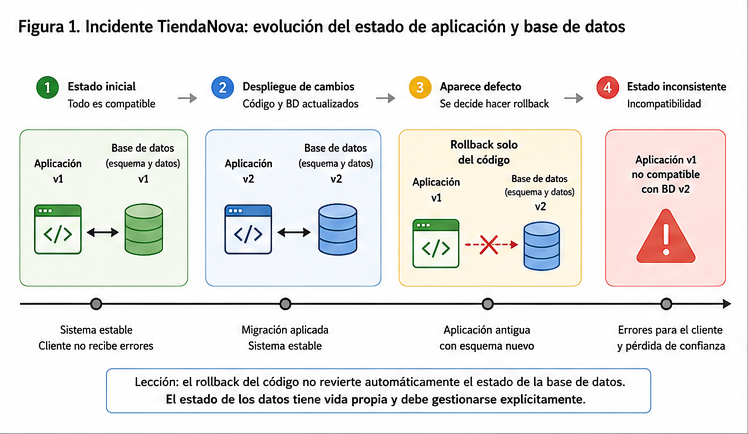
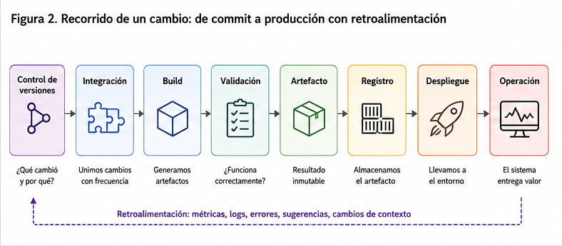

# Sesión 1. Introducción a DevOps

Este capítulo establece el marco conceptual que permitirá comprender las prácticas y herramientas que se utilizarán durante el curso. Docker, GitHub Actions, Terraform y Kubernetes no se estudiarán como tecnologías aisladas, sino como implementaciones concretas de capacidades necesarias para construir, entregar y operar software de manera reproducible, segura y confiable.

La pregunta central de esta sesión es anterior a cualquier herramienta: ¿qué problemas aparecen cuando un cambio de software debe recorrer el camino desde el repositorio de código hasta un entorno de producción, y qué propiedades debería tener un proceso de ingeniería diseñado para controlar ese recorrido?

## Resultados de aprendizaje

Al finalizar la sesión, el estudiante deberá ser capaz de:

- explicar los principales problemas de ingeniería asociados con la entrega de cambios de software hacia producción;
- representar conceptualmente el recorrido de un cambio desde el control de versiones hasta su operación en producción;
- relacionar automatización, reproducibilidad y ciclos rápidos de retroalimentación con la reducción del riesgo en la entrega de software;
- analizar un proceso manual de despliegue e identificar riesgos técnicos, de trazabilidad y de coordinación;
- distinguir las capacidades que caracterizan una práctica DevOps de las herramientas utilizadas para implementarlas.

## 1. El problema de entregar software de manera confiable

Construir software es solo una parte del trabajo de ingeniería. Otra parte consiste en llevar ese software desde el repositorio de código hasta el entorno donde genera valor para sus usuarios y mantenerlo funcionando allí de forma predecible. Este recorrido no constituye únicamente un problema logístico. Tiene restricciones, modos de falla, decisiones de diseño y consecuencias medibles cuando se implementa de forma deficiente.

La dificultad no proviene exclusivamente de la complejidad técnica de un sistema. También intervienen tres condiciones que aparecen simultáneamente en el desarrollo profesional:

- el software cambia de manera continua;
- varias personas pueden modificar simultáneamente componentes del mismo sistema;
- los entornos donde se ejecuta el software poseen estado y pueden divergir de lo que el equipo espera cuando existen cambios manuales, configuraciones no controladas o mecanismos insuficientes de trazabilidad.

Sin un proceso de ingeniería explícito, estas condiciones pueden producir entregas poco frecuentes, acumulación de cambios, diferencias entre ambientes y dificultades para determinar qué ocurrió cuando aparece una falla.

El problema que organiza esta sesión puede formularse de la siguiente manera:

> ¿Qué capacidades técnicas y organizativas permiten que un cambio de software llegue a producción de manera frecuente, verificable y controlada, y que el sistema pueda recuperarse de forma segura cuando ese cambio provoca una falla?

Una sola herramienta no resuelve este problema. Se requiere combinar prácticas técnicas, mecanismos de automatización, retroalimentación, trazabilidad y decisiones organizativas. Ese conjunto de capacidades constituye el punto de partida para estudiar DevOps.

## 2. Caso técnico de partida: TiendaNova

Considérese una empresa de comercio minorista, denominada TiendaNova, que opera un sistema compuesto por una aplicación web orientada al cliente, una API que expone el catálogo y el estado de los pedidos, y una base de datos relacional que almacena inventario, pedidos y datos de clientes. El equipo de ingeniería está compuesto por ocho desarrolladores que trabajan simultáneamente sobre el mismo repositorio.

La organización despliega, en promedio, cada tres o cuatro semanas. Cada despliegue agrupa entre veinte y cuarenta commits acumulados de varios desarrolladores. El proceso de entrega consiste en generar manualmente un paquete de archivos a partir de una rama considerada estable, transferirlo mediante una conexión remota al servidor de producción y reemplazar los archivos existentes.

La configuración de producción, incluidas credenciales de conexión a la base de datos y variables que modifican el comportamiento de la aplicación, se ajusta directamente en el servidor cuando surge una necesidad. Estos cambios no siempre quedan registrados en el repositorio ni existe un mecanismo que permita reconstruir con certeza la configuración existente en un momento determinado.

Los cambios de esquema de base de datos se aplican mediante scripts SQL que un integrante del equipo ejecuta manualmente contra la base de datos de producción, generalmente durante la misma ventana en la que se despliega el código correspondiente. No existe un mecanismo que asocie inequívocamente la versión de cada migración con la versión de la aplicación que depende de ella.

En una ocasión reciente, un despliegue introdujo un error de lógica en el cálculo de descuentos que solo se manifestó bajo una combinación específica de promociones activas. El equipo decidió recuperar la versión anterior de la aplicación sustituyendo los archivos desplegados por los de la versión previa.

El despliegue problemático, sin embargo, había incluido también un script que modificaba la estructura de una tabla de promociones, agregaba una columna y transformaba datos existentes hacia un nuevo formato. Recuperar la versión anterior del código no restauró automáticamente el estado anterior de la base de datos.

El sistema terminó ejecutando una versión antigua de la aplicación contra un esquema y unos datos que habían sido modificados para una versión posterior. Esto produjo fallas adicionales, distintas del problema original. El diagnóstico tomó varias horas porque el equipo no podía determinar con certeza qué versión del código, qué cambios de esquema y qué configuración coexistían en producción.

La Figura 1 sintetiza la secuencia de estados que conduce desde un sistema compatible hasta la incompatibilidad producida por revertir únicamente el código.

*Figura 1. Evolución del estado de la aplicación y la base de datos durante el incidente de TiendaNova.*

El escenario concentra varios problemas técnicamente plausibles de un proceso de entrega con poca trazabilidad y escaso control sobre su estado. El problema no consiste simplemente en que faltara un procedimiento para "deshacer la migración". En sistemas con datos persistentes, recuperar una versión anterior del código y recuperar el estado de los datos son operaciones diferentes. Algunos cambios de base de datos pueden ser difíciles o imposibles de revertir sin pérdida de información.

Por esta razón, un proceso de entrega necesita considerar explícitamente la compatibilidad entre versiones de aplicación y esquema, el versionado de las migraciones y una estrategia de recuperación apropiada para los cambios persistentes. Estos mecanismos se estudiarán con mayor profundidad cuando corresponda. En esta sesión interesa reconocer el problema que intentan resolver.

TiendaNova se utilizará nuevamente en este capítulo para analizar automatización, trazabilidad y diseño del proceso de entrega. El caso no se resolverá por completo en esta sesión.

## 3. Qué se entiende por DevOps

DevOps se reduce con frecuencia a la automatización de la construcción y el despliegue de software. Esa interpretación es insuficiente porque permite imaginar que introducir una herramienta de automatización transforma por sí sola la forma en que una organización entrega software.

En este curso, DevOps se entenderá como un conjunto de capacidades técnicas y organizativas orientadas a mejorar el flujo mediante el cual los cambios de software se construyen, validan, entregan y operan. Estas capacidades incluyen automatización, retroalimentación rápida, trazabilidad, trabajo sobre cambios integrables y responsabilidad compartida sobre el comportamiento del sistema en producción.

La definición incluye deliberadamente elementos que no son herramientas. El resultado de un proceso de entrega depende de qué verificaciones se realizan, quién dispone de información para tomar decisiones, cómo se coordinan los cambios y qué evidencia queda disponible cuando se necesita investigar una falla.

También es necesario distinguir DevOps de las estructuras organizativas que pueden utilizar ese nombre. En la práctica existen cargos como *DevOps Engineer* y equipos denominados DevOps. Su existencia no determina, por sí sola, que una organización posea las capacidades descritas anteriormente.

Una organización puede disponer de un equipo llamado DevOps y mantener procesos con poca trazabilidad, grandes ventanas de integración y responsabilidades fragmentadas. De forma equivalente, una organización puede aplicar prácticas asociadas con DevOps sin utilizar ese término como nombre de ningún cargo o departamento.

La misma distinción debe aplicarse a las herramientas. Contenedores, pipelines de CI/CD, infraestructura como código y plataformas de orquestación son mecanismos ampliamente utilizados para implementar determinadas capacidades, pero no constituyen por sí mismos una definición de DevOps. Se utilizarán durante el curso porque permiten estudiar de forma concreta problemas transferibles a otras tecnologías y plataformas.

## 4. DevOps como sistema sociotécnico

Un sistema sociotécnico es aquel cuyo comportamiento depende de la interacción entre componentes técnicos y elementos humanos u organizativos. La entrega de software puede analizarse de esta forma.

Un pipeline de integración continua puede ejecutar automáticamente cientos de verificaciones, pero una persona o un equipo decide qué verificaciones existen y qué condiciones permiten que un cambio continúe avanzando. La arquitectura puede permitir despliegues independientes, pero las reglas organizativas pueden exigir aprobaciones que introduzcan retrasos. Una herramienta puede almacenar información sobre un despliegue, pero esa información solo resulta útil si el proceso permite relacionarla con el código, la configuración y los cambios de infraestructura correspondientes.

Por tanto, ninguna de las herramientas introducidas posteriormente en el curso resolverá por sí sola todos los problemas del proceso de entrega. Una automatización técnicamente correcta puede ejecutar con gran eficiencia un procedimiento mal diseñado.

TiendaNova ilustra esta interacción. Existe un problema técnico porque la aplicación, el esquema de base de datos y la configuración de producción no poseen mecanismos suficientes para reconstruir o determinar de manera inequívoca el estado desplegado. También existe un problema organizativo porque el proceso no establece claramente quién debe evaluar la compatibilidad del cambio de esquema, definir la estrategia de recuperación y verificar que el conjunto completo pueda introducirse de manera segura.

La mejora del proceso exige actuar sobre ambas dimensiones.

## 5. Desarrollo, operaciones, seguridad y responsabilidad compartida

Un patrón organizativo frecuente ha consistido en separar las responsabilidades de quienes desarrollan software de las responsabilidades de quienes operan los sistemas en producción. Esta especialización no constituye un problema por sí misma. La dificultad aparece cuando los objetivos, la información y los mecanismos de coordinación de esos grupos producen incentivos incompatibles.

Un equipo de desarrollo puede recibir incentivos para entregar nuevas funcionalidades con rapidez, mientras que un equipo de operaciones puede recibir incentivos para reducir cualquier cambio que pueda afectar la estabilidad. Si ambos resultados se gestionan de manera independiente, cada despliegue puede convertirse en una negociación entre dos objetivos aparentemente opuestos.

DevOps promueve responsabilidad compartida sobre el resultado del sistema en producción. Esto no significa que todas las personas deban realizar las mismas tareas ni que desaparezca la especialización. Significa que la entrega y la operación confiable del software se consideran resultados del sistema completo y no responsabilidades aisladas de quienes ejecutan el último paso del despliegue.

El mismo razonamiento puede extenderse a seguridad. Las verificaciones de seguridad pueden incorporarse progresivamente al flujo de construcción y entrega para proporcionar retroalimentación antes de que un cambio llegue a producción. Esta integración suele asociarse con el término DevSecOps. El curso utilizará algunas de estas prácticas posteriormente, pero DevSecOps no constituye un tema independiente de esta sesión.

En TiendaNova, la persona que escribió la migración y la persona que realizó el despliegue disponían de información diferente sobre el mismo cambio. El incidente no necesita explicarse mediante negligencia individual. El diseño del proceso permitía que una modificación de aplicación y una modificación persistente del esquema llegaran juntas a producción sin una estrategia de recuperación suficientemente definida.

## 6. Flujo, retroalimentación y aprendizaje continuo

Una parte importante de la literatura sobre DevOps organiza sus principios alrededor de tres ideas relacionadas: flujo, retroalimentación y aprendizaje continuo.

### Flujo

El flujo describe el movimiento del trabajo desde su origen hasta su llegada al usuario. En software, un cambio puede atravesar revisión, integración, construcción, validación, empaquetado, despliegue y operación antes de producir valor.

El objetivo no consiste en eliminar cualquier intervención humana ni cualquier separación de responsabilidades. Determinados controles pueden ser técnicamente necesarios, responder a requisitos regulatorios o implementar una separación legítima de funciones.

El problema aparece cuando existen esperas, aprobaciones, traspasos o procedimientos manuales que no aportan control proporcional al retraso que introducen. Los traspasos innecesarios o mal especificados también pueden producir pérdida de contexto entre las personas que participan en el proceso.

### Retroalimentación

El sistema debe producir señales suficientemente tempranas y útiles cuando un cambio no se comporta como se esperaba.

Un error detectado segundos después de una modificación suele ser más sencillo de relacionar con su causa que un error descubierto después de que decenas de cambios adicionales hayan sido incorporados. El mismo principio aparece en distintas etapas mediante revisión de código, pruebas, validaciones automatizadas y señales obtenidas durante la operación.

La existencia de automatización no garantiza que una falla sea detectada. Una verificación únicamente puede detectar los comportamientos para los cuales posee información y criterios adecuados. Un pipeline que ejecuta pruebas insuficientes puede completar correctamente y entregar software que contiene defectos.

### Aprendizaje continuo

Resolver un incidente permite restablecer un servicio. Aprender de un incidente exige algo adicional: identificar qué características del sistema permitieron que la falla ocurriera o dificultaron su detección y recuperación.

Este análisis puede producir mejoras en pruebas, procedimientos, arquitectura, documentación, mecanismos de trazabilidad o responsabilidades. El objetivo es disminuir la probabilidad o el impacto de fallas semejantes, no únicamente identificar quién realizó la acción inmediatamente anterior al incidente.

Las tres ideas se refuerzan entre sí. Un flujo con ciclos de retroalimentación más cortos permite descubrir problemas antes; la evidencia obtenida de esos problemas permite aprender y modificar el proceso.

## 7. Cambios pequeños e integración frecuente

El tamaño de un cambio afecta la dificultad de revisarlo, probarlo, diagnosticarlo y recuperarse de una falla asociada con él. Cuando numerosos cambios independientes se acumulan durante varias semanas y se entregan simultáneamente, aumenta el número de modificaciones que deben considerarse como causas posibles ante un incidente.

Reducir el tamaño de cada lote puede limitar ese espacio de búsqueda y facilitar la revisión. También permite obtener retroalimentación sobre una modificación antes de agregar numerosas modificaciones posteriores.

Esta relación no implica que todo cambio pequeño sea seguro, que todo cambio grande falle ni que dividir arbitrariamente un cambio dependiente reduzca el riesgo. Algunos cambios deben coordinarse porque existen dependencias entre versiones de aplicación, configuración, infraestructura o esquema de datos.

El incidente de TiendaNova proporciona un ejemplo. La modificación del esquema no podía desplegarse en cualquier momento independientemente del código que dependía de ella. Para separarlos de forma segura habría sido necesario diseñar estados intermedios compatibles. Por tanto, reducir el tamaño de los lotes no significa separar componentes dependientes sin analizar su compatibilidad.

En esta sesión basta con establecer la relación causal básica:

1. un lote grande contiene más cambios candidatos ante una falla;
2. un cambio más acotado suele ser más sencillo de revisar y diagnosticar;
3. obtener retroalimentación con mayor frecuencia reduce el tiempo durante el cual un problema puede permanecer oculto.

Las estrategias de integración frecuente, el uso de ramas de corta duración y *trunk-based development* se estudiarán específicamente en la sesión siguiente.

## 8. Anatomía del recorrido de un cambio: de commit a producción

Un mapa general del recorrido de un cambio permite ubicar los problemas que se desarrollarán durante el curso sin estudiar todavía los mecanismos concretos de cada etapa. La Figura 2 representa ese recorrido y hace explícito el retorno de información desde la operación hacia las etapas iniciales.

*Figura 2. Recorrido conceptual de un cambio desde el control de versiones hasta producción, con retroalimentación desde operación.*

El recorrido comienza cuando un cambio queda registrado en el sistema de control de versiones. Antes de generar valor en producción puede atravesar diferentes mecanismos de integración, construcción, validación, almacenamiento y despliegue. Una vez ejecutándose, el comportamiento del sistema genera nueva información que puede provocar otro cambio.

Cada etapa plantea decisiones de ingeniería que se desarrollarán progresivamente durante el curso:

- ¿debe construirse un artefacto distinto para cada ambiente o debe construirse una vez y promoverse el mismo artefacto?
- ¿cómo se relaciona de forma inequívoca un artefacto desplegado con el código que lo produjo?
- ¿dónde debe residir la configuración que varía entre ambientes?
- ¿qué información debe conservarse para conocer qué versión se encuentra ejecutándose en cada ambiente?
- ¿qué ocurre con los cambios persistentes, como las migraciones de datos, cuando una versión de la aplicación necesita retirarse?
- ¿son equivalentes desplegar una versión y liberar una funcionalidad a los usuarios?
- ¿qué partes del entorno deberían quedar declaradas y versionadas en lugar de depender de configuraciones manuales?
- ¿qué evidencia necesita un equipo para determinar si un cambio está funcionando correctamente una vez desplegado?

Estas preguntas permiten conectar las herramientas que aparecerán posteriormente con los problemas que justifican su uso.

## 9. Automatización y reproducibilidad

La automatización reduce la necesidad de que una persona ejecute manualmente una secuencia de pasos cada vez que debe repetirse un proceso. Esto disminuye una fuente importante de variabilidad procedimental y permite conservar evidencia de lo ejecutado.

Sin embargo, automatización y reproducibilidad no son sinónimos.

Un proceso puede considerarse reproducible cuando las condiciones relevantes para su ejecución están suficientemente declaradas y controladas como para obtener resultados consistentes al repetirlo bajo esas mismas condiciones.

Automatizar una secuencia no garantiza esta propiedad. Un script puede depender de una versión instalada manualmente en un servidor, descargar una dependencia mutable, utilizar un archivo que no se encuentra bajo control de versiones o asumir un estado previo que nadie ha declarado. La ejecución estará automatizada, pero su resultado seguirá dependiendo de condiciones externas que el proceso no controla.

La Figura 3 contrasta ambos casos: un proceso puede estar automatizado y, al mismo tiempo, depender de condiciones externas no declaradas.

*Figura 3. Automatización y reproducibilidad dependen de propiedades diferentes del proceso.*

TiendaNova contiene varios ejemplos:

- la configuración de producción puede cambiar sin quedar representada en el repositorio;
- las migraciones se ejecutan manualmente y no están inequívocamente asociadas con la versión desplegada;
- el procedimiento de recuperación del código no contempla necesariamente el estado persistente de la base de datos.

Automatizar exactamente este proceso no corregiría esos defectos. Antes de automatizarlo sería necesario rediseñar algunas de sus propiedades.

Un proceso mejor diseñado debería permitir, entre otras cosas:

- asociar cada despliegue con la versión exacta del código y de los artefactos utilizados;
- versionar los cambios de esquema y conocer qué versiones de la aplicación son compatibles con ellos;
- definir una estrategia de recuperación que considere tanto el software ejecutable como los cambios persistentes que no puedan revertirse de forma trivial;
- mantener la configuración relevante mediante mecanismos controlados y auditables;
- producir evidencia suficiente para reconstruir qué ocurrió durante una entrega.

!!! warning "Automatizar no equivale a corregir"
    La automatización reduce la variabilidad introducida por la ejecución manual y facilita la repetición de un proceso. No garantiza que el proceso esté correctamente diseñado ni que sus dependencias y entradas estén bajo control. Automatizar un procedimiento defectuoso puede ejecutar el mismo defecto de forma más rápida y consistente.

La automatización debe evaluarse, por tanto, como un mecanismo dentro de un diseño más amplio y no como un objetivo independiente.

## 10. Desempeño de la entrega: velocidad y estabilidad

Un sistema de entrega debe evaluarse por sus resultados y no por la cantidad de herramientas que utiliza. Una organización puede adoptar contenedores, pipelines e infraestructura como código y continuar obteniendo entregas lentas o poco confiables si mantiene restricciones estructurales en el proceso.

Una intuición frecuente consiste en asumir que desplegar con mayor frecuencia necesariamente reduce la estabilidad porque expone producción a una mayor cantidad de cambios.

La investigación de DORA sobre desempeño de entrega de software ha encontrado repetidamente que velocidad y estabilidad no constituyen necesariamente objetivos contrapuestos. Los equipos con mejores resultados pueden presentar simultáneamente alto *throughput* y menor inestabilidad en sus cambios.

El modelo de DORA ha evolucionado con el tiempo. La versión actual utiliza cinco métricas de desempeño de entrega agrupadas en dimensiones relacionadas con *throughput* e inestabilidad. El detalle de estas métricas no constituye un resultado de aprendizaje de esta sesión.

La conclusión relevante para S01 es más limitada: aumentar la velocidad del flujo no requiere aceptar de forma automática una degradación equivalente de la estabilidad. El efecto depende de cómo se diseñan los cambios, los mecanismos de validación, la retroalimentación y la capacidad de recuperación.

Tampoco debe interpretarse esta evidencia como una regla según la cual desplegar más veces siempre mejora un sistema. Frecuencia y tamaño de lote describen propiedades distintas. Una organización puede desplegar frecuentemente cambios grandes y riesgosos, o desplegar cambios pequeños mediante un proceso deficiente. El resultado depende del sistema completo de entrega.

## 11. DevOps y conceptos relacionados

DevOps comparte problemas y prácticas con otros conceptos utilizados en ingeniería de software y operación de sistemas.

**CI/CD** se concentra en mecanismos de integración, validación y entrega automatizada. Constituye una implementación especialmente visible de las ideas de flujo y retroalimentación que se estudiarán durante el curso.

**Site Reliability Engineering (SRE)** aplica principios de ingeniería a la confiabilidad de sistemas en producción y proporciona mecanismos cuantitativos para razonar sobre los objetivos de servicio.

**Platform Engineering** se ocupa del diseño de plataformas internas que proporcionan capacidades reutilizables y de autoservicio a los equipos de desarrollo.

**DevSecOps** enfatiza la incorporación de capacidades de seguridad al flujo de desarrollo y entrega en lugar de tratarlas únicamente como una revisión posterior.

Estos conceptos mantienen áreas de intersección, pero no son sinónimos ni etapas obligatorias de una misma evolución organizativa. El curso profundizará principalmente en las capacidades de DevOps asociadas con contenerización, CI/CD, infraestructura como código y operación sobre plataformas declarativas.

## 12. Mapa del curso: del código a una plataforma reproducible

Las cuatro unidades del curso desarrollan progresivamente distintas partes del recorrido presentado en el apartado 8. La Figura 4 muestra cómo cada unidad interviene sobre una parte del flujo sin convertir las herramientas concretas en el eje organizador del curso.

*Figura 4. Relación entre las cuatro unidades del curso y el recorrido de un cambio desde el código hasta la operación.*

### Unidad I: artefactos reproducibles

Los contenedores permiten empaquetar la aplicación junto con archivos, binarios, bibliotecas y otras dependencias de espacio de usuario necesarias para su ejecución. Esto reduce diferencias entre ambientes y facilita utilizar el mismo artefacto a lo largo del proceso de entrega.

Los contenedores no reproducen un sistema operativo completo ni eliminan todas las dependencias de la plataforma de ejecución. Los procesos contenidos utilizan capacidades proporcionadas por el sistema anfitrión, incluido su kernel. Por esta razón, la portabilidad proporcionada por un contenedor debe entenderse como reducción y control de dependencias, no como independencia absoluta del entorno.

### Unidad II: integración y entrega automatizadas

El curso incorporará mecanismos para construir, validar, almacenar y promover artefactos mediante pipelines. También se estudiarán estrategias de despliegue, ambientes y mecanismos de recuperación.

### Unidad III: infraestructura como código

La infraestructura necesaria para ejecutar las aplicaciones se representará mediante configuración declarativa versionada. Esto permitirá aplicar a la infraestructura principios de revisión, trazabilidad y reproducibilidad semejantes a los utilizados para el software.

### Unidad IV: operación sobre una plataforma declarativa

Kubernetes permitirá estudiar un modelo en el que se declara un estado deseado y distintos controladores trabajan continuamente para aproximar el estado observado del sistema a ese estado declarado.

El hilo conductor del curso puede resumirse de la siguiente forma:

**código versionado → artefacto controlado → integración y entrega automatizadas → infraestructura declarada → operación declarativa**

Docker, GitHub Actions, Terraform, Google Cloud y Kubernetes proporcionarán implementaciones concretas para estudiar estas capacidades.

## 13. Actividad de análisis en equipos

!!! example "Actividad: rediseño conceptual del proceso de entrega de TiendaNova"
    Formar equipos de tres o cuatro estudiantes. Duración aproximada: veinte minutos.

    A partir del caso de TiendaNova presentado en el apartado 2, cada equipo debe elaborar un análisis breve que incluya:

    1. Una lista de los principales riesgos del proceso actual.

       Para cada riesgo deben indicarse las dimensiones a las que pertenece. Un mismo riesgo puede corresponder simultáneamente a proceso, trazabilidad y coordinación. Cuando existan varias dimensiones, debe identificarse cuál se considera predominante y justificar la decisión.

    2. Una explicación de qué tipo de intervención requiere cada riesgo:

       - automatización;
       - rediseño del proceso;
       - cambio en responsabilidades o coordinación;
       - una combinación de las anteriores.

       La respuesta debe justificar por qué la automatización, por sí sola, sería o no suficiente.

    3. Una propuesta conceptual de un proceso alternativo, sin especificar herramientas concretas.

       La propuesta debe indicar:

       - cómo deberían incorporarse los cambios de código;
       - qué verificaciones deberían ocurrir antes de llegar a producción;
       - cómo deberían relacionarse las versiones de la aplicación con los cambios de esquema de la base de datos;
       - qué debería analizarse antes de introducir un cambio persistente que pueda dificultar la recuperación;
       - qué debería ocurrir cuando un despliegue necesita retirarse o sustituirse.

    4. Una lista de la evidencia mínima que debería conservarse para reducir el espacio de búsqueda y el tiempo necesario para diagnosticar un incidente semejante.

       Puede considerarse evidencia relacionada con:

       - código;
       - artefactos;
       - configuración;
       - migraciones;
       - despliegues;
       - resultados de verificaciones;
       - eventos ocurridos durante la operación.

    Cada equipo debe estar preparado para defender una de sus decisiones y explicar qué problema permanecería sin resolver si únicamente se automatizara el proceso actual.

## 14. Preguntas de análisis

1. ¿Por qué automatizar el despliegue actual de TiendaNova, sin modificar la gestión de configuración, migraciones y trazabilidad, no habría evitado necesariamente el incidente?

2. Considérense dos alternativas:

   - desplegar con menor frecuencia para reducir el número de eventos de despliegue;
   - reducir el tamaño de los cambios y obtener retroalimentación con mayor frecuencia.

   ¿Qué dimensiones del riesgo modifica cada alternativa? Analizar al menos tamaño del cambio, espacio de diagnóstico, frecuencia de exposición, tiempo de retroalimentación y capacidad de recuperación.

3. ¿En qué condiciones un equipo puede incrementar su frecuencia de despliegue sin que esto implique necesariamente mayor inestabilidad?

4. ¿Por qué un pipeline ejecutado correctamente no constituye evidencia suficiente de que el software desplegado carece de defectos?

5. ¿Por qué la existencia de un cargo o equipo denominado DevOps no demuestra por sí misma que la organización aplique prácticas DevOps?

6. ¿Qué problemas del incidente de TiendaNova son principalmente técnicos y cuáles dependen del diseño organizativo del proceso? ¿Qué problemas requieren intervenir sobre ambas dimensiones?

7. Si una migración modifica datos de manera que no puede deshacerse de forma segura, ¿por qué restaurar simplemente la versión anterior de la aplicación puede ser insuficiente?

8. ¿Qué información debería estar disponible para reconstruir con precisión el estado que tenía TiendaNova inmediatamente antes y después de un despliegue?

## 16. Síntesis

La entrega de software constituye un problema de ingeniería porque un cambio debe atravesar múltiples estados antes de producir valor en producción y porque cada etapa puede introducir variabilidad, retrasos, pérdida de trazabilidad o incompatibilidades.

DevOps proporciona un marco para abordar este problema mediante capacidades técnicas y organizativas relacionadas con flujo, retroalimentación, automatización, reproducibilidad, cambios integrables y responsabilidad compartida. Estas capacidades no dependen de la existencia de un cargo, equipo o herramienta denominada DevOps.

El caso de TiendaNova mostró que una falla puede amplificarse cuando no existe una relación clara entre código, configuración, esquema de datos y versión desplegada. También mostró que automatizar un procedimiento no corrige automáticamente sus decisiones de diseño.

Los cambios pequeños pueden reducir el espacio de diagnóstico y permitir ciclos de retroalimentación más cortos, pero no deben separarse arbitrariamente cuando existen dependencias que requieren compatibilidad entre versiones. La integración frecuente y las prácticas concretas que permiten mantener cambios pequeños se desarrollarán en la sesión siguiente.

El resto del curso continuará sobre el recorrido presentado en esta sesión: construir artefactos controlados, automatizar su integración y entrega, representar la infraestructura mediante código y operar aplicaciones sobre plataformas declarativas. Las herramientas aparecerán como respuestas concretas a estos problemas, no como objetivos independientes.

## 17. Referencias

### Bibliografía principal

- Kim, G., Humble, J., Debois, P., Willis, J. y Forsgren, N. (2021). *The DevOps Handbook: How to Create World-Class Agility, Reliability, & Security in Technology Organizations* (2.ª ed.). IT Revolution.

- Forsgren, N., Humble, J. y Kim, G. (2018). *Accelerate: The Science of Lean Software and DevOps: Building and Scaling High Performing Technology Organizations*. IT Revolution.

- Humble, J. y Farley, D. (2010). *Continuous Delivery: Reliable Software Releases through Build, Test, and Deployment Automation*. Addison-Wesley.

### Documentación y fuentes técnicas de consulta

- DORA. *DORA's software delivery performance metrics*. Google Cloud.

- DORA. *Accelerate State of DevOps Report 2024*. Google Cloud.

- Docker Documentation. *What is a container?* y *What is an image?*

- HashiCorp Developer. *terraform plan command reference*.

- Kubernetes Documentation. *Kubernetes Self-Healing*, *Deployments* y *ReplicaSet*.

- Redgate Flyway Documentation. *Undo Migrations*. Referencia utilizada para considerar las limitaciones de la reversión de cambios persistentes de base de datos.f
