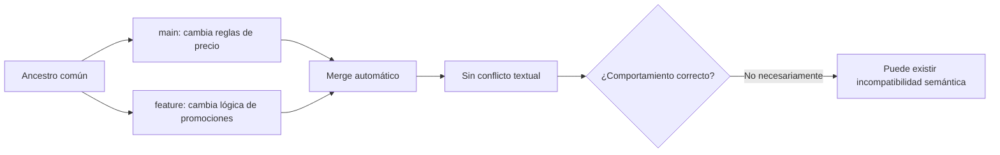
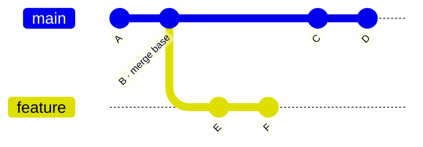
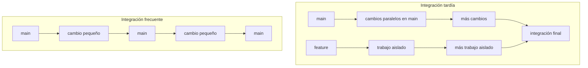
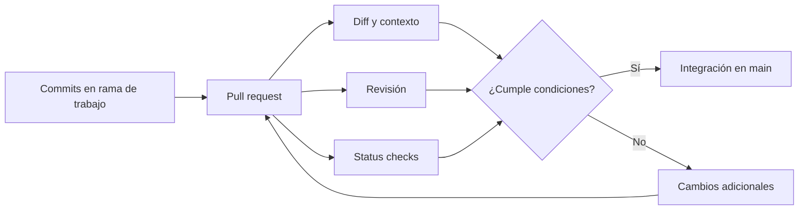
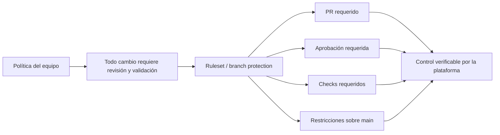
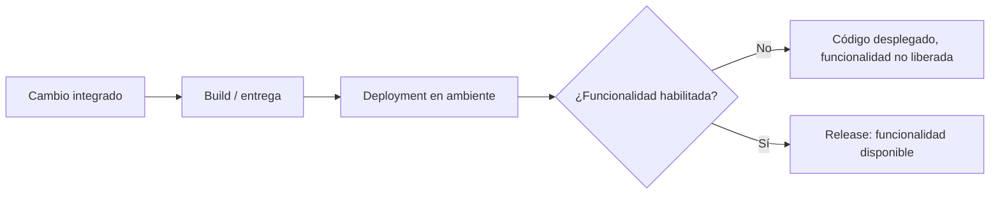

# Sesión 2. Git para DevOps

El control de versiones no reduce por sí mismo el riesgo asociado al cambio. Git permite conservar estados, comparar versiones y combinar líneas de desarrollo, pero la forma en que un equipo organiza esas operaciones determina cuánto trabajo se acumula antes de ser integrado, qué controles deben satisfacerse antes de incorporar un cambio y qué evidencia queda disponible para revisar o reconstruir una decisión.

En un contexto DevOps, el interés principal no está en memorizar comandos de Git, sino en diseñar un flujo de integración que mantenga pequeños los cambios, reduzca la divergencia entre líneas de desarrollo y produzca retroalimentación suficientemente temprana. Esta sesión parte de conocimientos previos de Git y se concentra en las decisiones de ingeniería que rodean la integración del trabajo de varias personas sobre un mismo sistema.

## 1. El problema de integración

Considérese un sistema de comercio electrónico cuyo módulo de promociones se desarrolla durante tres semanas en una rama separada. Mientras esa rama permanece abierta, la rama principal incorpora una corrección de redondeo y un nuevo descuento por volumen. Los cambios se realizan en regiones distintas del código y Git puede fusionarlos automáticamente. Sin embargo, la lógica de promociones fue construida suponiendo reglas anteriores para el cálculo del precio final. El resultado del merge compila, pero una combinación específica de descuentos produce un valor incorrecto.

Este caso distingue dos problemas que con frecuencia se confunden:

- **conflicto de merge:** Git no puede reconciliar automáticamente determinados cambios realizados sobre las mismas partes de una versión común;
- **incompatibilidad semántica:** Git produce una combinación técnicamente válida, pero el comportamiento resultante viola una expectativa del sistema.

Git puede detectar una parte de los conflictos estructurales derivados de la historia del repositorio. No conoce, en cambio, invariantes del dominio como "un descuento no puede producir un total negativo" o "dos promociones no deben aplicarse sobre la misma base de cálculo". La ausencia de un conflicto textual no constituye evidencia de corrección funcional.

**Figura 1.** Un merge limpio demuestra que Git pudo reconciliar las versiones; no demuestra que el sistema combinado preserve su comportamiento esperado.

La implicación para DevOps es directa: la integración debe ocurrir con suficiente frecuencia para limitar la cantidad de supuestos que pueden divergir antes de ser reconciliados, y debe complementarse con mecanismos de revisión y validación que vayan más allá de la capacidad de Git para combinar texto.

## 2. Qué significa integrar en Git

Una rama de Git no es una copia independiente del repositorio. Es una referencia que avanza hacia commits sucesivos. Cuando dos ramas parten de un commit común y evolucionan por separado, las historias divergen.

**Figura 2.** Dos líneas de desarrollo comparten un ancestro común. Git utiliza esa relación histórica para determinar qué cambios debe reconciliar durante una integración.

Para un merge de tres vías, Git utiliza como referencia un ancestro común apropiado, denominado **merge base**, y compara la evolución de ambos lados desde ese punto. Cuando los cambios no se superponen de forma incompatible, Git puede producir automáticamente un resultado combinado. Cuando no puede hacerlo con suficiente determinación, detiene el proceso y exige una resolución manual.

La palabra *integración* tiene aquí un sentido más amplio que "resolver conflictos". Integrar significa incorporar un conjunto de cambios a la línea compartida sobre la cual continuará desarrollándose el sistema. Desde la perspectiva del equipo, interesa que ese encuentro ocurra temprano porque la dificultad no depende únicamente de la cantidad de líneas modificadas. También depende de cuántos supuestos, contratos, dependencias y decisiones arquitectónicas hayan podido cambiar en paralelo.

Por ello, tres conceptos deben mantenerse separados:

| Concepto | Pregunta que responde |
|---|---|
| **Divergencia** | ¿Cuánto han evolucionado por separado dos líneas de desarrollo desde un ancestro común? |
| **Conflicto de merge** | ¿Puede Git construir automáticamente un resultado combinado? |
| **Corrección de integración** | ¿El sistema combinado conserva las propiedades funcionales y técnicas esperadas? |

La última pregunta no puede responderse solamente con Git. Requiere revisión, pruebas y otros mecanismos de validación que se desarrollarán más adelante en el curso.

## 3. Duración de ramas, tamaño del cambio y riesgo de integración

Una rama de larga duración no es problemática por definición. Una modificación aislada durante varias semanas podría integrarse sin dificultad, mientras que dos cambios realizados durante una misma hora pueden entrar en conflicto. La relación relevante es probabilística: cuanto más tiempo y más alcance se mantienen cambios fuera de la línea compartida, mayor es la oportunidad de que aparezcan supuestos incompatibles o que el contexto sobre el que se construyó el cambio deje de ser actual.

También conviene distinguir **duración de rama** de **tamaño del cambio**. Una rama puede vivir pocas horas y contener un cambio excesivamente amplio; otra puede permanecer abierta varios días por razones organizativas y contener una modificación pequeña. La disciplina buscada combina varias propiedades:

- alcance conceptual limitado;
- ramas de corta duración cuando se utilizan ramas;
- integración frecuente;
- retroalimentación temprana;
- capacidad de revisar y revertir cambios de forma acotada.

La idea de pequeños lotes introducida en la sesión anterior se aplica aquí al código. Un lote pequeño reduce la cantidad de información que debe comprenderse simultáneamente durante revisión, integración y diagnóstico. No existe un número universal de líneas o archivos a partir del cual un cambio sea "grande". El tamaño relevante es también cognitivo: cuántos comportamientos, contratos o componentes deben comprenderse como una sola unidad para evaluar el cambio.

Una estrategia razonable busca minimizar simultáneamente el **trabajo en curso no integrado** y el **alcance de cada unidad de cambio**. Esto reduce la distancia entre el estado sobre el que se desarrolla una modificación y el estado real de la línea principal.

## 4. Trunk-based development

**Trunk-based development (TBD)** es una disciplina de desarrollo en la que los integrantes del equipo integran lotes pequeños de trabajo a una línea principal compartida, normalmente `main` o `trunk`, al menos una vez al día y con frecuencia varias veces durante la jornada. Cuando se utilizan ramas, estas suelen vivir unas pocas horas y funcionan como un mecanismo transitorio de revisión, no como espacios de desarrollo prolongado.

DORA caracteriza trunk-based development mediante integraciones frecuentes al trunk, pocas ramas activas y ramas de vida muy corta. La práctica está asociada al propósito de evitar fases grandes de integración y estabilización al final del trabajo.

La diferencia fundamental, por tanto, no es "usar ramas" frente a "no usar ramas". Es el tiempo que transcurre antes de que un cambio vuelva a encontrarse con la línea compartida.

**Figura 3.** La integración frecuente distribuye los encuentros entre cambios en unidades pequeñas, en lugar de concentrarlos en un evento de integración tardío.

### 4.1 Relación con integración continua

Es posible ejecutar compilaciones y pruebas automatizadas en una rama de larga duración. Esa automatización puede aportar retroalimentación útil, pero no elimina el hecho de que la rama permanece separada de la línea sobre la cual otros cambios continúan acumulándose.

Por tanto:

> **Ejecutar CI sobre una rama no equivale a integrar frecuentemente esa rama en `main`.**

DORA presenta trunk-based development como una práctica necesaria para una implementación efectiva de integración continua: cambios pequeños se incorporan frecuentemente al trunk y una suite automatizada proporciona retroalimentación rápida sobre el estado integrado.

Esta distinción será importante en la Unidad II. Una pipeline puede validar el estado de una rama; la integración continua busca además reducir el tiempo durante el cual el trabajo permanece sin integrarse con el resto del sistema.

### 4.2 Cuándo una rama de mayor duración puede ser razonable

Trunk-based development no elimina todos los usos legítimos de ramas prolongadas. Algunos productos mantienen versiones soportadas en paralelo y requieren ramas de release o mantenimiento. También pueden existir restricciones regulatorias u operativas que justifiquen líneas de mantenimiento independientes.

La decisión debe responder a una necesidad concreta. Mantener ramas permanentes de `develop`, `staging`, `release` y `production` en un equipo que entrega un único producto de forma continua introduce coordinación adicional si esas ramas no representan estados o ciclos de vida realmente independientes.

La pregunta de ingeniería no es "¿qué flujo de Git es más popular?", sino:

> **¿Qué líneas de desarrollo deben existir simultáneamente y qué costo de coordinación introduce cada una?**

## 5. Pull requests: revisión y coordinación, no sincronización

Un **pull request (PR)** no es una operación de Git. Es una abstracción proporcionada por plataformas como GitHub para proponer la integración de cambios entre ramas y organizar alrededor de esa propuesta la comparación de diferencias, la discusión, la revisión y las verificaciones automatizadas.

Abrir un pull request no actualiza automáticamente la rama propuesta con los cambios recientes de la rama base. Una rama puede permanecer atrasada respecto de `main` mientras el PR está abierto. Cuando es necesario incorporar el estado reciente de la base, puede realizarse un merge de la rama base hacia la rama de trabajo o un rebase sobre la base, entre otras alternativas.

**Figura 4.** El pull request organiza la evaluación de un cambio. La actualización de la rama y la integración son operaciones distintas.

### 5.1 Qué hace revisable un pull request

Un PR pequeño no se define únicamente por cantidad de líneas o archivos. Debe representar una unidad conceptual que una persona revisora pueda comprender y evaluar con un modelo mental razonablemente acotado.

La dificultad de revisión aumenta con factores como:

- cantidad de comportamientos modificados;
- número de componentes y dependencias afectadas;
- presencia de cambios estructurales mezclados con cambios funcionales;
- criticidad de los componentes involucrados;
- ausencia de contexto sobre la motivación o los compromisos adoptados;
- volumen del diff;
- evidencia insuficiente de validación.

Un pull request que cambia autenticación, esquema de datos y comportamiento de interfaz como parte de una sola unidad puede ser difícil de revisar aunque cada modificación individual sea técnicamente sencilla. Separar los cambios por propósito reduce la carga cognitiva, mejora la trazabilidad y permite revertir con mayor precisión cuando el diseño del sistema lo permite.

Un PR revisable debería comunicar, como mínimo:

1. **qué problema resuelve**;
2. **qué cambia y qué queda explícitamente fuera de alcance**;
3. **por qué se eligió el enfoque propuesto cuando existen alternativas relevantes**;
4. **qué evidencia permite evaluar que el cambio funciona**;
5. **qué áreas requieren una revisión especialmente cuidadosa**.

La revisión no sustituye a las pruebas automatizadas, ni las pruebas sustituyen a la revisión. Cada mecanismo observa propiedades diferentes del cambio.

## 6. Cómo integrar un pull request: merge, squash y rebase

La plataforma puede ofrecer varias estrategias para incorporar un pull request a la rama base. La elección afecta principalmente la forma del historial y la información que se preserva.

| Estrategia | Resultado en la rama base | Ventaja principal | Compromiso |
|---|---|---|---|
| **Merge commit** | Preserva los commits de la rama y agrega un commit de merge | Mantiene explícita la estructura de la integración | Historial con más bifurcaciones y commits de integración |
| **Squash and merge** | Consolida los commits del PR en un único commit | Historial compacto cuando el PR representa un cambio lógico único | Se pierde la granularidad de los commits intermedios en `main` |
| **Rebase and merge** | Reaplica individualmente los commits sobre la rama base sin crear merge commit | Produce un historial lineal | Reescribe los commits y genera nuevos identificadores |

No existe una estrategia universalmente superior. La decisión depende de las propiedades que el equipo valore en su historial:

- ¿se necesita preservar la secuencia detallada de commits de la rama?;
- ¿cada pull request representa una unidad de cambio que conviene observar como un único commit?;
- ¿se prioriza un historial estrictamente lineal?;
- ¿qué forma de historial facilita mejor diagnóstico, auditoría y reversión en ese repositorio?

En equipos que utilizan PR pequeños como unidades lógicas de cambio, `squash and merge` puede producir un historial de `main` especialmente legible. Si los commits individuales ya tienen significado independiente y se desea conservar la topología de la integración, un merge commit puede resultar más apropiado. `Rebase and merge` mantiene linealidad, pero debe entenderse que el rebase crea commits con nuevas identidades.

La política de merge forma parte del diseño del flujo de trabajo; no debería quedar determinada únicamente por la opción predeterminada de la plataforma.

## 7. De convenciones organizativas a controles del repositorio

Un equipo puede establecer una regla como "todo cambio debe ser revisado antes de incorporarse a `main`". Mientras esa regla dependa exclusivamente de comportamiento humano, puede omitirse por error, urgencia o desconocimiento. Las plataformas de alojamiento permiten convertir parte de esas convenciones en restricciones verificables.

GitHub dispone actualmente de **branch protection rules** y **rulesets**. Dependiendo de la configuración y del tipo de repositorio, pueden utilizarse para exigir condiciones como:

- que los cambios lleguen mediante pull request;
- una cantidad determinada de aprobaciones;
- resolución de conversaciones antes del merge;
- status checks obligatorios;
- rama actualizada respecto de la base cuando se requiere verificación estricta;
- historial lineal;
- commits firmados;
- restricción o bloqueo de force push;
- merge queue en escenarios de alta concurrencia.

**Figura 5.** Las reglas del repositorio convierten parte de una política de trabajo en condiciones técnicas de integración.

Estas reglas no garantizan que código correcto llegue a producción y tampoco constituyen, por sí mismas, un mecanismo de despliegue. Su función es más específica: controlar qué condiciones deben cumplirse para modificar determinadas referencias del repositorio.

Esta precisión evita una conclusión incorrecta: una rama `main` sin protección no implica automáticamente que cualquier commit llegue a producción. El sistema puede tener controles posteriores de entrega o despliegue. Lo que sí implica es que el repositorio ofrece menos garantías sobre el camino mediante el cual un cambio puede incorporarse a esa rama.

## 8. Deployment y release son decisiones diferentes

La integración frecuente crea una tensión aparente: si los cambios se incorporan varias veces al día, ¿deben todas las funcionalidades quedar disponibles inmediatamente para las personas usuarias? No necesariamente.

**Deployment** es la instalación o puesta en ejecución de una versión en un ambiente determinado. Puede tratarse de desarrollo, staging, producción u otro entorno.

**Release** es la decisión de hacer una capacidad disponible para sus consumidores o usuarios.

Ambos eventos pueden coincidir, pero no necesitan hacerlo.

**Figura 6.** Separar deployment de release permite integrar y desplegar cambios sin que toda funcionalidad deba exponerse inmediatamente.

Los **feature flags** son un mecanismo habitual para separar estas decisiones, pero su implementación y los compromisos que introducen se estudiarán posteriormente junto con las estrategias de despliegue. En esta sesión interesa únicamente la consecuencia para el flujo de integración: trabajar en lotes pequeños no obliga a entregar al usuario una funcionalidad incompleta.

## 9. Antipatrones y decisiones de ingeniería

### 9.1 Rama larga como espacio de aislamiento por defecto

Mantener una rama abierta hasta que una funcionalidad esté "completa" retrasa el momento en que sus supuestos se confrontan con el estado compartido del sistema. El problema no es la existencia de la rama, sino convertir el aislamiento prolongado en el mecanismo normal de coordinación.

Una actualización frecuente de `main` hacia la rama puede disminuir parte de la divergencia, pero no es equivalente a integrar el trabajo en `main`: el resto del equipo continúa sin construir sobre ese cambio y el estado compartido aún no lo contiene.

### 9.2 Pull request excesivamente amplio

Cuando un PR combina varias decisiones independientes, la revisión puede transformarse en una inspección superficial. Pedir revisiones más largas no resuelve necesariamente el problema. Reducir y separar el alcance suele disminuir la carga cognitiva y hacer más precisa la evidencia de validación.

### 9.3 Aprobación como trámite

Una aprobación sin análisis suficiente crea la apariencia de control sin aportar una barrera efectiva. La calidad de la revisión depende de que el cambio tenga un alcance revisable, información suficiente y una responsabilidad clara sobre qué se está evaluando.

### 9.4 Flujo complejo sin una necesidad equivalente

Agregar ramas permanentes, múltiples etapas de merge y convenciones de promoción puede ser correcto cuando existen versiones soportadas en paralelo o ciclos de release independientes. En un producto único con entrega continua, el mismo diseño puede agregar estados intermedios cuyo único efecto sea aumentar coordinación y divergencia.

### 9.5 Confundir ausencia de conflicto con integración segura

Un merge automático solo establece que Git encontró una reconciliación estructural. La seguridad de la integración exige evidencia adicional sobre el comportamiento del sistema combinado.

## 10. Caso de análisis

Considérese el siguiente estado de un repositorio. No se pretende clasificar las ramas únicamente por su duración; interesa determinar qué evidencia sería necesaria antes de decidir si el flujo es saludable.

| Rama | Duración | Alcance aproximado | Estado respecto de `main` | Resultado observado |
|---|---:|---|---|---|
| A | 2 horas | Pequeño | Actualizada | Conflicto textual al integrar |
| B | 17 días | Pequeño | 42 commits detrás | Merge automático |
| C | 1 día | Mediano | Actualizada | Merge automático; pruebas fallan |
| D | 8 días | Grande | `main` incorporado diariamente | Merge automático |
| E | 4 horas | Pequeño | Actualizada | Revisión rechazada por cambio de contrato |

A partir de la tabla, analizar:

1. ¿En cuáles casos existe evidencia de un problema de integración y de qué tipo?
2. ¿Qué casos no pueden clasificarse correctamente con la información disponible?
3. ¿Por qué el merge automático de la rama B no permite concluir que una duración de 17 días fue una decisión segura?
4. ¿Qué demuestra el caso C sobre la diferencia entre conflicto de merge e incompatibilidad semántica?
5. ¿La actualización diaria de `main` en la rama D equivale a trunk-based development? Justificar.
6. ¿Qué evidencia debería solicitarse para evaluar si el rechazo de la rama E representa un problema del código, del contrato entre componentes o del diseño de la revisión?
7. ¿Qué controles del repositorio serían útiles en este escenario y cuáles no resolverían el problema por sí solos?

## 11. Criterios para evaluar un flujo de integración

Al analizar un repositorio real, un equipo debería poder responder al menos las siguientes preguntas:

| Dimensión | Evidencia relevante |
|---|---|
| **Frecuencia de integración** | Tiempo típico entre creación de un cambio e incorporación a `main` |
| **Trabajo no integrado** | Cantidad y duración de ramas activas; cambios pendientes de revisión |
| **Tamaño de lote** | Alcance conceptual y volumen de los PR |
| **Calidad de revisión** | Contexto disponible, profundidad de comentarios, responsabilidad de aprobación |
| **Controles automáticos** | Checks requeridos y reglas que condicionan el merge |
| **Trazabilidad** | Relación entre cambio, PR, revisión y commits finales |
| **Capacidad de recuperación** | Facilidad para identificar y revertir una unidad de cambio sin afectar modificaciones no relacionadas |

Estas dimensiones son más útiles que adoptar una convención de nombres de ramas o un flujo predeterminado sin relacionarlo con los riesgos concretos del equipo.

## 12. Síntesis

Git proporciona el modelo de historia y los mecanismos con los que se combinan líneas de desarrollo; la disciplina de integración determina cuándo y bajo qué condiciones ocurre esa combinación. Una práctica compatible con DevOps procura mantener pequeños los cambios, limitar el tiempo de divergencia y producir evidencia temprana antes de incorporar una modificación a la línea compartida.

Trunk-based development formaliza esa preferencia mediante integraciones muy frecuentes y ramas de corta duración. Los pull requests añaden un punto de coordinación para comparar, revisar y validar cambios, pero no sincronizan por sí mismos las ramas. Las estrategias de merge determinan qué forma adopta el historial, mientras que las reglas de protección y los rulesets permiten convertir convenciones del equipo en controles técnicos de integración.

Finalmente, un merge limpio no implica una integración correcta. Git puede reconciliar versiones; la validación del comportamiento combinado requiere mecanismos adicionales. Esa limitación conduce directamente al siguiente bloque conceptual del curso: automatizar la construcción y validación del software para obtener retroalimentación antes de que los defectos se propaguen hacia etapas posteriores de entrega.

## Referencias

1. DORA. *Trunk-based development*. https://dora.dev/capabilities/trunk-based-development/
2. Git. *git-merge Documentation*. https://git-scm.com/docs/git-merge
3. Git. *git-merge-base Documentation*. https://git-scm.com/docs/git-merge-base
4. Git. *Git data model*. https://git-scm.com/docs/gitdatamodel
5. GitHub Docs. *Pull request merges*. https://docs.github.com/en/pull-requests/reference/pull-request-merges
6. GitHub Docs. *About protected branches*. https://docs.github.com/en/repositories/configuring-branches-and-merges-in-your-repository/managing-protected-branches/about-protected-branches
7. GitHub Docs. *About rulesets*. https://docs.github.com/en/repositories/configuring-branches-and-merges-in-your-repository/managing-rulesets/about-rulesets
8. GitHub Docs. *Available rules for rulesets*. https://docs.github.com/en/repositories/configuring-branches-and-merges-in-your-repository/managing-rulesets/available-rules-for-rulesets
9. Kim, G., Humble, J., Debois, P., Willis, J. y Forsgren, N. (2021). *The DevOps Handbook: How to Create World-Class Agility, Reliability, & Security in Technology Organizations* (2.ª ed.). IT Revolution.
10. Forsgren, N., Humble, J. y Kim, G. (2018). *Accelerate: The Science of Lean Software and DevOps: Building and Scaling High Performing Technology Organizations*. IT Revolution.
11. Humble, J. y Farley, D. (2010). *Continuous Delivery: Reliable Software Releases through Build, Test, and Deployment Automation*. Addison-Wesley.
