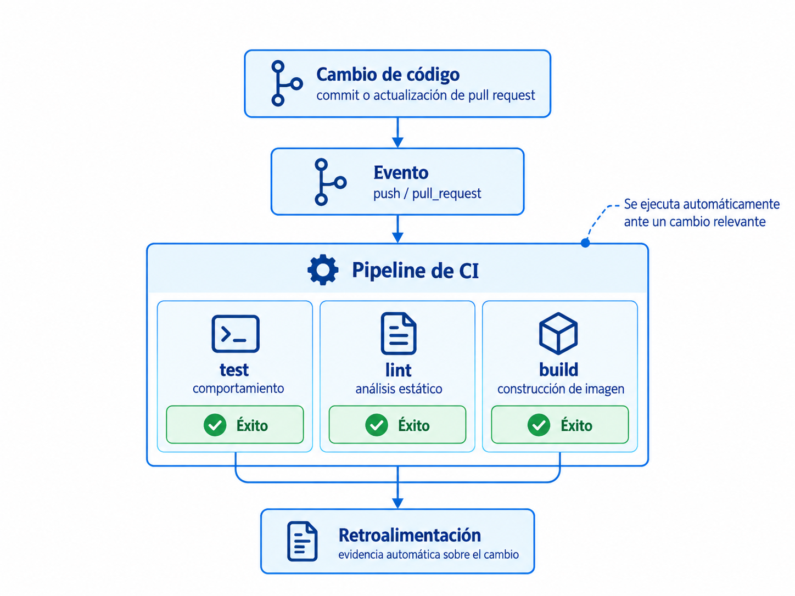
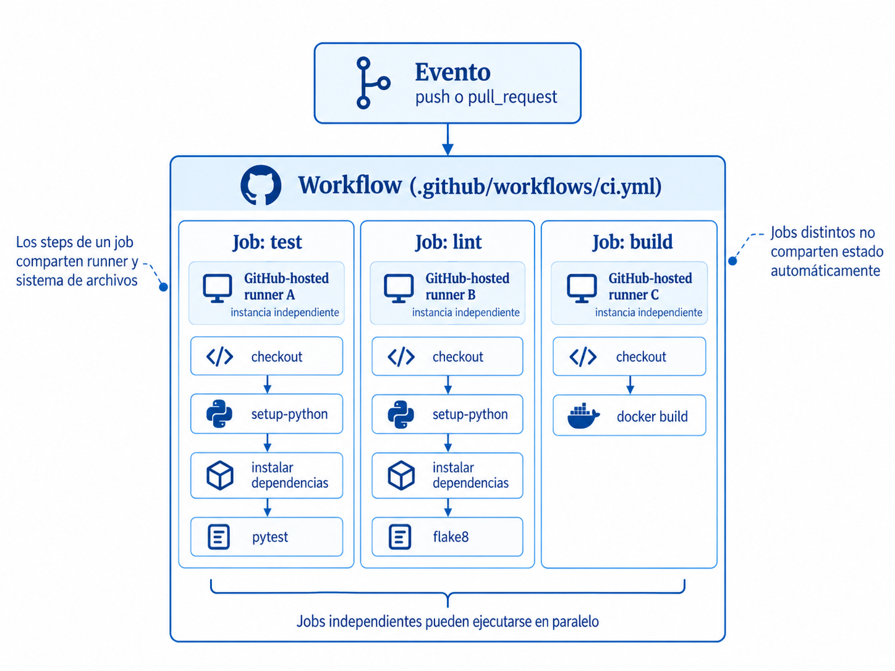
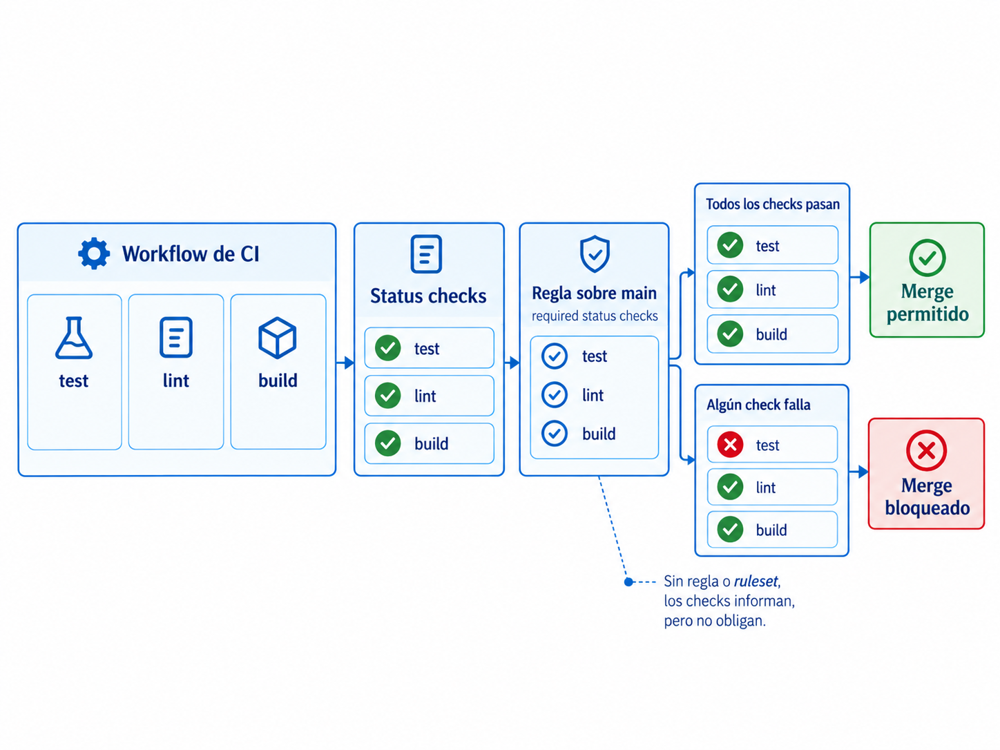
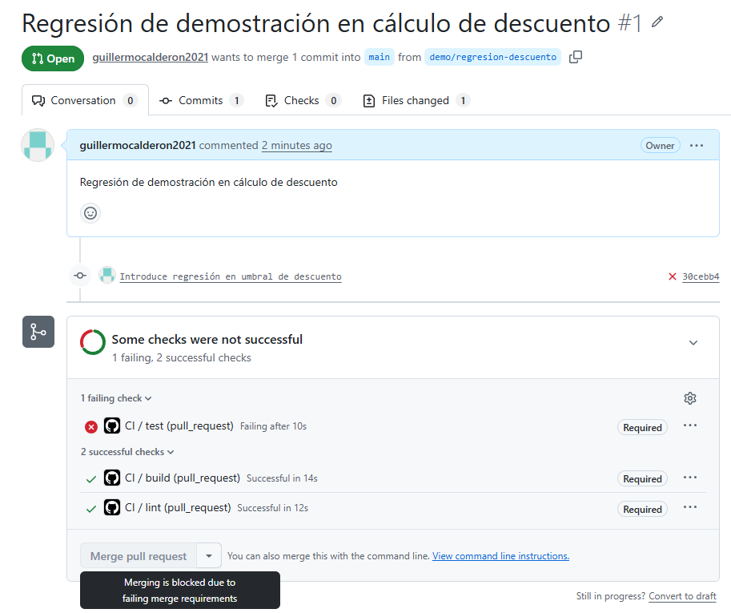

# S07. Fundamentos de CI con GitHub Actions

La Unidad I terminó con la construcción y ejecución reproducible de aplicaciones mediante contenedores. Una imagen permite empaquetar una aplicación junto con las dependencias necesarias para ejecutarla, y Docker Compose permite describir un entorno local compuesto por varios servicios. Ninguno de esos mecanismos responde, sin embargo, a una pregunta diferente: **¿cómo determinar de manera sistemática si un cambio de código puede integrarse sin romper comportamientos que el equipo ya considera válidos?**

La sesión de Git para DevOps introdujo trunk-based development, ramas de vida corta, integración frecuente y lotes pequeños de cambio. Ese modelo reduce el tamaño de cada integración, pero también aumenta la frecuencia con la que el equipo necesita comprobar que los cambios continúan siendo compatibles con el resto del sistema. Si esa comprobación depende exclusivamente de pasos manuales, cada integración queda sujeta a que una persona recuerde ejecutar las verificaciones correctas, disponga de un entorno apropiado y actúe sobre el resultado.

La integración continua combina dos ideas complementarias:

1. **integrar cambios pequeños con alta frecuencia**; y
2. **verificar automáticamente esos cambios para obtener retroalimentación temprana**.

La automatización no sustituye la práctica de integrar con frecuencia, y la integración frecuente no sustituye la verificación. Ambas forman parte del modelo de trabajo.

## El problema que resuelve la integración continua

Cuando varias personas trabajan durante periodos prolongados sin integrar sus cambios, las diferencias entre ramas crecen y la integración acumula más decisiones, conflictos y posibles regresiones. El problema no se limita a los conflictos de Git. Dos cambios pueden fusionarse sin producir ningún conflicto textual y, aun así, alterar de forma incompatible el comportamiento del sistema.

La verificación manual tampoco ofrece una garantía suficiente. Una persona puede ejecutar correctamente todas las pruebas en su equipo, pero otra puede olvidar hacerlo. También pueden existir diferencias entre los entornos locales, dependencias instaladas de forma distinta o comandos que se ejecutan con opciones diferentes. La señal obtenida depende entonces de prácticas individuales que no necesariamente se aplican de manera uniforme.

La integración continua traslada parte de esa verificación al proceso compartido del repositorio. Ante determinados cambios, un sistema automatizado ejecuta un conjunto definido de verificaciones en un entorno controlado y reporta el resultado al equipo. Esto reduce el tiempo entre la introducción de un problema y su detección, y hace que la verificación sea repetible para todas las personas que contribuyen al proyecto.

!!! note "Concepto clave"
    La integración continua es una práctica de desarrollo en la que los cambios se integran con frecuencia y son sometidos a verificaciones automáticas para detectar problemas lo antes posible dentro del proceso de integración.

La integración continua no implica que cualquier cambio que obtenga un resultado satisfactorio sea correcto en sentido absoluto. El sistema únicamente puede comprobar las condiciones que hayan sido expresadas mediante verificaciones automáticas. Un pipeline verde significa que las verificaciones ejecutadas finalizaron según lo esperado; no constituye una prueba general de ausencia de defectos.

## Pipeline de integración continua

Un **pipeline de CI** representa el proceso automatizado de verificación asociado a un cambio. De manera simplificada, un cambio relevante produce un evento que dispara un conjunto de verificaciones y genera retroalimentación automática para el equipo. La Figura 1 resume esta secuencia sin asociarla todavía a una plataforma específica.



*Figura 1. Flujo general de un pipeline de integración continua: un cambio dispara verificaciones automáticas y produce retroalimentación sobre el resultado.*

Las verificaciones dependen del tipo de proyecto. GitHub Actions no impone qué debe comprobarse; únicamente proporciona el mecanismo para ejecutar el trabajo definido por el equipo.

| Tipo de verificación | Pregunta que intenta responder | Ejemplo |
| --- | --- | --- |
| Pruebas automatizadas | ¿El comportamiento cubierto por las pruebas sigue siendo válido? | `pytest` |
| Lint | ¿Existen problemas detectables automáticamente en el código o incumplimientos de reglas configuradas? | `flake8` |
| Verificación de tipos | ¿Las relaciones de tipos cumplen las restricciones declaradas? | `mypy` |
| Construcción | ¿El artefacto puede construirse correctamente? | `docker build` |

Un linter constituye una forma de análisis estático, pero el análisis estático es un concepto más amplio y puede incluir verificadores de tipos, análisis de seguridad u otras herramientas que inspeccionan el código sin ejecutar la aplicación como lo haría un usuario.

Para esta sesión se utilizarán tres verificaciones: pruebas automatizadas, lint y construcción de la imagen de contenedor. El propósito no es estudiar en profundidad `pytest`, `flake8` o Docker, sino observar cómo comandos que ya pueden ejecutarse localmente se convierten en verificaciones automatizadas dentro de un pipeline. La inclusión del build conecta este bloque con la Unidad I: la imagen que antes se construía manualmente pasa ahora a formar parte de la verificación automática del cambio.

## Modelo de ejecución de GitHub Actions

GitHub Actions es la plataforma utilizada en el curso para implementar los pipelines de CI. Antes de estudiar la sintaxis YAML, es necesario comprender las unidades que forman su modelo de ejecución.

La Figura 2 representa el modelo que se utilizará en el ejemplo de la sesión. Un evento inicia el workflow; el workflow contiene tres jobs independientes y cada job se ejecuta sobre su propio GitHub-hosted runner. Dentro de cada job, los steps se ejecutan secuencialmente.



*Figura 2. Modelo de ejecución utilizado en la sesión: evento, workflow, jobs, GitHub-hosted runners y steps.*

### Workflow

Un workflow es un proceso automatizado definido mediante un archivo YAML dentro de `.github/workflows/`. GitHub detecta los archivos válidos ubicados en ese directorio y los asocia al repositorio. Un repositorio puede contener varios workflows independientes, por ejemplo uno para integración continua y otro para despliegue.

Docker Compose también utiliza YAML, pero describe un problema distinto. Un archivo `compose.yaml` declara servicios que deben ejecutarse y relacionarse entre sí; un workflow de GitHub Actions declara un proceso automatizado que comienza ante un evento y termina cuando sus jobs concluyen.

### Eventos y disparadores

El bloque `on` declara qué eventos pueden iniciar una ejecución del workflow. Dos eventos habituales en CI son:

- `push`: ocurre cuando se envían commits a una referencia del repositorio;
- `pull_request`: permite reaccionar ante cambios relacionados con una solicitud de incorporación hacia una rama objetivo.

Los eventos pueden filtrarse por rama u otras condiciones. La elección del disparador determina **cuándo** se obtiene retroalimentación y, por tanto, forma parte del diseño del pipeline.

### Jobs

Un job agrupa una secuencia de steps que se ejecutan sobre un runner. Cuando varios jobs no declaran dependencias entre sí, GitHub Actions permite que se ejecuten de forma concurrente. No debe interpretarse esto como una garantía de que todos comiencen exactamente en el mismo instante: una ejecución puede permanecer en cola hasta que exista capacidad disponible.

En runners alojados por GitHub, cada job recibe una instancia nueva del entorno indicado mediante `runs-on`. Por ello, dos jobs independientes no deben asumir que comparten archivos o estado. Cuando un job necesita resultados producidos por otro, esa relación debe declararse explícitamente; los mecanismos para coordinar jobs se desarrollan en la sesión siguiente.

### Steps

Un step es una unidad de ejecución dentro de un job. Los steps se ejecutan, por defecto, de forma secuencial sobre el mismo runner. Esto permite que un step utilice archivos creados por un step anterior.

Un step puede:

- ejecutar comandos mediante `run`; o
- invocar una acción reutilizable mediante `uses`.

Existe una precisión importante: **compartir el mismo runner no significa compartir el mismo proceso de shell**. Cada entrada `run` crea un nuevo proceso y un nuevo shell. El sistema de archivos del runner permanece disponible durante el job, pero una variable definida únicamente dentro de un shell no se transfiere automáticamente al siguiente step.

Por ejemplo, los archivos creados por el primer step permanecen disponibles para el segundo:

```yaml
steps:
  - name: Crear archivo
    run: echo "dato" > resultado.txt

  - name: Leer archivo
    run: cat resultado.txt
```

En cambio, esta variable de shell no se conserva de la misma forma:

```yaml
steps:
  - name: Definir variable
    run: MI_VARIABLE=valor

  - name: Intentar utilizarla
    run: echo "$MI_VARIABLE"
```

GitHub Actions dispone de mecanismos explícitos para propagar valores entre steps. No es necesario estudiarlos todavía; en esta sesión basta con distinguir el estado persistente en el sistema de archivos del estado particular de cada proceso de shell.

### Runners

Un runner es la máquina que ejecuta un job. En esta sesión se utilizarán **GitHub-hosted runners**, aprovisionados por GitHub para cada job y retirados al finalizar. Esto proporciona un entorno limpio para cada ejecución del job y evita depender del estado acumulado por ejecuciones anteriores.

También existen **self-hosted runners**, administrados por la organización que utiliza GitHub. Estos permiten controlar hardware, red y software instalado, pero trasladan al equipo responsabilidades de mantenimiento y seguridad. Un self-hosted runner no debe asumirse como efímero: puede ser persistente, aunque también es posible diseñar infraestructura propia para crear runners efímeros.

La elección entre ambos modelos se retoma al final de la sesión como decisión de ingeniería.

## Códigos de salida y resultado de los steps

GitHub Actions no necesita comprender qué significa `pytest`, `flake8` o cualquier otra herramienta. Para un step basado en `run`, el mecanismo fundamental es el **código de salida** del proceso ejecutado.

Por convención:

```text
código 0       -> ejecución satisfactoria
código distinto de 0 -> falla
```

Cuando se ejecuta:

```bash
python -m pytest
```

`pytest` determina si las pruebas pasan o fallan y finaliza con un código de salida correspondiente. GitHub Actions observa ese resultado. Si el comando termina con un código distinto de cero, el step se marca como fallido y, salvo que el workflow indique otro comportamiento, los siguientes steps del job no se ejecutan.

El mismo mecanismo permite utilizar otras herramientas:

```bash
flake8 .
```

```bash
mypy src/
```

```bash
docker build -t ejemplo:ci .
```

La capacidad de una herramienta para participar en CI no depende de que GitHub Actions conozca su dominio específico, sino de que pueda ejecutarse de forma automatizada y comunicar de manera adecuada su resultado.

## Proyecto utilizado en la sesión

El ejemplo utiliza una API pequeña cuyo código completo se mantiene en el repositorio complementario `devops-ci-cd-demo`. Así puede trabajarse con un caso realista sin convertir este capítulo en una explicación del framework web.

La estructura relevante del repositorio es:

```text
devops-ci-cd-demo/
├── app/
│   ├── __init__.py
│   ├── main.py
│   └── pricing.py
├── tests/
│   ├── test_api.py
│   └── test_pricing.py
├── requirements.txt
├── requirements-dev.txt
├── Dockerfile
└── .github/
    └── workflows/
        └── ci.yml
```

La API expone un endpoint de salud y otro que calcula el precio de una compra aplicando un descuento del 10 % a partir de diez unidades. El repositorio docente está disponible en [guillermocalderon2021/devops-ci-cd-demo](https://github.com/guillermocalderon2021/devops-ci-cd-demo). El estado estable correspondiente a esta sesión se conserva mediante el tag `s07-ci-basico`.

Antes de introducir GitHub Actions, el repositorio permite ejecutar localmente las mismas verificaciones que luego se automatizarán:

```bash
python -m pytest
flake8 app tests
docker build -t devops-ci-cd-demo:local .
```

Cada comando responde una pregunta diferente:

```text
python -m pytest -> ¿el comportamiento probado sigue siendo válido?
flake8       -> ¿el código cumple las reglas estáticas configuradas?
docker build -> ¿puede construirse la imagen?
```

GitHub Actions no sustituye estos mecanismos: los automatiza ante eventos definidos por el equipo y publica sus resultados para cada cambio.

## Estructura de un workflow

El archivo `.github/workflows/ci.yml` define tres jobs independientes: `test`, `lint` y `build`.

```yaml
name: CI

on:
  push:
    branches: [main]
  pull_request:
    branches: [main]

jobs:
  test:
    runs-on: ubuntu-latest
    steps:
      - name: Descargar el código
        uses: actions/checkout@v7

      - name: Configurar Python
        uses: actions/setup-python@v7
        with:
          python-version: "3.13"

      - name: Instalar dependencias
        run: python -m pip install -r requirements-dev.txt

      - name: Ejecutar pruebas
        run: python -m pytest

  lint:
    runs-on: ubuntu-latest
    steps:
      - name: Descargar el código
        uses: actions/checkout@v7

      - name: Configurar Python
        uses: actions/setup-python@v7
        with:
          python-version: "3.13"

      - name: Instalar dependencias
        run: python -m pip install -r requirements-dev.txt

      - name: Ejecutar lint
        run: flake8 app tests

  build:
    runs-on: ubuntu-latest
    steps:
      - name: Descargar el código
        uses: actions/checkout@v7

      - name: Construir imagen
        run: docker build --tag devops-ci-cd-demo:${{ github.sha }} .
```

`test` y `lint` repiten deliberadamente la preparación del entorno para hacer visible que cada job parte de su propio runner. El pipeline funciona, pero todavía no está optimizado; esa limitación se retomará en la sesión siguiente. `build`, por su parte, delega en el `Dockerfile` la construcción de la imagen estudiada en la Unidad I.

!!! note "Sobre `ubuntu-latest`"
    `ubuntu-latest` identifica la imagen estable más reciente que GitHub ofrece bajo esa etiqueta, pero no representa un sistema operativo inmutable. La imagen puede evolucionar con el tiempo. Cuando un proyecto necesita controlar explícitamente la versión del sistema operativo puede utilizar una etiqueta concreta, por ejemplo `ubuntu-24.04`.

!!! warning "Versiones de las acciones"
    El ejemplo utiliza `actions/checkout@v7` y `actions/setup-python@v7`, vigentes al preparar este material. Una referencia como `@v7` es legible y conveniente para un ejemplo docente, pero no constituye una referencia inmutable. GitHub recomienda fijar acciones mediante el identificador completo del commit (SHA) cuando se requiere la máxima protección frente a cambios en dependencias del workflow. Las implicaciones de seguridad de esta decisión se estudian en la sesión siguiente.

## Status checks y gates

Al finalizar los jobs, GitHub muestra sus resultados asociados al commit o al pull request. Estos resultados constituyen **status checks** que proporcionan retroalimentación sobre las verificaciones realizadas.

La existencia de un status check no implica, por sí sola, que GitHub impida integrar un cambio. Un equipo puede ejecutar CI automáticamente y aun así permitir que alguien fusione un pull request con verificaciones fallidas. En ese caso existe la señal de CI, pero la política del repositorio permite ignorarla.

Un **gate** aparece cuando determinados checks se convierten en una condición obligatoria para avanzar. En GitHub, los required status checks pueden aplicarse mediante mecanismos como las reglas de protección de rama o los conjuntos de reglas (*rulesets*).

La Figura 3 separa explícitamente la generación de señales de CI de la política que decide si esas señales son obligatorias. En el escenario utilizado en la sesión, `test`, `lint` y `build` son required status checks sobre `main`.



*Figura 3. Relación entre el workflow de CI, los status checks y el ruleset que convierte checks requeridos en un gate para la integración a `main`.*

Esta separación es importante:

- el **workflow** ejecuta las verificaciones;
- los **status checks** comunican el resultado;
- la **política del repositorio** decide si ciertos resultados son obligatorios para permitir la fusión.

Un pipeline puede existir sin gate. Sin embargo, cuando una organización necesita garantizar que determinadas verificaciones no puedan ignorarse por la vía habitual de integración, debe convertirlas en requisitos obligatorios.

!!! note "Disponibilidad de las reglas"
    La disponibilidad de determinadas reglas depende del tipo de repositorio y del plan de GitHub utilizado. Para una práctica individual puede utilizarse un repositorio donde la cuenta permita configurar required status checks o un repositorio institucional preparado para ese propósito.

## Demostración: de una regresión a un gate

La demostración parte de `devops-ci-cd-demo` con su versión correcta integrada en `main` y con `test`, `lint` y `build` configurados como checks obligatorios.

Primero se ejecutan localmente las tres verificaciones:

```bash
python -m pytest
flake8 app tests
docker build -t devops-ci-cd-demo:local .
```

Después se identifica en `.github/workflows/ci.yml` qué job automatiza cada comando y se crea una rama para introducir una regresión. La regla de precios contiene inicialmente:

```python
if quantity >= 10:
    subtotal *= 0.90
```

La condición se modifica a:

```python
if quantity > 10:
    subtotal *= 0.90
```

El cambio es sintácticamente válido y la imagen continúa siendo construible, pero una compra de exactamente diez unidades deja de recibir el descuento esperado. Al abrir un pull request hacia `main`, el resultado esperado es:

```text
test     failure
lint     success
build    success
```

La combinación permite distinguir las señales del pipeline: `test` detecta la regresión porque existe una prueba para el valor de frontera; `lint` no encuentra una infracción estática; y `build` confirma que la imagen todavía puede construirse. Dos checks satisfactorios no compensan la falla de un check obligatorio, por lo que el pull request permanece bloqueado.

Al restaurar `quantity >= 10` y publicar un nuevo commit sobre la misma rama, el workflow se ejecuta nuevamente:

```text
test     success
lint     success
build    success
```

Una vez satisfechos los required checks, la política permite que el cambio avance.

La Figura 4 muestra el resultado real de esta regresión en el repositorio de demostración. GitHub marca `test` como fallido, mantiene `lint` y `build` como satisfactorios y bloquea la fusión porque los tres checks se configuraron como obligatorios.



*Figura 4. Pull request de demostración con `test` fallido, `lint` y `build` satisfactorios y la fusión bloqueada por los requisitos de `main`. Captura del repositorio del curso.*

### Puntos de observación

- Los comandos automatizados también pueden ejecutarse localmente.
- Cada check examina una propiedad distinta del mismo commit.
- El workflow genera la evidencia; la política del repositorio determina si esa evidencia bloquea la integración.
- Un nuevo commit produce una nueva verificación automática.
- La repetición de preparación entre jobs deja abierto el problema de ingeniería que se estudia en S08.

## Preparación del repositorio para la práctica

Cada estudiante debe trabajar sobre un **fork propio** del repositorio docente. No debe clonar directamente el repositorio del profesor para realizar los cambios de la práctica, porque el objetivo es que cada persona pueda crear ramas, publicar commits, ejecutar GitHub Actions y abrir pull requests dentro de un repositorio que controla.

El procedimiento es el siguiente:

1. Abrir el repositorio docente [guillermocalderon2021/devops-ci-cd-demo](https://github.com/guillermocalderon2021/devops-ci-cd-demo) y utilizar **Fork** para crear una copia en la cuenta personal de GitHub.
2. Clonar **el fork propio**. Sustituir `<usuario>` por el nombre de usuario de GitHub:

    ```bash
    git clone https://github.com/<usuario>/devops-ci-cd-demo.git
    cd devops-ci-cd-demo
    ```

3. Abrir la pestaña **Actions** del fork. Si GitHub indica que los workflows están deshabilitados para ese repositorio, habilitarlos antes de continuar. El archivo `.github/workflows/ci.yml` forma parte del repositorio y se copia con el fork.
4. Preparar el entorno local y ejecutar las verificaciones iniciales:

    ```bash
    python -m pip install -r requirements-dev.txt
    python -m pytest
    flake8 app tests
    docker build -t devops-ci-cd-demo:local .
    ```

5. Generar una primera ejecución satisfactoria de CI en el fork. Como el workflow responde a `push` sobre `main`, puede utilizarse un commit vacío que no modifica archivos:

    ```bash
    git switch main
    git pull
    git commit --allow-empty -m "Inicializa CI en el fork"
    git push origin main
    ```

    En la pestaña **Actions**, esperar a que `test`, `lint` y `build` finalicen satisfactoriamente. GitHub requiere que un status check obligatorio haya finalizado correctamente en el repositorio durante los siete días anteriores para poder utilizarlo como required status check.

6. Configurar en el fork un **branch ruleset** para `main`. Los branch rulesets del repositorio docente no se heredan automáticamente al crear un fork. En **Settings → Rules → Rulesets**, crear una regla activa para `main`, activar **Require a pull request before merging** y **Require status checks to pass**, y seleccionar `test`, `lint` y `build` como checks obligatorios.
7. Para los ejercicios de la sesión, crear una rama de trabajo, publicar los cambios en el fork y abrir el pull request hacia `main` **dentro del mismo fork**. A partir de este punto no debe trabajarse directamente sobre `main`.

El tag `s07-ci-basico` permite recuperar el estado estable utilizado como punto de partida de esta sesión:

```bash
git fetch --tags
git checkout s07-ci-basico
```

Un tag identifica un commit concreto y no constituye una rama de trabajo. Para realizar modificaciones a partir de ese estado debe crearse una rama nueva, por ejemplo:

```bash
git switch -c practica-s07 s07-ci-basico
```

!!! warning "Fork y ruleset"
    El workflow `ci.yml` sí se copia con el fork porque es un archivo versionado del repositorio. El branch ruleset que protege `main` no se copia. Si el estudiante omite la configuración del ruleset, los checks pueden ejecutarse y reportar fallos, pero esos resultados no actuarán necesariamente como gate que bloquee la fusión.

## Límites de la integración continua

La integración continua automatiza verificaciones, pero no decide qué debe verificarse. Una funcionalidad sin pruebas o análisis puede contener defectos mientras el pipeline permanece verde. CI amplifica una estrategia de pruebas y análisis; no la sustituye.

La utilidad de CI también depende de la rapidez de la retroalimentación. Un pipeline demasiado lento aumenta el intervalo entre introducir un problema y recibir la señal. Caché, paralelización y organización de jobs se estudian en la sesión siguiente.

La integración continua tampoco sustituye la revisión de código. Un pipeline puede detectar que las pruebas pasan y que el código cumple reglas automáticas, pero no puede garantizar que la solución elegida sea adecuada para el problema, que el diseño resulte mantenible o que se hayan considerado correctamente todas las implicaciones del cambio.

## Errores frecuentes

### Ejecutar CI pero permitir que su resultado se ignore

Un workflow puede producir correctamente status checks y, aun así, la rama principal puede permitir integrar cambios fallidos si no existe una política que exija esos checks. Esto no significa que el workflow deje de ser CI; significa que la organización no ha convertido su señal en una condición obligatoria para integrar.

Cuando el objetivo del equipo es impedir que determinados fallos lleguen a `main`, los checks relevantes deben configurarse como obligatorios.

### Utilizar referencias de acciones sin considerar su mutabilidad

Una referencia como:

```yaml
uses: actions/checkout@v7
```

es fácil de leer y mantiene el workflow dentro de una versión mayor concreta, pero el tag puede actualizarse. Cuando el objetivo es utilizar una referencia inmutable, GitHub recomienda el identificador completo del commit (SHA) correspondiente. La sesión siguiente desarrolla esta decisión dentro de la seguridad del pipeline.

### Agrupar verificaciones independientes sin valorar el compromiso

Es posible ejecutar lint y pruebas como steps sucesivos del mismo job:

```yaml
- run: flake8 app tests
- run: python -m pytest
```

Para un proyecto pequeño, esta estructura puede ser suficiente y resulta sencilla. Separarlas en jobs distintos permite aislamiento y ejecución concurrente, pero también puede repetir preparación del entorno y consumir más recursos.

Por tanto, no existe una regla universal según la cual cada verificación deba ser un job diferente. La decisión depende del costo de preparación, del tiempo de ejecución, de la independencia entre verificaciones y de la utilidad de recibir resultados separados.

### Normalizar fallas intermitentes

Una prueba o dependencia que falla ocasionalmente por razones no relacionadas con el cambio puede erosionar la confianza en el pipeline. Si la respuesta habitual consiste únicamente en reintentar hasta obtener un resultado verde, el equipo deja de interpretar una falla como una señal confiable.

Las fallas intermitentes deben investigarse porque un gate solamente aporta valor cuando el equipo confía en la información que produce.

## Caso técnico

Un equipo de cuatro personas mantiene una API interna. Cada cambio se revisa mediante pull request, pero la ejecución de pruebas depende de que cada persona recuerde hacerlo localmente.

Durante dos incidentes recientes ocurrió lo siguiente:

1. En el primer incidente existía una prueba que detectaba exactamente la regresión introducida, pero nadie la ejecutó antes de fusionar el cambio.
2. En el segundo incidente no existía ninguna prueba que cubriera el comportamiento afectado.

### Primer incidente

CI puede atender directamente la debilidad observada. Si la prueba existente se ejecuta automáticamente ante cada pull request, el resultado deja de depender de que una persona recuerde el comando. Si además el check correspondiente es obligatorio, un resultado fallido impide la fusión por la vía normal del pull request.

### Segundo incidente

CI no puede detectar automáticamente un comportamiento para el cual el equipo no ha definido ninguna verificación. La automatización ejecuta pruebas; no las inventa. Una vez que el defecto se comprende y el equipo incorpora una prueba que lo reproduce, esa nueva prueba puede convertirse en una protección automática frente a regresiones futuras del mismo tipo.

La diferencia entre ambos incidentes establece un límite fundamental:

```text
verificación existente + ejecución no garantizada
                  |
                  v
          CI puede automatizarla

verificación inexistente
                  |
                  v
        CI no tiene qué ejecutar
```

## Decisiones de ingeniería

### Qué eventos deben disparar el workflow

Un workflow ejecutado ante `pull_request` permite verificar los cambios propuestos antes de integrarlos. Ejecutarlo también ante `push` a `main` permite validar el estado que efectivamente quedó integrado y cubrir flujos en los que existan cambios directos autorizados sobre la rama.

La configuración:

```yaml
on:
  push:
    branches: [main]
  pull_request:
    branches: [main]
```

puede producir una verificación del cambio durante el pull request y otra después de su integración a `main`. Esa repetición puede ser deseable o innecesaria según la política del repositorio. La selección de eventos debe responder al flujo real del equipo.

### Qué tipo de runner utilizar

Los GitHub-hosted runners reducen el trabajo operativo del equipo y proporcionan una instancia nueva para cada job. Los self-hosted runners permiten controlar la infraestructura, acceder a redes privadas o utilizar hardware específico, pero requieren administración, actualización y protección propias.

Para un proyecto que comienza a utilizar GitHub Actions y no posee requisitos especiales de infraestructura, un GitHub-hosted runner constituye un punto de partida razonable.

### Qué checks deben ser obligatorios

No todo check informativo debe necesariamente convertirse en un gate. Un check obligatorio debe representar una condición suficientemente importante y confiable como para impedir que el cambio avance cuando falla.

Convertir una verificación inestable en requisito puede bloquear trabajo por razones que no dependen del cambio. Dejar como informativa una verificación crítica permite que una regresión conocida avance. La decisión requiere considerar tanto el costo de un falso bloqueo como el costo de integrar un defecto que la verificación habría detectado.

## Actividades de análisis

1. Un repositorio contiene un workflow con `on: push` sin ningún filtro de rama. Analizar en qué referencias podría ejecutarse el workflow y proponer una configuración que limite la ejecución a los cambios que el equipo necesita verificar.

2. Un repositorio ejecuta automáticamente pruebas ante cada `pull_request`, pero `main` no exige ningún status check para permitir la fusión. Identificar qué elementos de CI ya existen, qué mecanismo falta para convertir el resultado en un gate y qué riesgo permanece mientras la señal pueda ignorarse.

3. Comparar dos diseños para un proyecto pequeño:

    **Diseño A:** un único job ejecuta `flake8` y después `pytest`.

    **Diseño B:** existen jobs independientes `lint` y `test`.

    Identificar al menos dos ventajas y dos costos potenciales del diseño B respecto al diseño A. No asumir que uno de los dos es siempre correcto.

4. Un pull request muestra los resultados siguientes:

    ```text
    test: failure
    lint: success
    build: success
    ```

    Los tres checks son obligatorios. Explicar qué puede concluirse sobre el cambio a partir de cada resultado, por qué `lint: success` y `build: success` no contradicen `test: failure` y qué decisión debe tomar la política de integración configurada.

5. Un desarrollador ejecuta localmente `pytest` y obtiene éxito. El mismo commit falla posteriormente en GitHub Actions durante el step de instalación de dependencias por una interrupción temporal del servicio desde el que se descargan paquetes. Explicar qué evidencia existe sobre el código y qué evidencia existe sobre el pipeline. Determinar si ambos fallos deberían interpretarse de la misma forma.

## De integración continua a entrega continua

Esta sesión establece el modelo básico de CI: cambios frecuentes, eventos que disparan workflows, jobs ejecutados en runners, steps que automatizan comandos, resultados visibles y políticas capaces de convertir determinadas verificaciones en gates.

La siguiente sesión estudia qué ocurre cuando ese pipeline crece. Será necesario reducir tiempos de ejecución, evitar trabajo repetido, coordinar jobs, ejecutar verificaciones sobre varias configuraciones y proteger el propio mecanismo de automatización. Allí se introducirán caché, dependencias entre jobs, matrices, paralelización, prácticas de seguridad y diagnóstico del pipeline.

Más adelante, el resultado validado por CI se convertirá en entrada de un problema diferente: **cómo promover un artefacto entre ambientes y desplegarlo de manera controlada**. Ese problema corresponde a entrega continua.

## Referencias

- GitHub Docs. *Understanding GitHub Actions*.
- GitHub Docs. *Workflow syntax for GitHub Actions*.
- GitHub Docs. *Using GitHub-hosted runners*.
- GitHub Docs. *About protected branches*.
- GitHub Docs. *Available rules for rulesets*.
- GitHub Docs. *Troubleshooting required status checks*.
- GitHub Docs. *Secure use reference*.
- `actions/checkout`. Repositorio y notas de versión oficiales.
- `actions/setup-python`. Repositorio y documentación oficial.
- Repositorio del curso: `guillermocalderon2021/devops-ci-cd-demo`, tag `s07-ci-basico`.
- Humble, J. y Farley, D. *Continuous Delivery*. Addison-Wesley.
- Kim, G., Humble, J., Debois, P., Willis, J. y Forsgren, N. *The DevOps Handbook*, 2.ª edición. IT Revolution.
