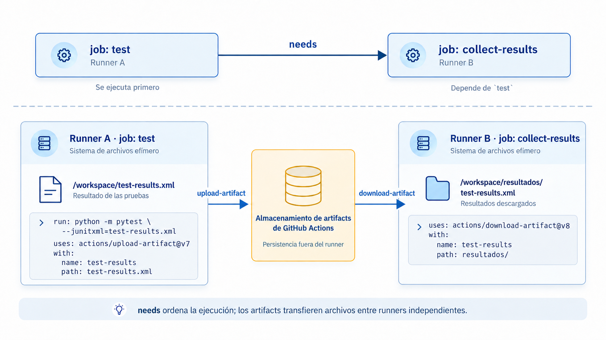
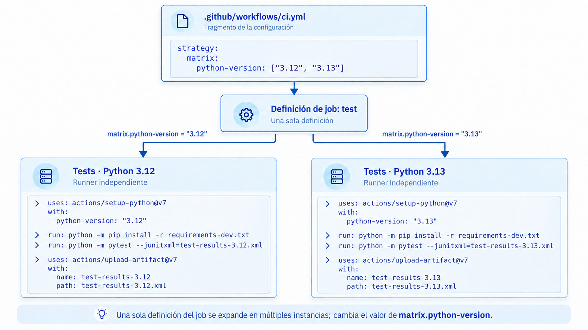
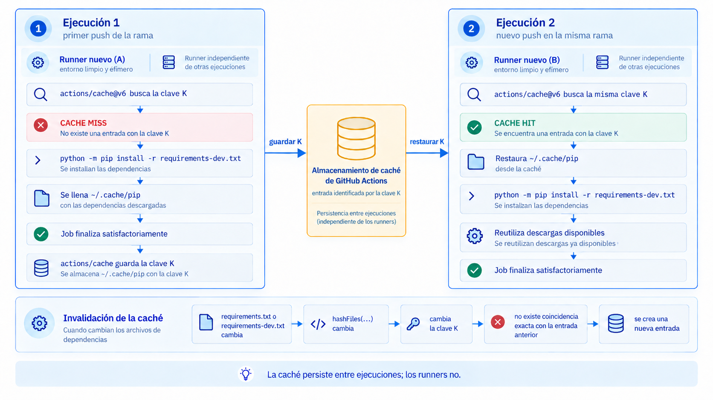
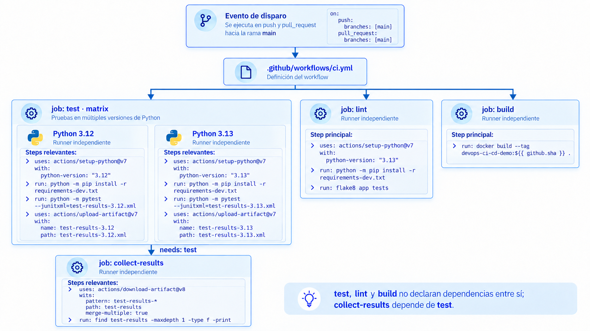

# S08. Ingeniería de pipelines de CI

En la sesion anterior construimos un pipeline de integración continua funcional para el repositorio `devops-ci-cd-demo`. El workflow contiene tres jobs independientes: `test`, `lint` y `build`. Los dos primeros preparan un entorno Python, instalan dependencias y ejecutan una verificación; el tercero construye la imagen definida por el `Dockerfile`.

Ese diseño es suficiente para establecer el modelo de ejecución de GitHub Actions, pero deja varias preguntas abiertas. ¿Qué ocurre cuando una misma verificación debe repetirse en varias configuraciones? ¿Cómo puede un job utilizar archivos producidos por otro si cada uno se ejecuta en un runner distinto? ¿Cómo se evita descargar repetidamente las mismas dependencias? ¿Qué costo tiene aumentar el paralelismo? ¿Con qué permisos debería ejecutarse el workflow?

La ingeniería de pipelines consiste en tomar decisiones explícitas sobre esas relaciones. El objetivo no es agregar mecanismos por acumulación, sino construir un pipeline que proporcione la evidencia necesaria con un tiempo, un costo y una superficie de riesgo razonables.

## 1. Modelo de ejecución de pipelines

En la clase anterior los tres jobs podían comenzar sin esperar a los demás:

```text
test ──────┐
lint ──────┼── verificaciones independientes
build ─────┘
```

Mientras no exista una dependencia entre ellos, GitHub Actions puede ejecutarlos concurrentemente, sujeto a la disponibilidad de runners.

Cuando un job necesita que otro haya terminado, el workflow deja de ser únicamente un conjunto de jobs independientes. Resulta más útil representarlo como un **grafo dirigido**:

- cada job constituye un nodo;
- una dependencia entre jobs constituye una arista;
- la ausencia de una arista conserva la posibilidad de paralelismo.

### 1.1 Dependencias entre jobs

La palabra clave `needs` permite declarar esa relación.

```yaml
jobs:
  primero:
    runs-on: ubuntu-latest
    steps:
      - run: echo "primero"

  segundo:
    needs: primero
    runs-on: ubuntu-latest
    steps:
      - run: echo "segundo"
```

`segundo` no comienza hasta que `primero` finaliza satisfactoriamente. Si `primero` falla o se omite, `segundo` también se omite por defecto.

Agregar `needs` no debe entenderse como una forma de "ordenar" visualmente un workflow. Cada dependencia elimina una posibilidad de paralelismo. Por tanto, debe existir una razón técnica para introducirla.

### 1.2 Transferencia de archivos entre jobs

Los steps de un mismo job comparten el sistema de archivos del runner. Los jobs distintos no lo hacen.

Supóngase que un job genera:

```text
resultado.xml
```

El archivo existe en el runner de ese job, pero otro job no puede leerlo directamente. Para transferir archivos entre jobs se utilizan **workflow artifacts**.

El job productor puede publicar el archivo:

```yaml
- name: Publicar resultado
  uses: actions/upload-artifact@v7
  with:
    name: resultado-pruebas
    path: resultado.xml
```

y un job posterior puede recuperarlo:

```yaml
- name: Descargar resultado
  uses: actions/download-artifact@v8
  with:
    name: resultado-pruebas
    path: resultados/
```

Un artifact no es una variable ni un mecanismo de caché. Su propósito es conservar y transferir archivos producidos por una ejecución.

| Mecanismo | Propósito principal | Ejemplo |
| --- | --- | --- |
| Sistema de archivos del runner | Compartir archivos entre steps del mismo job | un archivo generado y leído en el step siguiente |
| Output de un job | Transferir valores pequeños entre jobs | un identificador o una cadena |
| Artifact | Transferir o conservar archivos producidos por una ejecución | reportes de pruebas, binarios, paquetes |
| Caché | Reutilizar archivos para evitar trabajo repetido entre ejecuciones | descargas de dependencias |

Los artifacts pueden además descargarse posteriormente desde la interfaz de GitHub mientras continúen dentro de su periodo de retención.

!!! note "Artifacts y runners"
    Publicar un artifact no hace que dos jobs compartan runner. El archivo se carga en almacenamiento administrado por GitHub y luego otro job lo descarga en su propio runner.



*Figura 1. `needs` establece la dependencia de ejecución entre jobs, mientras que los artifacts permiten transferir archivos entre runners independientes.*


## 2. Estrategias de matriz

### 2.1 Expansión de configuraciones

Copiar un job completo para cambiar únicamente la versión de Python produce duplicación:

```text
test-python-3.12
test-python-3.13
```

Si ambos jobs realizan exactamente las mismas operaciones, la diferencia puede expresarse mediante una **matriz**.

```yaml
strategy:
  matrix:
    python-version: ["3.12", "3.13"]
```

Después, el valor se utiliza dentro del job:

```yaml
- name: Configurar Python
  uses: actions/setup-python@v7
  with:
    python-version: ${{ matrix.python-version }}
```

GitHub genera una instancia del job para cada valor declarado. En este caso:

```text
test / Python 3.12
test / Python 3.13
```

Cada instancia utiliza su propio runner.



*Figura 2. Una única definición del job `test` se expande en instancias independientes para Python 3.12 y Python 3.13.*

La matriz no debe confundirse con una lista de versiones "interesantes". En un proyecto real debería representar configuraciones que el equipo declara soportar o que necesita verificar por alguna razón concreta. En esta sesión se utilizarán Python 3.12 y 3.13 únicamente para disponer de dos entornos explícitos sobre los cuales observar el mecanismo.

### 2.2 Control de ejecución con `fail-fast` y `max-parallel`

Por defecto, una matriz utiliza `fail-fast: true`. Si una combinación falla, GitHub puede cancelar otras combinaciones que todavía estén en ejecución o en espera.

Cuando interesa conocer el resultado de todas las combinaciones, puede desactivarse:

```yaml
strategy:
  fail-fast: false
  matrix:
    python-version: ["3.12", "3.13"]
```

También puede limitarse el número de instancias simultáneas:

```yaml
strategy:
  max-parallel: 2
```

`fail-fast` y `max-parallel` representan decisiones distintas:

- `fail-fast` determina qué ocurre con el resto de la matriz cuando una combinación falla;
- `max-parallel` limita cuántas combinaciones pueden ejecutarse simultáneamente.

Más cobertura y más paralelismo pueden reducir el tiempo de espera, pero aumentan el consumo total de runner.

## 3. Caché de dependencias

Los GitHub-hosted runners son efímeros. Una ejecución posterior no recibe el sistema de archivos utilizado por una ejecución anterior.

Esto significa que, sin un mecanismo adicional, comandos como:

```bash
python -m pip install -r requirements-dev.txt
```

vuelven a descargar los paquetes que necesiten en cada runner nuevo.

### 3.1 Claves de caché

Una **caché** permite conservar determinadas rutas entre ejecuciones. Para `pip`, una ruta habitual es:

```text
~/.cache/pip
```

El ejemplo utilizado en esta sesión emplea:

```yaml
- name: Restaurar caché de pip
  uses: actions/cache@v6
  with:
    path: ~/.cache/pip
    key: pip-${{ runner.os }}-${{ matrix.python-version }}-${{ hashFiles('requirements.txt', 'requirements-dev.txt') }}
```

La clave incorpora cuatro elementos:

```text
pip
│
├── sistema operativo del runner
├── versión de Python
└── hash de los archivos de dependencias
```

Si alguno de los archivos de dependencias cambia, `hashFiles(...)` produce otro valor y, por tanto, otra clave.

### 3.2 Alcance de la caché

En este ejemplo **no se conserva un entorno Python ya instalado**. Se conserva el caché local que `pip` utiliza para descargas y paquetes construidos.

Por eso el paso de instalación sigue siendo necesario:

```yaml
- name: Instalar dependencias
  run: python -m pip install -r requirements-dev.txt
```

La secuencia es:

```text
runner nuevo
   ↓
restaurar ~/.cache/pip, si existe una entrada compatible
   ↓
ejecutar pip install
   ↓
pip puede reutilizar contenido descargado previamente
```

La caché mejora el tiempo de preparación; no sustituye la declaración de dependencias.

!!! note "Cache hit y cache miss"
    Una coincidencia exacta con la clave solicitada es un **cache hit**. Si no existe una entrada compatible se produce un **cache miss**. Si el job termina satisfactoriamente, la acción puede guardar una nueva caché para ejecuciones posteriores.

Para esta sesión se utiliza `actions/cache` de forma explícita porque permite observar el mecanismo. `actions/setup-python` también ofrece integración con el caché de gestores como `pip`.

### 3.3 Restauración, invalidación y límites

Una caché es una optimización, no una fuente de verdad. Las dependencias deben seguir estando declaradas en archivos versionados.

La clave debe incluir los elementos que afectan al contenido reutilizable. En este proyecto `requirements-dev.txt` incluye a `requirements.txt`, por lo que ambos archivos participan en la clave:

```yaml
${{ hashFiles('requirements.txt', 'requirements-dev.txt') }}
```

Una clave demasiado general puede reducir el aislamiento entre estados distintos del proyecto. Una clave excesivamente específica puede producir muy pocos aciertos y disminuir el beneficio de la caché.

También debe evitarse almacenar secretos o credenciales dentro de las rutas cacheadas.



*Figura 3. Ciclo de una caché entre ejecuciones con runners efímeros: `cache miss`, almacenamiento, `cache hit` e invalidación de la clave cuando cambian los archivos de dependencias.*

## 4. Seguridad del workflow

Un pipeline ejecuta código con acceso a recursos del repositorio y, en sesiones posteriores, podrá necesitar acceso a servicios externos. La seguridad debe formar parte de su diseño.

### 4.1 Permisos del `GITHUB_TOKEN`

GitHub genera un `GITHUB_TOKEN` para cada ejecución. El workflow puede limitar explícitamente sus permisos:

```yaml
permissions:
  contents: read
```

Esto indica que el workflow necesita leer el contenido del repositorio, pero no escribirlo.

Cuando se especifica al menos un permiso de forma explícita, los permisos no mencionados quedan establecidos en `none`. Esta propiedad permite aplicar el principio de mínimo privilegio directamente en el archivo del workflow.

El objetivo no es declarar `contents: read` por costumbre. Si un job necesita crear una release, publicar un paquete o modificar otro recurso, tendrá que recibir los permisos estrictamente necesarios para esa operación.

### 4.2 Versionado de acciones

Una referencia como:

```yaml
uses: actions/checkout@v7
```

es conveniente y legible, pero la etiqueta mayor no es una referencia inmutable.

Cuando se requiere una política más estricta frente a modificaciones de una dependencia del workflow, la acción puede fijarse mediante el SHA completo de un commit:

```yaml
uses: actions/checkout@<SHA_COMPLETO> # v7.x.x
```

El comentario conserva la referencia humana a la versión, mientras que el SHA identifica un contenido concreto.

En este material se utilizan etiquetas de versión mayor para mantener legibilidad. La diferencia entre ambas estrategias debe entenderse como una decisión de seguridad y mantenimiento.

### 4.3 Gestión de secretos

Las credenciales no deben escribirse directamente en el YAML ni imprimirse deliberadamente en los logs.

GitHub permite definir secretos a nivel de repositorio, organización o environment y referenciarlos desde un workflow. Sin embargo, el enmascaramiento automático de valores sensibles no debe considerarse una garantía suficiente frente a cualquier transformación o exposición accidental.

La regla de diseño es más simple:

> un workflow no debería recibir un secreto que no necesita.

### 4.4 Ejecución de código no confiable

!!! danger "Código no confiable y `pull_request_target`"
    El evento `pull_request_target` se ejecuta en el contexto del repositorio base y puede disponer de permisos elevados y secretos que no están disponibles para un `pull_request` ordinario desde un fork. No debe combinarse con la descarga y ejecución de código no confiable proveniente del pull request. GitHub incorpora protecciones adicionales en acciones actuales como `checkout`, pero la separación entre código no confiable y contexto privilegiado sigue siendo una responsabilidad de diseño del workflow.

## 5. Diseño del pipeline

### 5.1 Pipeline extendido

El workflow de esta sesión parte directamente del pipeline de la sesión anterior. Se mantienen las tres verificaciones originales:

- pruebas automatizadas;
- lint;
- construcción de la imagen Docker.

Sobre esa base se incorporan cuatro cambios:

1. `test` se ejecuta como matriz en Python 3.12 y 3.13;
2. cada instancia produce un reporte JUnit y lo publica como artifact;
3. `collect-results` espera a que termine la matriz y descarga esos artifacts;
4. `test` utiliza caché de `pip`, y el workflow declara permisos explícitos.

```yaml
name: CI

on:
  push:
    branches: [main]
  pull_request:
    branches: [main]

permissions:
  contents: read

jobs:
  test:
    name: Tests - Python ${{ matrix.python-version }}
    runs-on: ubuntu-latest

    strategy:
      fail-fast: false
      matrix:
        python-version: ["3.12", "3.13"]

    steps:
      - name: Descargar el código
        uses: actions/checkout@v7

      - name: Configurar Python
        uses: actions/setup-python@v7
        with:
          python-version: ${{ matrix.python-version }}

      - name: Restaurar caché de pip
        uses: actions/cache@v6
        with:
          path: ~/.cache/pip
          key: pip-${{ runner.os }}-${{ matrix.python-version }}-${{ hashFiles('requirements.txt', 'requirements-dev.txt') }}

      - name: Instalar dependencias
        run: python -m pip install -r requirements-dev.txt

      - name: Ejecutar pruebas
        run: python -m pytest --junitxml=test-results-${{ matrix.python-version }}.xml

      - name: Publicar resultados
        uses: actions/upload-artifact@v7
        with:
          name: test-results-${{ matrix.python-version }}
          path: test-results-${{ matrix.python-version }}.xml
          retention-days: 7

  collect-results:
    name: Recopilar resultados
    needs: test
    runs-on: ubuntu-latest

    steps:
      - name: Descargar reportes
        uses: actions/download-artifact@v8
        with:
          pattern: test-results-*
          path: test-results
          merge-multiple: true

      - name: Mostrar archivos recuperados
        run: find test-results -maxdepth 1 -type f -print

  lint:
    name: Lint
    runs-on: ubuntu-latest

    steps:
      - name: Descargar el código
        uses: actions/checkout@v7

      - name: Configurar Python
        uses: actions/setup-python@v7
        with:
          python-version: "3.13"

      - name: Instalar dependencias
        run: python -m pip install -r requirements-dev.txt

      - name: Ejecutar lint
        run: flake8 app tests

  build:
    name: Build
    runs-on: ubuntu-latest

    steps:
      - name: Descargar el código
        uses: actions/checkout@v7

      - name: Construir imagen
        run: docker build --tag devops-ci-cd-demo:${{ github.sha }} .
```

### 5.2 Publicación e identificación de artifacts

Las instancias de una matriz no deben intentar modificar el mismo artifact. Por eso cada una publica:

```text
test-results-3.12
test-results-3.13
```

El nombre incorpora el valor de la matriz:

```yaml
name: test-results-${{ matrix.python-version }}
```

Después `collect-results` los selecciona mediante:

```yaml
pattern: test-results-*
```

y los descarga en un mismo directorio.


### 5.3 Agregación de artifacts

La forma del grafo completo permite observar qué jobs permanecen independientes y cuál declara una dependencia explícita:



*Figura 4. Grafo del pipeline extendido: las instancias de `test`, `lint` y `build` no declaran dependencias entre sí; `collect-results` depende de `test` y recupera los artifacts producidos por la matriz.*

`collect-results` depende de `test`. Esa dependencia tiene una razón concreta: necesita que las instancias de la matriz hayan publicado sus reportes antes de intentar descargarlos.

`lint` y `build` permanecen independientes porque no necesitan ningún archivo producido por los demás jobs.

### 5.4 Dependencias de ejecución y propagación de fallos

Como `collect-results` declara:

```yaml
needs: test
```

por defecto se omitirá si `test` falla.

Esto es intencional en el ejemplo principal: primero se desea observar la semántica normal de `needs`.

En un pipeline cuyo objetivo fuera recopilar reportes incluso cuando las pruebas fallan podría utilizarse una condición como `if: ${{ always() }}` y configurar la publicación de resultados para ejecutarse aun después de una falla. Ese patrón es útil para diagnóstico, pero introduce una política diferente y no es necesario para comprender el mecanismo básico.

## 6. Ejecución y observación del pipeline

La demostración parte del repositorio utilizado en S07 y de una rama creada para esta sesión. No se modifica la lógica de la aplicación; se modifica únicamente el workflow.

### 6.1 Preparación de la rama

```bash
git switch main
git pull --ff-only origin main
git switch -c s08/pipeline-engineering
```

Antes de editar el workflow conviene comprobar que el pipeline de S07 continúa siendo la referencia inicial:

```bash
git show HEAD:.github/workflows/ci.yml
```

### 6.2 Modificación del workflow

Editar:

```text
.github/workflows/ci.yml
```

y revisar el cambio:

```bash
git diff -- .github/workflows/ci.yml
```

El objetivo de esta revisión no es leer el YAML línea por línea, sino identificar cuatro cambios estructurales:

```text
matrix
cache
artifacts + needs
permissions
```

### 6.3 Publicación de la rama

```bash
git add .github/workflows/ci.yml
git commit -m "Extiende pipeline de integración continua"
git push -u origin s08/pipeline-engineering
```

Crear un pull request hacia `main`.

### 6.4 Ejecución de la matriz

En la ejecución debe aparecer una instancia de `test` por cada versión:

```text
Tests - Python 3.12
Tests - Python 3.13
```

Ambas ejecutan la misma definición de job, pero reciben valores distintos desde `matrix.python-version`.

La observación importante es que no se duplicó el YAML para construir esas dos ejecuciones.

### 6.5 Primera ejecución y `cache miss`

En la primera ejecución puede no existir una entrada para las claves de caché utilizadas.

Debe revisarse el log del step:

```text
Restaurar caché de pip
```

y localizar la evidencia de un **cache miss**.

El tiempo exacto de `pip install` no es la prueba principal del funcionamiento de la caché, porque puede variar según la disponibilidad del runner y la red.

### 6.6 Segunda ejecución y `cache hit`

Realizar un cambio que no modifique `requirements.txt` ni `requirements-dev.txt`. Por ejemplo, agregar un comentario al `README.md` o realizar un cambio menor previamente definido para la demostración.

Después:

```bash
git add .
git commit -m "Dispara nueva ejecución del pipeline"
git push
```

En la nueva ejecución deben conservarse las mismas claves, por lo que puede observarse un **cache hit**.

La comparación central es:

```text
primera ejecución  -> no existía una caché compatible
segunda ejecución -> se restaura una caché compatible
```

### 6.7 Inspección de artifacts

Cada instancia de `test` debe publicar su reporte:

```text
test-results-3.12
test-results-3.13
```

El job `collect-results` comienza únicamente después de que la matriz `test` termina satisfactoriamente.

En ese job debe observarse:

```text
test-results/
├── test-results-3.12.xml
└── test-results-3.13.xml
```

Los artifacts también pueden descargarse desde la interfaz de la ejecución del workflow.

### 6.8 Consumo de runners

La ejecución ya no contiene únicamente tres jobs simples.

Conceptualmente hay:

```text
2 instancias de test
1 lint
1 build
1 collect-results
```

El tiempo de pared puede reducirse gracias al paralelismo, pero el consumo de runner corresponde al trabajo acumulado de las instancias ejecutadas.

Agregar una versión a la matriz no es gratuito: aumenta cobertura y también aumenta trabajo computacional.

## 7. Diagnóstico de fallos

### 7.1 Localización del fallo

Un pipeline más complejo produce más lugares posibles de falla. El primer paso no debe ser reejecutar indiscriminadamente.

El diagnóstico puede seguir una secuencia sencilla:

1. identificar qué job falló;
2. identificar qué step produjo el código de salida distinto de cero;
3. leer el log de ese step;
4. distinguir si el problema pertenece al código, a la configuración del pipeline o a una dependencia externa;
5. determinar si el fallo se reproduce.

### 7.2 Interpretación de logs

Algunos ejemplos:

```text
pytest falla
→ revisar la prueba, el código y la versión de Python de esa instancia

download-artifact no encuentra archivos
→ revisar si el job productor se ejecutó, el nombre del artifact y la relación needs

cache miss inesperado
→ comparar la clave calculada y los archivos que participan en hashFiles(...)

docker build falla
→ diagnosticar la construcción de la imagen, no asumir que el problema pertenece a GitHub Actions
```

### 7.3 Fallos determinísticos e intermitentes

Una reejecución puede aportar evidencia cuando se sospecha de un fallo transitorio, pero no convierte un fallo intermitente en un pipeline confiable.

## 8. Consideraciones de diseño

Los mecanismos de esta sesión no constituyen una lista de elementos que todo workflow deba contener.

**Dependencias entre jobs.** `needs` debe representar una dependencia real. Serializar jobs independientes aumenta el tiempo del pipeline sin aportar evidencia adicional.

**Artifacts.** Deben utilizarse cuando un archivo producido durante la ejecución necesita conservarse o consumirse desde otro job. No reemplazan una caché.

**Matrices.** Cada valor debe corresponder a una configuración que el equipo tenga una razón para verificar. Una matriz grande aumenta rápidamente el consumo de runners.

**`fail-fast`.** Mantenerlo activo reduce trabajo cuando basta con conocer que existe una combinación fallida. Desactivarlo obtiene información de todas las combinaciones a costa de consumir más recursos.

**Caché.** El beneficio depende del costo del trabajo que se evita. En proyectos pequeños puede ser marginal; en instalaciones o builds costosos puede ser significativo. El diseño de la clave determina cuándo el contenido puede reutilizarse.

**Permisos.** Un workflow debe recibir únicamente los permisos que necesita. Si una operación futura requiere acceso adicional, ese cambio debería ser explícito y revisable.

**Versionado de acciones.** Las etiquetas mayores favorecen legibilidad y mantenimiento; el pinning por SHA ofrece una referencia inmutable y una política de supply chain más estricta.

## 9. Limitaciones

El pipeline de esta sesión todavía es deliberadamente pequeño.

No publica imágenes en un registry, no despliega software y no utiliza credenciales de un proveedor de nube. Tampoco intenta resolver todos los problemas de rendimiento de un pipeline real.

La caché utilizada conserva el caché de `pip`; no hace persistente el runner ni comparte automáticamente un entorno virtual entre jobs.

La matriz solo cubre una dimensión. Agregar sistema operativo, arquitectura u otras variables produciría el producto cartesiano de las combinaciones declaradas, salvo que se utilicen mecanismos como `include` o `exclude`.

La configuración `permissions: contents: read` es suficiente para este workflow porque sus operaciones no necesitan escribir en el repositorio. Un pipeline de entrega continua tendrá necesidades distintas y deberá declarar permisos diferentes.

Estas limitaciones permiten separar dos preguntas que no deben confundirse:

```text
¿el pipeline verifica correctamente el cambio?
```

y:

```text
¿el pipeline está diseñado eficientemente y con el menor privilegio necesario?
```

La ingeniería de pipelines intenta responder ambas.

## 10. Actividades de análisis

1. Un workflow contiene `test`, `lint` y `build`. Los tres jobs declaran `needs` formando la cadena `test -> lint -> build`, aunque ninguno utiliza archivos ni resultados producidos por otro. Explicar qué efecto tiene esa estructura sobre el paralelismo y proponer una organización más apropiada.

2. Un proyecto declara soporte para Python 3.12 y 3.13. Se propone duplicar manualmente el job `test` para cada versión. Comparar esa solución con una matriz y explicar qué problema de mantenimiento evita la matriz.

3. Considérese la clave:

   ```yaml
   key: pip-${{ runner.os }}-${{ matrix.python-version }}-${{ hashFiles('requirements.txt', 'requirements-dev.txt') }}
   ```

   Explicar qué cambio produciría una nueva clave si se modifica `requirements.txt`, qué ocurriría si únicamente cambia un archivo dentro de `app/`, y por qué ese comportamiento es apropiado para el contenido almacenado en `~/.cache/pip`.

4. Una instancia de la matriz publica `test-results-3.12` y otra intenta publicar un artifact con exactamente el mismo nombre. Explicar por qué esta configuración es problemática y proponer un nombre que identifique de forma única cada artifact.

5. Un workflow que únicamente necesita leer el repositorio declara:

   ```yaml
   permissions:
     contents: write
   ```

   Identificar el principio de seguridad que se incumple y proponer una configuración más adecuada.

6. Un equipo agrega cinco versiones de Python a una matriz únicamente porque están disponibles en `setup-python`. Explicar qué información debería conocer el equipo antes de decidir cuáles versiones pertenecen realmente a la matriz.

## 11. Referencias

- GitHub Docs. *Using jobs in a workflow*. https://docs.github.com/en/actions/how-tos/write-workflows/choose-what-workflows-do/use-jobs
- GitHub Docs. *Running variations of jobs in a workflow*. https://docs.github.com/en/actions/how-tos/write-workflows/choose-what-workflows-do/run-job-variations
- GitHub Docs. *Store and share data with workflow artifacts*. https://docs.github.com/en/actions/tutorials/store-and-share-data
- GitHub Docs. *Dependency caching reference*. https://docs.github.com/en/actions/reference/workflows-and-actions/dependency-caching
- GitHub Docs. *Workflow syntax for GitHub Actions*. https://docs.github.com/en/actions/reference/workflows-and-actions/workflow-syntax
- GitHub Docs. *Secure use reference*. https://docs.github.com/en/actions/reference/security/secure-use
- GitHub Docs. *Use GITHUB_TOKEN for authentication in workflows*. https://docs.github.com/en/actions/tutorials/authenticate-with-github_token
- Humble, J. y Farley, D. *Continuous Delivery*. Addison-Wesley.
