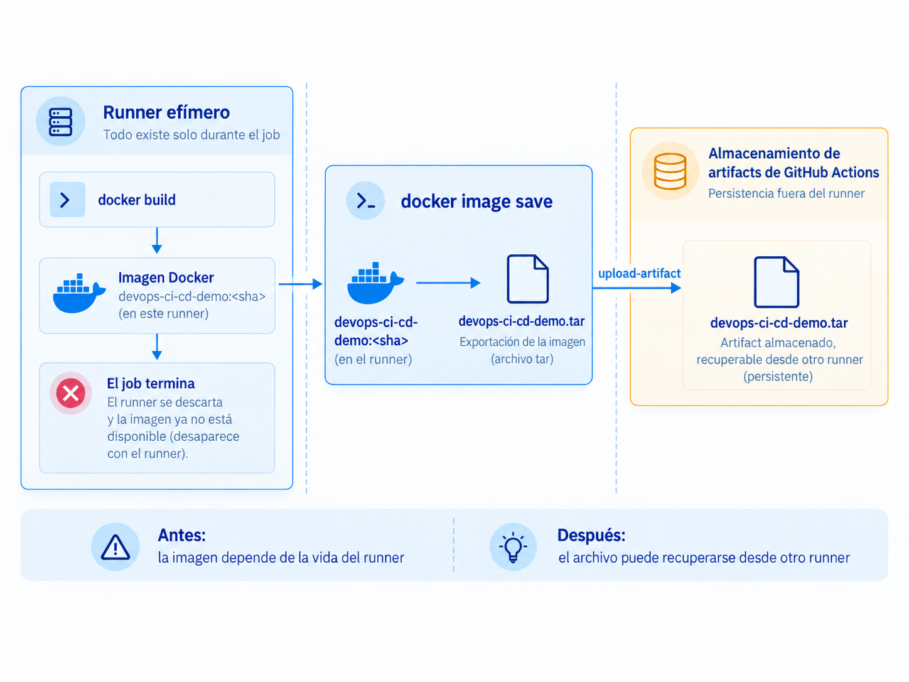
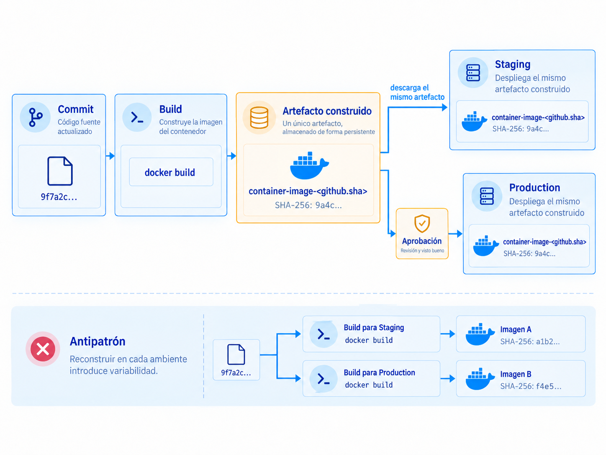
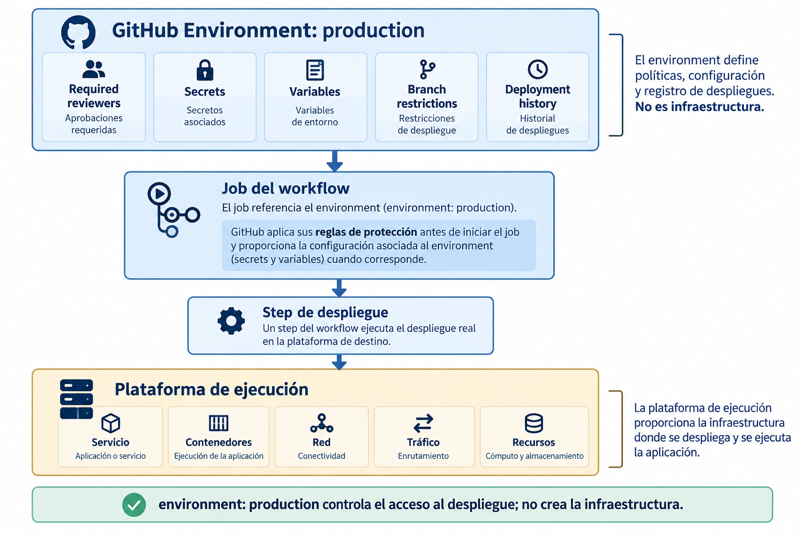
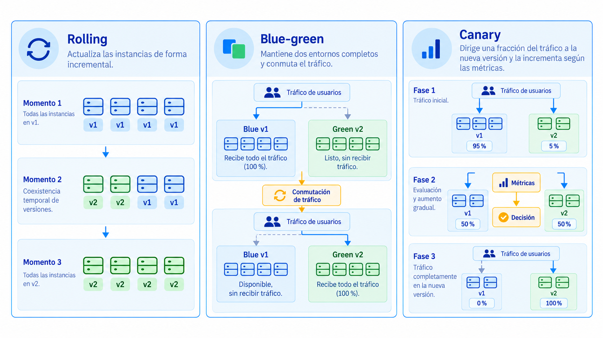
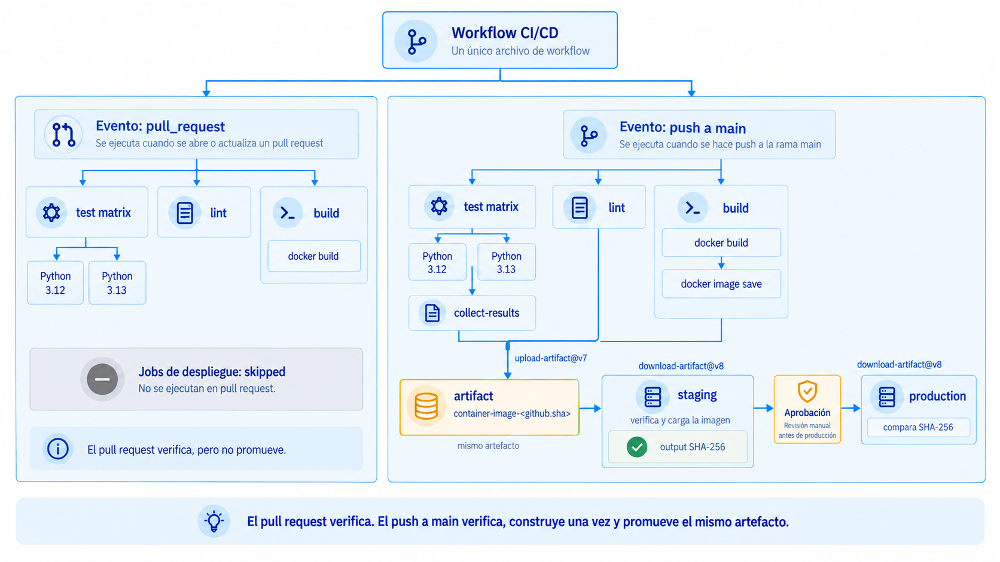
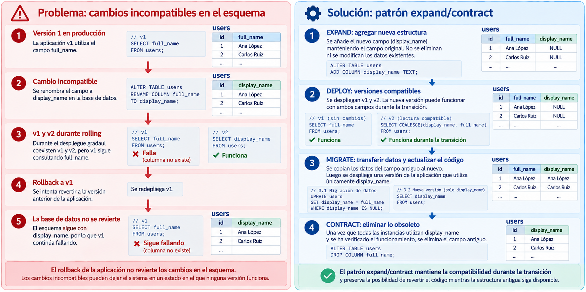

# S09. Entrega continua y estrategias de despliegue

Las sesiones anteriores construyeron progresivamente un pipeline de integración continua para `devops-ci-cd-demo`. En la clase 7 (Fundamentos de CI con GitHub Actions) se establecieron las verificaciones automáticas y el gate que impide integrar un cambio cuando los checks requeridos no finalizan satisfactoriamente. En la clase 8 (Ingeniería de pipelines de CI) el mismo pipeline se extendió con una matriz de pruebas, caché de dependencias, transferencia de artifacts entre jobs y dependencias explícitas mediante `needs`.

Al finalizar la clase 8 (Ingeniería de pipelines de CI), el workflow puede verificar el cambio con bastante más precisión, pero todavía existe una limitación importante: el job `build` construye una imagen Docker dentro de un runner efímero y, cuando el job termina, esa imagen desaparece junto con el runner. El pipeline sabe que la imagen **puede construirse**, pero todavía no conserva una unidad desplegable que pueda promoverse hacia un ambiente.

Esta sesión parte exactamente de ese punto. El problema ya no consiste únicamente en decidir si un cambio puede integrarse, sino en establecer qué se entrega, cómo se identifica, cómo avanza entre ambientes y cómo se sustituye una versión en ejecución sin convertir cada despliegue en un procedimiento manual distinto.

## 1. De integración continua a entrega continua

### 1.1 El límite del pipeline de la clase 8

El pipeline construido en la clase 8 (Ingeniería de pipelines de CI) puede representarse de forma simplificada así:

```text
pull_request / push a main
           │
           ├── test
           │    ├── Python 3.12
           │    └── Python 3.13
           │          │
           │          └── collect-results
           │
           ├── lint
           │
           └── build
                │
                └── docker build
```

Los jobs `test`, `lint` y `build` proporcionan evidencia distinta. `test` verifica comportamiento, `lint` aplica análisis estático y `build` comprueba que el `Dockerfile` puede producir una imagen.

El último punto requiere atención. El job construido en la clase 8 (Ingeniería de pipelines de CI) ejecuta:

```yaml
- name: Construir imagen
  run: docker build --tag devops-ci-cd-demo:${{ github.sha }} .
```

La imagen queda almacenada en el daemon de Docker del runner utilizado por ese job:

```text
runner de build
      │
      ├── devops-ci-cd-demo:<sha>
      │
      └── finaliza el job
                 │
                 ▼
          runner descartado
                 │
                 ▼
          imagen no disponible
          para jobs posteriores
```

El tag basado en `${{ github.sha }}` permite identificar qué commit produjo la imagen, pero identificar algo no equivale a conservarlo.

Por tanto, el pipeline de la clase 8 (Ingeniería de pipelines de CI) responde:

```text
¿este commit puede producir una imagen?
```

pero todavía no responde:

```text
¿dónde está la imagen exacta que se verificó
y que se desea promover posteriormente?
```

La entrega continua comienza a resolver esa segunda pregunta.

### 1.2 Entrega continua y despliegue continuo

**Integración continua** (*Continuous Integration, CI*) automatiza la integración frecuente de cambios y la obtención de evidencia sobre su calidad. Un cambio que no supera las verificaciones requeridas no debería avanzar a la rama protegida.

**Entrega continua** (*Continuous Delivery*) extiende ese proceso hasta mantener el software en un estado en el que pueda desplegarse de manera repetible y bajo demanda. El pipeline puede automatizar la construcción, la validación y la promoción entre ambientes, pero puede conservar una decisión explícita antes de producción.

**Despliegue continuo** (*Continuous Deployment*) lleva la automatización un paso más lejos: un cambio que supera satisfactoriamente todas las verificaciones definidas puede avanzar automáticamente hasta producción sin una aprobación humana obligatoria en ese punto.

La diferencia puede representarse así:

```text
Continuous Delivery

cambio
  ↓
CI
  ↓
artefacto
  ↓
staging
  ↓
gate de producción
  ↓
producción


Continuous Deployment

cambio
  ↓
CI
  ↓
artefacto
  ↓
staging
  ↓
producción automática
```

La presencia de una aprobación manual antes de producción no implica que el proceso deje de ser entrega continua. Lo esencial es que, una vez tomada la decisión de promover, el despliegue no dependa de reconstrucciones ad hoc ni de una secuencia manual recordada por una persona.

!!! note "Terminología"
    Entrega continua y despliegue continuo no son sinónimos. En esta sesión se construirá un flujo de **entrega continua**: staging avanzará automáticamente, mientras que producción quedará protegido por una aprobación.

### 1.3 Pipeline de entrega

Un pipeline de entrega agrega responsabilidades nuevas al pipeline de CI:

```text
cambio
  ↓
verificación
  ↓
construcción
  ↓
artefacto identificable
  ↓
promoción
  ↓
ambiente
  ↓
estrategia de despliegue
  ↓
observación
  ↓
promover, detener o revertir
```

Estas responsabilidades no deben confundirse.

Un test produce evidencia. Un gate decide si algo puede avanzar. Un artifact conserva un archivo. Un ambiente representa un destino y sus políticas. Una estrategia de despliegue determina cómo una versión sustituye a otra cuando existe infraestructura real que sirve tráfico.

Separar estas funciones permite razonar sobre el pipeline sin convertirlo en una secuencia de comandos difícil de modificar.

## 2. Artefactos de entrega

### 2.1 Workflow artifacts y artefactos desplegables

En la clase 8 (Ingeniería de pipelines de CI) ya se utilizaron workflow artifacts:

```text
test-results-3.12.xml
test-results-3.13.xml
```

Esos artifacts permiten conservar y transferir archivos entre jobs, pero no son el producto que se desea ejecutar en producción. Son evidencia generada por las pruebas.

En la clase 9 (Entrega continua y estrategias de despliegue) aparece un segundo concepto relacionado: el **artefacto desplegable**, es decir, la unidad construida que representa una versión concreta de la aplicación.

Para este proyecto:

```text
workflow artifact de pruebas
    → test-results-3.13.xml

artefacto desplegable
    → imagen Docker devops-ci-cd-demo:<sha>
```

GitHub Actions puede utilizar el mismo mecanismo de workflow artifacts para transportar ambos tipos de archivo durante una demostración. La diferencia es semántica: un reporte de pruebas proporciona evidencia; una imagen de contenedor representa una unidad que posteriormente puede ejecutarse.

En un sistema de producción, una imagen de contenedor se almacena normalmente en un **container registry**. En esta sesión se utilizará temporalmente un workflow artifact para concentrar la atención en la identidad y promoción del mismo archivo. La publicación en un registry se retoma cuando el curso incorpora infraestructura y servicios de nube.

### 2.2 Persistencia del resultado de `build`

El job `build` puede extenderse para exportar la imagen después de construirla.

Docker permite serializar una imagen mediante:

```bash
docker image save \
  --output devops-ci-cd-demo.tar \
  devops-ci-cd-demo:${{ github.sha }}
```

El archivo:

```text
devops-ci-cd-demo.tar
```

contiene la imagen y puede cargarse posteriormente con:

```bash
docker image load --input devops-ci-cd-demo.tar
```

Después de crear el archivo, el workflow puede publicarlo:

```yaml
- name: Publicar imagen construida
  uses: actions/upload-artifact@v7
  with:
    name: container-image-${{ github.sha }}
    path: devops-ci-cd-demo.tar
    retention-days: 7
```

La imagen deja entonces de depender del filesystem del runner que ejecutó `build`.



*Figura 1. `docker image save` exporta la imagen construida a un archivo que puede persistirse fuera del runner mediante un workflow artifact y recuperarse posteriormente desde otro runner.*

### 2.3 Identificación e inmutabilidad

Un artefacto desplegable debe poder asociarse con una versión concreta del código.

En este proyecto se utiliza:

```text
github.sha
```

como identificador:

```text
devops-ci-cd-demo:9f7a2c...
container-image-9f7a2c...
```

El identificador no debe reinterpretarse posteriormente. Si un tag o un nombre que aparentemente representa una versión puede modificarse para apuntar a contenido diferente, deja de proporcionar una garantía fuerte sobre qué se verificó y qué se desplegó.

Las versiones actuales de `actions/upload-artifact` crean artifacts que no se modifican incrementalmente después de su creación. En este ejemplo se combina esa propiedad con un nombre derivado del SHA del commit para mantener una asociación explícita entre código y artefacto.

!!! note "Inmutabilidad"
    Inmutable no significa que el archivo sea imposible de borrar. Significa que la unidad que se decide promover no debe reconstruirse ni alterarse silenciosamente mientras avanza entre ambientes.

### 2.4 Construir una vez y promover el mismo artefacto

La regla central puede expresarse como:

```text
build once, deploy many
```



*Figura 2. Un único build produce un artefacto identificable que se recupera en staging y producción. Reconstruir por ambiente produce unidades distintas y reintroduce variabilidad.*

Aunque A y B se construyan a partir del mismo commit, dos construcciones distintas introducen una nueva oportunidad para que algo cambie: una dependencia externa, una imagen base, una herramienta del entorno de construcción o cualquier otra entrada que no haya quedado completamente fijada.

La evidencia obtenida sobre A no demuestra necesariamente el comportamiento de B.

Por eso la promoción consiste en mover **el mismo artefacto**, no en reconstruir el mismo código en cada ambiente.

## 3. Ambientes y promoción

### 3.1 Ambientes de ejecución

Un **ambiente** es un contexto de ejecución con configuración, datos, dependencias externas y nivel de exposición propios.

En esta unidad se utilizarán principalmente:

```text
staging
producción
```

**Staging** permite observar una versión en condiciones más cercanas a las reales antes de exponerla a usuarios de producción.

**Producción** es el ambiente que atiende la carga real del sistema.

Staging no necesita ser una copia física exacta de producción para aportar valor, pero las diferencias relevantes deben conocerse. Cuanto más divergen ambos ambientes en aspectos que afectan al comportamiento de la aplicación, menos evidencia puede transferirse de uno al otro.

Ejemplos de diferencias relevantes incluyen:

```text
configuración de red
servicios externos
volumen y forma de los datos
límites de recursos
mecanismos de autenticación
variables de configuración
```

### 3.2 Promoción

**Promover** un artefacto significa autorizar que el mismo artefacto avance hacia un ambiente con mayor exposición.

La promoción no debe ejecutar de nuevo el proceso de construcción:

```text
build
  ↓
artifact A
  ↓
staging
  ↓
artifact A
  ↓
producción
```

Durante la promoción sí pueden existir verificaciones adicionales. Por ejemplo, después de desplegar en staging puede ejecutarse una prueba contra el servicio ya desplegado.

La diferencia es que esas verificaciones evalúan el artefacto existente; no producen uno nuevo.

### 3.3 Gates de integración y gates de despliegue

La clase 7 (Fundamentos de CI con GitHub Actions) introdujo un gate sobre la integración:

```text
pull request
     ↓
status checks
     ↓
gate
     ↓
merge a main
```

La clase 9 (Entrega continua y estrategias de despliegue) introduce otro punto de control:

```text
artefacto
     ↓
staging
     ↓
verificación
     ↓
gate de despliegue
     ↓
producción
```

Ambos mecanismos cumplen la misma función estructural: impedir que algo avance hasta que se satisfaga una política.

Lo que cambia es el objeto que está siendo controlado.

| Gate | Objeto que avanza | Pregunta |
| --- | --- | --- |
| Integración | cambio de código | ¿puede incorporarse a `main`? |
| Despliegue | artefacto construido | ¿puede avanzar a un ambiente con mayor exposición? |

Un test no es por sí mismo un gate. El test produce evidencia. El gate es el mecanismo que impide avanzar cuando la evidencia o la aprobación requerida no existe.

### 3.4 GitHub Environments

GitHub Actions permite asociar un job con un **GitHub Environment**:

```yaml
environment: production
```

Un environment puede incorporar reglas como:

```text
required reviewers
restricciones por rama
wait timers
secrets del ambiente
variables del ambiente
reglas de protección personalizadas
```

Cuando un job referencia un environment protegido, las reglas deben cumplirse antes de que el job pueda comenzar. Los secrets definidos para ese environment tampoco están disponibles antes de superar las reglas de protección.

Un environment de GitHub no crea servidores, contenedores ni redes.



*Figura 3. Un GitHub Environment concentra reglas de protección, configuración y registro del deployment. El despliegue real requiere un step que actúe sobre una plataforma de ejecución independiente.*

La plataforma de ejecución real se estudiará posteriormente. En esta sesión, `staging` y `production` en GitHub representan los **puntos de control** del proceso de promoción.

!!! warning "Environment no significa infraestructura"
    Declarar `environment: production` no despliega la aplicación. El job todavía necesita un step capaz de comunicarse con la plataforma real de ejecución. En la demostración de esta sesión ese paso se mantiene deliberadamente simulado.

## 4. Estrategias de despliegue

Promover un artefacto responde **qué versión** puede avanzar. Todavía queda una pregunta distinta: cuando ya existe una versión ejecutándose, ¿cómo se sustituye por la nueva?

La respuesta depende de la estrategia de despliegue.



*Figura 4. Rolling sustituye instancias gradualmente; blue-green prepara un entorno alterno y conmuta el tráfico; canary expone la versión nueva a una fracción del tráfico y utiliza observación y decisión para aumentar o detener la promoción.*

### 4.1 Rolling deployment

En un **rolling deployment**, la versión nueva sustituye gradualmente a la anterior.

Durante parte del proceso existen simultáneamente instancias de ambas versiones.

Esto reduce la necesidad de detener todas las instancias al mismo tiempo. Sin embargo, la disponibilidad depende de que la plataforma mantenga suficiente capacidad saludable mientras realiza la sustitución.

La coexistencia introduce una condición especialmente importante:

```text
v1 y v2 deben poder funcionar
correctamente durante la transición
```

Esto afecta:

- formato de solicitudes y respuestas;
- sesiones;
- mensajes intercambiados;
- estructura de datos persistentes;
- contratos con otros servicios.

Una versión que funciona perfectamente cuando se ejecuta sola puede fallar durante un rolling deployment si no es compatible con la versión que todavía permanece activa.

### 4.2 Blue-green deployment

En **blue-green** se mantienen dos entornos capaces de ejecutar la aplicación.

Después de verificar `Green`, el enrutamiento se modifica mediante una conmutación de tráfico.

La principal diferencia respecto de rolling es que no se reemplazan instancias una por una. Se prepara un entorno completo y después se conmuta el tráfico.

Esto puede permitir una reversión rápida del enrutamiento mientras el entorno anterior continúe disponible.

El costo es mayor capacidad temporal:

```text
blue  +  green
```

Además, disponer de dos grupos de instancias no duplica necesariamente el estado persistente. Si ambos entornos utilizan la misma base de datos, un cambio incompatible en el esquema puede impedir que el entorno anterior vuelva a funcionar aunque su código siga disponible.

También pueden existir transiciones relacionadas con conexiones en curso, sesiones o propagación del routing. Blue-green reduce el tiempo de cambio entre versiones, pero no debe interpretarse como una garantía automática de reversión de todos los efectos del despliegue.

### 4.3 Canary deployment

En **canary**, ambas versiones pueden recibir tráfico, pero la versión nueva comienza con una fracción reducida.

El valor de canary no proviene únicamente del reparto porcentual. La observación y el criterio de decisión forman parte del mecanismo.

Sin observabilidad y sin un criterio definido de promoción, la espera entre 5 %, 50 % y 100 % no proporciona evidencia suficiente para decidir.

Las señales pueden incluir, según el sistema:

```text
tasa de errores
latencia
saturación
resultados de negocio
errores específicos de la nueva versión
```

La interpretación de estas señales pertenece a temas posteriores de observabilidad. En esta sesión basta con reconocer que canary necesita una señal para tomar decisiones.

### 4.4 Comparación

| Propiedad | Rolling | Blue-green | Canary |
| --- | --- | --- | --- |
| Unidad de transición | instancias | entornos | fracción de tráfico |
| Coexistencia de versiones atendiendo tráfico | sí, durante el rollout | no como objetivo sostenido; se conmuta el tráfico | sí |
| Capacidad adicional | normalmente moderada | alta durante la transición | depende de la implementación |
| Ventaja principal | sustitución gradual sin duplicar todo el entorno | conmutación rápida entre entornos | limita inicialmente la exposición |
| Riesgo característico | incompatibilidad entre versiones coexistentes | costo y compatibilidad del estado compartido | señales insuficientes o no representativas |
| Reversión | detener/revertir rollout | conmutar hacia el entorno anterior, si sigue siendo compatible | retirar tráfico de la versión canary |
| Requisito especialmente importante | compatibilidad temporal | entorno alterno preparado | observabilidad y criterio de promoción |

No existe una estrategia universalmente superior. La elección depende de las propiedades del sistema, de la infraestructura disponible y del tipo de riesgo que se desea controlar.

## 5. Rollback y compatibilidad del estado

### 5.1 Revertir la aplicación

Un **rollback** consiste en volver a una versión anterior conocida como estable cuando la versión promovida produce un comportamiento no aceptable.

Si se conservan artefactos identificables:

```text
v1 → artifact A
v2 → artifact B
```

un rollback de v2 a v1 puede consistir en volver a desplegar A.

Esto es distinto de:

```text
volver al código fuente anterior
↓
reconstruir
↓
desplegar una construcción nueva
```

La segunda opción produce otro artefacto y reintroduce variabilidad.

### 5.2 Código y estado no se revierten de la misma forma

Revertir el binario o la imagen no revierte automáticamente todos los efectos producidos mientras la versión nueva estuvo activa.

Por ejemplo:

```text
aplicación v2
   │
   ├── modifica filas
   ├── emite mensajes
   ├── llama servicios externos
   └── aplica una migración
```

Volver a ejecutar v1 no deshace automáticamente ninguna de esas operaciones.

Por eso:

```text
rollback de aplicación
≠
deshacer todos los efectos del despliegue
```

El problema es especialmente visible en una base de datos compartida.

### 5.3 Migraciones compatibles

Supóngase que v1 utiliza:

```text
customers.full_name
```

y v2 requiere:

```text
customers.display_name
```

Una migración que simplemente renombra la columna antes de completar un rolling deployment produce este estado:

```text
base de datos
└── display_name

v2 → funciona
v1 → busca full_name → falla
```

El problema no es que rolling sea incorrecto. El problema es introducir un cambio de estado incompatible mientras dos versiones deben coexistir.

Una estrategia más segura separa la evolución del esquema.

#### Expansión

Primero se agrega una estructura compatible sin retirar la anterior:

```text
full_name
display_name
```

El sistema mantiene compatibilidad con v1 y v2.

#### Migración de uso

La nueva versión comienza a utilizar la nueva estructura. Si hace falta, puede escribirse temporalmente en ambas representaciones o migrarse el contenido existente de forma controlada.

#### Contracción

Cuando ninguna instancia ni proceso necesita la estructura antigua, esta puede eliminarse en un cambio posterior.

```text
expand
   ↓
desplegar código compatible
   ↓
migrar uso/datos
   ↓
contract
```

Este patrón suele denominarse **expand/contract**. Su propósito no es hacer que todas las migraciones sean triviales, sino evitar que el cambio de esquema obligue a actualizar simultáneamente todas las versiones consumidoras.

La Figura 5, desarrollada en el caso técnico de la sección 9, representa tanto el fallo provocado por una migración incompatible como la secuencia `expand → deploy → migrate → contract`.

## 6. Despliegue y liberación

### 6.1 Desplegar no equivale a liberar

Desplegar una versión significa colocar el código en un ambiente donde puede ejecutarse.

Liberar una funcionalidad (*release*) significa permitir que esa funcionalidad sea utilizada por las personas o sistemas a los que está destinada.

Ambas decisiones pueden coincidir:

```text
deploy
  ↓
feature disponible inmediatamente
```

pero no tienen que hacerlo.

Separarlas permite desplegar código antes de habilitar su comportamiento visible.

### 6.2 Feature flags

Un **feature flag** es una condición evaluada por la aplicación que controla si una funcionalidad está habilitada.

```python
if feature_flags["new_checkout"]:
    return new_checkout()
return current_checkout()
```

El código de ambas rutas puede estar desplegado, pero solo una queda activa.

Esto permite:

```text
deploy de v2
    ↓
función nueva desactivada
    ↓
verificación
    ↓
activar flag
```

o una liberación gradual:

```text
5 % de usuarios
      ↓
25 %
      ↓
100 %
```

Un feature flag no sustituye rolling, blue-green ni canary. Opera en otra capa.

```text
estrategia de despliegue
→ controla qué versión de la aplicación ejecuta la infraestructura

feature flag
→ controla qué comportamiento ejecuta la aplicación
```

Tampoco debe confundirse una liberación gradual mediante flags con un canary de infraestructura. Pueden combinarse, pero resuelven problemas distintos.

## 7. Extensión del pipeline de la clase 8

La implementación de esta sesión conserva los jobs construidos en la clase 8 (Ingeniería de pipelines de CI) y agrega el mecanismo mínimo necesario para demostrar promoción.

La plataforma de ejecución real todavía no se introduce. Por esa razón, los jobs finales **simulan el último paso del despliegue**, pero realizan de forma real las operaciones que interesan en esta sesión:

1. construir una sola imagen;
2. persistirla;
3. recuperar exactamente el mismo archivo en runners posteriores;
4. asociar esos jobs con environments distintos;
5. bloquear producción mediante una aprobación.

### 7.1 Dos caminos dentro del mismo workflow

El workflow sigue escuchando dos eventos:

```yaml
on:
  push:
    branches: [main]
  pull_request:
    branches: [main]
```

Pero el significado de ambos eventos es distinto.

En un pull request se desea verificar:

```text
pull_request
     ↓
test + lint + build
     ↓
gate de integración
```

No se desea promover el código todavía.

Después del merge, GitHub genera un `push` sobre `main`. Ese evento sí puede iniciar el camino de entrega:

```text
push a main
     ↓
test + lint + build
     ↓
artefacto
     ↓
staging
     ↓
producción
```

Por tanto, los jobs de promoción declaran:

```yaml
if: github.event_name == 'push' && github.ref == 'refs/heads/main'
```

Esto evita que un pull request todavía no integrado intente avanzar hacia staging o producción.

### 7.2 Modificación del job `build`

En la clase 8 (Ingeniería de pipelines de CI) el job termina después de `docker build`. En la clase 9 (Entrega continua y estrategias de despliegue) se extiende únicamente para ejecuciones originadas por un `push` a `main`.

```yaml
build:
  name: Build
  runs-on: ubuntu-latest

  steps:
    - name: Descargar el código
      uses: actions/checkout@v7

    - name: Construir imagen
      run: docker build --tag devops-ci-cd-demo:${{ github.sha }} .

    - name: Exportar imagen
      if: github.event_name == 'push' && github.ref == 'refs/heads/main'
      run: |
        docker image save \
          --output devops-ci-cd-demo.tar \
          devops-ci-cd-demo:${{ github.sha }}

    - name: Publicar imagen
      if: github.event_name == 'push' && github.ref == 'refs/heads/main'
      uses: actions/upload-artifact@v7
      with:
        name: container-image-${{ github.sha }}
        path: devops-ci-cd-demo.tar
        retention-days: 7
```

El `docker build` continúa ejecutándose también en pull requests porque sigue siendo una verificación de CI.

La exportación y publicación se reservan para `main`, donde aparece una versión integrada que se desea promover.

### 7.3 Promoción a staging

El job de staging espera a que terminen:

```text
collect-results
lint
build
```

`collect-results` ya depende de `test`. Por transitividad, si una instancia de la matriz `test` falla, `collect-results` no completa satisfactoriamente y la promoción no comienza.

El job puede definirse así:

```yaml
promote_staging:
  name: Promover a staging
  if: github.event_name == 'push' && github.ref == 'refs/heads/main'
  needs: [collect-results, lint, build]
  runs-on: ubuntu-latest
  environment: staging

  outputs:
    image-sha256: ${{ steps.identity.outputs.sha256 }}

  steps:
    - name: Descargar imagen construida
      uses: actions/download-artifact@v8
      with:
        name: container-image-${{ github.sha }}
        path: release

    - name: Calcular identidad del archivo
      id: identity
      run: |
        SHA256=$(sha256sum release/devops-ci-cd-demo.tar | awk '{print $1}')
        echo "sha256=$SHA256" >> "$GITHUB_OUTPUT"
        echo "SHA-256 del artefacto: $SHA256"

    - name: Cargar imagen
      run: docker image load --input release/devops-ci-cd-demo.tar

    - name: Verificar imagen
      run: docker image inspect devops-ci-cd-demo:${{ github.sha }} > /dev/null

    - name: Simular promoción
      run: |
        echo "El artefacto está preparado para desplegarse en staging."
        echo "La infraestructura real se incorpora en una sesión posterior."
```

Este job recupera un artifact construido en otro runner. El uso de:

```yaml
environment: staging
```

registra el job en ese environment, pero el `echo` final deja explícito que todavía no existe una plataforma externa de staging.

El step `identity` recupera además un mecanismo estudiado en la clase 8 (Ingeniería de pipelines de CI): los **outputs**. El SHA-256 calculado se expone como output del job y puede ser utilizado por producción.

### 7.4 Gate y promoción a producción

Producción depende de staging:

```yaml
needs: promote_staging
```

y referencia un environment protegido:

```yaml
environment: production
```

```yaml
promote_production:
  name: Promover a producción
  if: github.event_name == 'push' && github.ref == 'refs/heads/main'
  needs: promote_staging
  runs-on: ubuntu-latest
  environment: production

  steps:
    - name: Descargar la misma imagen
      uses: actions/download-artifact@v8
      with:
        name: container-image-${{ github.sha }}
        path: release

    - name: Verificar identidad del archivo
      env:
        STAGING_SHA256: ${{ needs.promote_staging.outputs.image-sha256 }}
      run: |
        PRODUCTION_SHA256=$(sha256sum release/devops-ci-cd-demo.tar | awk '{print $1}')

        echo "SHA-256 observado en staging:    $STAGING_SHA256"
        echo "SHA-256 observado en producción: $PRODUCTION_SHA256"

        test "$PRODUCTION_SHA256" = "$STAGING_SHA256"

    - name: Cargar imagen
      run: docker image load --input release/devops-ci-cd-demo.tar

    - name: Verificar imagen
      run: docker image inspect devops-ci-cd-demo:${{ github.sha }} > /dev/null

    - name: Simular promoción
      run: |
        echo "El mismo artefacto está preparado para desplegarse en producción."
        echo "La infraestructura real se incorpora en una sesión posterior."
```

La comparación mediante `sha256sum` no reemplaza las validaciones que realiza GitHub al descargar un artifact. Su propósito didáctico es hacer visible que ambos jobs recibieron exactamente el mismo archivo `devops-ci-cd-demo.tar`.

El flujo queda:

```text
test matrix
     │
     ▼
collect-results ───┐
                   │
lint ───────────────┼──> promote_staging
                   │          │
build ──────────────┘          │
                               │ output SHA-256
                               ▼
                        gate production
                               │
                               ▼
                      promote_production
```

`build` produce el artefacto una sola vez. Staging y producción lo descargan, pero ninguno vuelve a ejecutar `docker build`.

### 7.5 Workflow resultante

El workflow completo conserva los mecanismos de la clase 8 (Ingeniería de pipelines de CI) y agrega el camino de promoción:

```yaml
name: CI

on:
  push:
    branches: [main]
  pull_request:
    branches: [main]

permissions:
  contents: read

jobs:
  test:
    name: Tests - Python ${{ matrix.python-version }}
    runs-on: ubuntu-latest

    strategy:
      fail-fast: false
      matrix:
        python-version: ["3.12", "3.13"]

    steps:
      - name: Descargar el código
        uses: actions/checkout@v7

      - name: Configurar Python
        uses: actions/setup-python@v7
        with:
          python-version: ${{ matrix.python-version }}

      - name: Restaurar caché de pip
        uses: actions/cache@v6
        with:
          path: ~/.cache/pip
          key: pip-${{ runner.os }}-${{ matrix.python-version }}-${{ hashFiles('requirements.txt', 'requirements-dev.txt') }}

      - name: Instalar dependencias
        run: python -m pip install -r requirements-dev.txt

      - name: Ejecutar pruebas
        run: python -m pytest --junitxml=test-results-${{ matrix.python-version }}.xml

      - name: Publicar resultados
        uses: actions/upload-artifact@v7
        with:
          name: test-results-${{ matrix.python-version }}
          path: test-results-${{ matrix.python-version }}.xml
          retention-days: 7

  collect-results:
    name: Recopilar resultados
    needs: test
    runs-on: ubuntu-latest

    steps:
      - name: Descargar reportes
        uses: actions/download-artifact@v8
        with:
          pattern: test-results-*
          path: test-results
          merge-multiple: true

      - name: Mostrar archivos recuperados
        run: find test-results -maxdepth 1 -type f -print

  lint:
    name: Lint
    runs-on: ubuntu-latest

    steps:
      - name: Descargar el código
        uses: actions/checkout@v7

      - name: Configurar Python
        uses: actions/setup-python@v7
        with:
          python-version: "3.13"

      - name: Instalar dependencias
        run: python -m pip install -r requirements-dev.txt

      - name: Ejecutar lint
        run: flake8 app tests

  build:
    name: Build
    runs-on: ubuntu-latest

    steps:
      - name: Descargar el código
        uses: actions/checkout@v7

      - name: Construir imagen
        run: docker build --tag devops-ci-cd-demo:${{ github.sha }} .

      - name: Exportar imagen
        if: github.event_name == 'push' && github.ref == 'refs/heads/main'
        run: |
          docker image save \
            --output devops-ci-cd-demo.tar \
            devops-ci-cd-demo:${{ github.sha }}

      - name: Publicar imagen
        if: github.event_name == 'push' && github.ref == 'refs/heads/main'
        uses: actions/upload-artifact@v7
        with:
          name: container-image-${{ github.sha }}
          path: devops-ci-cd-demo.tar
          retention-days: 7

  promote_staging:
    name: Promover a staging
    if: github.event_name == 'push' && github.ref == 'refs/heads/main'
    needs: [collect-results, lint, build]
    runs-on: ubuntu-latest
    environment: staging

    outputs:
      image-sha256: ${{ steps.identity.outputs.sha256 }}

    steps:
      - name: Descargar imagen construida
        uses: actions/download-artifact@v8
        with:
          name: container-image-${{ github.sha }}
          path: release

      - name: Calcular identidad del archivo
        id: identity
        run: |
          SHA256=$(sha256sum release/devops-ci-cd-demo.tar | awk '{print $1}')
          echo "sha256=$SHA256" >> "$GITHUB_OUTPUT"
          echo "SHA-256 del artefacto: $SHA256"

      - name: Cargar imagen
        run: docker image load --input release/devops-ci-cd-demo.tar

      - name: Verificar imagen
        run: docker image inspect devops-ci-cd-demo:${{ github.sha }} > /dev/null

      - name: Simular promoción
        run: |
          echo "El artefacto está preparado para desplegarse en staging."
          echo "La infraestructura real se incorpora en una sesión posterior."

  promote_production:
    name: Promover a producción
    if: github.event_name == 'push' && github.ref == 'refs/heads/main'
    needs: promote_staging
    runs-on: ubuntu-latest
    environment: production

    steps:
      - name: Descargar la misma imagen
        uses: actions/download-artifact@v8
        with:
          name: container-image-${{ github.sha }}
          path: release

      - name: Verificar identidad del archivo
        env:
          STAGING_SHA256: ${{ needs.promote_staging.outputs.image-sha256 }}
        run: |
          PRODUCTION_SHA256=$(sha256sum release/devops-ci-cd-demo.tar | awk '{print $1}')

          echo "SHA-256 observado en staging:    $STAGING_SHA256"
          echo "SHA-256 observado en producción: $PRODUCTION_SHA256"

          test "$PRODUCTION_SHA256" = "$STAGING_SHA256"

      - name: Cargar imagen
        run: docker image load --input release/devops-ci-cd-demo.tar

      - name: Verificar imagen
        run: docker image inspect devops-ci-cd-demo:${{ github.sha }} > /dev/null

      - name: Simular promoción
        run: |
          echo "El mismo artefacto está preparado para desplegarse en producción."
          echo "La infraestructura real se incorpora en una sesión posterior."
```




*Figura 6. El mismo workflow sigue dos caminos condicionados por el evento: un pull request verifica sin promover, mientras que un push a `main` verifica, construye una vez, persiste el artefacto y lo promueve a través de staging y del gate de producción.*


## 8. Ejecución y observación del pipeline

### 8.1 Preparación de los environments

Antes de ejecutar el workflow deben existir dos GitHub Environments:

```text
staging
production
```

`staging` puede quedar sin aprobación manual.

`production` debe configurarse con un **required reviewer**.

En un repositorio público, GitHub permite utilizar environments y reglas de protección en los planes actuales. La disponibilidad concreta de algunas reglas depende del plan y de la visibilidad del repositorio.

Para una demostración realizada con una sola cuenta, no debe activarse **Prevent self-review**, porque la misma cuenta que provoca la ejecución necesitará aprobarla. En una configuración de producción resulta preferible que quien inicia el cambio no pueda aprobar su propio despliegue.

### 8.2 Preparación de la rama

La modificación del workflow debe desarrollarse en una rama:

```bash
git switch main
git pull --ff-only origin main
git switch -c s09/continuous-delivery
```

Después de editar:

```bash
git diff -- .github/workflows/ci.yml
```

La revisión debe localizar principalmente:

```text
docker image save
upload-artifact
if: push a main
environment: staging
environment: production
output SHA-256
needs
```

### 8.3 Verificación mediante pull request

Publicar la rama:

```bash
git add .github/workflows/ci.yml
git commit -m "Extiende pipeline con promoción entre ambientes"
git push -u origin s09/continuous-delivery
```

Crear un pull request hacia `main`.

En esa ejecución se espera:

```text
Tests - Python 3.12     → se ejecuta
Tests - Python 3.13     → se ejecuta
Recopilar resultados    → se ejecuta
Lint                     → se ejecuta
Build                    → se ejecuta
Promover a staging       → skipped
Promover a producción    → skipped
```

Esta observación es deliberada.

El pipeline comprueba que la propuesta puede integrarse, pero no convierte una rama todavía no integrada en una candidata a promoción.

### 8.4 Integración y creación del artefacto

Después de que el pull request supere el gate configurado en la clase 7 (Fundamentos de CI con GitHub Actions), se integra a `main`.

El merge provoca un nuevo evento:

```text
push a main
```

En esa ejecución `build` realiza tres operaciones diferentes:

```text
docker build
     ↓
docker image save
     ↓
upload-artifact
```

Debe aparecer un artifact similar a:

```text
container-image-<github.sha>
```

El nombre permite relacionarlo con el commit integrado.

### 8.5 Promoción a staging

Después de finalizar satisfactoriamente:

```text
collect-results
lint
build
```

se ejecuta:

```text
Promover a staging
```

Debe observarse que el job:

1. descarga el artifact;
2. calcula el SHA-256 del archivo;
3. carga la imagen mediante `docker image load`;
4. verifica que existe el tag correspondiente a `${{ github.sha }}`;
5. expone el SHA-256 como output.

El runner de staging no construyó la imagen.

```text
NO ejecutó docker build
```

La recuperó desde el artifact producido por `build`.

### 8.6 Gate de producción

Cuando staging termina, `Promover a producción` referencia:

```yaml
environment: production
```

Si el environment tiene un required reviewer, el job queda pendiente antes de iniciar sus steps.

Esto permite distinguir:

```text
job creado
≠
job autorizado a comenzar
```

Después de aprobarlo desde la interfaz, el job comienza.

Los secrets de un environment protegido, si existieran, solo serían accesibles después de superar sus reglas de protección.

### 8.7 Verificación de la identidad

Producción vuelve a descargar:

```text
container-image-${{ github.sha }}
```

y calcula el SHA-256 del archivo.

El valor se compara con el output producido por staging:

```bash
test "$PRODUCTION_SHA256" = "$STAGING_SHA256"
```

Una ejecución satisfactoria proporciona una evidencia visible:

```text
staging SHA-256    == producción SHA-256
```

Esto representa de manera concreta el principio:

```text
build once
promote the same artifact
```

GitHub Actions también valida automáticamente el digest de los artifacts cuando se utilizan las acciones de upload y download. La comparación explícita del archivo se mantiene aquí porque hace observable el principio de identidad dentro del ejemplo.

### 8.8 Historial de deployment

Los jobs que referencian:

```yaml
environment: staging
```

y:

```yaml
environment: production
```

crean información de deployment asociada con esos environments.

El historial permite observar qué ejecuciones se relacionaron con cada ambiente, pero **no debe utilizarse por sí solo como prueba de que dos ambientes recibieron bytes idénticos**. Para esta demostración, esa propiedad se comprueba mediante el SHA-256 del archivo descargado.

## 9. Compatibilidad durante el despliegue

### 9.1 Coexistencia de versiones

Una estrategia puede modificar el riesgo de la transición, pero no elimina la necesidad de compatibilidad.

En rolling:

```text
v1 + v2 sirven tráfico simultáneamente
```

En canary:

```text
v1 + v2 sirven fracciones de tráfico
```

En blue-green:

```text
dos entornos existen en paralelo
y comparten con frecuencia ciertos recursos externos
```

Los problemas de compatibilidad pueden aparecer en:

```text
base de datos
colas
eventos
APIs internas
sesiones
caches
archivos compartidos
```

Una decisión de despliegue debe considerar esos contratos, no únicamente el número de instancias.




*Figura 5. Un cambio de esquema incompatible puede romper las instancias antiguas y hacer insuficiente un rollback del código. Expand/contract conserva temporalmente la estructura anterior, migra datos y código de forma compatible y elimina lo obsoleto únicamente al final.*


### 9.2 Caso técnico: migración incompatible

Supóngase un sistema desplegado mediante rolling.

La versión v1 utiliza:

```sql
SELECT full_name FROM customers;
```

La versión v2 utiliza:

```sql
SELECT display_name FROM customers;
```

El equipo despliega v2 y, como parte del mismo cambio, ejecuta:

```sql
ALTER TABLE customers
RENAME COLUMN full_name TO display_name;
```

Durante el rollout:

```text
[v2] [v1] [v1] [v1]
```

las instancias v1 intentan consultar `full_name`, que ya no existe.

El problema aparece aunque:

```text
v1 funcionaba correctamente antes
v2 funciona correctamente después
```

porque el estado intermedio es incompatible.

### 9.3 Por qué un rollback simple tampoco funciona

Ante las fallas, el equipo revierte todas las instancias a v1:

```text
[v1] [v1] [v1] [v1]
```

pero la base de datos conserva:

```text
display_name
```

El código anterior sigue esperando:

```text
full_name
```

y ahora todas las instancias fallan.

La secuencia demuestra que:

```text
revertir código
no revierte automáticamente
la evolución del estado
```

### 9.4 Secuencia compatible

Una evolución más segura separa el cambio.

**Despliegue 1: expandir**

```sql
ALTER TABLE customers
ADD COLUMN display_name TEXT;
```

La aplicación existente continúa utilizando `full_name`.

**Despliegue 2: código compatible**

La nueva versión puede leer `display_name`, manteniendo durante la transición una estrategia que permita convivir con datos todavía disponibles en `full_name`.

**Migración de datos**

Se completa el contenido de la nueva columna y se comprueba que las rutas activas ya no dependen de la antigua.

**Despliegue posterior: contraer**

Solo cuando ninguna versión activa necesita `full_name` se elimina la columna.

La seguridad proviene de evitar un punto en el que una versión todavía activa dependa de una estructura que ya fue eliminada.

## 10. Límites y compromisos

La entrega continua no elimina el riesgo de desplegar. Cambia la forma de administrarlo.

### Artefactos

Conservar el mismo artefacto reduce la incertidumbre entre ambientes, pero no demuestra por sí solo que la configuración de staging y producción sea equivalente.

### Staging

Staging aporta evidencia cuando reproduce las características relevantes de producción. Una diferencia importante puede ocultar un problema que aparecerá únicamente después de promover.

### Aprobaciones manuales

Un required reviewer puede impedir que un despliegue avance accidentalmente, pero también agrega tiempo de espera.

Una aprobación sin información útil disponible para quien revisa puede convertirse en un trámite.

La pregunta no debería ser:

```text
¿hay una aprobación?
```

sino:

```text
¿qué evidencia permite a la persona
tomar una decisión informada?
```

### Rolling

Reduce la necesidad de una interrupción total, pero exige compatibilidad mientras conviven versiones y suficiente capacidad saludable durante el rollout.

### Blue-green

Facilita la conmutación entre dos entornos, pero requiere capacidad adicional y no resuelve automáticamente la compatibilidad con bases de datos u otros recursos compartidos.

### Canary

Limita inicialmente la exposición, pero su utilidad depende de disponer de tráfico suficiente, señales observables y criterios de promoción previamente definidos.

### Rollback

Un rollback puede restaurar rápidamente el artefacto anterior, pero no revierte automáticamente efectos persistentes o externos.

### Feature flags

Permiten separar deployment y release, pero introducen estados adicionales dentro de la aplicación. Los flags temporales que nunca se retiran pueden convertirse en deuda técnica.

### Workflow artifacts como mecanismo de entrega

El uso de `docker image save` y workflow artifacts es deliberadamente didáctico.

Para una imagen de contenedor destinada a entornos reales resulta más apropiado utilizar un container registry, que ofrece mecanismos específicos para distribución, versionado y recuperación de imágenes. La sesión posterior sobre infraestructura permite introducir esa transición sin adelantar autenticación y permisos de nube en la clase 9 (Entrega continua y estrategias de despliegue).

## 11. Actividades de análisis

1. El pipeline ejecuta `docker build` de forma independiente en staging y producción a partir del mismo commit. Explicar por qué el hecho de utilizar el mismo SHA de Git no garantiza que ambas construcciones sean necesariamente el mismo artefacto y proponer una estructura alternativa.

2. El workflow escucha `pull_request` y `push` hacia `main`. Se agregan jobs de producción sin ninguna condición adicional. Analizar qué ejecuciones podrían intentar alcanzar producción y proponer una condición que preserve la verificación de pull requests sin promover código todavía no integrado.

3. Un equipo exige aprobación manual antes de staging y nuevamente antes de producción. Identificar qué riesgo pretende controlar cada aprobación y determinar bajo qué condiciones la primera produciría evidencia adicional frente a limitarse a aumentar el tiempo de entrega.

4. Una aplicación utiliza rolling deployment. La versión nueva agrega un campo obligatorio a los mensajes publicados en una cola, pero durante varios minutos continúan existiendo consumidores de la versión anterior. Analizar qué tipo de incompatibilidad puede aparecer y qué propiedad debería tener el cambio para permitir la coexistencia.

5. Un sistema utiliza blue-green, pero `Blue` y `Green` comparten la misma base de datos. Explicar por qué conservar el entorno anterior no garantiza por sí solo que el rollback sea seguro.

6. Un equipo propone un canary de 1 % durante cinco minutos antes de promover automáticamente al 100 %. El sistema recibe aproximadamente veinte solicitudes por hora. Analizar si esa estrategia proporciona evidencia suficiente y qué información adicional sería necesaria para definir un criterio de promoción.

7. Staging y producción descargan un artifact con el mismo nombre. Explicar por qué el nombre constituye una identificación útil pero no una demostración suficiente de identidad de contenido. Proponer una forma de comprobar esa identidad.

8. Una funcionalidad se despliega desactivada mediante un feature flag y se activa una semana después. Identificar qué decisión ocurrió durante el deployment y cuál durante el release. Explicar por qué esta separación puede reducir el acoplamiento entre ambas decisiones.

9. En el caso de la migración de `full_name` a `display_name`, proponer una secuencia expand/contract que permita tanto rolling deployment como rollback de la aplicación mientras exista la versión anterior.

10. Un equipo desea eliminar la aprobación manual de producción y adoptar continuous deployment. Enumerar qué evidencia y controles deberían fortalecerse antes de que esa modificación represente una reducción deliberada del tiempo de entrega y no simplemente la eliminación de una barrera.

## 12. Referencias

- Humble, J. y Farley, D. *Continuous Delivery: Reliable Software Releases through Build, Test, and Deployment Automation*. Addison-Wesley.
- Kim, G., Humble, J., Debois, P. y Willis, J. *The DevOps Handbook*, 2.ª edición. IT Revolution Press.
- Forsgren, N., Humble, J. y Kim, G. *Accelerate*. IT Revolution Press.
- GitHub Docs. *Deployments and environments*. https://docs.github.com/en/actions/reference/workflows-and-actions/deployments-and-environments
- GitHub Docs. *Deploying with GitHub Actions*. https://docs.github.com/en/actions/how-tos/deploy/configure-and-manage-deployments/control-deployments
- GitHub Docs. *Managing environments for deployment*. https://docs.github.com/en/actions/how-tos/deploy/configure-and-manage-deployments/manage-environments
- GitHub Docs. *Reviewing deployments*. https://docs.github.com/en/actions/how-tos/deploy/configure-and-manage-deployments/review-deployments
- GitHub Docs. *Store and share data with workflow artifacts*. https://docs.github.com/en/actions/tutorials/store-and-share-data
- GitHub. `actions/upload-artifact`. https://github.com/actions/upload-artifact
- GitHub. `actions/download-artifact`. https://github.com/actions/download-artifact
- Docker Docs. *docker image save*. https://docs.docker.com/reference/cli/docker/image/save/
- Docker Docs. *docker image load*. https://docs.docker.com/reference/cli/docker/image/load/
- Fowler, M. *BlueGreenDeployment*. https://martinfowler.com/bliki/BlueGreenDeployment.html
