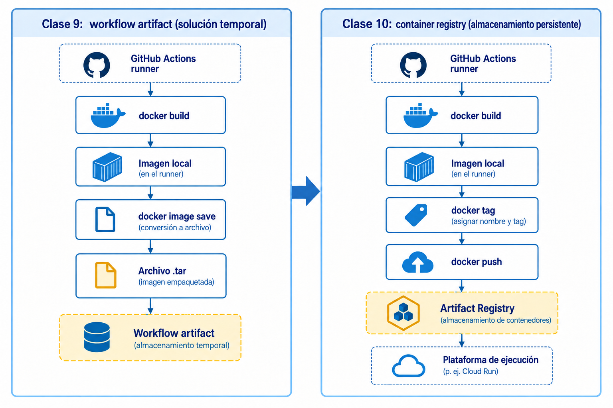
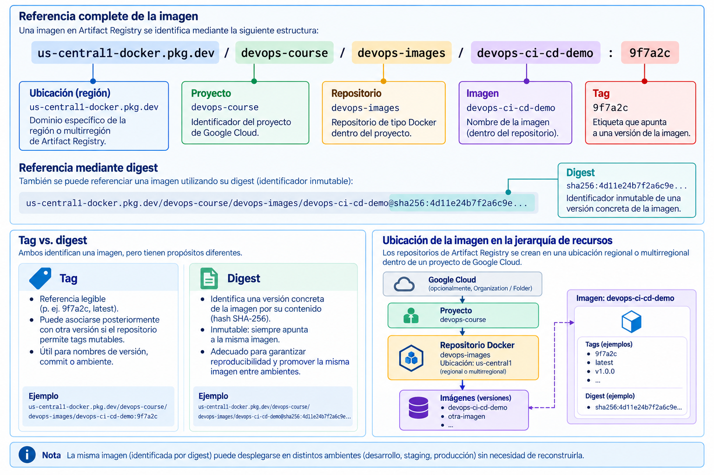
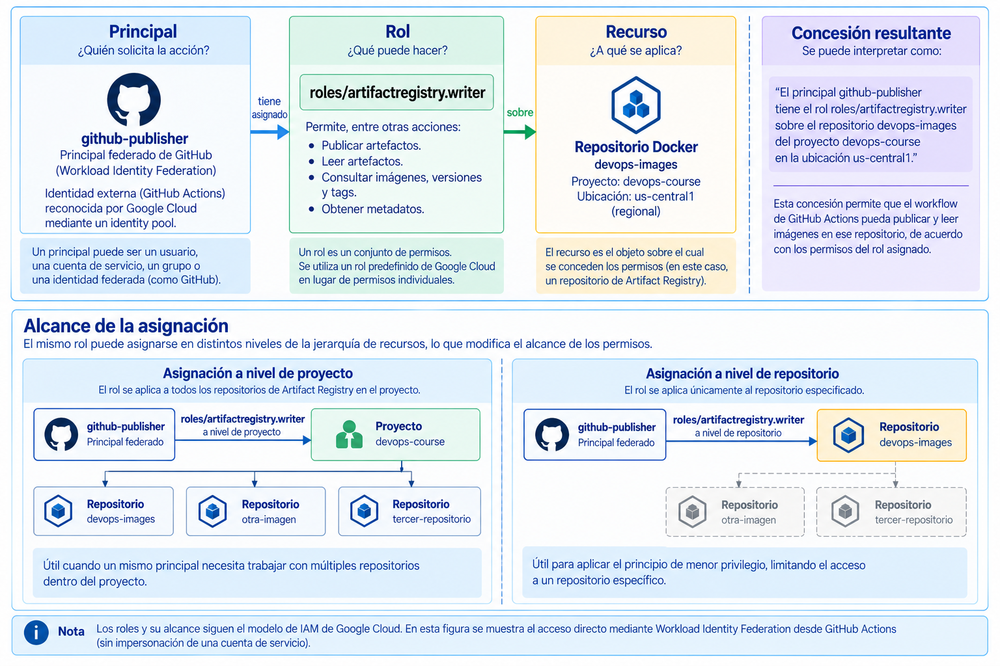
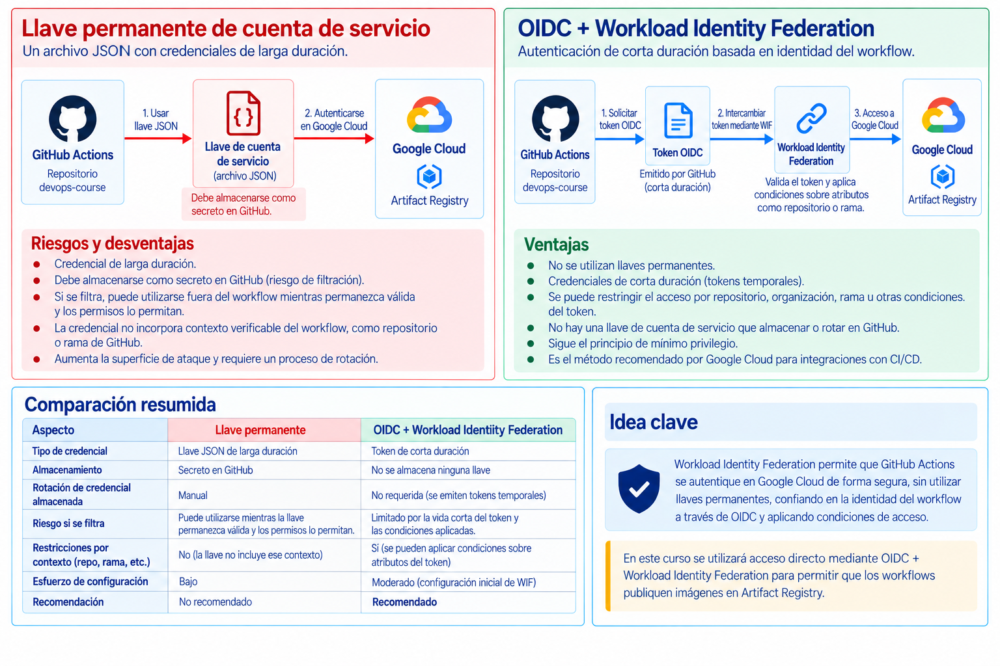

# Clase 10. Infraestructura y servicios en la nube para DevOps

En la clase 9 (Entrega continua y estrategias de despliegue) el pipeline quedó en condiciones de construir una imagen una sola vez, conservarla fuera del runner y promover el mismo artefacto entre ambientes. El despliegue todavía termina en una simulación. Los GitHub Environments permiten aplicar controles sobre el avance hacia `staging` y `production`, pero no proporcionan por sí mismos un lugar donde almacenar ni ejecutar la aplicación.

Para continuar el recorrido se necesitan recursos fuera de GitHub Actions. La imagen debe quedar disponible en un registro de contenedores; el pipeline necesita una identidad que Google Cloud pueda reconocer; y esa identidad debe recibir únicamente los permisos necesarios para operar sobre los recursos correspondientes.

Esta sesión estudia esas piezas antes de introducir una plataforma de ejecución. Google Cloud se utilizará como implementación concreta, pero los principios son transferibles a otros proveedores.

## 1. Del pipeline a la infraestructura de nube

Hasta este punto, el pipeline podía conservar la imagen fuera del runner mediante `docker image save` y un workflow artifact. Para continuar hacia una plataforma real de ejecución, ese mecanismo didáctico se sustituye por un servicio especializado en almacenar y distribuir imágenes de contenedor.



*Figura 1. Transición desde el almacenamiento temporal mediante workflow artifacts hacia un container registry.*

El workflow artifact fue útil para demostrar dos propiedades: el resultado de `build` podía sobrevivir al runner que lo produjo y staging y producción podían recuperar exactamente el mismo archivo. Sin embargo, una plataforma real de contenedores normalmente obtiene las imágenes desde un **container registry**.

La regla estudiada en la clase anterior se mantiene: la imagen se construye una vez y las etapas posteriores consumen esa misma versión. El cambio está en la forma de almacenarla y distribuirla.

### 1.1 Recursos y servicios

Una plataforma de nube expone buena parte de su infraestructura mediante recursos administrados por APIs. Un repositorio de imágenes, una cuenta de servicio y, posteriormente, un servicio de ejecución poseen configuración, permisos e identificadores propios.

Esto permite administrar los mismos recursos desde distintas interfaces:

```text
consola web
CLI
pipeline
Terraform
    │
    ▼
API del servicio
    │
    ▼
recurso de nube
```

La consola no constituye una infraestructura diferente de la que se administra mediante CLI o Terraform. Son interfaces distintas sobre los mismos recursos.

### 1.2 Proyecto y ubicación

Google Cloud organiza los recursos en una jerarquía que puede incluir organización, carpetas y proyectos. Para esta unidad interesa principalmente el **project**, porque constituye la entidad básica necesaria para habilitar servicios y crear recursos.

```text
Organization
    │
    ├── Folder (opcional)
    │      │
    │      └── Project
    │             ├── Artifact Registry
    │             └── otros recursos
    │
    └── Project
          ├── Artifact Registry
          └── otros recursos
```

Las organizaciones y carpetas son relevantes para gobierno a mayor escala, pero no son necesarias para comprender la práctica de esta sesión. Un proyecto puede existir sin que el estudiante administre directamente una estructura de carpetas.

Algunos recursos requieren además una **ubicación**. Un repositorio de Artifact Registry, por ejemplo, se crea en una región o multirregión determinada. Esa selección afecta proximidad, costos de transferencia y disponibilidad de servicios. Para los ejemplos del curso se utilizará una región compatible con la plataforma de ejecución que se incorporará posteriormente.

## 2. Artifact Registry

**Artifact Registry** es el servicio de Google Cloud utilizado para almacenar y administrar artefactos como imágenes de contenedor. En esta sesión se trabajará con un repositorio de formato Docker.

Su posición en la arquitectura es sencilla:

```text
runner de CI
    │
    │ docker push
    ▼
Artifact Registry
    │
    │ pull
    ▼
plataforma de ejecución
```

Artifact Registry no ejecuta la aplicación. Conserva versiones de las imágenes y permite que identidades autorizadas las publiquen o recuperen.

### 2.1 Repositorio e imagen

Una imagen almacenada en Artifact Registry utiliza un nombre con esta estructura:

```text
LOCATION-docker.pkg.dev/PROJECT-ID/REPOSITORY/IMAGE:TAG
```

Por ejemplo:

```text
us-central1-docker.pkg.dev/devops-course/devops-images/devops-ci-cd-demo:9f7a2c
```

La dirección contiene varios niveles:

| Parte | Ejemplo | Significado |
| --- | --- | --- |
| ubicación | `us-central1` | ubicación del repositorio |
| proyecto | `devops-course` | proyecto de Google Cloud |
| repositorio | `devops-images` | repositorio de formato Docker |
| imagen | `devops-ci-cd-demo` | nombre de la imagen |
| tag | `9f7a2c` | etiqueta asignada a una versión |

Un repositorio puede contener múltiples imágenes y cada imagen puede tener varias versiones.

### 2.2 Tag y digest

En las clases anteriores se utilizó el SHA del commit como tag:

```text
devops-ci-cd-demo:<github.sha>
```

Ese tag mantiene una relación legible entre código e imagen. En un repositorio que admite **tags mutables**, una etiqueta puede asociarse posteriormente con otra versión. Artifact Registry también permite configurar repositorios con tags inmutables, en los que una etiqueta ya utilizada no puede reasignarse a otro digest.

Artifact Registry también identifica cada versión mediante un **digest**:

```text
sha256:4d11e24b...
```

La misma versión puede referenciarse entonces de dos formas:

```text
.../devops-ci-cd-demo:9f7a2c
```

o:

```text
.../devops-ci-cd-demo@sha256:4d11e24b...
```

El tag resulta conveniente para expresar una versión mediante una etiqueta. El digest identifica una versión concreta de la imagen por su contenido.

El SHA del commit y el digest responden a necesidades diferentes: el primero relaciona la imagen con el código fuente que la produjo; el segundo identifica una versión concreta almacenada en el registry.



*Figura 2. Componentes de una referencia de Artifact Registry y diferencia entre tag y digest.*

Para promoción y rollback, el digest ofrece una referencia más fuerte cuando se necesita asegurar qué imagen concreta se está utilizando.

### 2.3 Del workflow artifact al registry

En la clase anterior la imagen se serializó como un archivo:

```text
devops-ci-cd-demo.tar
```

y GitHub Actions lo almacenó como workflow artifact.

Con un registry, Docker puede publicar la imagen directamente:

```text
docker build
    ↓
docker tag
    ↓
docker push
    ↓
Artifact Registry
```

Ya no es necesario ejecutar `docker image save` para que una plataforma de nube pueda recuperar la imagen.

El pipeline que se construirá posteriormente conservará la misma propiedad:

```text
build
  ↓
imagen
  ↓
push
  ↓
Artifact Registry
  ↓
staging
  ↓
production
```

Staging y producción utilizarán la imagen ya publicada. Ninguno debe reconstruirla.

## 3. Demostración: publicación de una imagen

La demostración se realiza inicialmente desde una terminal autenticada con una cuenta de usuario. El objetivo es observar el funcionamiento del registry antes de incorporar autenticación desde GitHub Actions.

Antes de comenzar se requiere:

- Docker instalado y operativo;
- Google Cloud CLI (`gcloud`);
- una sesión autenticada en Google Cloud;
- un proyecto con facturación habilitada;
- permisos suficientes para habilitar la API de Artifact Registry y crear el repositorio utilizado en la demostración.

Estos privilegios corresponden a la preparación inicial del recurso. No implican que la identidad del futuro pipeline deba recibir los mismos permisos.

Se utilizarán estas variables:

```bash
export PROJECT_ID="ID_DEL_PROYECTO"
export REGION="us-central1"
export REPOSITORY="devops-images"
export IMAGE="devops-ci-cd-demo"
```

Seleccionar el proyecto y habilitar la API de Artifact Registry:

```bash
gcloud config set project "$PROJECT_ID"

gcloud services enable artifactregistry.googleapis.com
```

Crear un repositorio de formato Docker:

```bash
gcloud artifacts repositories create "$REPOSITORY" \
  --repository-format=docker \
  --location="$REGION" \
  --description="Imágenes del curso DevOps"
```

Para que Docker pueda autenticarse frente al host de Artifact Registry:

```bash
gcloud auth configure-docker "${REGION}-docker.pkg.dev"
```

El comando configura el cliente Docker para utilizar las credenciales administradas por `gcloud` al comunicarse con ese host.

Dentro del repositorio de la aplicación se obtiene el commit actual:

```bash
export COMMIT_SHA="$(git rev-parse HEAD)"
```

La imagen puede construirse con ese valor como tag:

```bash
docker build \
  --tag "${IMAGE}:${COMMIT_SHA}" \
  .
```

Después se asigna el nombre completo del registry:

```bash
docker tag \
  "${IMAGE}:${COMMIT_SHA}" \
  "${REGION}-docker.pkg.dev/${PROJECT_ID}/${REPOSITORY}/${IMAGE}:${COMMIT_SHA}"
```

y se publica:

```bash
docker push \
  "${REGION}-docker.pkg.dev/${PROJECT_ID}/${REPOSITORY}/${IMAGE}:${COMMIT_SHA}"
```

Las versiones almacenadas pueden consultarse con:

```bash
gcloud artifacts docker images list \
  "${REGION}-docker.pkg.dev/${PROJECT_ID}/${REPOSITORY}/${IMAGE}" \
  --include-tags
```

La salida permite relacionar el tag utilizado por el equipo con el digest calculado para la versión almacenada.

!!! note "Alcance de la demostración"
    Esta construcción se ejecuta localmente para aislar el funcionamiento de Artifact Registry. El diseño final no construirá nuevamente la imagen en una computadora del docente. El pipeline será responsable de producirla y publicarla.

## 4. Identidad y autorización

La demostración anterior funciona porque la terminal ya dispone de una identidad autenticada mediante `gcloud`. Un pipeline no puede depender de una sesión iniciada manualmente por una persona.

Antes de permitir una operación, Google Cloud debe resolver dos cuestiones diferentes.

**Autenticación** establece qué identidad presenta la solicitud.

```text
¿quién realiza esta solicitud?
```

**Autorización** determina si esa identidad puede realizar la operación solicitada sobre el recurso.

```text
¿puede esta identidad hacer esto
sobre este recurso?
```

Es posible autenticarse correctamente y carecer del permiso necesario. También es posible diseñar una identidad válida con permisos excesivos. Ambos problemas deben analizarse por separado.

### 4.1 Principal, rol y recurso

IAM (*Identity and Access Management*) administra autorización sobre los recursos de Google Cloud.

Una concesión de acceso puede razonarse mediante tres elementos:

```text
principal + role + resource
```

El **principal** representa una identidad autenticada. El **rol** agrupa permisos. El **recurso** determina sobre qué objeto se aplica la concesión.

Por ejemplo, una identidad utilizada para publicar imágenes puede recibir `roles/artifactregistry.writer` específicamente sobre el repositorio `devops-images`. Este rol predefinido permite leer y escribir artefactos; su nombre no debe interpretarse como permiso exclusivo de escritura.

Cuando un rol se concede en un nivel superior, su alcance puede extenderse a los recursos descendientes. Por ello no es equivalente conceder un rol sobre un repositorio concreto que concederlo sobre todo el proyecto.

### 4.2 Mínimo privilegio

El principio de **mínimo privilegio** consiste en proporcionar los permisos y el alcance necesarios para una responsabilidad concreta, sin ampliar el acceso por comodidad.

Un pipeline que únicamente necesita publicar una imagen no requiere administrar todos los recursos del proyecto. La misma identidad y el mismo rol pueden producir alcances distintos según el recurso sobre el que se realice la concesión.



*Figura 3. Relación entre principal, rol y recurso, y efecto del nivel de asignación sobre el alcance de los permisos.*

El mismo criterio puede separar las responsabilidades de varias identidades:

```text
pipeline de construcción
└── publica imágenes

runtime
└── recupera imágenes

administración de plataforma
└── crea y configura recursos
```

La infraestructura no necesita ser creada por la misma identidad que publica cada nueva versión de la aplicación.

## 5. Identidades de cargas de trabajo

Una persona puede autenticarse de manera interactiva. GitHub Actions, una máquina virtual o una aplicación necesitan una identidad de workload.

En Google Cloud, una **service account** es una identidad utilizada principalmente por aplicaciones y cargas de trabajo. Puede actuar como principal de IAM y recibir roles sobre recursos.

```text
usuario humano
└── cuenta de usuario

workload
└── identidad no humana
```

Una service account puede utilizarse como identidad de un workload que se ejecuta dentro de Google Cloud o como identidad que un sistema externo impersona temporalmente. No obstante, un pipeline externo que utiliza Workload Identity Federation no siempre necesita actuar mediante una service account: cuando el servicio lo admite, el principal federado puede recibir acceso directamente sobre el recurso.

Cuando se utiliza una service account dedicada a un pipeline, sus permisos deben corresponder a una función concreta. Compartir una sola identidad entre múltiples pipelines con responsabilidades diferentes dificulta aplicar mínimo privilegio y distinguir posteriormente qué sistema realizó una operación.

### 5.1 Llaves de cuentas de servicio

Una solución tradicional para autenticar un pipeline externo consiste en generar una llave de una service account y guardarla como secreto en el sistema de CI.

El problema principal es la duración de esa credencial. Quien obtiene la llave privada puede autenticarse como la cuenta de servicio mientras la llave siga siendo válida.

Esto obliga a proteger, rotar y revocar credenciales que pueden haber sido copiadas fuera del lugar previsto. Google Cloud recomienda evitar las llaves administradas por el usuario cuando existe una alternativa más segura.

GitHub Actions dispone de una alternativa: puede obtener tokens OIDC para demostrar la identidad de una ejecución sin almacenar una llave privada permanente de Google Cloud.

## 6. OIDC y Workload Identity Federation

**OpenID Connect (OIDC)** permite que GitHub emita un token firmado que contiene información verificable sobre la ejecución del workflow.

Para solicitar ese token, un job declara:

```yaml
permissions:
  contents: read
  id-token: write
```

`id-token: write` habilita la solicitud del token OIDC. No concede acceso a Artifact Registry ni a otros recursos de Google Cloud.

El token contiene información sobre el contexto de la ejecución, por ejemplo el repositorio y la referencia desde la que se ejecuta el workflow.

Google Cloud puede utilizar **Workload Identity Federation (WIF)** para confiar en esas identidades externas bajo condiciones definidas.

Para esta sesión se utilizará como modelo principal el **acceso directo del principal federado**. Después de validar el token, Google Cloud reconoce una identidad federada a la que pueden concederse roles de IAM sobre los recursos necesarios.



*Figura 4. Comparación entre una llave permanente de cuenta de servicio y la autenticación federada mediante OIDC y Workload Identity Federation.*

Otra posibilidad consiste en permitir que el principal federado **impersone temporalmente una service account** y utilizar los permisos asignados a esa cuenta. Ese modelo es útil en determinados escenarios, pero no se desarrollará en esta sesión.

OIDC y WIF no sustituyen IAM. La federación permite que Google Cloud reconozca una identidad externa; IAM sigue determinando qué puede hacer esa identidad una vez autenticada.

### 6.1 Confianza limitada

Aceptar cualquier token emitido por GitHub sería una política demasiado amplia. La relación de confianza debe restringir qué ejecuciones son aceptables.

Por ejemplo, puede exigirse que el token corresponda al repositorio esperado y, cuando el diseño lo requiera, a una rama determinada.

```text
token válido de GitHub
        │
        ├── repositorio autorizado
        └── referencia autorizada
                 │
                 ▼
          identidad aceptada
```

La federación no elimina la necesidad de diseñar políticas. Traslada la confianza desde una llave permanente hacia tokens temporales y reglas que determinan qué ejecuciones pueden obtener acceso.

### 6.2 Configuración visible en GitHub Actions

La acción oficial de Google permite realizar esta autenticación desde un workflow. El siguiente fragmento representa el modelo de federación directa utilizado en esta sesión:

```yaml
permissions:
  contents: read
  id-token: write

steps:
  - name: Descargar el código
    uses: actions/checkout@v7

  - name: Autenticar con Google Cloud
    uses: google-github-actions/auth@v3
    with:
      project_id: PROJECT_ID
      workload_identity_provider: WORKLOAD_IDENTITY_PROVIDER
```

El identificador del provider describe una configuración de confianza. No es una llave privada.

La configuración completa del Workload Identity Pool, del provider y de sus condiciones pertenece a la preparación de infraestructura. Para esta sesión interesa comprender el flujo de identidad y su relación con IAM.

## 7. Arquitectura resultante

Al incorporar el registro y la identidad, el pipeline de la unidad puede representarse de esta forma:

```text
GitHub repository
       │
       ▼
GitHub Actions
       │
       ├── test
       ├── lint
       └── build
              │
              │ OIDC
              ▼
   Workload Identity Federation
              │
              ▼
             IAM
              │
              ▼
      Artifact Registry
              │
              └── imagen por digest
                       │
                       ▼
             plataforma de ejecución
```

Los componentes cumplen funciones diferentes:

| Componente | Función en el flujo |
| --- | --- |
| GitHub Actions | ejecuta el pipeline |
| OIDC | aporta evidencia verificable sobre la identidad de la ejecución |
| Workload Identity Federation | permite a Google Cloud aceptar al principal externo bajo condiciones definidas |
| IAM | autoriza al principal resultante a operar sobre recursos |
| Artifact Registry | almacena y distribuye la imagen |
| plataforma de ejecución | ejecutará la imagen como servicio |

La última pieza todavía no se ha implementado. Artifact Registry resuelve dónde queda almacenada la imagen y los mecanismos de identidad resuelven cómo un pipeline puede operar sobre recursos de Google Cloud sin depender de una llave permanente.

La próxima sesión parte de esa imagen ya disponible en el registry y estudia la plataforma que la ejecutará.

## 8. Límites y decisiones de diseño

### Proyecto y ambientes

`staging` y `production` pueden compartir un proyecto o utilizar proyectos separados. La separación ofrece límites administrativos más fuertes; compartir un proyecto reduce la cantidad de configuración. En ambos casos, los permisos deben diseñarse de forma que una identidad destinada a un ambiente no obtenga acceso innecesario sobre el otro.

### Tags y digests

Un tag facilita la trazabilidad y puede relacionar una imagen con un commit. Su posibilidad de reasignación depende de la política de mutabilidad configurada en el repositorio. El digest identifica la versión concreta almacenada y constituye una referencia adecuada cuando se necesita preservar la identidad exacta del artefacto durante una promoción o un rollback.

### Alcance de IAM

Conceder un rol a nivel de proyecto puede resultar apropiado cuando la identidad necesita actuar sobre varios recursos. Si únicamente debe utilizar un repositorio y el servicio permite asignar la política a ese nivel, limitar la concesión reduce el radio de acción.

### Llaves permanentes

Una llave JSON puede seguir siendo necesaria en ciertos sistemas, pero introduce una credencial de larga duración. Cuando el proveedor de CI puede emitir tokens OIDC y Google Cloud puede establecer confianza mediante WIF, la federación evita distribuir esa llave.

### Federación y mínimo privilegio

WIF mejora la forma de autenticación, pero no compensa permisos excesivos. Una identidad temporal con `roles/owner` sigue teniendo más autoridad de la necesaria durante el tiempo en que sus credenciales son válidas.

## 9. Actividades de análisis

1. El pipeline construye `api:<github.sha>` y la publica en Artifact Registry. Antes de desplegar a producción vuelve a ejecutar `docker build` con el mismo commit. Explicar qué propiedad del proceso de entrega se pierde y qué debería promoverse en su lugar.

2. Una imagen aparece en el registry con el tag `production`. El mismo tag se ha actualizado varias veces. Explicar qué representa el tag y por qué el digest permite identificar una versión de forma más precisa.

3. Un workflow se autentica correctamente en Google Cloud, pero recibe un error de permisos al ejecutar `docker push`. Explicar por qué este resultado no contradice que la autenticación haya sido satisfactoria.

4. Un pipeline que únicamente publica imágenes posee `roles/owner` sobre todo el proyecto. Proponer una autorización más acotada e identificar el recurso sobre el que debería aplicarse cuando sea posible.

5. Una organización guarda una llave JSON de una service account en GitHub Secrets. La llave no ha sido expuesta públicamente. Explicar por qué, aun así, WIF puede reducir el riesgo operativo asociado con esa autenticación.

6. Un Workload Identity Provider acepta tokens emitidos por GitHub sin restringir el repositorio de origen. Explicar qué parte del diseño de confianza falta y por qué el emisor por sí solo no identifica al pipeline autorizado.

7. Un workflow utiliza OIDC y WIF, pero la identidad resultante recibe permisos administrativos sobre todo el proyecto. Identificar qué parte del diseño mejoró y qué problema continúa presente.

8. Staging y producción comparten un proyecto de Google Cloud y utilizan repositorios distintos para sus artefactos. Proponer una forma de evitar que la identidad utilizada por staging obtenga acceso innecesario al repositorio destinado a producción.

## 10. Referencias

- Google Cloud. *About resource hierarchy*. https://cloud.google.com/resource-manager/docs/cloud-platform-resource-hierarchy
- Google Cloud. *Artifact Registry overview*. https://cloud.google.com/artifact-registry/docs/overview
- Google Cloud. *Repository and image names*. https://cloud.google.com/artifact-registry/docs/docker/names
- Google Cloud. *Store Docker container images in Artifact Registry*. https://cloud.google.com/artifact-registry/docs/docker/store-docker-container-images
- Google Cloud. *IAM overview*. https://cloud.google.com/iam/docs/overview
- Google Cloud. *Best practices for managing service account keys*. https://cloud.google.com/iam/docs/best-practices-for-managing-service-account-keys
- Google Cloud. *Best practices for using service accounts in deployment pipelines*. https://cloud.google.com/iam/docs/best-practices-for-using-service-accounts-in-deployment-pipelines
- Google Cloud. *Configure Workload Identity Federation with deployment pipelines*. https://cloud.google.com/iam/docs/workload-identity-federation-with-deployment-pipelines
- GitHub Docs. *Configuring OpenID Connect in Google Cloud Platform*. https://docs.github.com/en/actions/how-tos/secure-your-work/security-harden-deployments/oidc-in-google-cloud-platform
- Google GitHub Actions. `google-github-actions/auth`. https://github.com/google-github-actions/auth
