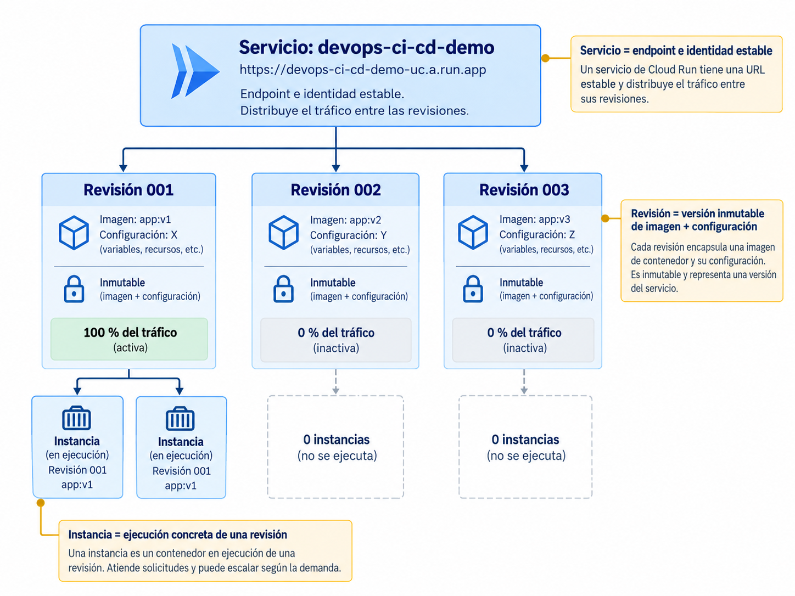
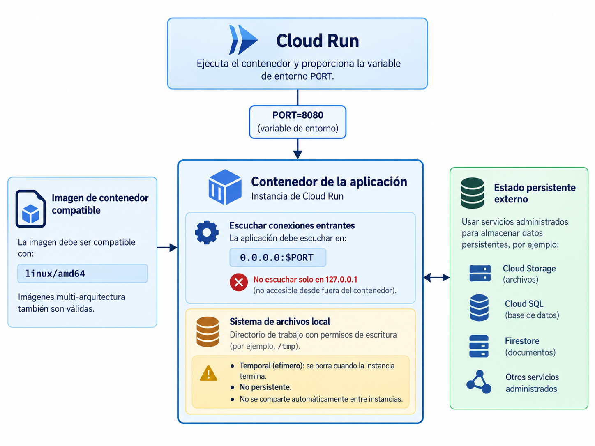
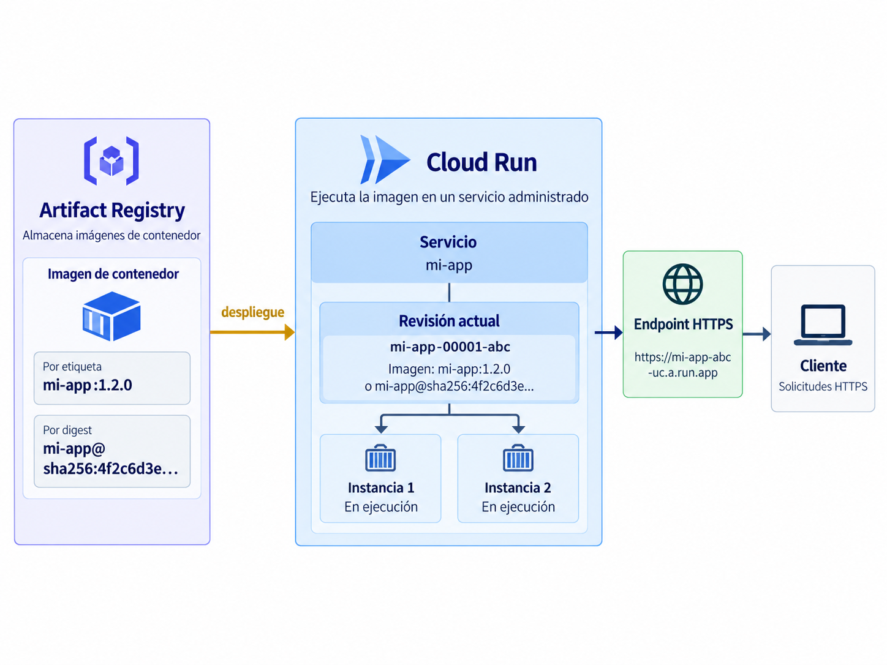
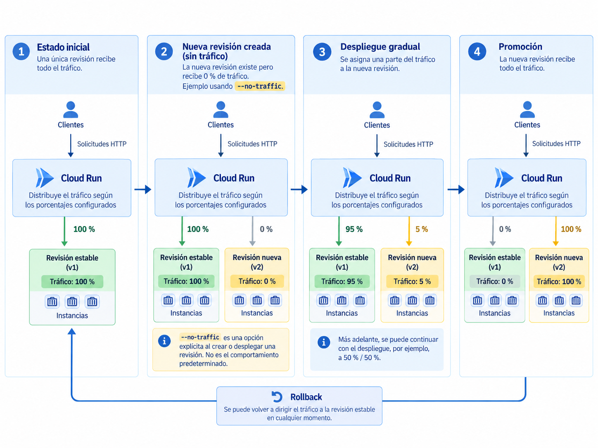

# Clase 11. Despliegue sobre plataformas gestionadas de contenedores

En la clase 10 (Infraestructura y servicios en la nube para DevOps) se incorporaron dos piezas que faltaban en el flujo de entrega construido durante la unidad: un registro especializado donde conservar las imágenes de contenedor y un modelo de identidad y autorización para operar sobre recursos de Google Cloud sin depender de una llave permanente.

Artifact Registry resuelve almacenamiento y distribución, pero no ejecuta la aplicación. Para que una imagen atienda solicitudes se necesita una plataforma capaz de crear instancias a partir de ella, exponer un endpoint estable, sustituir versiones, distribuir tráfico y ajustar capacidad según la demanda.

Esta sesión estudia esa capa mediante **Cloud Run**, utilizado como implementación concreta de una plataforma gestionada de contenedores. El objetivo es comprender su modelo de ejecución y las responsabilidades que asume la plataforma, no memorizar una secuencia aislada de comandos.

---

## 1. Plataforma de ejecución gestionada

Hasta la clase 10, el recorrido de una imagen puede representarse así:

```text
código fuente
     │
     ▼
GitHub Actions
     │
     ├── test
     ├── lint
     └── build
            │
            ▼
       imagen Docker
            │
            ▼
    Artifact Registry
            │
            ▼
     ¿dónde se ejecuta?
```

Un registry conserva artefactos y permite distribuirlos. No crea procesos de aplicación, no expone por sí mismo un endpoint HTTP y no decide cuántas instancias deben estar activas.

Una plataforma de ejecución añade esas responsabilidades:

```text
Artifact Registry
      │
      │ imagen
      ▼
plataforma de ejecución
      │
      ├── crea instancias
      ├── expone un endpoint
      ├── enruta solicitudes
      ├── administra versiones
      └── ajusta capacidad
```

Una plataforma gestionada permite ejecutar contenedores sin que el equipo tenga que administrar directamente máquinas virtuales, nodos de un clúster o un balanceador de carga para cada servicio.

En Cloud Run, la unidad principal de esta sesión es el **servicio**. Un servicio representa una aplicación HTTP accesible mediante una URL estable y ejecutada por una cantidad variable de instancias.

### 1.1 Responsabilidades de la plataforma y del equipo

Cloud Run administra, entre otros aspectos:

- aprovisionamiento de infraestructura;
- endpoint HTTPS del servicio;
- terminación TLS;
- creación y eliminación de instancias;
- enrutamiento de solicitudes;
- distribución de tráfico entre revisiones;
- escalamiento horizontal;
- parte del ciclo de vida de las instancias.

El equipo continúa siendo responsable de decidir:

- qué imagen se despliega;
- qué configuración recibe el contenedor;
- qué identidad utiliza el servicio;
- qué recursos necesita;
- quién puede invocar el endpoint;
- dónde se conserva el estado persistente;
- qué revisión recibe tráfico;
- qué límites de escalamiento son apropiados.

Una plataforma gestionada reduce trabajo operativo, pero no elimina las decisiones de arquitectura, seguridad y entrega.

---

## 2. Servicios, revisiones e instancias

Para razonar correctamente sobre un despliegue en Cloud Run deben distinguirse tres conceptos: **servicio**, **revisión** e **instancia**.

### 2.1 Servicio

Un **servicio** es el recurso lógico que representa la aplicación desplegada.

Por ejemplo:

```text
devops-ci-cd-demo
```

El servicio posee una URL estable. Esa URL no cambia cada vez que se despliega una versión nueva.

```text
cliente
   │
   ▼
URL estable del servicio
   │
   ▼
Cloud Run
   │
   ▼
revisión que recibe tráfico
```

El servicio proporciona una identidad estable para la aplicación aunque las versiones que atienden las solicitudes cambien.

### 2.2 Revisión

Una **revisión** representa una versión inmutable de la configuración desplegada de un servicio.

Una revisión incluye, entre otros elementos:

```text
imagen de contenedor
variables de entorno
límites de recursos
concurrencia
identidad de servicio
otras opciones de ejecución
```

Cuando se despliega una imagen distinta o se modifica una configuración perteneciente a la plantilla del servicio, Cloud Run crea una nueva revisión. La anterior no se modifica.

```text
servicio devops-ci-cd-demo
        │
        ├── revisión 1
        ├── revisión 2
        └── revisión 3
```

Esta propiedad conecta con el principio estudiado en la clase 9 (Entrega continua y estrategias de despliegue): una versión desplegada debe poder identificarse y conservarse sin modificaciones silenciosas.

Cloud Run puede recibir una referencia de imagen mediante tag:

```text
.../devops-ci-cd-demo:9f7a2c
```

o mediante digest:

```text
.../devops-ci-cd-demo@sha256:...
```

Cuando el despliegue utiliza un tag, Cloud Run resuelve ese tag a una versión concreta de la imagen. Reasignar posteriormente el mismo tag en el registry no modifica una revisión ya creada.

### 2.3 Instancia

Una **instancia** es una ejecución concreta de una revisión.

```text
servicio
   │
   ▼
revisión
   │
   ├── instancia A
   ├── instancia B
   └── instancia C
```

La plataforma puede crear y eliminar instancias según la demanda. Por ello, una aplicación ejecutada en Cloud Run no debe asumir que existe una única copia permanente del proceso.

La relación completa es:

```text
servicio
→ endpoint e identidad estable

revisión
→ versión inmutable de imagen + configuración

instancia
→ ejecución concreta de una revisión
```

Un despliegue crea o actualiza un **servicio** mediante una nueva **revisión**, y Cloud Run ejecuta una cantidad variable de **instancias** de esa revisión.




---

## 3. Contrato de ejecución del contenedor

Cloud Run puede ejecutar imágenes construidas con distintos lenguajes y frameworks, pero el contenedor debe respetar determinadas condiciones. Estas condiciones forman parte del contrato entre la aplicación y la plataforma.

### 3.1 Puerto de escucha

El contenedor que recibe solicitudes debe escuchar en:

```text
0.0.0.0
```

y no únicamente en:

```text
127.0.0.1
```

Cloud Run inyecta la variable de entorno:

```text
PORT
```

para indicar el puerto al que se enviarán las solicitudes. El valor predeterminado es `8080`, aunque puede configurarse otro.

El `Dockerfile` actual de `devops-ci-cd-demo` contiene:

```dockerfile
EXPOSE 8080

CMD ["gunicorn", "--bind", "0.0.0.0:8080", "app.main:app"]
```

Esta configuración funciona con el puerto predeterminado porque Gunicorn escucha en `0.0.0.0:8080`.

Debe distinguirse entre:

```text
EXPOSE 8080
```

y el proceso que realmente abre el puerto. `EXPOSE` documenta el puerto previsto por la imagen; no hace que una aplicación comience a escuchar ni determina por sí mismo el puerto que utilizará Cloud Run.

Para una aplicación más portable conviene que el proceso pueda utilizar el valor recibido mediante `PORT` en lugar de depender de un puerto fijo.

### 3.2 Arquitectura de la imagen

Las imágenes desplegadas en Cloud Run deben poder ejecutarse como contenedores Linux sobre arquitectura `x86_64`. Cuando se utiliza una imagen multi-arquitectura, el manifiesto debe incluir `linux/amd64`.

Este detalle puede ser relevante si una imagen se construye localmente en un equipo con otra arquitectura, por ejemplo Apple Silicon. Una construcción que funciona en la computadora local no garantiza por sí sola que la imagen publicada contenga una variante compatible con la plataforma de ejecución.

### 3.3 Estado local

El sistema de archivos del contenedor es escribible, pero no constituye almacenamiento persistente.

Los datos escritos localmente:

- pertenecen a una instancia concreta;
- pueden desaparecer cuando la instancia termina;
- no se comparten automáticamente con otras instancias;
- no deben considerarse almacenamiento permanente.

Por ejemplo:

```text
instancia A
└── /app/uploads/archivo.pdf

instancia B
└── no contiene necesariamente ese archivo
```

El estado que debe sobrevivir al ciclo de vida de una instancia debe almacenarse en un servicio externo apropiado.

### 3.4 Multiplicidad y concurrencia

Cloud Run puede ejecutar varias instancias de una misma revisión simultáneamente:

```text
misma revisión
├── instancia 1
├── instancia 2
├── instancia 3
└── ...
```

Además, una misma instancia puede procesar más de una solicitud al mismo tiempo.

Por tanto:

```text
100 solicitudes
```

no implica necesariamente:

```text
100 instancias
```

La cantidad necesaria depende, entre otros factores, de la concurrencia permitida y del consumo de recursos observado.

Estas propiedades explican por qué los servicios HTTP sin estado se adaptan bien a plataformas con escalamiento horizontal. Variables globales en memoria, archivos locales o cachés internas deben diseñarse suponiendo que otra solicitud puede ser atendida por otra instancia.




---

## 4. Despliegue e inspección

La demostración parte de una imagen ya publicada en Artifact Registry durante la clase 10. No se utilizará el despliegue desde código fuente.

Cloud Run puede desplegar directamente desde código, pero ese mecanismo no promueve necesariamente la imagen que ya fue construida y validada por el pipeline. En su modalidad habitual, además, el despliegue desde source introduce una nueva construcción.

En esta unidad se conserva la propiedad:

```text
build once
promote the same artifact
```

Por ello, la unidad que se despliega será la imagen ya almacenada en Artifact Registry.

### 4.1 Requisitos y permisos

Se requiere:

- Google Cloud CLI instalado;
- sesión autenticada mediante `gcloud`;
- proyecto seleccionado;
- facturación habilitada;
- APIs de Artifact Registry y Cloud Run habilitadas;
- imagen `devops-ci-cd-demo` disponible en Artifact Registry;
- autorización para desplegar sobre Cloud Run;
- autorización para leer la imagen almacenada;
- autorización para utilizar la identidad de servicio correspondiente.

Un conjunto habitual de roles para una identidad que despliega una imagen existente incluye:

| Recurso o responsabilidad | Rol habitual |
| --- | --- |
| crear o actualizar el servicio | `roles/run.developer` |
| leer la imagen del repositorio | `roles/artifactregistry.reader` |
| utilizar la service account de ejecución | `roles/iam.serviceAccountUser` |

Los roles deben concederse con el alcance mínimo necesario. La tabla describe un caso frecuente, no una razón para conceder esos roles sobre todo el proyecto si un alcance menor resulta suficiente.

Para la demostración se utilizarán:

```bash
export PROJECT_ID="ID_DEL_PROYECTO"
export REGION="us-central1"
export REPOSITORY="devops-images"
export IMAGE="devops-ci-cd-demo"
export SERVICE="devops-ci-cd-demo"
```

Seleccionar el proyecto:

```bash
gcloud config set project "$PROJECT_ID"
```

Habilitar Cloud Run:

```bash
gcloud services enable run.googleapis.com
```

Consultar las versiones existentes de la imagen:

```bash
gcloud artifacts docker images list \
  "${REGION}-docker.pkg.dev/${PROJECT_ID}/${REPOSITORY}/${IMAGE}" \
  --include-tags
```

Seleccionar un tag publicado:

```bash
export IMAGE_TAG="TAG_PUBLICADO"
```

Construir la referencia completa:

```bash
export IMAGE_REF="${REGION}-docker.pkg.dev/${PROJECT_ID}/${REPOSITORY}/${IMAGE}:${IMAGE_TAG}"
```

Comprobar:

```bash
echo "$IMAGE_REF"
```

El resultado debe tener la forma:

```text
us-central1-docker.pkg.dev/PROJECT_ID/devops-images/devops-ci-cd-demo:TAG
```

### 4.2 Crear el servicio

Para la demostración se hará público el endpoint para poder invocarlo desde `curl` sin preparar un cliente autenticado:

```bash
gcloud run deploy "$SERVICE" \
  --image "$IMAGE_REF" \
  --region "$REGION" \
  --no-invoker-iam-check
```

Si el servicio no existe, `gcloud run deploy` lo crea. Si ya existe, despliega una nueva revisión.

`--no-invoker-iam-check` deshabilita la comprobación IAM del permiso de invocación para ese servicio. Utilizar esta opción requiere que la identidad que ejecuta el despliegue pueda modificar la política de invocación del servicio, incluyendo el permiso `run.services.setIamPolicy`.

!!! warning "Acceso público"
    Un servicio de Cloud Run es privado por defecto. Hacer público un endpoint es una decisión de seguridad, no un requisito técnico. Un backend interno o un servicio entre componentes puede y normalmente debe exigir autenticación.

Al finalizar, `gcloud` muestra la URL del servicio.

También puede obtenerse mediante:

```bash
export SERVICE_URL="$(
  gcloud run services describe "$SERVICE" \
    --region "$REGION" \
    --format='value(status.url)'
)"
```

Comprobar:

```bash
echo "$SERVICE_URL"
```

### 4.3 Probar el servicio

La aplicación expone:

```text
GET /health
```

Puede verificarse con:

```bash
curl "${SERVICE_URL}/health"
```

Se espera:

```json
{"status":"ok"}
```

El endpoint:

```text
GET /price
```

requiere `unit_price` y `quantity`:

```bash
curl \
  "${SERVICE_URL}/price?unit_price=12.50&quantity=3"
```

La respuesta debe contener el precio unitario, la cantidad y el total calculado.



La cadena de ejecución ya es real:

```text
Artifact Registry
       │
       ▼
Cloud Run service
       │
       ▼
revision
       │
       ▼
container instance
       │
       ▼
HTTPS endpoint
       │
       ▼
curl / navegador
```

### 4.4 Inspeccionar el servicio y la revisión

Después de un despliegue conviene observar los recursos creados.

Describir el servicio:

```bash
gcloud run services describe "$SERVICE" \
  --region "$REGION"
```

Obtener el nombre de la revisión más reciente:

```bash
export LATEST_REVISION="$(
  gcloud run services describe "$SERVICE" \
    --region "$REGION" \
    --format='value(status.latestCreatedRevisionName)'
)"
```

Comprobar:

```bash
echo "$LATEST_REVISION"
```

Listar revisiones:

```bash
gcloud run revisions list \
  --service "$SERVICE" \
  --region "$REGION"
```

Describir una revisión:

```bash
gcloud run revisions describe "$LATEST_REVISION" \
  --region "$REGION"
```

Observar la imagen asociada:

```bash
gcloud run revisions describe "$LATEST_REVISION" \
  --region "$REGION" \
  --format='value(spec.containers[0].image)'
```

Aunque el despliegue se haya solicitado mediante un tag, la revisión representa una versión concreta e inmutable del servicio.

---

## 5. Gestión de revisiones y tráfico

Una revisión no corresponde únicamente a una versión del código. La configuración de ejecución también forma parte de ella.

### 5.1 Cambios de configuración

Por ejemplo:

```bash
gcloud run services update "$SERVICE" \
  --region "$REGION" \
  --update-env-vars APP_ENV=staging
```

Después:

```bash
gcloud run revisions list \
  --service "$SERVICE" \
  --region "$REGION"
```

debe aparecer una revisión adicional.

La relación puede expresarse así:

```text
misma imagen
+
configuración diferente
=
revisión diferente
```

!!! note "Variables y secretos"
    Las variables de entorno son apropiadas para configuración no sensible. Credenciales, API keys y otros secretos no deberían almacenarse como variables ordinarias dentro del workflow o del repositorio. Google Cloud ofrece Secret Manager para administrar valores sensibles.

Una revisión que deja de recibir tráfico no tiene que eliminarse inmediatamente. En la configuración predeterminada, y mientras no exista una política que mantenga instancias mínimas, una revisión sin solicitudes puede reducirse a cero instancias activas. Cloud Run conserva revisiones anteriores para permitir inspección y redistribución de tráfico, aunque existe un límite por servicio y las revisiones más antiguas pueden eliminarse automáticamente cuando se supera.

### 5.2 Revisión y tráfico son decisiones separadas

Crear una revisión nueva no obliga a enviarle todas las solicitudes.

Puede desplegarse sin tráfico:

```bash
gcloud run deploy "$SERVICE" \
  --image "NUEVA_REFERENCIA_DE_IMAGEN" \
  --region "$REGION" \
  --no-traffic
```

La nueva revisión existe, pero no recibe tráfico desde la URL principal:

```text
servicio
  │
  ├── revisión estable   → 100 %
  └── revisión nueva     →   0 %
```

Esto separa dos decisiones:

```text
crear una versión desplegable
≠
enviarle tráfico
```

### 5.3 Despliegue gradual

Supóngase que existen:

```text
REVISION_ESTABLE
REVISION_NUEVA
```

Una distribución gradual puede ser:

```text
95 % → revisión estable
 5 % → revisión nueva
```

mediante:

```bash
gcloud run services update-traffic "$SERVICE" \
  --region "$REGION" \
  --to-revisions \
  REVISION_ESTABLE=95,REVISION_NUEVA=5
```

Después puede modificarse a:

```text
50 % → revisión estable
50 % → revisión nueva
```

y finalmente:

```text
100 % → revisión nueva
```

Esto proporciona un mecanismo concreto para implementar el reparto de tráfico estudiado en la clase 9 como canary o rollout gradual.

Los cambios de tráfico no deben interpretarse como operaciones instantáneas sobre todas las solicitudes. La nueva configuración puede necesitar un breve intervalo para propagarse y las solicitudes que ya estaban en curso pueden finalizar en la revisión que las recibió originalmente.

La plataforma distribuye tráfico, pero no determina por sí sola si una revisión se comporta correctamente. Esa decisión requiere evidencia.




### 5.4 Rollback

Si una revisión nueva presenta problemas y la anterior continúa disponible, el tráfico puede devolverse a la versión conocida:

```bash
gcloud run services update-traffic "$SERVICE" \
  --region "$REGION" \
  --to-revisions REVISION_ESTABLE=100
```

Esto no reconstruye la aplicación.

```text
rollback
→ volver a una revisión existente

no
→ reconstruir el código antiguo
```

La limitación discutida en la clase 9 permanece: devolver tráfico a una revisión anterior no revierte automáticamente cambios en bases de datos, mensajes ya publicados ni otros efectos externos producidos por la revisión problemática.

---

## 6. Escalamiento e identidades

### 6.1 Escalamiento horizontal

Una vez que una revisión recibe tráfico, Cloud Run ajusta la cantidad de instancias utilizando señales como utilización de CPU y concurrencia de solicitudes.

```text
poca demanda
    │
    ▼
menos instancias

más demanda
    │
    ▼
más instancias
```

Cuando una revisión deja de recibir solicitudes, la configuración predeterminada permite reducir su cantidad de instancias hasta cero.

Esto disminuye consumo durante periodos de inactividad, pero puede introducir latencia adicional en la primera solicitud que llega cuando no existe una instancia disponible. Ese fenómeno se conoce habitualmente como **cold start**.

### 6.2 Instancias mínimas

Mantener un mínimo mayor que cero conserva capacidad disponible aunque no haya solicitudes.

```text
mínimo = 0
→ menor consumo durante inactividad
→ posibilidad de cold start

mínimo > 0
→ capacidad disponible
→ menor probabilidad de cold start
→ costo asociado
```

No existe una configuración universalmente correcta. Depende de requisitos de latencia, disponibilidad y costo.

### 6.3 Instancias máximas

También es posible limitar el número máximo de instancias.

Este límite puede proteger:

- presupuesto;
- bases de datos con capacidad limitada;
- APIs externas;
- servicios que no toleran un número arbitrario de conexiones simultáneas.

Sin embargo, limitar instancias también limita capacidad. Si la demanda supera lo que las instancias permitidas pueden atender, las solicitudes pueden acumular espera y eventualmente fallar.

Un máximo de instancias es, por tanto, una decisión de capacidad y protección de dependencias.

### 6.4 Identidad que despliega e identidad de servicio

En esta etapa deben distinguirse dos identidades.

La **identidad que despliega** ejecuta operaciones como:

```text
gcloud run deploy
```

Necesita autorización para crear o actualizar el servicio y para utilizar la identidad de ejecución correspondiente.

Durante la demostración, esta identidad es la cuenta autenticada mediante `gcloud`.

La **identidad de servicio** es la identidad con la que se ejecutan las instancias de Cloud Run cuando la aplicación llama a otros servicios de Google Cloud.

```text
Cloud Run
   │
   └── service identity
          │
          ├── Secret Manager
          ├── Cloud Storage
          └── otras APIs
```

Ambas identidades representan responsabilidades distintas:

```text
identidad de despliegue
→ modifica el servicio

identidad de ejecución
→ accede a dependencias durante la ejecución
```

Separarlas permite aplicar mínimo privilegio de forma más precisa.

---

## 7. Diagnóstico e integración con el proceso de entrega

Un despliegue puede fallar aunque la imagen se haya construido correctamente. El diagnóstico mejora cuando el problema se clasifica según la capa en la que aparece.

### 7.1 Problemas de contrato del contenedor

**El contenedor escucha únicamente en `localhost`.**

```text
127.0.0.1
```

no satisface el contrato de ingreso. El proceso debe escuchar en:

```text
0.0.0.0
```

sobre el puerto configurado.

**El proceso utiliza un puerto diferente.**

Hardcodear un puerto puede funcionar mientras coincida con la configuración del servicio, pero reduce portabilidad. La aplicación debería poder utilizar `PORT`.

**La imagen no contiene una arquitectura compatible.**

Una imagen construida localmente puede funcionar en la computadora del desarrollador y fallar en Cloud Run si no contiene una variante compatible con `linux/amd64`.

### 7.2 Problemas de identidad y acceso

**El despliegue devuelve un error de permisos.**

Debe distinguirse qué operación falló:

```text
leer la imagen
actualizar Cloud Run
utilizar la service account
modificar acceso de invocación
```

Cada operación corresponde a permisos diferentes. Estar autenticado no implica estar autorizado para todas ellas.

**El servicio responde `403`.**

Un despliegue exitoso no significa necesariamente que cualquier cliente pueda invocarlo. Cloud Run es privado por defecto y el acceso debe diseñarse explícitamente.

### 7.3 Problemas de revisión y tráfico

**La revisión aparece creada, pero no recibe solicitudes.**

Debe revisarse la distribución de tráfico. Una revisión desplegada con `--no-traffic` puede existir correctamente y recibir 0 %.

**El rollback no revierte datos externos.**

Redistribuir tráfico recupera una revisión de la aplicación, no deshace automáticamente cambios de base de datos ni otros efectos externos.

### 7.4 Integración con el proceso de entrega

Al terminar esta sesión, el recorrido completo de las piezas estudiadas puede representarse así:

```text
GitHub Actions
      │
      ├── test
      ├── lint
      └── build
             │
             ▼
      Artifact Registry
             │
             ▼
        Cloud Run
             │
             ├── servicio
             ├── revisiones
             ├── tráfico
             └── instancias
```

La demostración utilizó `gcloud run deploy` de forma manual para aislar el funcionamiento de Cloud Run. La automatización completa integra las piezas ya estudiadas:

```text
GitHub Actions
      │
      │ OIDC
      ▼
Workload Identity Federation
      │
      ▼
IAM
      │
      ├── Artifact Registry
      └── Cloud Run
```

El diseño resultante debe preservar las propiedades desarrolladas durante la unidad:

```text
construir una vez
identificar la imagen
publicarla en un registry
desplegar esa misma versión
controlar el tráfico
conservar una ruta de rollback
```

No es necesario reconstruir el artefacto antes de cada ambiente.

### 7.5 Actividades de análisis

1. Una aplicación almacena archivos subidos por usuarios en `/app/uploads` y espera encontrarlos allí en solicitudes posteriores. Explicar por qué este diseño puede fallar en Cloud Run aunque funcione correctamente durante pruebas locales.

2. Un servicio posee tres revisiones. La revisión A recibe 100 % del tráfico y B y C reciben 0 %. Explicar qué representa cada revisión y por qué la ausencia de tráfico no implica que deba eliminarse inmediatamente.

3. Un equipo despliega `api:production`. Una semana después reasigna el tag `production` a otra imagen sin ejecutar un nuevo despliegue. Explicar si la revisión existente cambia de contenido.

4. Un equipo ya validó y publicó una imagen en Artifact Registry, pero despliega nuevamente desde código fuente. Explicar qué propiedad del proceso de entrega se debilita.

5. Una revisión nueva recibe 5 % del tráfico y presenta errores. La revisión anterior permanece disponible. Proponer el rollback y explicar qué efectos externos no serían revertidos.

6. Un servicio mantiene cero instancias durante periodos prolongados sin tráfico y presenta latencia elevada en la primera solicitud posterior. Explicar una causa posible y el compromiso que introduce configurar instancias mínimas.

7. Una API que debería ser privada fue desplegada con acceso público únicamente porque el comando de ejemplo lo incluía. Identificar qué decisión de seguridad fue tomada y qué debe revisarse.

8. Un despliegue falla con un error de permisos. La identidad está correctamente autenticada. Proponer al menos tres autorizaciones distintas que deberían revisarse antes de concluir que el problema está en Cloud Run.

---

## 8. Referencias

- Google Cloud. *What is Cloud Run?* https://cloud.google.com/run/docs/overview/what-is-cloud-run
- Google Cloud. *Deployment options and resource model*. https://cloud.google.com/run/docs/resource-model
- Google Cloud. *Container runtime contract*. https://cloud.google.com/run/docs/container-contract
- Google Cloud. *Deploy container images to Cloud Run services*. https://cloud.google.com/run/docs/deploying
- Google Cloud. *Deploy services from source code*. https://cloud.google.com/run/docs/deploying-source-code
- Google Cloud. *Cloud Run IAM roles*. https://cloud.google.com/run/docs/reference/iam/roles
- Google Cloud. *Manage Cloud Run services*. https://cloud.google.com/run/docs/managing/services
- Google Cloud. *Manage revisions*. https://cloud.google.com/run/docs/managing/revisions
- Google Cloud. *Rollbacks, gradual rollouts, and traffic migration*. https://cloud.google.com/run/docs/rollouts-rollbacks-traffic-migration
- Google Cloud. *Configure containers for services*. https://cloud.google.com/run/docs/configuring/services/containers
- Google Cloud. *Configure environment variables for services*. https://cloud.google.com/run/docs/configuring/services/environment-variables
- Google Cloud. *About instance autoscaling in Cloud Run services*. https://cloud.google.com/run/docs/about-instance-autoscaling
- Google Cloud. *Authentication overview*. https://cloud.google.com/run/docs/authenticating/overview
- Google Cloud. *Allowing public (unauthenticated) access*. https://cloud.google.com/run/docs/authenticating/public
