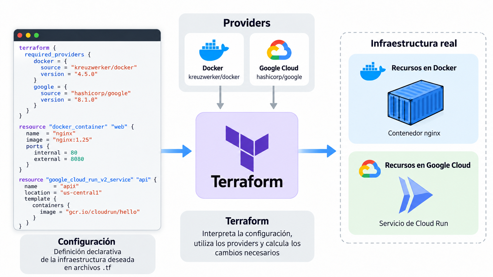
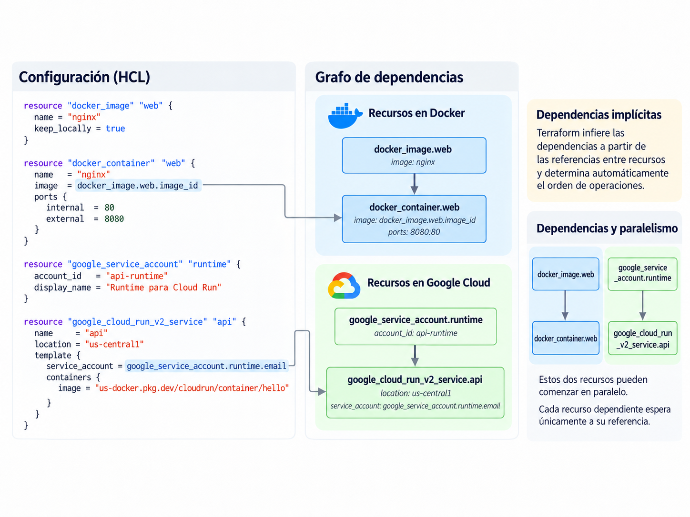
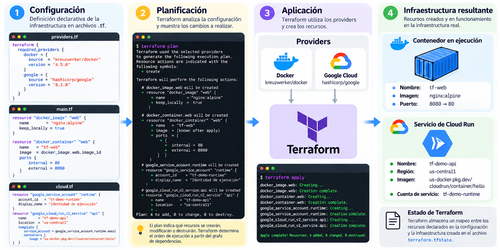
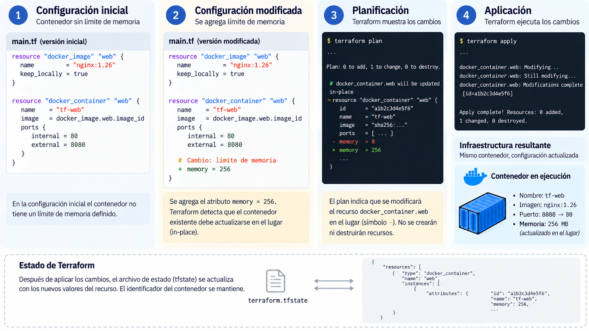
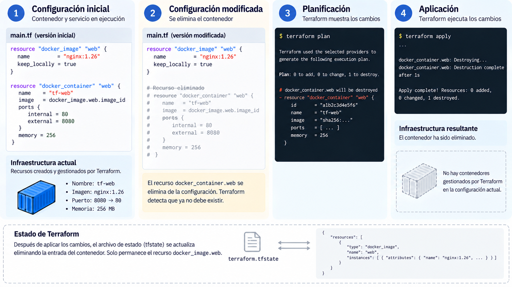

# Clase 12. Terraform I: infraestructura como código

!!! note "Resultados de aprendizaje"
    Al finalizar la clase se espera poder:

    - explicar el problema de ingeniería que aborda la infraestructura como código;
    - distinguir un procedimiento imperativo de una declaración de estado deseado;
    - leer una configuración básica de Terraform e identificar requisitos de providers, providers, resources y referencias;
    - explicar cómo las referencias entre recursos determinan dependencias;
    - interpretar un `terraform plan` e identificar creación, actualización, reemplazo y destrucción;
    - ejecutar el flujo básico `init`, `validate`, `plan`, `apply` y `destroy` sobre un entorno local;
    - justificar el impacto operativo de un cambio de infraestructura antes de aplicarlo.

## 1. Infraestructura como código

### 1.1. Infraestructura manual y reproducibilidad

En las clases anteriores se desplegó una aplicación sobre Google Cloud mediante la consola y órdenes de `gcloud`. El resultado podía ser funcional y repetible mientras la secuencia de pasos estuviera bien documentada, pero la infraestructura continuaba dependiendo de acciones ejecutadas directamente sobre el proveedor.

Este enfoque presenta limitaciones cuando la infraestructura cambia con frecuencia o debe mantenerse por un equipo:

- **revisión:** una modificación ejecutada directamente no pasa necesariamente por el mismo proceso de revisión que el código de aplicación;
- **reproducibilidad:** crear un segundo entorno equivalente exige repetir correctamente todas las acciones;
- **trazabilidad:** reconstruir qué configuración debía existir en una versión concreta requiere combinar documentación, historial de comandos y estado del proveedor;
- **automatización:** aplicar cambios de infraestructura desde un pipeline resulta más difícil cuando el procedimiento depende de pasos manuales.

La infraestructura como código (Infrastructure as Code, IaC) aborda este problema describiendo mediante archivos versionables los recursos y configuraciones que deben administrarse.

La práctica es independiente de una nube concreta. Terraform puede utilizar providers para plataformas distintas dentro de un mismo flujo de trabajo y una configuración puede incluso requerir más de un provider. Esto no significa que un recurso sea portable automáticamente entre plataformas: cada provider define sus propios tipos de recursos, argumentos y comportamiento. Lo transferible es el modelo de trabajo basado en configuración, dependencias, planificación y aplicación de cambios.

La configuración versionada representa el **estado deseado administrado mediante la herramienta**. No sustituye la observación del entorno real ni garantiza que la arquitectura sea correcta. Permite, en cambio, someter los cambios de infraestructura a prácticas de ingeniería similares a las utilizadas para el código de aplicación: revisión, control de versiones y automatización.

!!! warning "Límite"
    Una configuración puede ser sintácticamente válida, estar versionada y haber sido revisada, y aun así describir una arquitectura insegura, costosa o destructiva. IaC hace visibles y reproducibles los cambios; no elimina la necesidad de criterio de ingeniería.

### 1.2. Enfoques imperativo y declarativo

Un procedimiento **imperativo** especifica una secuencia de acciones. Por ejemplo:

```bash
gcloud artifacts repositories create tf-demo-apps \
  --repository-format=docker \
  --location=us-central1

gcloud iam service-accounts create tf-demo-runtime \
  --display-name="Identidad de ejecución de la demostración"

gcloud run deploy tf-demo-api \
  --image=us-docker.pkg.dev/cloudrun/container/hello \
  --region=us-central1 \
  --service-account=tf-demo-runtime@PROJECT_ID.iam.gserviceaccount.com \
  --no-allow-unauthenticated
```

La persona que mantiene el procedimiento debe conocer el orden, el efecto de repetir cada orden y las condiciones bajo las cuales una operación crea, actualiza o falla.

En un enfoque **declarativo** se describe el estado deseado. Una configuración equivalente puede expresarse como recursos:

```hcl
resource "google_artifact_registry_repository" "apps" {
  location      = "us-central1"
  repository_id = "tf-demo-apps"
  format        = "DOCKER"
}

resource "google_service_account" "runtime" {
  account_id   = "tf-demo-runtime"
  display_name = "Identidad de ejecución de la demostración"
}

resource "google_cloud_run_v2_service" "api" {
  name     = "tf-demo-api"
  location = "us-central1"

  template {
    service_account = google_service_account.runtime.email

    containers {
      image = "us-docker.pkg.dev/cloudrun/container/hello"
    }
  }
}
```


La diferencia principal no es la cantidad de líneas, sino el modelo de ejecución:

| Aspecto | Imperativo | Declarativo |
|---|---|---|
| Expresión principal | Secuencia de acciones | Estado deseado |
| Orden | Definido por el procedimiento | Inferido a partir de dependencias |
| Repetición | Depende del comportamiento de cada orden | Se calculan las diferencias respecto del estado deseado |
| Cambio | Se modifica la secuencia | Se modifica la declaración |
| Revisión previa | Depende de la herramienta y del procedimiento | Terraform puede producir un plan antes de aplicar |

El enfoque declarativo no sustituye todos los procedimientos imperativos. Migraciones de datos, operaciones puntuales y tareas administrativas pueden expresarse mejor como secuencias. IaC resulta especialmente útil para infraestructura que debe mantenerse, modificarse y reproducirse durante la vida de un sistema.

## 2. Configuración de Terraform

Terraform utiliza archivos con extensión `.tf`, escritos en HashiCorp Configuration Language (HCL). Los archivos `.tf` de un directorio forman una configuración raíz.

Para esta clase bastan cuatro elementos: el bloque `terraform`, providers, resources y referencias.

### 2.1. Requisitos y providers

El bloque `terraform` declara requisitos de la configuración:

```hcl
terraform {
  required_version = ">= 1.9"

  required_providers {
    docker = {
      source  = "kreuzwerker/docker"
      version = "4.5.0"
    }
  }
}
```

`required_version` restringe las versiones de Terraform que pueden ejecutar la configuración. `required_providers` identifica los providers requeridos mediante tres elementos: un nombre local, una dirección de origen y una restricción de versión.

En el ejemplo, `docker` es el nombre local utilizado dentro de la configuración, `kreuzwerker/docker` identifica el provider en el registro y `4.5.0` fija la versión utilizada para esta práctica.

Un **provider** es un complemento que permite a Terraform interactuar con una API concreta. Terraform no implementa directamente las operaciones de Docker, Google Cloud o Kubernetes; delega ese comportamiento a providers. El bloque `provider` configura una instancia del provider que utilizarán los recursos correspondientes:

```hcl
provider "docker" {}
```

Una misma configuración raíz puede requerir más de un provider. Por ejemplo, una configuración podría administrar simultáneamente recursos de Google Cloud y objetos de Docker:

```hcl
terraform {
  required_providers {
    docker = {
      source  = "kreuzwerker/docker"
      version = "4.5.0"
    }

    google = {
      source  = "hashicorp/google"
      version = "8.1.0"
    }
  }
}

provider "docker" {}

provider "google" {
  region = "us-central1"
}
```

Los recursos continúan perteneciendo al esquema de su provider. `docker_container`, por ejemplo, no se convierte en un recurso de Google Cloud por declarar también el provider `google`. Utilizar varios providers permite administrar distintos sistemas desde una misma configuración, pero no elimina las diferencias entre sus APIs ni sus modelos de recursos.

<figure markdown="span">
  
  <figcaption>Una configuración puede utilizar varios providers. Cada provider traduce los recursos de su propio dominio hacia la API correspondiente.</figcaption>
</figure>

La configuración de la práctica fija el provider Docker en `4.5.0`, que es la versión utilizada para verificar los resultados. Durante `terraform init`, Terraform instala los providers requeridos y registra en `.terraform.lock.hcl` las selecciones concretas y sus checksums. El archivo de bloqueo debe versionarse para que un cambio de versión del provider sea explícito y revisable, en lugar de introducirse accidentalmente entre ejecuciones.

### 2.2. Resources

Un bloque `resource` declara un objeto administrado mediante Terraform:

```hcl
resource "docker_image" "web" {
  name         = "nginx:alpine"
  keep_locally = true
}
```

El bloque contiene dos identificadores:

- `docker_image`: tipo de recurso definido por el provider;
- `web`: nombre local dentro de la configuración.

La dirección del recurso es:

```text
docker_image.web
```

Los argumentos dentro del bloque describen la configuración deseada del recurso.

### 2.3. Referencias y dependencias

Un recurso puede utilizar atributos de otro:

```hcl
resource "docker_container" "web" {
  name  = "tf-web"
  image = docker_image.web.image_id

  ports {
    internal = 80
    external = 8080
  }
}
```

La expresión:

```hcl
docker_image.web.image_id
```

lee el atributo `image_id` del recurso `docker_image.web`.

La referencia también establece una **dependencia implícita**: el contenedor necesita la imagen. Terraform utiliza las referencias de la configuración para construir un grafo de dependencias y determinar un orden válido de creación y destrucción.

<figure markdown="span">
  
  <figcaption>Las referencias entre recursos forman el grafo de dependencias. Cadenas independientes pueden ejecutarse en paralelo.</figcaption>
</figure>


!!! note "Concepto clave"
    Una configuración de Terraform no es un script que se ejecuta de arriba abajo. El orden textual de los bloques no determina el orden de creación. Las dependencias se obtienen principalmente de las referencias entre recursos.

Terraform dispone también del meta-argumento `depends_on` para relaciones que no pueden inferirse mediante una referencia. No se utilizará en la práctica de esta clase. Cuando una referencia expresa correctamente la relación, es preferible a una dependencia explícita.

## 3. Flujo de trabajo de Terraform

El flujo básico de esta clase utiliza cinco órdenes:

| Orden | Propósito | ¿Modifica infraestructura? |
|---|---|---|
| `terraform init` | Inicializar la configuración e instalar providers | No |
| `terraform validate` | Comprobar sintaxis y consistencia interna | No |
| `terraform plan` | Calcular y mostrar los cambios propuestos | No |
| `terraform apply` | Ejecutar los cambios propuestos | Sí |
| `terraform destroy` | Retirar los recursos administrados por la configuración | Sí |

`terraform fmt` se utilizará adicionalmente para aplicar el formato canónico de HCL.

### 3.1. Inicialización

```bash
terraform init
```

`init` prepara el directorio de trabajo e instala los providers requeridos. Como resultado aparecen, entre otros, dos elementos:

- `.terraform/`: directorio local regenerable utilizado por Terraform;
- `.terraform.lock.hcl`: archivo que registra las versiones seleccionadas de los providers y sus checksums.

El directorio `.terraform/` no se versiona. `.terraform.lock.hcl` sí debe incluirse en el repositorio para que ejecuciones posteriores reutilicen por defecto las mismas selecciones de providers y cualquier cambio de dependencia pueda revisarse.

### 3.2. Validación y formato

```bash
terraform validate
terraform fmt
```

`validate` comprueba la sintaxis y la consistencia interna de la configuración. Puede detectar, por ejemplo, referencias inválidas, tipos incompatibles o argumentos que no pertenecen al esquema conocido por el provider.

No garantiza que la infraestructura pueda crearse. Los permisos, cuotas, restricciones del servicio remoto y otros errores pueden aparecer únicamente durante la aplicación.

`fmt` reescribe los archivos `.tf` con el formato canónico de Terraform.

### 3.3. Plan de ejecución

```bash
terraform plan
```

Terraform necesita razonar sobre tres elementos:

1. la **configuración**, que expresa el estado deseado;
2. el **estado de Terraform**, que relaciona los recursos declarados con los objetos administrados;
3. la **situación actual de los objetos administrados** en el provider.

El estado se estudiará con detalle en la clase siguiente. En esta sesión basta comprender que Terraform necesita esa relación para determinar qué objetos ya administra y qué diferencias existen respecto de la configuración.


Por defecto, durante la planificación Terraform consulta los objetos remotos administrados para actualizar la información utilizada en el cálculo. Por ello, una modificación manual sobre un recurso ya administrado puede aparecer posteriormente en el plan. Un recurso creado completamente fuera de Terraform no se incorpora automáticamente a la configuración ni al estado.

El plan no modifica la infraestructura. Su salida indica qué haría Terraform si se aplicara la configuración.

### 3.4. Lectura de un plan

Las acciones principales se representan mediante símbolos:

| Símbolo | Acción | Interpretación |
|---|---|---|
| `+` | Crear | Se creará un recurso |
| `~` | Actualizar | Se modificará un recurso existente |
| `-/+` o combinación equivalente mostrada por la CLI | Reemplazar | El objeto existente debe ser destruido y creado nuevamente |
| `-` | Destruir | Se eliminará un recurso administrado |

La distinción entre **actualización** y **reemplazo** es especialmente importante. Un provider puede permitir que algunos atributos cambien sobre el objeto existente y exigir reemplazo para otros.

Ejemplo esquemático:

```text
  # docker_container.web must be replaced
-/+ resource "docker_container" "web" {
      ...
      ~ ports {
          ~ external = 8080 -> 8081 # forces replacement
            internal = 80
        }
    }

Plan: 1 to add, 0 to change, 1 to destroy.
```

Las reglas de reemplazo pertenecen al esquema y comportamiento de cada recurso del provider. No deben inferirse únicamente por intuición. El propio plan y la documentación del recurso son la evidencia que debe revisarse.

Un plan correcto tampoco garantiza que `apply` tendrá éxito. Un servicio remoto puede rechazar una operación por permisos, cuotas, valores inválidos o dependencias que Terraform no puede verificar durante la planificación.

### 3.5. Aplicación y destrucción

```bash
terraform apply
```

Cuando se ejecuta sin un plan guardado, `apply` calcula un nuevo plan, lo muestra y solicita confirmación. La revisión debe realizarse sobre el plan que se aplicará en ese momento.

!!! warning "Revisión antes de aplicar"
    Confirmar un `apply` sin leer el plan elimina uno de los controles principales del flujo de Terraform. Deben revisarse, como mínimo, el resumen y cualquier destrucción o reemplazo propuesto.

Para retirar los recursos administrados por la configuración:

```bash
terraform plan -destroy
terraform destroy
```

`plan -destroy` permite revisar previamente la destrucción. `destroy` ejecuta una operación cuyo objetivo es eliminar los recursos administrados por la configuración.

<figure markdown="span">
  
  <figcaption>Terraform transforma una configuración declarativa en un plan revisable y, tras su aplicación, actualiza la infraestructura y el estado administrado.</figcaption>
</figure>


## 4. Terraform con Docker

La práctica utiliza el provider `kreuzwerker/docker` para observar el comportamiento de Terraform sobre un entorno local. Docker se emplea aquí como laboratorio por tres razones: no requiere credenciales de nube, las operaciones son rápidas y el resultado puede verificarse con herramientas ya conocidas.

Gestionar contenedores locales mediante Terraform no constituye el patrón de despliegue que se pretende recomendar para producción. El objetivo es aislar y observar el modelo de Terraform antes de utilizarlo sobre infraestructura de nube.

### 4.1. Preparación

Verificar Terraform y Docker:

```bash
terraform version
docker version
docker ps
```

Crear un directorio independiente:

```bash
mkdir tf-clase12-docker
cd tf-clase12-docker
```

Crear `.gitignore`:

```gitignore
.terraform/
*.tfstate
*.tfstate.*
*.tfplan
```

`.terraform.lock.hcl` no se ignora.

### 4.2. Configuración inicial

Crear `main.tf`:

```hcl
terraform {
  required_version = ">= 1.9"

  required_providers {
    docker = {
      source  = "kreuzwerker/docker"
      version = "4.5.0"
    }
  }
}

provider "docker" {}

resource "docker_image" "web" {
  name         = "nginx:alpine"
  keep_locally = true
}

resource "docker_container" "web" {
  name  = "tf-web"
  image = docker_image.web.image_id

  ports {
    internal = 80
    external = 8080
  }
}
```

Antes de ejecutar Terraform, responder:

1. ¿Cuántos recursos se declaran?
2. ¿Cuál depende del otro?
3. ¿Qué expresión establece la dependencia?

La configuración declara dos recursos. `docker_container.web` depende de `docker_image.web` mediante `docker_image.web.image_id`.

`keep_locally = true` conserva la imagen local cuando Terraform deja de administrarla durante la destrucción de la configuración.

!!! info "Etiqueta de imagen"
    `nginx:alpine` es una etiqueta mutable. Resulta suficiente para esta práctica, pero una configuración que requiera reproducibilidad estricta debería utilizar una versión o digest controlado.

### 4.3. Inicialización y primer plan

Ejecutar:

```bash
terraform init
terraform validate
terraform fmt
terraform plan
```

Verificaciones:

- `init` crea `.terraform/` y `.terraform.lock.hcl`;
- `validate` informa que la configuración es válida;
- `fmt` no modifica el archivo si ya utiliza el formato canónico;
- el plan propone crear dos recursos;
- los valores que todavía no pueden calcularse aparecen como `(known after apply)`.

**Punto de control.** Abrir `.terraform.lock.hcl`, localizar la versión seleccionada del provider Docker y comprobar que corresponde a la versión `4.5.0`.

Verificar además que `plan` no creó el contenedor:

```bash
docker ps -a
```

### 4.4. Aplicación

Ejecutar:

```bash
terraform apply
```

Antes de responder `yes`, revisar el resumen del plan.

Después de aplicar, comprobar el resultado sin utilizar Terraform:

```bash
docker ps
curl -I http://localhost:8080
```

Registrar el identificador del contenedor:

```bash
docker inspect --format '{{.Id}}' tf-web
```

Terraform crea también `terraform.tfstate`. En esta clase no se inspeccionará ni editará. Su propósito y estructura corresponden a la siguiente sesión.

### 4.5. Plan sin cambios

Ejecutar de nuevo:

```bash
terraform plan
```

El resultado esperado es que Terraform no proponga acciones. La configuración continúa expresando el mismo estado deseado y los objetos administrados coinciden con él.

Antes de continuar, explicar qué información necesita Terraform para concluir que no hay cambios.

### 4.6. Actualización de un recurso

Agregar un límite de memoria:

```hcl
resource "docker_container" "web" {
  name   = "tf-web"
  image  = docker_image.web.image_id
  memory = 256

  ports {
    internal = 80
    external = 8080
  }
}
```

Antes de ejecutar el plan, registrar una predicción:

> ¿Terraform podrá modificar el contenedor existente o deberá reemplazarlo?

Ejecutar:

```bash
terraform plan
```

Contrastar la predicción con el plan. Si el provider propone una actualización in situ, aplicar:

```bash
terraform apply
```

Verificar el identificador y el límite:

```bash
docker inspect --format '{{.Id}}' tf-web
docker inspect --format '{{.HostConfig.Memory}}' tf-web
```

Registrar si el identificador cambió.

<figure markdown="span">
  
  <figcaption>Una actualización in-place modifica el recurso existente sin destruirlo y conserva su identidad.</figcaption>
</figure>

### 4.7. Reemplazo de un recurso

Cambiar el puerto externo:

```hcl
ports {
  internal = 80
  external = 8081
}
```

Registrar nuevamente una predicción y ejecutar:

```bash
terraform plan
```

Localizar en la salida:

- la acción propuesta para `docker_container.web`;
- el atributo responsable del reemplazo, si el provider lo indica;
- el resumen final.

Aplicar el cambio y verificar:

```bash
terraform apply
docker inspect --format '{{.Id}}' tf-web
curl -I http://localhost:8081
```

Comparar con el identificador registrado previamente.

Completar:

| Cambio | Acción del plan | ¿Cambió el identificador? | Efecto observable |
|---|---|---|---|
| Límite de memoria | | | |
| Puerto externo | | | |

Una predicción incorrecta no se corrige memorizando una lista universal de atributos. Debe contrastarse con el plan y, cuando sea necesario, con la documentación del recurso del provider.

### 4.8. Destrucción

Previsualizar y ejecutar la destrucción:

```bash
terraform plan -destroy
terraform destroy
```

Después verificar:

```bash
docker ps -a
```

El contenedor `tf-web` ya no debe existir. La imagen se conserva localmente por `keep_locally = true`.

### 4.9. Análisis de la práctica

1. ¿Qué información de `required_providers` permite identificar qué implementación de un provider debe instalar Terraform?
2. ¿Por qué declarar dos providers en una configuración no vuelve portables los recursos de uno hacia el otro?
3. ¿Por qué el segundo `terraform plan` no propone acciones?
4. ¿Qué diferencia existe entre editar la configuración y ejecutar manualmente `docker rm` seguido de `docker run`?
5. ¿Por qué el reemplazo merece más atención que una actualización in situ?
6. ¿Qué archivos aparecieron en el directorio después de `init` y después de `apply`?
7. ¿Cuál de esos archivos se estudiará con detalle en la siguiente clase y por qué Terraform lo necesita?


<figure markdown="span">
  
  <figcaption>Al eliminar un recurso de la configuración, el plan propone su destrucción y el estado se actualiza para dejar de administrarlo.</figcaption>
</figure>

## 5. Análisis de un plan en Google Cloud

El caso siguiente traslada los conceptos observados con Docker a recursos de nube. No es necesario ejecutarlo durante esta clase. El objetivo es leer la configuración, construir el grafo de dependencias y evaluar el impacto de los cambios.

### 5.1. Configuración

```hcl
terraform {
  required_version = ">= 1.9"

  required_providers {
    google = {
      source  = "hashicorp/google"
      version = "8.1.0"
    }
  }
}

provider "google" {
  region = "us-central1"
}

resource "google_artifact_registry_repository" "apps" {
  location      = "us-central1"
  repository_id = "tf-demo-apps"
  format        = "DOCKER"
  description   = "Repositorio de la demostración de Terraform"
}

resource "google_service_account" "runtime" {
  account_id   = "tf-demo-runtime"
  display_name = "Identidad de ejecución de la demostración"
}

resource "google_cloud_run_v2_service" "api" {
  name                = "tf-demo-api"
  location            = "us-central1"
  deletion_protection = false

  template {
    service_account = google_service_account.runtime.email

    containers {
      image = "us-docker.pkg.dev/cloudrun/container/hello"
    }
  }
}
```

El identificador del proyecto se omite deliberadamente de la configuración. Puede suministrarse por mecanismos externos o, en configuraciones posteriores, mediante variables. La razón es parametrizar la configuración y evitar acoplarla a un proyecto concreto; un Project ID no es una credencial secreta.

`deletion_protection = false` se utiliza únicamente para un escenario de demostración que eventualmente debe poder destruirse. En infraestructura persistente, la protección contra eliminación puede ser una salvaguarda adecuada.

### 5.2. Grafo de dependencias

Analizar las referencias de la configuración:

- `google_cloud_run_v2_service.api` referencia `google_service_account.runtime.email`;
- el repositorio de Artifact Registry no aparece referenciado por los otros dos recursos.

Por tanto, el grafo contiene una dependencia entre la cuenta de servicio y Cloud Run, mientras que el repositorio no tiene dependencia explícita con ellos.


Preguntas:

1. ¿Qué recursos podrían comenzar su creación sin esperar a otro recurso de la configuración?
2. ¿Cuál debe esperar a que exista la cuenta de servicio?
3. ¿Por qué la posición de los bloques en `main.tf` no responde estas preguntas?
4. ¿Qué relación conceptual existe entre Artifact Registry y Cloud Run que esta configuración todavía no expresa mediante una referencia?

### 5.3. Reemplazo de una cuenta de servicio

Supóngase que esta configuración ya administra un servicio en producción. Durante una migración inicial, dos roles se concedieron manualmente a la cuenta de servicio mediante `gcloud` y no se declararon en Terraform.

Posteriormente se propone cambiar:

```hcl
account_id = "tf-demo-runtime"
```

por un identificador que cumpla una nueva convención de nombres.

El plan indica:

```text
Plan: 1 to add, 1 to change, 1 to destroy.
```

Además, muestra que la cuenta de servicio debe reemplazarse y que Cloud Run debe actualizarse para utilizar la identidad nueva.

Analizar:

1. ¿Qué recurso explica la adición y la destrucción del resumen?
2. ¿Por qué Cloud Run puede aparecer como actualización aunque cambie la cuenta utilizada por el servicio?
3. ¿Qué ocurre con los permisos que se concedieron manualmente a la identidad anterior?
4. ¿Por qué el resumen `1 to add, 1 to change, 1 to destroy` no basta para decidir si el cambio es seguro?
5. ¿Cómo cambiaría el análisis si las asignaciones IAM también estuvieran declaradas en Terraform?

!!! note "Resolución"
    El cambio de identidad puede requerir reemplazar la cuenta de servicio. Cloud Run puede actualizar su plantilla para utilizar la nueva identidad. Los permisos concedidos únicamente a la identidad anterior no se transfieren por el hecho de crear otra cuenta y, si no forman parte de la configuración administrada, Terraform no puede tratarlos como recursos cuya transición deba planificarse. La consecuencia operativa debe analizarse antes de aprobar el cambio.

El punto principal no es memorizar qué atributo de Google Cloud fuerza reemplazo. Esa conclusión debe verificarse en el plan producido por la versión concreta del provider y, cuando corresponda, en su documentación.

### 5.4. Fallos durante la aplicación

Supóngase ahora que Cloud Run referencia una imagen que debería existir en el repositorio administrado:

```hcl
containers {
  image = "${google_artifact_registry_repository.apps.registry_uri}/api:1.0"
}
```

La referencia introduce una dependencia desde el servicio hacia el repositorio. Sin embargo, declarar el repositorio no implica que la imagen `api:1.0` exista dentro de él.

Predicción:

1. ¿Puede Terraform construir un plan aunque la imagen no exista?
2. ¿Qué podría ocurrir durante `apply`?
3. Si el repositorio y la cuenta de servicio se crean antes de que falle Cloud Run, ¿debe suponerse que Terraform deshará automáticamente esos cambios?

El ejemplo ilustra un límite esencial: un plan permite revisar las acciones que Terraform puede calcular, pero no demuestra que todas las operaciones remotas terminarán correctamente.

## 6. Actividades de análisis

### Actividad 1. Interpretación de un plan

Un plan muestra:

- `google_cloud_run_v2_service.api` con una actualización;
- `google_service_account.runtime` con reemplazo;
- `Plan: 1 to add, 1 to change, 1 to destroy`.

Explicar a qué recurso corresponde cada contador y por qué el resumen no basta para decidir la aprobación.

### Actividad 2. Dependencias

Dada una configuración con:

- un repositorio de Artifact Registry;
- una cuenta de servicio;
- un servicio de Cloud Run que referencia la cuenta;
- una asignación IAM que concede a la cuenta acceso al repositorio;

dibujar el grafo de dependencias y justificar cada arista a partir de referencias concretas.

### Actividad 3. Impacto de un reemplazo

Para cada recurso, indicar qué información adicional sería necesaria antes de aprobar un reemplazo:

| Recurso | Información necesaria para evaluar el impacto |
|---|---|
| Contenedor sin estado | |
| Repositorio de imágenes | |
| Cuenta de servicio con permisos | |
| Servicio de Cloud Run consumido por clientes | |

La respuesta debe distinguir el hecho técnico de que un recurso sea reemplazado de las consecuencias operativas que ese reemplazo pueda tener.

## Referencias

### Fundamentos

- Forsgren, N., Humble, J. y Kim, G. (2018). *Accelerate: The Science of Lean Software and DevOps*. IT Revolution.
- Kim, G., Humble, J., Debois, P., Willis, J. y Forsgren, N. (2021). *The DevOps Handbook* (2.ª ed.). IT Revolution.
- Morris, K. (2025). *Infrastructure as Code* (3.ª ed.). O'Reilly Media.
- Brikman, Y. (2022). *Terraform: Up & Running* (3.ª ed.). O'Reilly Media.

### Documentación oficial de Terraform

- Instalación: https://developer.hashicorp.com/terraform/install
- `terraform init`: https://developer.hashicorp.com/terraform/cli/commands/init
- `terraform validate`: https://developer.hashicorp.com/terraform/cli/commands/validate
- `terraform plan`: https://developer.hashicorp.com/terraform/cli/commands/plan
- `terraform apply`: https://developer.hashicorp.com/terraform/cli/commands/apply
- `terraform destroy`: https://developer.hashicorp.com/terraform/cli/commands/destroy
- Archivo de bloqueo de dependencias: https://developer.hashicorp.com/terraform/language/files/dependency-lock
- Requisitos de providers: https://developer.hashicorp.com/terraform/language/providers/requirements
- Dependencias: https://developer.hashicorp.com/terraform/tutorials/configuration-language/dependencies
- `depends_on`: https://developer.hashicorp.com/terraform/language/meta-arguments/depends_on

### Providers utilizados

- Docker provider: https://registry.terraform.io/providers/kreuzwerker/docker/latest/docs
- Google provider: https://registry.terraform.io/providers/hashicorp/google/latest/docs

### Google Cloud

- Cloud Run: https://cloud.google.com/run/docs
- Artifact Registry: https://cloud.google.com/artifact-registry/docs
- IAM: https://cloud.google.com/iam/docs
