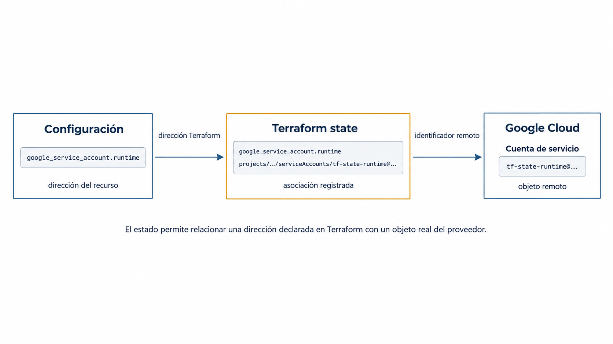
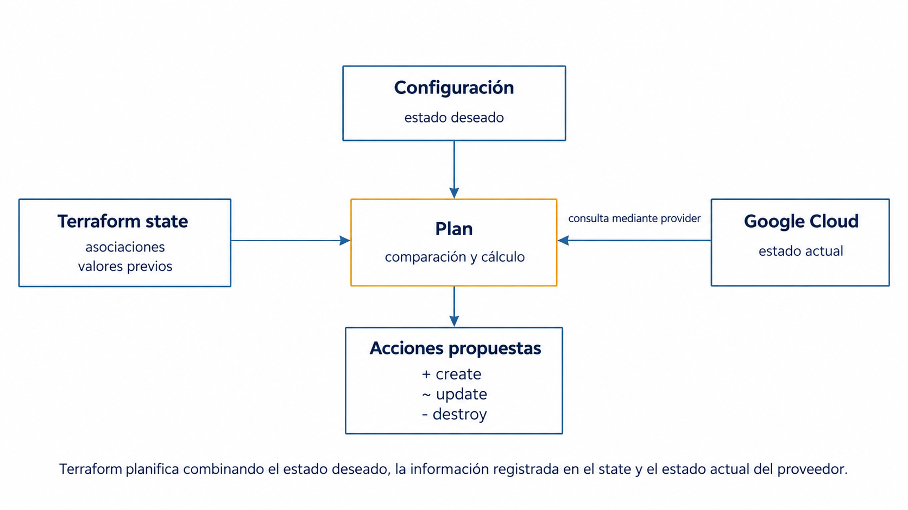
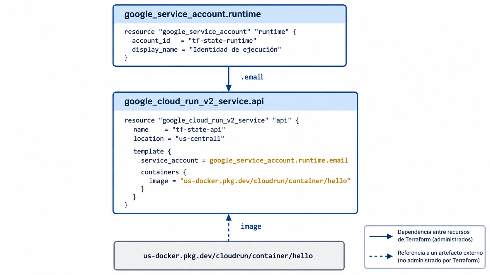
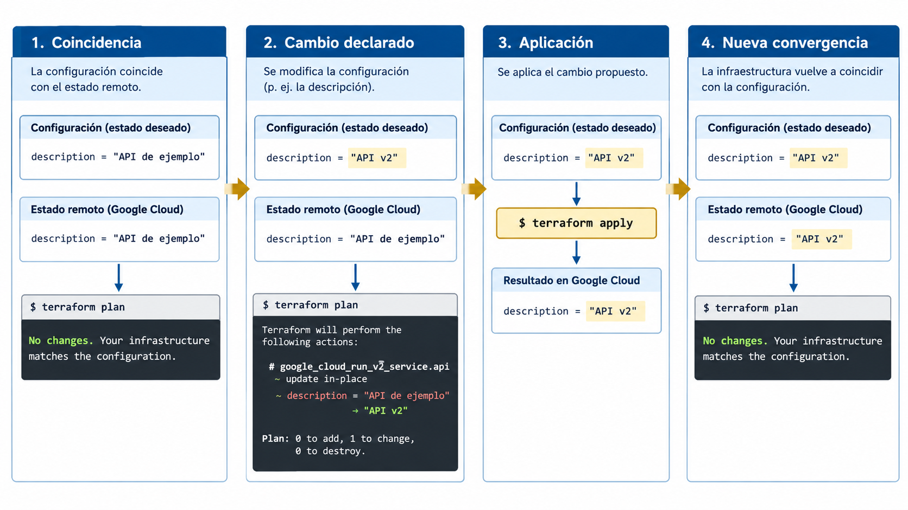

# Clase 13. Terraform II: estado e idempotencia

!!! note "Resultados de aprendizaje"
    Al finalizar la clase se espera poder:

    - explicar por qué Terraform necesita mantener estado y cómo relaciona una instancia declarada con un objeto remoto;
    - distinguir entre configuración, estado de Terraform e infraestructura real;
    - describir el backend local y reconocer los riesgos de almacenar el estado de forma insegura;
    - inspeccionar el estado mediante `terraform show`, `terraform state list` y `terraform state show`;
    - explicar cómo la actualización de la información remota interviene en el cálculo de un plan;
    - interpretar un plan sin cambios en términos de convergencia e idempotencia.

En la clase anterior se utilizó Terraform para declarar recursos, calcular un plan y aplicar cambios. Después de crear la infraestructura, una nueva ejecución de `terraform plan` pudo concluir que no había acciones pendientes. Esta clase estudia la información que permite llegar a esa conclusión.

## 1. Estado de Terraform

### 1.1. Direcciones de recursos y objetos remotos

Una configuración de Terraform expresa recursos mediante direcciones lógicas. Por ejemplo:

```hcl
resource "google_service_account" "runtime" {
  account_id   = "tf-state-runtime"
  display_name = "Identidad de ejecución de Terraform"
}
```

La dirección del recurso es:

```text
google_service_account.runtime
```

Esta dirección pertenece al modelo de Terraform. Google Cloud, en cambio, administra un objeto remoto identificado mediante información propia de su API, como el proyecto y el correo electrónico de la cuenta de servicio.

Después de crear el recurso, Terraform necesita conservar la asociación entre ambos niveles:

```text
google_service_account.runtime
              │
              │ asociación registrada por Terraform
              ▼
tf-state-runtime@PROJECT_ID.iam.gserviceaccount.com
```

El **estado** (`state`) es la información que Terraform mantiene para relacionar las instancias de recursos de la configuración con los objetos remotos que administra. Sin esa asociación, una ejecución posterior no podría saber con suficiente precisión qué objeto existente corresponde a cada bloque de la configuración.

Terraform espera normalmente una relación uno a uno entre una instancia de recurso y un objeto remoto. Dos direcciones distintas no deberían representar el mismo objeto administrado, porque la relación dejaría de ser inequívoca.



*Figura 1. Asociación entre una dirección de recurso de Terraform, el state y el objeto remoto administrado.*

### 1.2. Información almacenada en el estado

El estado no contiene únicamente identificadores. Terraform conserva también atributos conocidos de los recursos y metadatos que necesita para administrarlos.

Conceptualmente, el estado cumple al menos tres funciones:

| Función | Propósito |
|---|---|
| Asociación | Relacionar una instancia de recurso con un objeto remoto concreto |
| Atributos | Conservar valores conocidos de los recursos administrados |
| Metadatos | Mantener información necesaria para administrar esos recursos, como la configuración de provider asociada |

El estado no sustituye la configuración. La configuración expresa lo que se desea administrar; el estado registra cómo Terraform relaciona esa configuración con objetos concretos y qué información conoce sobre ellos.

Tampoco debe interpretarse como una copia perfecta y permanentemente actualizada del proveedor. Los objetos remotos pueden cambiar entre ejecuciones. Terraform consulta nuevamente al provider cuando necesita actualizar su visión de esos objetos.

!!! note "Distinción"
    La configuración expresa el estado deseado. El state registra la relación entre Terraform y los objetos administrados. La infraestructura real existe en el proveedor y puede cambiar independientemente de ambos.

## 2. Backend local

Un **backend** determina dónde almacena Terraform el state y cómo accede a él. Si no se configura otro backend, Terraform utiliza el backend `local`.

En el backend local, el state se almacena normalmente en:

```text
terraform.tfstate
```

Después de actualizar el state, Terraform puede mantener también una copia del snapshot anterior:

```text
terraform.tfstate.backup
```

El archivo `terraform.tfstate` utiliza JSON internamente, pero no se considera un archivo de configuración que deba editarse manualmente. Terraform proporciona comandos específicos para consultar y modificar el state sin depender de su representación interna.

### 2.1. Estado local y trabajo en equipo

El backend local es adecuado para una práctica individual porque no requiere infraestructura adicional. Tiene, sin embargo, limitaciones evidentes cuando varias personas administran los mismos recursos:

- el archivo debe estar disponible para todas las ejecuciones que administren esa infraestructura;
- una copia desactualizada puede representar relaciones diferentes a las que utilizó otra persona;
- el archivo puede perderse si existe únicamente en un equipo;
- el contenido puede incluir información que no debe almacenarse en un repositorio público o compartirse sin controles.

La solución sistemática para equipos consiste en almacenar el state fuera del equipo local mediante un backend apropiado. El estado remoto y la coordinación entre ejecuciones se desarrollan en una clase posterior.

### 2.2. Información sensible

El state puede almacenar valores sensibles devueltos por providers o utilizados por recursos. Marcar una salida como `sensitive` controla su presentación en determinados outputs de Terraform, pero no convierte el archivo de state en un almacén cifrado por sí mismo.

Por esta razón, los archivos locales de state no deben versionarse:

```gitignore
*.tfstate
*.tfstate.*
```

También debe evitarse publicar el resultado de comandos que expongan el state completo en formatos destinados a procesamiento automatizado. Por ejemplo, `terraform show -json` puede incluir valores sensibles en texto legible.

!!! warning "Estado y control de versiones"
    `.terraform.lock.hcl` sí debe versionarse; `terraform.tfstate` no. El primero registra selecciones de dependencias. El segundo contiene información operativa sobre la infraestructura administrada y puede incluir datos sensibles.

## 3. Inspección del estado

La inspección del state permite observar directamente qué recursos administra Terraform y qué atributos conoce sobre ellos. Para esta clase se utilizarán tres órdenes.

### 3.1. `terraform state list`

```bash
terraform state list
```

La orden enumera las direcciones de las instancias de recursos registradas en el state.

Si una configuración contiene una cuenta de servicio y un servicio de Cloud Run, el resultado esperado será semejante a:

```text
google_cloud_run_v2_service.api
google_service_account.runtime
```

La salida muestra **direcciones de Terraform**, no nombres de recursos del proveedor. Esta distinción permite referirse de forma estable a cada instancia desde la CLI.

### 3.2. `terraform state show`

```bash
terraform state show google_service_account.runtime
```

La orden muestra los atributos de una sola instancia almacenada en el state. Entre ellos pueden aparecer valores escritos en la configuración y valores calculados por el provider durante la creación.

El mismo principio se aplica al servicio de Cloud Run:

```bash
terraform state show google_cloud_run_v2_service.api
```

Esta salida permite localizar atributos que antes del `apply` aparecían como `(known after apply)` y que ahora tienen valores concretos.

### 3.3. `terraform show`

```bash
terraform show
```

Sin indicar un archivo, `terraform show` presenta una representación legible del state actual completo. También puede utilizarse para visualizar un plan guardado, pero en esta clase se empleará únicamente para inspeccionar state.

Las tres órdenes responden a preguntas diferentes:

| Orden | Pregunta principal |
|---|---|
| `terraform state list` | ¿Qué instancias administra este state? |
| `terraform state show DIRECCION` | ¿Qué sabe Terraform sobre una instancia concreta? |
| `terraform show` | ¿Cómo representa Terraform el state completo? |

Estas órdenes son preferibles a abrir y editar directamente `terraform.tfstate`.

## 4. Planificación y actualización del estado

Para calcular un plan, Terraform combina tres fuentes de información:

1. **Configuración:** lo que los archivos `.tf` describen como estado deseado.
2. **Estado:** las asociaciones y los atributos que Terraform conserva de los objetos administrados.
3. **Infraestructura real:** los objetos que existen actualmente en el proveedor.



*Figura 2. Información utilizada por Terraform para calcular las acciones propuestas por un plan.*

Un ejemplo sencillo muestra por qué los tres elementos son necesarios. Supóngase que la configuración contiene:

```hcl
resource "google_cloud_run_v2_service" "api" {
  name     = "tf-state-api"
  location = "us-central1"

  template {
    containers {
      image = "us-docker.pkg.dev/cloudrun/container/hello"
    }
  }
}
```

Después del primer `apply`, el state registra la asociación entre `google_cloud_run_v2_service.api` y el servicio remoto creado. Google Cloud puede además asignar valores que no estaban disponibles antes de crear el servicio, como identificadores y URI calculadas.

Si posteriormente se modifica únicamente la configuración, por ejemplo cambiando un atributo admitido por el recurso, Terraform dispone de:

```text
Configuración          valor nuevo
State                  valor anterior conocido
Infraestructura real   valor actualmente observado
```

A partir de esas diferencias calcula las acciones necesarias.

### 4.1. Actualización antes de planificar

En el modo normal, `terraform plan` consulta los objetos remotos administrados para sincronizar en memoria la información utilizada durante la planificación. Después compara esa información con la configuración para calcular las acciones propuestas.

Esto explica por qué el plan puede detectar que un recurso cambió fuera de Terraform aunque el archivo local de state contuviera información anterior. La detección y reconciliación sistemática de esas modificaciones externas corresponde a la clase siguiente.

La opción:

```bash
terraform plan -refresh=false
```

omite esa actualización previa. Puede reducir consultas a APIs, pero también puede producir un plan incompleto al ignorar cambios externos. No se utilizará en las prácticas de esta unidad salvo para analizar explícitamente su efecto.

### 4.2. Modo `refresh-only`

Terraform también dispone de un modo de planificación cuyo objetivo no es modificar la infraestructura, sino mostrar cómo debería actualizarse el state para reflejar cambios observados en los objetos remotos:

```bash
terraform plan -refresh-only
```

Esta modalidad será utilizada con mayor profundidad al estudiar drift. En esta clase basta distinguirla del plan normal:

- **plan normal:** calcula cambios para que la infraestructura satisfaga la configuración;
- **refresh-only:** calcula cambios del state necesarios para reflejar cambios detectados en los objetos remotos.

No debe utilizarse el comando histórico `terraform refresh` como procedimiento habitual. Está obsoleto y actualiza el state sin proporcionar el mismo flujo de revisión previa que ofrecen `plan -refresh-only` y `apply -refresh-only`.

## 5. Idempotencia y convergencia

Después de aplicar correctamente una configuración y mientras no cambien ni la configuración ni los objetos remotos relevantes, una nueva ejecución de:

```bash
terraform plan
```

debe concluir que no son necesarios cambios.

Este comportamiento puede describirse mediante la idea de **convergencia**: Terraform aplica acciones hasta que la infraestructura observada satisface el estado deseado expresado por la configuración.

La **idempotencia** describe una propiedad relacionada: aplicar nuevamente una operación sobre un sistema que ya satisface el estado deseado no debería producir un nuevo cambio efectivo.

De forma abstracta:

```text
f(f(x)) = f(x)
```

En infraestructura declarativa, la idea puede expresarse como:

```text
configuración + infraestructura ya convergida
                    │
                    ▼
             no hay cambios
```

No debe interpretarse como la afirmación de que cualquier configuración de Terraform producirá siempre un plan vacío después del primer `apply`. La infraestructura puede cambiar externamente, los providers pueden obtener valores calculados de APIs y algunas entradas pueden variar entre ejecuciones. La idempotencia es una propiedad buscada del proceso de reconciliación cuando las entradas relevantes permanecen estables.

## 6. Práctica con Google Cloud

La práctica utiliza dos recursos que los estudiantes ya conocen de la unidad anterior:

- una cuenta de servicio administrada por el usuario;
- un servicio de Cloud Run cuya revisión utiliza esa cuenta como identidad de ejecución.

El servicio ejecutará la imagen pública de ejemplo de Cloud Run `us-docker.pkg.dev/cloudrun/container/hello`. La imagen está publicada por Google y se utiliza aquí únicamente como carga de trabajo conocida. Su construcción y publicación no forman parte de esta clase, de modo que la práctica permanezca centrada en Terraform.

El grafo principal es:

```text
google_service_account.runtime
              │
              │ email
              ▼
google_cloud_run_v2_service.api
```



*Figura 3. Dependencia entre los recursos administrados por Terraform y referencia a la imagen externa utilizada por Cloud Run.*

### 6.1. Requisitos

La práctica requiere:

- un proyecto de Google Cloud con facturación habilitada;
- APIs de Cloud Run e IAM habilitadas;
- credenciales de aplicación configuradas para Terraform;
- permisos para crear cuentas de servicio y servicios de Cloud Run;
- permiso `iam.serviceAccounts.actAs` sobre la cuenta de servicio utilizada como identidad del servicio;
- acceso a Internet desde Google Cloud para obtener la imagen pública de ejemplo de Cloud Run.

Las APIs pueden habilitarse con:

```bash
gcloud services enable run.googleapis.com iam.googleapis.com
```

Para autenticación local del provider:

```bash
gcloud auth application-default login
```

Definir el proyecto para la sesión actual:

```bash
export GOOGLE_PROJECT="ID_DEL_PROYECTO"
```

En PowerShell:

```powershell
$env:GOOGLE_PROJECT = "ID_DEL_PROYECTO"
```

!!! warning "Credenciales"
    No se descargarán claves JSON de cuentas de servicio para esta práctica. La autenticación automatizada sin claves se retomará al integrar Terraform con CI/CD.

### 6.2. Configuración

Crear un directorio nuevo y un archivo `main.tf`:

```hcl
terraform {
  required_version = ">= 1.9"

  required_providers {
    google = {
      source  = "hashicorp/google"
      version = "8.1.0"
    }
  }
}

provider "google" {
  region = "us-central1"
}

resource "google_service_account" "runtime" {
  account_id   = "tf-state-runtime"
  display_name = "Identidad de ejecución de Terraform"
}

resource "google_cloud_run_v2_service" "api" {
  name                = "tf-state-api"
  location            = "us-central1"
  deletion_protection = false

  template {
    service_account = google_service_account.runtime.email

    containers {
      image = "us-docker.pkg.dev/cloudrun/container/hello"
    }
  }
}
```

Antes de ejecutar Terraform, identificar:

1. las dos direcciones de recursos;
2. la referencia que establece la dependencia;
3. cuál de los dos recursos puede crearse primero;
4. qué valores podrían conocerse únicamente después de la creación.

La imagen `us-docker.pkg.dev/cloudrun/container/hello` es una dependencia externa de la práctica. Terraform administra el servicio de Cloud Run que la referencia, no la imagen.

`deletion_protection = false` se utiliza para permitir la limpieza de la práctica. En un servicio de producción, desactivar esta protección requiere una decisión explícita y revisada.

### 6.3. Inicialización y primer plan

```bash
terraform init
terraform validate
terraform plan
```

El plan debe mostrar dos recursos por crear.

Localizar en la salida:

- `google_service_account.runtime`;
- `google_cloud_run_v2_service.api`;
- la referencia a la identidad de ejecución;
- atributos marcados como `(known after apply)`.

**Punto de control 1.** Antes del `apply`, ejecutar:

```bash
terraform state list
```

Si todavía no existe infraestructura administrada en este directorio, no deben aparecer las dos instancias nuevas. El plan describe acciones futuras; no crea asociaciones nuevas en el estado por sí mismo.

### 6.4. Aplicación

```bash
terraform apply
```

Revisar el plan y confirmar únicamente si coincide con lo esperado.

Al finalizar, verificar los objetos directamente en Google Cloud:

```bash
gcloud iam service-accounts describe \
  tf-state-runtime@${GOOGLE_PROJECT}.iam.gserviceaccount.com
```

```bash
gcloud run services describe tf-state-api \
  --region=us-central1
```

Estas órdenes consultan el proveedor de forma independiente a Terraform.

### 6.5. Inspección del estado

Ejecutar:

```bash
terraform state list
```

Resultado esperado:

```text
google_cloud_run_v2_service.api
google_service_account.runtime
```

Inspeccionar después cada instancia:

```bash
terraform state show google_service_account.runtime
```

```bash
terraform state show google_cloud_run_v2_service.api
```

Finalmente:

```bash
terraform show
```

**Punto de control 2.** Para cada recurso, distinguir tres datos:

- un valor escrito explícitamente en `main.tf`;
- un valor obtenido mediante una referencia a otro recurso;
- un valor calculado por el provider después de crear el objeto.

No es necesario que todos los estudiantes localicen exactamente los mismos atributos calculados, porque la salida puede variar con la versión del provider. Debe justificarse cada clasificación a partir de la configuración y de la salida observada.

### 6.6. Comparación con Google Cloud

Seleccionar un atributo observable del servicio de Cloud Run y compararlo entre:

```bash
terraform state show google_cloud_run_v2_service.api
```

y:

```bash
gcloud run services describe tf-state-api \
  --region=us-central1
```

La comparación no busca demostrar que ambas salidas tengan el mismo formato. Busca identificar que Terraform mantiene una representación del objeto administrado mientras Google Cloud mantiene el objeto real.

**Punto de control 3.** Responder:

- ¿qué identifica `google_cloud_run_v2_service.api`?
- ¿qué identifica el nombre `tf-state-api`?
- ¿por qué Terraform necesita conservar información adicional después de crear el servicio?

### 6.7. Plan sin cambios

Sin modificar la configuración ni los recursos de Google Cloud:

```bash
terraform plan
```

El resultado esperado es un plan sin acciones.

Este resultado debe interpretarse como una conclusión derivada de la información disponible: la configuración sigue expresando el mismo estado deseado y los objetos remotos observados continúan siendo compatibles con él.

**Punto de control 4.** Explicar por qué la existencia de `terraform.tfstate` por sí sola no basta para concluir que no hay cambios. ¿Qué otra fuente debe consultar Terraform?

### 6.8. Cambio de configuración y nueva convergencia

Agregar una descripción al servicio:

```hcl
resource "google_cloud_run_v2_service" "api" {
  name                = "tf-state-api"
  location            = "us-central1"
  description         = "Servicio administrado con Terraform"
  deletion_protection = false

  template {
    service_account = google_service_account.runtime.email

    containers {
      image = "us-docker.pkg.dev/cloudrun/container/hello"
    }
  }
}
```

Ejecutar:

```bash
terraform plan
```

Antes de aplicar, responder:

- ¿qué recurso cambia?
- ¿se crea un recurso nuevo, se actualiza el existente o se reemplaza?
- ¿qué evidencia del plan permite justificar la respuesta?

Aplicar el cambio:

```bash
terraform apply
```

Y ejecutar nuevamente:

```bash
terraform plan
```

El segundo plan debe volver a indicar que no existen cambios pendientes.



*Figura 4. Secuencia de cambio, aplicación y nueva convergencia entre configuración e infraestructura.*

### 6.9. Limpieza

Antes de destruir, revisar:

```bash
terraform plan -destroy
```

Después:

```bash
terraform destroy
```

Verificar que los dos recursos ya no existen.

El archivo local de state no debe reutilizarse posteriormente para una infraestructura diferente. La administración de state compartido y de varios ambientes se desarrollará en otra clase.

La práctica permite establecer dos conclusiones. El estado forma parte del mecanismo de administración: perderlo no destruye la infraestructura, pero Terraform pierde las asociaciones que mantenía con los objetos remotos. Además, un plan sin cambios no significa que Terraform haya repetido las operaciones anteriores; significa que, después de actualizar la información relevante y compararla con la configuración, no encuentra acciones necesarias para alcanzar el estado deseado.

## 7. Actividades de análisis

!!! question "Actividad 1. Asociación entre configuración y objeto remoto"
    Una configuración contiene `google_service_account.runtime` y Google Cloud contiene una cuenta llamada `tf-state-runtime`. Explicar por qué la coincidencia del nombre no debe considerarse suficiente para afirmar que Terraform administra automáticamente esa cuenta.

!!! question "Actividad 2. Lectura del state"
    Después de un `apply`, `terraform state list` muestra dos direcciones. Se elimina accidentalmente `main.tf`, pero `terraform.tfstate` permanece. Explicar qué información continúa disponible y por qué el state no sustituye la configuración como declaración del estado deseado.

!!! question "Actividad 3. Plan sin cambios"
    Un estudiante afirma: "Terraform no hizo nada porque ya había ejecutado `apply` una vez". Reformular la explicación utilizando configuración, state, infraestructura real y convergencia.

!!! question "Actividad 4. State desactualizado"
    Suponer que el archivo local de state contiene un valor anterior de un recurso, mientras que el objeto remoto cambió fuera de Terraform. Explicar por qué un plan normal puede detectar esa diferencia y qué riesgo introduciría ejecutar `terraform plan -refresh=false`.

!!! question "Actividad 5. Estado sensible"
    Un equipo propone subir `terraform.tfstate` al repositorio privado para que todos tengan una copia. Identificar los problemas técnicos y de seguridad de esa solución. No es necesario proponer todavía un backend concreto; basta justificar por qué Git no resuelve correctamente la coordinación del state.

## 8. Referencias

### Terraform

- HashiCorp. *State*. https://developer.hashicorp.com/terraform/language/state
- HashiCorp. *Purpose of Terraform State*. https://developer.hashicorp.com/terraform/language/state/purpose
- HashiCorp. *Backend Type: local*. https://developer.hashicorp.com/terraform/language/backend/local
- HashiCorp. *terraform state list*. https://developer.hashicorp.com/terraform/cli/commands/state/list
- HashiCorp. *terraform state show*. https://developer.hashicorp.com/terraform/cli/commands/state/show
- HashiCorp. *terraform show*. https://developer.hashicorp.com/terraform/cli/commands/show
- HashiCorp. *terraform plan*. https://developer.hashicorp.com/terraform/cli/commands/plan
- HashiCorp. *terraform refresh*. https://developer.hashicorp.com/terraform/cli/commands/refresh

### Google Cloud

- Google Cloud. *Configure service identity for services*. https://cloud.google.com/run/docs/configuring/services/service-identity
- HashiCorp. *google_cloud_run_v2_service*. https://registry.terraform.io/providers/hashicorp/google/latest/docs/resources/cloud_run_v2_service
- HashiCorp. *google_service_account*. https://registry.terraform.io/providers/hashicorp/google/latest/docs/resources/google_service_account
