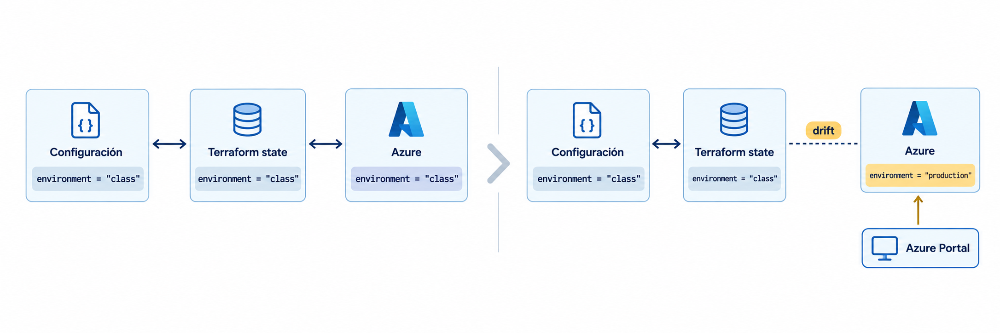
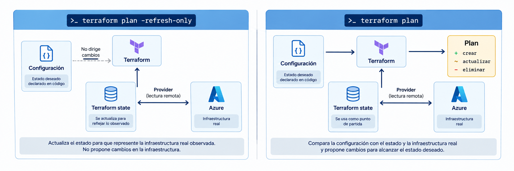
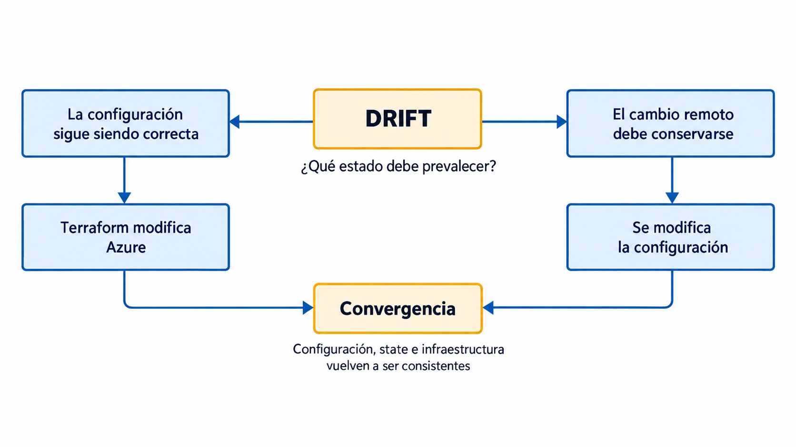
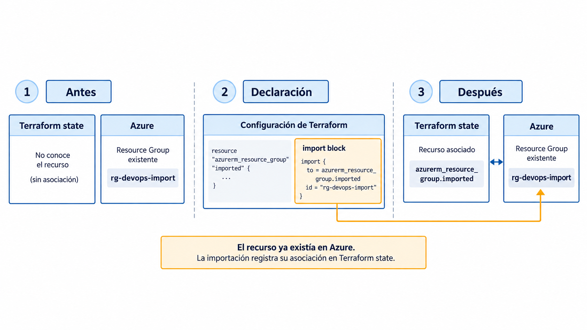

# Terraform III: drift y reconciliación

## Objetivos

La sesión aborda los cambios realizados fuera del flujo de Terraform y la incorporación de infraestructura existente al estado administrado.

Al finalizar, el estudiante podrá:

1. identificar diferencias entre configuración, estado e infraestructura remota;
2. interpretar la actualización implícita del estado durante `terraform plan`;
3. utilizar `terraform plan -refresh-only` para inspeccionar cambios externos;
4. seleccionar una estrategia de reconciliación a partir del estado deseado;
5. distinguir drift de infraestructura existente no administrada;
6. importar un recurso existente mediante un bloque `import`.

La práctica utiliza Microsoft Azure. El cambio de `hashicorp/google` a `hashicorp/azurerm` permite observar que el modelo de Terraform se mantiene aunque cambien el proveedor, los tipos de recursos y las APIs utilizadas.

---

## 1. Drift y actualización del estado

Terraform administra recursos mediante tres representaciones relacionadas:

```text
Configuración Terraform
        │
        ▼
Terraform state
        │
        ▼
Infraestructura remota
```

La **configuración** declara el estado deseado.

El **state** mantiene las asociaciones entre direcciones de recursos de Terraform y objetos remotos, junto con atributos conocidos de esos objetos.

La **infraestructura remota** corresponde a los recursos que existen actualmente en el proveedor.

Después de un `apply` exitoso, estas representaciones deberían ser consistentes para los atributos administrados por Terraform.

### 1.1. Cambios externos

Un recurso puede modificarse mediante mecanismos distintos de Terraform:

- Azure Portal;
- Azure CLI;
- otro pipeline;
- otra herramienta de infraestructura;
- una intervención operativa.

Considérese la siguiente configuración:

```hcl
tags = {
  environment = "class"
  managed_by  = "terraform"
}
```

Después del último `apply`:

```text
Configuración          State                 Azure
environment=class      environment=class     environment=class
```

Si el valor se modifica directamente en Azure:

```text
environment=production
```

el recurso remoto deja de coincidir con la información registrada:

```text
Configuración          State                 Azure
environment=class      environment=class     environment=production
```

Esta diferencia entre el estado registrado por Terraform y el objeto remoto se denomina **resource drift**.

El origen del cambio puede ser accidental o intencional. Su detección debe preceder a la decisión de reconciliación.



*Figura 1. Aparición del drift cuando un atributo de un recurso administrado cambia fuera de Terraform.*

---

### 1.2. Actualización durante `terraform plan`

Terraform consulta los recursos remotos antes de calcular un plan normal. Los providers leen los objetos administrados y Terraform actualiza en memoria la información necesaria para calcular las acciones propuestas.

De forma simplificada:

```text
                 Configuración
                      │
                      ▼
State ────────► terraform plan ◄──────── Provider
                                            │
                                            ▼
                                   Infraestructura remota
```

Por esta razón, `terraform plan` puede mostrar diferencias aunque los archivos `.tf` no hayan sido modificados.

### 1.3. Plan normal

El modo normal de planificación calcula las acciones necesarias para llevar los objetos remotos hacia la configuración declarada.

Por ejemplo:

```text
Configuración:
environment = "class"

Azure:
environment = "production"
```

puede producir un plan que proponga:

```text
production -> class
```

si el atributo puede modificarse en el recurso existente.

### 1.4. Modo `refresh-only`

El modo:

```bash
terraform plan -refresh-only
```

calcula únicamente los cambios que serían necesarios en el `state` para representar los objetos remotos tal como existen en ese momento.

Su dirección conceptual es:

```text
Infraestructura remota
          │
          ▼
        State
```

El plan puede revisarse sin modificar la infraestructura.

Si posteriormente se ejecuta:

```bash
terraform apply -refresh-only
```

Terraform registra en el `state` los valores observados en los objetos remotos y no aplica cambios sobre esos objetos.



*Figura 2. `refresh-only` calcula una actualización del state a partir de lo observado; un plan normal calcula acciones para alcanzar la configuración declarada.*

### 1.5. `terraform refresh`

El comando:

```bash
terraform refresh
```

está obsoleto. Su comportamiento equivale esencialmente a una actualización `refresh-only` aplicada sin una fase previa de aprobación.

Para inspeccionar cambios externos se utilizarán:

```bash
terraform plan -refresh-only
```

y, cuando corresponda actualizar el `state`:

```bash
terraform apply -refresh-only
```

---

## 2. Reconciliación

La detección de drift identifica una diferencia técnica. La reconciliación establece qué representación debe modificarse para recuperar consistencia.

Existen dos casos principales.

### 2.1. Reaplicación de la configuración

Si el cambio externo no representa la configuración deseada, se conserva el código existente.

Ejemplo:

```text
Configuración:
environment = "class"

Azure:
environment = "production"
```

Un plan normal puede proponer:

```text
environment: "production" -> "class"
```

Después del `apply`, el recurso remoto vuelve a coincidir con la configuración.

```text
Configuración
      │
      ▼
Infraestructura remota
```

### 2.2. Actualización de la configuración

Si el cambio externo debe conservarse, la configuración debe modificarse para representar la nueva decisión.

Por ejemplo:

```hcl
tags = {
  environment = "production"
  managed_by  = "terraform"
}
```

Un plan posterior permite verificar la consistencia entre la declaración y el recurso remoto.

```text
Infraestructura remota
          │
          ▼
     Configuración
```

La estrategia depende del contexto operativo, de la autorización del cambio y del estado deseado del sistema.



*Figura 3. La estrategia de reconciliación depende de cuál representación corresponde al estado deseado.*

---

## 3. Infraestructura existente e importación

La existencia de un objeto creado fuera de Terraform no constituye drift cuando Terraform nunca lo ha administrado.

Considérese un Resource Group creado directamente en Azure:

```text
rg-devops-import
```

y la siguiente situación:

```text
Configuración:        no existe un resource correspondiente
State:                no existe una asociación
Azure:                rg-devops-import existe
```

El objeto es **infraestructura existente no administrada**.

Para incorporarlo a Terraform se necesitan:

1. una declaración `resource`;
2. una asociación de importación;
3. un plan que permita revisar el resultado.

### 3.1. Declaración del recurso

```hcl
resource "azurerm_resource_group" "imported" {
  name     = "rg-devops-import"
  location = var.location
}
```

La declaración establece cómo se administrará el objeto después de incorporarlo.

### 3.2. Bloque `import`

```hcl
import {
  to = azurerm_resource_group.imported
  id = "/subscriptions/${var.subscription_id}/resourceGroups/rg-devops-import"
}
```

`to` contiene la dirección de Terraform:

```text
azurerm_resource_group.imported
```

`id` contiene el identificador remoto utilizado por el provider.

El valor de `id` debe poder determinarse durante la planificación.

### 3.3. Plan de importación

El flujo declarativo es:

```text
resource block
      +
import block
      │
      ▼
terraform plan
      │
      ▼
terraform apply
      │
      ▼
asociación registrada en state
```

El objeto existente se conserva. Terraform incorpora su asociación al `state` y puede proponer ajustes adicionales cuando la declaración no coincide con los atributos remotos.



*Figura 4. La importación conserva el objeto remoto y registra su asociación con una dirección de Terraform. El identificador remoto aparece abreviado en la figura; en la práctica se utiliza el Resource ID completo de Azure.*

También existe el comando:

```bash
terraform import ADDRESS ID
```

que realiza la asociación desde la CLI. En esta sesión se utilizará el bloque `import` porque permite incorporar la operación al proceso normal de `plan` y revisión.

---

## 4. Práctica con Azure

La práctica utiliza una infraestructura pequeña:

```text
Azure Subscription
└── Resource Group
    └── Storage Account
```

El objetivo es observar drift, actualización del `state`, reconciliación e importación sin introducir todavía redes, máquinas virtuales ni plataformas de aplicaciones.

### 4.1. Conceptos mínimos de Azure

Para esta práctica bastan tres conceptos.

**Subscription.** Es el ámbito de Azure dentro del cual se crean los recursos y se aplica la facturación y el control de acceso.

**Resource Group.** Es un contenedor lógico de recursos de Azure. Todo recurso utilizado en esta práctica pertenecerá a un Resource Group.

**Storage Account.** Es el recurso administrativo de Azure Storage. Puede dar acceso a servicios como blobs, archivos, colas y tablas. En esta práctica no se almacenarán datos; se utilizará únicamente como recurso administrado por Terraform.

Terraform creará:

```text
rg-devops-drift-<identificador>
└── stdevops<identificador>
```

Cada estudiante debe utilizar un identificador propio para evitar colisiones cuando varias personas trabajen en una misma suscripción.

### 4.2. Azure CLI y autenticación

La práctica se ejecutará localmente y Terraform utilizará las credenciales de **Azure CLI**.

Comprobar que Azure CLI está instalada:

```bash
az version
```

Si el comando no existe, instalar Azure CLI siguiendo la documentación oficial:

<https://learn.microsoft.com/cli/azure/install-azure-cli>

Iniciar sesión:

```bash
az login
```

El comando abre el navegador para completar la autenticación. Al finalizar, Azure CLI muestra las suscripciones disponibles para la cuenta.

Listarlas de forma compacta:

```bash
az account list --output table
```

Una cuenta puede tener acceso a varias suscripciones. Seleccionar explícitamente la que se utilizará en la práctica:

```bash
az account set --subscription "ID_O_NOMBRE_DE_LA_SUSCRIPCION"
```

Comprobar la selección:

```bash
az account show --output table
```

Obtener el identificador que deberá copiarse posteriormente a `terraform.tfvars`:

```bash
az account show --query id --output tsv
```

!!! note "Autenticación local"
    `az login` autentica Azure CLI y el provider `azurerm` puede reutilizar esa sesión para ejecuciones locales de Terraform. La autenticación no interactiva para pipelines se estudiará en la sesión de Terraform dentro de CI/CD.

### 4.3. Registro de `Microsoft.Storage`

Azure organiza los tipos de recursos mediante **Resource Providers**. El Storage Account utilizado en la práctica pertenece al namespace:

```text
Microsoft.Storage
```

Con AzureRM 5.x los Resource Providers no se registran automáticamente por defecto. Comprobar su estado:

```bash
az provider show \
  --namespace Microsoft.Storage \
  --query registrationState \
  --output tsv
```

Si el resultado no es:

```text
Registered
```

registrarlo:

```bash
az provider register \
  --namespace Microsoft.Storage \
  --wait
```

La operación requiere permisos suficientes sobre la suscripción. Si Azure devuelve `AuthorizationFailed` o `Forbidden`, no debe intentarse resolver el problema otorgando permisos adicionales sin autorización; debe utilizarse una suscripción en la que la cuenta tenga los permisos requeridos.

### 4.4. Estructura del proyecto

Crear una carpeta de trabajo y abrirla en el editor de código:

```bash
mkdir tf-clase18-drift
cd tf-clase18-drift
```

La estructura será:

```text
tf-clase18-drift/
├── main.tf
├── variables.tf
├── terraform.tfvars
├── terraform.tfvars.example
└── .gitignore
```

| Archivo | Función | ¿Se versiona? |
|---|---|---|
| `main.tf` | Provider y recursos de Azure | Sí |
| `variables.tf` | Declaración de variables | Sí |
| `terraform.tfvars` | Valores concretos de la suscripción y nombres | No |
| `terraform.tfvars.example` | Plantilla de valores requeridos | Sí |
| `.gitignore` | Artefactos locales y valores específicos del entorno | Sí |

#### `variables.tf`

```hcl
variable "subscription_id" {
  description = "ID de la suscripción de Azure"
  type        = string
}

variable "location" {
  description = "Región utilizada por los recursos"
  type        = string
  default     = "eastus"
}

variable "resource_group_name" {
  description = "Nombre del Resource Group principal"
  type        = string
}

variable "import_resource_group_name" {
  description = "Nombre del Resource Group creado fuera de Terraform"
  type        = string
}

variable "storage_account_name" {
  description = "Nombre globalmente único del Storage Account"
  type        = string
}
```

#### `terraform.tfvars`

Completar el archivo con valores propios:

```hcl
subscription_id           = "00000000-0000-0000-0000-000000000000"
location                  = "eastus"
resource_group_name       = "rg-devops-drift-gc123"
import_resource_group_name = "rg-devops-import-gc123"
storage_account_name      = "stdevopsgc123"
```

Sustituir:

- `subscription_id` por el valor obtenido con `az account show --query id --output tsv`;
- `gc123` por un identificador propio.

Los nombres de Resource Group deben ser distintos a los utilizados por otros estudiantes dentro de la misma suscripción.

El nombre del Storage Account tiene restricciones adicionales:

- entre 3 y 24 caracteres;
- únicamente letras minúsculas y números;
- debe ser **globalmente único en Azure**.

Si Azure informa `StorageAccountAlreadyTaken`, cambiar únicamente `storage_account_name` por otro nombre válido.

#### `terraform.tfvars.example`

```hcl
subscription_id            = "ID_DE_LA_SUSCRIPCION"
location                   = "eastus"
resource_group_name        = "rg-devops-drift-IDENTIFICADOR"
import_resource_group_name = "rg-devops-import-IDENTIFICADOR"
storage_account_name       = "stdevopsIDENTIFICADOR"
```

#### `.gitignore`

```gitignore
.terraform/
*.tfstate
*.tfstate.*
*.tfplan
terraform.tfvars
```

`.terraform.lock.hcl` no debe ignorarse.

### 4.5. Configuración de Terraform

Crear `main.tf`:

```hcl
terraform {
  required_version = ">= 1.12"

  required_providers {
    azurerm = {
      source  = "hashicorp/azurerm"
      version = "~> 5.0"
    }
  }
}

provider "azurerm" {
  features {}

  subscription_id = var.subscription_id
}

resource "azurerm_resource_group" "main" {
  name     = var.resource_group_name
  location = var.location

  tags = {
    environment = "class"
    managed_by  = "terraform"
  }
}

resource "azurerm_storage_account" "main" {
  name                     = var.storage_account_name
  resource_group_name      = azurerm_resource_group.main.name
  location                 = azurerm_resource_group.main.location
  account_tier             = "Standard"
  account_replication_type = "LRS"

  tags = {
    environment = "class"
    managed_by  = "terraform"
  }
}
```

El bloque:

```hcl
provider "azurerm" {
  features {}
  subscription_id = var.subscription_id
}
```

selecciona la suscripción sobre la cual operará Terraform. La autenticación proviene de la sesión iniciada anteriormente con `az login`.

Las referencias:

```hcl
azurerm_resource_group.main.name
azurerm_resource_group.main.location
```

establecen una dependencia implícita del Storage Account respecto al Resource Group.

### 4.6. Inicialización y primer despliegue

Inicializar el directorio:

```bash
terraform init
```

Terraform descargará el provider `hashicorp/azurerm` y generará `.terraform.lock.hcl`.

Formatear y validar:

```bash
terraform fmt
terraform validate
```

Generar el plan:

```bash
terraform plan
```

Antes de continuar, identificar en la salida:

- los dos recursos que se crearán;
- la dependencia entre ambos;
- los atributos marcados como `(known after apply)`;
- el resumen final del plan.

Aplicar:

```bash
terraform apply
```

Terraform vuelve a mostrar el plan y solicita confirmación. Escribir:

```text
yes
```

cuando las acciones propuestas correspondan a los dos recursos esperados.

Después del `apply`, establecer la línea base:

```bash
terraform plan
```

El resultado esperado es:

```text
No changes.
```

### 4.7. Localización de los recursos en Azure Portal

Para la primera práctica con Azure conviene identificar dónde quedaron los recursos creados.

1. Abrir <https://portal.azure.com/>.
2. Buscar **Resource groups**.
3. Abrir el Resource Group cuyo nombre se definió en `resource_group_name`.
4. En la lista **Resources**, abrir el Storage Account cuyo nombre se definió en `storage_account_name`.
5. Revisar **Overview** y **Tags**.

También puede verificarse el Storage Account desde Azure CLI:

```bash
az storage account show \
  --resource-group NOMBRE_DEL_RESOURCE_GROUP \
  --name NOMBRE_DEL_STORAGE_ACCOUNT \
  --query "{name:name,location:location,tags:tags}" \
  --output yaml
```

Sustituir ambos nombres por los valores utilizados en `terraform.tfvars`.


## 5. Experimentos

Los experimentos parten de la infraestructura creada en la sección anterior. Antes de comenzar:

```bash
terraform plan
```

debe mostrar:

```text
No changes.
```

### 5.1. Experimento 1: detección de drift

El cambio externo se realizará desde **Azure Portal** para que el recurso se modifique por un mecanismo distinto de Terraform.

1. Abrir <https://portal.azure.com/>.
2. Entrar a **Resource groups**.
3. Abrir el Resource Group principal.
4. Abrir el Storage Account.
5. Seleccionar **Tags**.
6. Localizar:

```text
environment = class
```

7. Cambiar únicamente el valor a:

```text
environment = production
```

8. Guardar el cambio.

No modificar `main.tf`.

La situación conceptual es:

```text
Configuración          State                 Azure
environment=class      environment=class     environment=production
```

#### Plan `refresh-only`

Ejecutar:

```bash
terraform plan -refresh-only
```

Identificar en la salida:

- `azurerm_storage_account.main`;
- el atributo `tags`;
- el valor anterior `class`;
- el valor remoto `production`;
- la indicación de que Terraform detectó un cambio realizado fuera de su flujo.

No ejecutar todavía:

```bash
terraform apply -refresh-only
```

El objetivo de este paso es inspeccionar la divergencia.

#### Plan normal

Ejecutar:

```bash
terraform plan
```

Comparar ambos resultados.

| Operación | Resultado que calcula |
|---|---|
| `terraform plan -refresh-only` | actualización del `state` para representar los objetos remotos |
| `terraform plan` | acciones sobre los objetos remotos para alcanzar la configuración declarada |

El plan normal debe proponer devolver el tag del Storage Account a:

```text
environment = class
```

aunque ningún archivo `.tf` haya cambiado.

---

### 5.2. Experimento 2: reconciliación del drift

#### Caso A. La configuración sigue siendo correcta

Considerar que el cambio:

```text
environment = production
```

fue accidental.

Mantener en `main.tf`:

```hcl
environment = "class"
```

Revisar:

```bash
terraform plan
```

Aplicar la corrección:

```bash
terraform apply
```

Comprobar:

```bash
terraform plan
```

El resultado esperado es:

```text
No changes.
```

Azure debe mostrar nuevamente:

```text
environment = class
```

#### Caso B. El cambio remoto debe conservarse

Volver a Azure Portal y cambiar otra vez el tag del Storage Account:

```text
environment = production
```

Ejecutar:

```bash
terraform plan -refresh-only
```

Esta vez se considerará que el cambio fue autorizado.

Modificar en `main.tf` **únicamente los tags del Storage Account**:

```hcl
tags = {
  environment = "production"
  managed_by  = "terraform"
}
```

Ejecutar:

```bash
terraform plan
```

El plan debe mostrar que ya no es necesario devolver `environment` a `class`.

La configuración ha incorporado la decisión operativa y vuelve a representar el valor existente en Azure.

---

### 5.3. Experimento 3: importación de un Resource Group

En este experimento se creará deliberadamente un recurso **fuera de Terraform** y luego se incorporará al `state`.

El nombre utilizado debe ser exactamente el mismo que se definió en:

```hcl
import_resource_group_name
```

Crear el Resource Group desde Azure CLI. En el siguiente comando, sustituir el nombre por el valor utilizado en `terraform.tfvars`:

```bash
az group create \
  --name rg-devops-import-IDENTIFICADOR \
  --location eastus
```

La salida JSON confirma la creación.

En este momento:

```text
Azure:           el Resource Group existe
Terraform state: no existe una asociación
```

#### Declaración del recurso

Agregar a `main.tf`:

```hcl
resource "azurerm_resource_group" "imported" {
  name     = var.import_resource_group_name
  location = var.location
}
```

Ejecutar:

```bash
terraform plan
```

Terraform todavía no sabe que esa dirección corresponde al Resource Group creado con Azure CLI. El plan puede intentar crear un recurso con ese nombre.

**No aplicar este plan.**

#### Asociación mediante `import`

Agregar a `main.tf`:

```hcl
import {
  to = azurerm_resource_group.imported
  id = "/subscriptions/${var.subscription_id}/resourceGroups/${var.import_resource_group_name}"
}
```

Ejecutar:

```bash
terraform plan
```

Ahora el plan debe incluir una operación de importación para:

```text
azurerm_resource_group.imported
```

El resultado ideal es una importación sin cambios inesperados sobre el Resource Group. Si aparecen cambios adicionales, deben revisarse antes de aplicar.

Aplicar:

```bash
terraform apply
```

#### Inspección del `state`

Ejecutar:

```bash
terraform state list
```

Debe aparecer, entre otros:

```text
azurerm_resource_group.imported
```

Inspeccionar:

```bash
terraform state show azurerm_resource_group.imported
```

El Resource Group ya existía en Azure. La operación incorporó al `state` la asociación entre el objeto remoto y la dirección:

```text
azurerm_resource_group.imported
```

Los bloques `import` pueden mantenerse como registro histórico o retirarse después de una importación exitosa. En esta práctica se conservarán hasta completar la sesión.

---

### 5.4. Clasificación de cambios

| Situación | Configuración | State | Infraestructura remota | Tratamiento |
|---|---|---|---|---|
| Cambio declarado | cambia | conoce el recurso | conserva el valor anterior | planificar y aplicar |
| Drift | no cambia | conoce el recurso | cambia externamente | detectar, interpretar y reconciliar |
| Recurso existente no administrado | se declara para adoptarlo | no existe asociación | el objeto ya existe | importar |

Un recurso ya administrado que cambia externamente se trata como drift. La importación se utiliza para establecer una asociación inexistente.

### 5.5. Limpieza

Al terminar la práctica, Terraform administra tres recursos:

```text
azurerm_resource_group.main
azurerm_storage_account.main
azurerm_resource_group.imported
```

El último Resource Group fue creado manualmente, pero **después de la importación su ciclo de vida quedó bajo administración de Terraform**.

Revisar primero qué se eliminará:

```bash
terraform plan -destroy
```

El plan debe incluir el Storage Account y los dos Resource Groups.

Después ejecutar:

```bash
terraform destroy
```

Confirmar únicamente después de revisar el plan.

!!! warning "Efecto de la importación"
    `terraform destroy` eliminará también el Resource Group importado. La importación no crea una copia: incorpora el recurso remoto existente al conjunto de recursos administrados por Terraform.

Después de la limpieza, no ejecutar `terraform apply` salvo que se desee volver a crear la infraestructura de la práctica.


## 6. Consideraciones, actividades y alcance

### 6.1. Consideraciones operativas

#### Aplicación automática

La ejecución automática de `terraform apply` ante cualquier diferencia puede revertir intervenciones operativas válidas.

La automatización de drift debe separar:

```text
detección
revisión
reconciliación
```

El grado de automatización depende del tipo de infraestructura, criticidad del cambio y controles de aprobación.

#### Actualización del `state`

`terraform apply -refresh-only` puede registrar valores remotos en el `state` sin modificar la infraestructura.

Después de esa operación pueden seguir existiendo diferencias entre la configuración y el `state`. Un plan normal permite identificar esas diferencias.

#### Modificación directa del archivo de estado

`terraform.tfstate` no debe editarse manualmente.

Terraform dispone de operaciones específicas para administrar asociaciones y estado. Las operaciones de manipulación explícita del state se estudiarán únicamente cuando exista un caso que las requiera.

#### Cambios manuales

Las intervenciones manuales pueden ser necesarias durante incidentes o tareas excepcionales. Los cambios permanentes deben reflejarse posteriormente en la configuración administrada para recuperar reproducibilidad y trazabilidad.

---

### 6.2. Actividades de análisis

#### Actividad 1. Interpretación de un `refresh-only`

Un plan contiene:

```text
~ tags = {
    ~ "environment" = "class" -> "production"
  }
```

Los archivos `.tf` no han cambiado.

Explicar:

1. qué representa cada valor;
2. dónde ocurrió el cambio;
3. qué información adicional se necesita para seleccionar una estrategia de reconciliación.

#### Actividad 2. Modos de planificación

Después de una modificación manual se ejecutan:

```bash
terraform plan -refresh-only
```

y:

```bash
terraform plan
```

Comparar el objetivo y el efecto potencial de ambos planes.

#### Actividad 3. Intervención de emergencia

Durante un incidente se modifica manualmente una propiedad administrada por Terraform y la modificación corrige la falla. Un plan posterior propone revertirla.

Definir un procedimiento para incorporar la corrección al flujo de infraestructura como código.

#### Actividad 4. Clasificación

Clasificar cada situación como **drift**, **recurso no administrado** o **cambio declarado**:

1. un tag se modifica desde Azure Portal;
2. un administrador crea un Resource Group que nunca ha estado en Terraform;
3. una pull request modifica `account_replication_type`;
4. otra automatización modifica un recurso registrado en `terraform.tfstate`.

#### Actividad 5. Reconciliación automática

Un equipo ejecuta `terraform apply` automáticamente cada vez que una verificación detecta diferencias.

Identificar:

- un beneficio;
- dos riesgos;
- una condición que permitiría automatizar razonablemente la reconciliación.

---

### 6.3. Alcance de la sesión

La sesión cubre:

- actualización implícita del estado durante `plan`;
- resource drift;
- `refresh-only`;
- estrategias de reconciliación;
- infraestructura existente no administrada;
- bloques `import`.

Estos temas se relacionan directamente con los objetivos de Terraform Associate 004 sobre administración del state, drift e importación.

Los siguientes contenidos quedan para sesiones posteriores:

| Tema | Sesión |
|---|---|
| variables, outputs, expresiones y módulos | Terraform modular |
| refactorización y bloques `moved` | Terraform modular |
| backend remoto | Estado remoto y ambientes |
| bloqueo y coordinación del state | Estado remoto y ambientes |
| separación de ambientes | Estado remoto y ambientes |
| `plan` en pull requests | Terraform en CI/CD |
| `apply` controlado | Terraform en CI/CD |
| autenticación no interactiva | Terraform en CI/CD |

---

### 6.4. Referencias

#### Terraform

- HashiCorp. *Manage resource drift*. <https://developer.hashicorp.com/terraform/tutorials/state/resource-drift>
- HashiCorp. *Use refresh-only mode to sync Terraform state*. <https://developer.hashicorp.com/terraform/tutorials/state/refresh>
- HashiCorp. *terraform plan command*. <https://developer.hashicorp.com/terraform/cli/commands/plan>
- HashiCorp. *terraform refresh command*. <https://developer.hashicorp.com/terraform/cli/commands/refresh>
- HashiCorp. *Import block reference*. <https://developer.hashicorp.com/terraform/language/block/import>
- HashiCorp. *Terraform Associate 004 review*. <https://developer.hashicorp.com/terraform/tutorials/certification-004/associate-review-004>

#### Azure

- HashiCorp. *AzureRM Provider*. <https://registry.terraform.io/providers/hashicorp/azurerm/latest/docs>
- HashiCorp. *Authenticate using Azure CLI*. <https://registry.terraform.io/providers/hashicorp/azurerm/latest/docs/guides/azure_cli>
- HashiCorp. *AzureRM Storage Account*. <https://registry.terraform.io/providers/hashicorp/azurerm/latest/docs/resources/storage_account>
- Microsoft. *Install Azure CLI*. <https://learn.microsoft.com/cli/azure/install-azure-cli>
- Microsoft. *Authenticate Terraform to Azure*. <https://learn.microsoft.com/azure/developer/terraform/authenticate-to-azure>
- Microsoft. *Azure resource providers and types*. <https://learn.microsoft.com/azure/azure-resource-manager/management/resource-providers-and-types>
- Microsoft. *Create an Azure Storage Account*. <https://learn.microsoft.com/azure/storage/common/storage-account-create>
